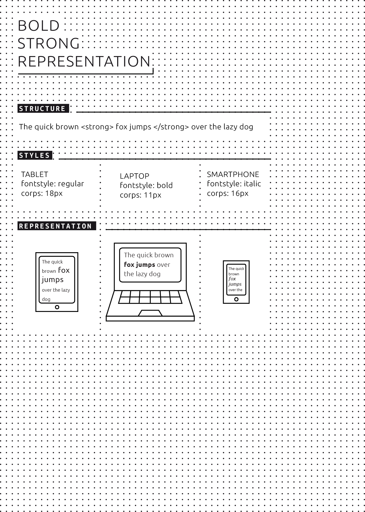

#02 The basics 

 
- Throughout the historical development of writing, characters beyond the basic alphabet have played an increasingly important role, starting with blank spaces between words, then punctuation marks, and later **markup** for formatting. 
- In electronic texts, markup has developed into two general types: visual-typographic (as in the markup tag 'bold type') vs. logical-semantic (as in the markup tag 'emphasis'). 
- Logical-semantic markup is the foundation of hybrid publishing, since it can be translated into whatever visual formatting is most suitable for each particular medium. 
- One of the main advantages of electronic books is that the same content can be published in a wide variety of formats. 

 

##Layout and structure of a text 
A text is a collection of words and words are composed of letters. In order to read a text, we make use of a variety of layout aids. The most simple and basic of these is the use of spaces between words. Classical Greek and Roman texts were written in what is called 'continuous script', without spaces, which was not considered a problem since reading was a craft which only a few people mastered. Gradually, an increasing number of design and layout aids were introduced: not only spaces between words but also capital letters at the beginning of sentences, line breaks, and a variety of punctuation marks such as commas, semicolons, colons and periods.[^hist] Also, concepts such as paragraphs and chapters developed into a standardized system that allowed the structure intended by the authors to be transmitted to readers familiar with these standards. 

In the electronic processing of texts, this hierarchical ordering of words into sentences, sentences into paragraphs and so on, as well as additional reading aids such bold or italic text, is made possible by using specific formatting codes. This process is called markup and the codes are called markup elements. It goes without saying that all these markup elements require stable definitions and clear relationships if they are to be of any use. In order to establish which markup is allowed and how it should be used, **markup languages** were defined. 

With the emergence of computer networks and the increasing need to standardize texts for multiple usages, an international ISO standard was defined in 1982, known as Standardized General Markup Language (SGML). This was an extremely important development, as it established a strict division between the *conceptual* structure and formatting of the text, and the final *representation* of that structure and formatting. This is radically different from the **'What You See Is What You Get' (WYSIWYG)** markup languages used in word processors such as Microsoft Word, WordPerfect or OpenOffice, where text which is marked up in a certain way (such as italic or bold) is immediately displayed that way. SGML and its derivatives, **HTML** (Hypertext Markup Language, used mainly in web design) and the expanded XML (Extensible Markup Language), allow instead for formatting *concepts* such as 'emphasis' or 'strong emphasis', (rather than 'italic' or 'bold') as well as structuring concepts such as 'chapter heading' or 'quotation', to be linked logically to specific display representations for each concept in a separate list of definitions known as a **style sheet**. 

This is especially important and relevant in the context of hybrid publishing because it makes it possible, at the later stage of visual design, not only to define how each of these markup elements will be displayed, but also to provide different definitions for each specific output. For example, we can decide that for output A (say the printed book), text marked as 'chapter heading' will be centered on the page, in a different font and larger font size than the running text, while text marked as 'quotation' will be rendered in the same font and size as the running text, but in italics; while for output B (say a display screen) we could instead decide to render chapter headings as bold and quotations as underlined text. 

 

By combining the structured text with a different style sheet for each output format, a variety of end products can thus be generated using one single structured text. However, in order to make this possible, the source text must be as systematically structured as possible. 

###What is an electronic text? 

An electronic text is generally understood as a text which is represented on a display screen of some sort. However, the most important difference between a paper text and an electronic text, in the context of hybrid publishing, is the notion that the electronic text becomes a structured file. As we have seen, the use of markup allows us to create different layouts, or representations, for different media. It is also crucial to understand that electronic publishing introduces a paradigm shift away from the page-centered culture of book printing. Book printing traditionally allows for various printing sizes, depending on the wishes of the author, designer and publisher. For example, when making an art book based on a collection of paintings or drawings, a decision will be made as to what the ideal book size is, and whether it should be printed in portrait or landscape format. In the world of screens however, there are other decisions to be made since there are a variety of screen sizes to deal with, and a screen of course cannot be cut to the required size, as is the case with paper book publishing. 

Many electronic reading devices now support **reflowable** text, which means that the layout of the text is automatically adapted to fit the dimensions of the device. This works well for genres such as novels which usually consist only of text. However when the overall design cannot so easily be modified, for example if there are crucial relationships between the body text and illustrations or other elements such as footnotes or tables (as is the case for art and design books as well as research publications), then the transposition from an existing print work to an electronic representation can pose some serious issues, which will be further addressed in the following chapters. 

##Possibilities offered by electronic publishing 

One of the most widespread forms of electronic publishing consists of scanning existing paper books and converting them into digital media such as images, electronic texts, or an ebook. **Optical character recognition (OCR)** is often used to convert the printed text of a book into a digital text format such as **ASCII** or **Unicode**. After this conversion the text can be re-formatted, searched, or processed using other software applications. Examples of organizations or projects for book scanning on a large scale are: Project Gutenberg,[^Project-Gutenberg] the Million Book Project,[^Million-Book-Project] Google Books,[^Google-Books] and the Open Content Alliance.[^Open-Content-Alliance] 

New electronic technologies allow for a variety of publication outlets, bringing new opportunities as well as new challenges. Page numbering and indexing for example, which for centuries were essential book-making concepts, are problematic in electronic publications, where page numbers are unstable or even non-existent (a historical illustration of this problem, and a possible solution, is the numbering of chapters and verses in the Bible, allowing readers to refer to the same passage even though they may be using different editions, or even different languages). Fixed page numbers and indexes referring to page numbers have traditionally allowed readers, writers and researchers to refer to the same publication (or at least the same edition) across time and space. However, in an electronic environment with non-fixed screen sizes this is much more complicated. Though the text itself usually remains fixed, as the original text file exists independently from its representation format (**e-paper**, **LCD**, paper), the actual representation in each format can vary substantially, making it much harder to refer to the location of a passage in the text. The challenge becomes even greater if we widen our ambition to include not only tables, references and notes but also pictures, audio and video, and hyperlinks. 

Just as cultural standardization of typography and layout over the centuries has made it possible to instantly distinguish a novel, an educational textbook, or a 'coffee table book' of art reproductions, this will in all likelihood eventually be the case as well for different genres of electronic books. With the notable exception of electronic (or paper) books as art objects in their own right, electronic art book publishing is already quickly developing many common features as a genre, though differences between individual publications will always remain. 

At the most basic level, all files in an ebook are nothing but bitstreams (streams of binary code: zeros and ones). As we have seen, the great novelty in the world of electronic art books is that, based on standardized but flexible structures, the same content can be published in a wide variety of formats. This not only depends on the capabilities of the output (reading/viewing/listening) device, but also on the function of the book, such as a dictionary, a study book, a reference work, a catalogue, or a work of fiction. 

All these new possibilities of course will require thorough, and potentially more labor-intensive, editorial and production strategies. Not only because of the possibility of representing the same content in a variety of forms, but more importantly because once they are properly edited and stored electronically, the content and its constituent parts can be endlessly used and re-used in different ways, now and in the future. 

[^hist]: Guglielmo Cavallo and Roger Chartier (eds.), *A History of Reading in the West*, Polity Press 1999. 
[^Project-Gutenberg]: Project Gutenberg, https://www.gutenberg.org. 
[^Million-Book-Project]: Million Book Project, https://archive.org/details/millionbooks. 
[^Google-Books]: Google Books, http://books.google.nl/. 
[^Open-Content-Alliance]: Open Content Alliance, http://www.opencontentalliance.org.
