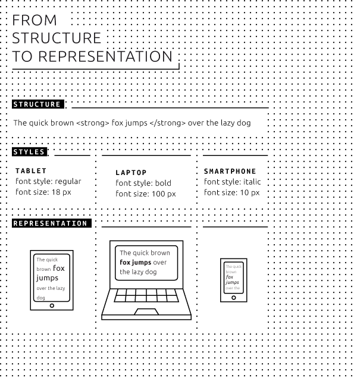

# 02 The Basics 
 
## What is a text? 
A text is a collection of words and words are compositions of letters. In order to read a text we have all kinds of layout helpers. Keep in mind that in the Roman times (when texts were cut in stone) there was continuing writing: no spaces between the words. This was not considered a problem as reading was a craft only a few people mastered. These people knew the words and hence were able to read aloud, just try: *Icanreadthiseasilyaloud*. 
 
In time, the craft of reading became a common good and many design/lay-out helpers were introduced, for example spaces between words, capitals at the beginning of new sentences, commas, semicolons, colons and line breaks.[^hist] Furthermore, the notions of paragraphs, chapters and the like, developed into a standardized system that allowed for a smooth transmission between the structure the authors endowed their text with and the readers who became familiar to these standards. Thus enabling ease of reading and the possibility to read silently. 
 
This structure of stratifying words into sentences, sentences into paragraphs and so on, including reading aids such as exclamation marks, bold and underscored text is made possible by the insertion of special codes. This process is called **markup** and the codes are called markup elements. It goes without saying that all these **markup** elements demand stable definitions and clear relationships. Everybody is free to invent their own rules (e.g., every first letter of a new chapter is a well-decorated small picture). For example, in the time of handwritten manuscripts many 'free style' inventions were made. Some of them remained in our time and became part of the expended alphabet. Think of the ampersand '&', it originated from the conflation of the letter e and the letter t - we call this conflations, *ligatures*. To define what we allow and what not, **markup languages** emerged. 
 
Markup languages are grammars that define the markup and the relations between markup elements. With the emergence of computer networks and the increasing need to standardize texts for multiple usages, an international ISO standard established in 1982 is called: Standardized General Markup Language (SGML). This logically structured markup language was a big step forward as it made a fundamental split between the text structure as such and the final representation of that structure. For example, contrary to languages used in word processors such as **TeX**, **LaTeX**, Microsoft Word, WordPerfect or ODF (OpenOffice document format), where presentation and text structuring are mixed, SGML only defines functions or roles. When we type a **bold** word in the text using a word processor we in fact type 'start bold' -\> type the word -\> 'end bold'. 
 
 
 
What is happening here is a mixture of **layout** and structure. Layout is the activity of presenting a text onto a medium, such as a paper page. SGML and its derivatives, the easier **HTML** (HyperText Markup Language) and the expanded **XML** (Extensible Markup Language) make a strict distinction between structure and representation. A markup language allows for notions such as 'highlighted word or phrase' onto which can be attached a certain layout or function type (1,2,3...) This allows you to equate for example a chapter heading with type 1 and quotation with type 4. Depending on the output substrate you can then define in the layout phase how this will look like. For instance, a chapter heading is in a certain type font and font size and centered on the page (described with type 1), whilst a quotation is represented in the same font size and font of the running text, but now in italics (type 4, in this example). On a screen we can thus have things like chapter headings in pink and quotations in yellow. 
 
This freedom in the layout is explicated in a so-called **style sheet** , which is a table that connects a layout schema with the markup schema. This way of working is imperative if one wants to allow a source text to be represented in many different ways on various media of various sizes. Note that in many programs these translations are done fairly invisibly to the user. If we translate an .odt file into a .docx file, all coding is translated one-to-one. As we will see in the following, translation between one file type into another is not always symmetrical. Hence, the golden rule is to *always make sure that the source text is as systemically structured as possible*. 
 
An important notion is that all digital texts and accompanying coding are written in simple letters and numerals, this is called **plain text**, or a flat file. This is a stripped down text without layout; the most elementary token. It goes without saying that the flexibility of this process is limited to the character set for plain text we use. In the 'old' days this was **ASCII** based and limited to the possible number of distinct signs (letters, numerals, commas, etc.) of a binary computer text. Slowly but surely, a new elaborated list of allowed signs, extending ASCII is making inroads. This collection of signs is called: **Unicode**. Unicode aims to include all alphabets and letter systems including common signs and ligatures, such as the aforementioned *&* and diacritic signs. Again, this is a step forward to guarantee a clean source file for all kind of usages, even those we don't consider or even imaging today. 
 
### What is an electronic text? 
 
An electronic text is normally understood as a text which is represented on a screen of some sort. Of course this is sloppy language. The key issue is that an electronic text became a structured file in which the emotions and intentions of the author are translated into notions like highlighted text of a certain type through the work of said author. Due to this markup, we become able to make different layouts, expressions, onto different media. It is of great importance to note that electronic publishing introduces a big shift away from the page centered culture of book printing. Book printing allows for various printing sizes depending on the wishes of the author, designer and publisher. For example, when making an art book based on a collection of paintings or drawings, a decision can me made on what the ideal book size is and whether or not it will be printed in oblong size or not. In the world of screens these types of decisions are different as we have very different screen sizes. No screen can be cut to the demanded size like with paper book publishing. 
 
In electronic books we have to work around things in a completely different way to the paper world. This means that the transposition from an existing work to an electronic representation is rife with difficulties if the structure of the texts and, in particular when the relation between illustrations and running text, is important. In the world of text based publications (novels, research publications) there is generally only running text. For these publications the page size is less important and this is part of the reason why e-readers are becoming increasingly popular. On electronic reading devices the text can always be made to fit the size of the device, this is called **reflowable** text. In all other cases, the creator (publisher, designer, etc.) has to consider how to design the work and under what conditions content and meaning are represented. This will be discussed in the following chapters for various outlets, as one might opt for various versions of the original work. It goes without saying that in the coming years, authors and designers will try and develop digitally conceived works that intrinsically allow for a variety of representations depending on the reading device whether electronic or not. 
 
## What are some electronic possibilities? 
 
Book scanning is a process used in past, and still being used to convert physical books into digital media such as images, electronic texts, or an ebook by using an image scanner. **Optical character recognition** (OCR) is often used to convert a book into a digital text format like ASCII. To convert the raw images is used to turn book pages into a digital text format like ASCII. After this conversion which reduces not only the file size, it also allows the user to reformatted the text, search through it, and make it processed by other applications. Examples of book scanning by organizations on large scale are projects like: Project Gutenberg[^Project-Gutenberg], Million Book Project[^Million-Book-Project], Google Books[^Google-Books], and the Open Content Alliance scan books on a large scale. 
 
Novel electronic capabilities enable a great number of possible publication outlets. Before entering into the problematic aspects of such a plurality of presentations of the same message, we investigate the possibilities. As with all technological possibilities; the coin has two sides (leaving aside the unstable rim) which exclude each other. The printing press introduced pagination and indexing, allowing many thousands of identical texts to be read and compared by an expanding group of readers over the years, independently of location. In an electronic world with non-fixed screen sizes this is complicated. On paper text is fixed, this allows for comparisons and interactions between different readers separated in space and time. In an electronic version the fixity of the text remains, as the text file is independent from its final substrate (**e-ink**, **LCD**, paper), but its presentation on the final substrate can vary substantially. Think about the introduction of numbering phrases in the Bible, which came along when Bibles became printed books in very different formats and the priest wanted everybody in the audience to read the same text. As the formats of the Bibles were non standardized, page numbers were of no help, hence the numbering of the phrases. In an electronic environment, where page numbers are unstable, we are confronted with the same problem. 
 
The challenge becomes even greater if we widen our ambition to pictures, audio and video, hyperlinks, etc. In the Toolkit project, we deal with the field of books in the arts. This category of books integrates all aspects of text-only publications but expands it with visual information that can be explanatory of the text and, more importantly, to visual information which can be a 'stand alone' statement. In such cases, text, helps the 'reader' (viewer) to have an understanding of and have a deeper appreciation for the object. It is clear that various forms of art books demand and enable different electronic representations. In these books we witness a crossover between the primary importance of text and image. 
 
As cultural standardization over the centuries rendered, for example, a detective, religious or an educational book instantly distinguishable by its typography and layout, - this too will also become a fact for electronic books. Apart from the electronic (or paper) book as a *object d'art*, electronic art book publishing will have many commonalities as a genre despite its differences per book. A major issue is that the electronic sub-structure makes all files just bitstreams (streams of binary code: zeros and ones). The digital files containing the various kinds of information are all equal on this level of digital bitstreams in the computer memory: merely standardized code. The great new thing in the world of electronic art books is that based on standardized, though well tailored structures, the creative message can be published in a great variety of ways. This not only depends on the capabilities of the output (reading/viewing/listening) device, but also on the function of the book for the author in an actual context, such as a dictionary, a study, a reference, a coffee table book, or a leisure book. The same source can and will be represented differently under different circumstances. All these vistas demand a thorough and more labor-intensive editorial and production strategy. Not only because the same source can express itself in various output forms but even more so because once properly edited and stored electronically, information and its constituting parts can be reused and used in different ways, to be decided upon given a specific environment of goal, now and in the future. 
 
 
 
 
## Summing up 
The essential issue is henceforward that the start is a clean plain text file. Within this text markup coding is added. This coding has to adhere to standardized rules. In the most advanced case this would be according to the XML standard, but this very demanding grammar is too demanding for small publishers. Simple HTML coding is frequently used but is mainly useful for web design. The advanced version HTML5 is a promising, but also not simple option. In this booklet we opt for Markdown as a coding language as it is very simple and straightforward, however it is unfit for elaborate publications. From Markdown we can then convert to a HTML version, provided that we have a clear table that translate lay-out coding to the various outlets, such as paper, e-ink or LCD screens. Such a table is named a style sheet. 
 
 
[^hist]: Guglielmo Cavallo and Roger Chartier (eds.), A History of Reading in the West, Polity Press 1999. 
[^Project-Gutenberg]: Project Gutenberg, https://www.gutenberg.org. 
[^Million-Book-Project]: Million Book Project, https://archive.org/details/millionbooks 
[^Google-Books]: Google Books, http://books.google.nl/ 
[^Open-Content-Alliance]: Open Content Alliance, www.opencontentalliance.org/ 

