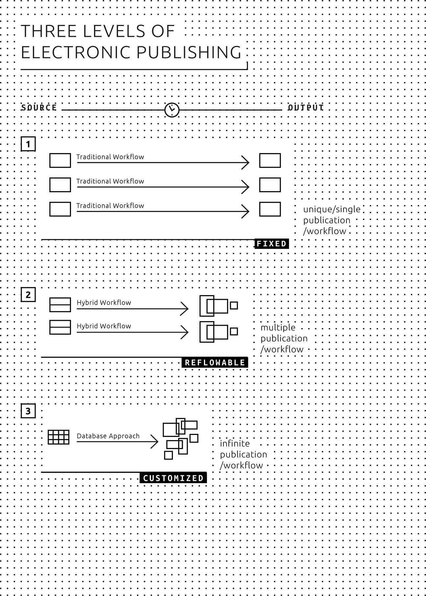

# 03 Genres of Publication 
 
 
## Five genres 
In the present project we deal with various kinds of products which we combine into five genres: 
 
 1) Research publication; 
 
 2) Art/design catalogue; 
 
 3) Artist/designer book; 
 
 4) Art/design periodical; 
 
 5) New genres of publication. 
 
 
###1) Research publication 
- Heavy in use of text; 
- Texts take a central role; 
- Visuals are secondary (images refer to texts); 
- Often longer texts; 
- Often with a standardized structure; 
- Often with complex referencing (footnotes, endnotes, cross-references, citations, bibliographies, keyword and name indexes, list of illustrations, glossaries, table of contents). 
 
**Going electronic: Advantages and issues** 
As in the whole book world, there are intense discussions about changing the forms of research publications in both sciences and humanities. The idea is to transition from the classical textbook model to new forms of publication that allow more complex forms of visualization, inclusion of real time data, and computation. However, if one wants to publish in standard ebook formats and target a broad range of electronic reading platforms and devices, the visual and multimedia possibilities of current ebook technology are as a matter of fact limited - mostly because of the size the ebook will get, making it too heavy for download. The alternative, to develop research publications as visual apps, will in most cases not be a viable solution because apps have short lifespans of technical compatibility while research publishing is long-term (and long-tail) publishing almost by definition. 
 
Advantages of going electronic with publications presenting research are first of all obvious for users: firstly, an ebook allows for copying (and pasting) text in an easy and natural way which has been long desired by researchers, students, and readers alike. Secondly, an obvious but crucial advantage is the possibility of searching within a text. Thirdly, a possible advantage is the possibility of embedding the **datasets** employed in the publication itself. For publishers a huge advantage has to do with the wider reach and availability of the content. Making the text available digitally will increase its spreading, not in the least regarding international outreach, as the ebook offers no limitations on availability. Open access publishing further changes the question of availability dramatically. 
 
Issues which specifically relate to digital research publications lie in referencing. With fixed page numbers no longer there, there is no standard way to specify the location of the reference. Worth extra thoughts are setting the parameters for the use of and interaction between text and images within a publication. 
 
Going electronic also opens up new possibilities for creating content. Due to the high level of standardized structure, a 'modularization' becomes possible, thereby allowing to go beyond the traditional way of essay writing. In particular when authors refer to each other, they often share data, quotations, tables, figures, et cetera. Multiple use and reuse of 'modules' will enormously enhance the communication within a community. However, this remains a future dream for now as comments and annotations don't stick with (a specific place in) the book like in physical books, which makes sharing difficult.[^Kircz](http://elpub.scix.net/cgi-bin/works/Show?234_elpub2008) 
 
 
 
###2) Art/design catalogue 
- Heavy in use of images; 
- Visuals take central role over texts; 
- Visuals are primary (text refers to visuals); 
- Descriptive texts of changing lengths. 
 
**Going electronic: Advantages and issues** 
Most art/design catalogues are image-heavy publications, and this is precisely the greatest challenge for electronic publishing in this genre. Being an art/design catalogue, it is important that the quality of the images is high, with no degradation of colors and the highest possible **resolution**. This means that a publication containing a lot of these images will be very large in size, posing a problem when it comes to downloading speed, storage space on the user's device and on the publishers servers. This is an issue that begs consideration but as speed and storage space increase exponentially over time, possibilities grow parallel. 
 
Possibilities in this direction lie in offering high quality images which can be zoomed in to and complementing the content with other (interactive) materials. Also, most **tablet** computers offer much more better color reproduction (gamut) than the print page. An issue of concern is that in a catalogue often a fixed page layout is necessary: image and text must appear in a certain layout as they belong to each other. However, changes in size (of the device or of the settings a reader uses) might influence the flow of content, resulting in a drifting apart of pictures and text. 
 
Just as with research publications, modularization offers interesting chances for writing and presenting material. As a catalogue is often built up around parts which are already modular in nature, there is a lot to be gained from using these features in electronic publishing. For example giving readers the opportunity to 'build' their own publication; publishing different editions (small, medium, large) of a catalogue without extra effort; easy updating of a part of the catalogue. 
 
 
###3) Artist/designer book 
- Book *by* an artist, rather than *about* an artist; 
- Complex use of images and typography, often pushing the possibilities of the medium; 
- In print: making use of the book as a material, visual and haptic object; 
- Difficult or impossible translation into other media; 
- Text is often used in non-descriptive or non-narrative ways. 
 
**Going electronic: Advantages and issues** 
As artists/designers books essentially represent a reflection around the medium itself, it is not a question of going electronic and considering the accompanying 'advantages and issues'. There aren't advantages or disadvantages in choosing a digital format or a print edition, it's a different choice that determines the artist book from the start. Also, choosing an electronic format like EPUB for an artist/designer book means to master the specificities of such formats. This seems to be one of the reason why there are few digital artists' books, except for electronic reproductions of artists' paper books on such websites as UbuWeb and Monoskop. 
 
When working on an electronic edition of an already existing print artist/designer book, the most important thing thus is the choice of the file format. The specifications of the format (and medium in general, as mentioned above) determine the end result extensively. Furthermore, here too, the quality of images and the relation between text and images is important. Where an artists' book is not primarily a reflection of its medium, and electronic publication of a book or pamphlet is principally not difficult (a good example would be Sol LeWitt's 1968 'Sentences on Conceptual Art'), advantages of digitalization are similar to those in other genres: the more elaborate possibilities offered in interactive material, outreach of the publication, reach of new audiences, and friendliness for reusing text and images. 
 
 
###4) Art/design periodical 
- Heavy in use of both texts and images; 
- Both images and texts take central role; 
- Use of images is both primary and secondary; 
- Texts of changing lengths; 
- A more-or-less fixed page-layout format; 
- Recurring publication format (e.g. magazines, series etc.). 
 
**Going electronic: Advantages and issues** 
A periodical thrives well by its physical presence. It can be tossed in a bag and just as easily be disposed of. In a digital form, the physical presence becomes limited in this sense. Of course the digital domain offers other forms of 'nudging' and ways to keep a periodical present for the reader, such as push messages on tablets and smart phones, email notifications, and sharing via social media, but this is not quite the same. 
 
The archival aspect provides other chances and issues for digital art/design periodicals. New articles can refer to older ones and even integrate parts. The periodical as such becomes a repository and therefore a playground for new work. 
 
Advantages are mostly the same as with the other genres listed: increased possibilities in extending content (interactivity, video etc.); decreasing distribution costs; outreach to a large audience; modularity. However, storage and download/update speed present a challenge, as already mentioned above. 
 
###5) New genres of publication 
New genres of publication are likely to emerge out of the ongoing digitization of the publishing industry. They could even fall outside of what we would normally consider a 'book', like short pamphlets, poems, essays, sketches, or - in the world of digital media - apps, a series of tweets, a blog et cetera. Or similar to adventure games, we can imagine the use of an interactive approach where the reader is able to control the narrative or to build or customize the publication. 
 
 
## Three levels of electronic publishing 
Independently of the different genres listed above we can sketch a basic picture based on commonalities and diversions. The scope of epublishing starts with simple conversions from paper publications to electronic ones, moving towards full-scale electronic publications. When thinking of the different forms of publishing in this respect, the role of metadata and the use and application of metadata also comes into view. (Embedding a Custom Set of Metadata Based on Dublin Core Metadata Initiative Into a MultiMarkdown Document) 
 
A division into three levels can be made, which are described in further detail below (From print to what?): 
 
1. One-to-one; the book is considered a separate product where text-authors, illustrators, artist photographers, and designers work together to produce the book, which then is published and exists as a single edition. The print book can as such be translated one-on-one into an ebook. 
 
2. One-to-many; the publication has various chameleonic appearances, dependent on the context and available presentation media (type & size of screen/paper). In other words, a book is offered in formats such as print, EPUB, **PDF**, **mobi**, **web**, and looks and works according to the format used. 
 
3. One-to-database; here the book is not a separate, defined, and limited entity. A publication is put together out of various independent components defined as modules that can be used and re-used multiple times by whomever has access to them. For example: a reader chooses a selection of chapters on offer and gets an epub specially made in this occasion. 
 
 
 
 
###1) One-to-one publications 
On the first level, there is the unique book. Each book is considered as a separate product where authors, illustrators, artists, photographers, and designers work together to produce the book as a one-off team. The production workflow can be unique from book to book, but mostly is traditional, moving from manuscript to a designed PDF ready to be printed. Pictures and/or full layout pages do not work as reusable (digital) objects. In many cases no archives of the independent ingredients that together create the end-product are available. 
 
Usually this implies that going electronic means making an e-representation of the same book. In some cases files of the final pages or book are being converted into EPUB 3 by an external agent. The final pages are checked on readability and the digital make-up (for example, that figures and captions are on the same page), and changes are made accordingly to create the ebook. On this level the ebook is not more than an exact-as-possible picture of the printed book. 
 
The publisher might use a document management system, which can be a mere collection of folders/directories on a hard drive. Archiving files is important for possible reprints. Sometimes publishers are forced to scan their own books in order to reprint them because they don't have an archived version of it. Herein lie great possibilities, because having an archive of semantically structured content allows reissuing the publication in efficient ways and in new formats not envisioned before. 
 
There are many common characteristics between books in one genre. The question is how we can reveal and define these characteristics to enhance insight in the nature of the genre at hand and thus enhance the realization of these new options. 
 
 
###2) One-to-many publications 
The next level presents a split between the manifestation of a (one) paper print version and (many) electronic versions. The electronic version, contrary to the paper version, is not a single object but has various appearances, due to different presentation substrates of electronic book formats. Furthermore, the sizes of reading devices are not standardized and generally allow for both portrait or oblong viewing. On top of this, the popular semi-standard EPUB 3 allows for flowable pages and a change in font and font size. 
 
Workflow schemes become very important when working towards a one-to-many publication, as the same texts and images are used in various outlets. A structured and detailed workflow, accompanied by a related descriptors (metadata) set is necessary. In such a way, the ebook is not a byproduct of the print book anymore, but is produced simultaneously in its different output formats. 
 
###3) One-to-database 
Database publishing presents the final level. Database publishing means that all objects or entities constituting a publication can be used independently and easily from each other. To that end they should be uniquely defined and stored in a database. As a precondition for full scale database publishing, the editorial workflow is important, because it is there that a decision is being made on what items are defined as individual entities and which characteristics and features (metadata) they have. 
 
Especially in publications which have a more or less fixed layout database publishing opens new ways of conceiving books. For example, in the case of a collection of essays readers are then be able to make a personal choice from the available texts. The same can be thought of in the case of catalogues and journals. Based on metadata a structured presentation of all material is made possible, allowing the reader to navigate and put together a collection based on personal interests. Of course this means that **tagging**, describing, and storing of all components should happen in the early stages of publication with utmost care. 
 
It is important to note that there will not be one workflow which fits all but if the relevant metadata is available publications in different forms can be created. 
 
 
 
[^Kircz]: Anita de Waard and Joost Kircz, Modeling scientific discourse - shifting perspectives and persistent issues, Proceedings of the 12th International Conference on Electronic Publishing held in Toronto, Canada 25-27 June 2008, http://elpub.scix.net/cgi-bin/works/Show?234_elpub2008. 
 

