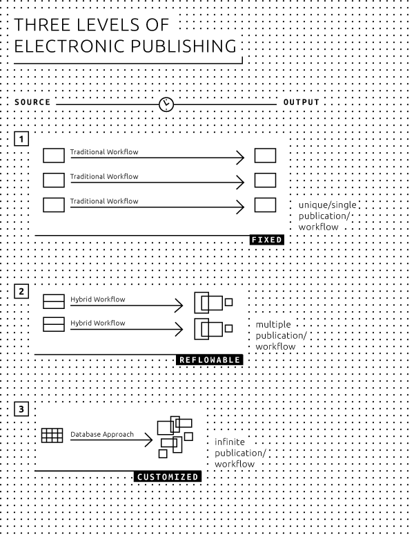

#3 Genres of publication 

 
- In art and design publishing, the most common genres are: research publications, art/design catalogues, artists'/designers' books, and art/design periodicals. 
- The opportunities and challenges of electronic publishing are different for each genre. 
- Common opportunities include searchability, ease of access and distribution, and modularization of content; common difficulties include layout consistency, page numbering and referencing, and potentially large file sizes. 
- There are three ways of creating hybrid books: 
	- one-to-one, where the book is one single product published in different media. 
	- one-to-many, where the book has different appearances in different media. 
	- one-to-database, where the book is based on the content of a database which can be used in a number of ways. 

##Five genres 
In the present project we deal with a variety of publication products which we have categorized into five genres: 
 
1. Research publication; 
2. Art/design catalogue; 
3. Artists'/designers' book; 
4. Art/design periodical; 
5. New genres. 

###1) Research publication 
- Usually text-based; 
- Texts traditionally play a central role; 
- Visuals are often secondary (images illustrate the text); 
- Often longer texts; 
- Often with a standardized structure; 
- Often with complex referencing (table of contents, footnotes, endnotes, cross-references, citations, bibliography, keyword and name indexes, list of illustrations, glossary). 

**Going electronic: advantages and issues** 
In the sciences and humanities, discussions on the digital opportunities for research publications mostly focus on the transition from the traditional textbook to new forms of publication which allow for more complex forms of visualization, inclusion of real-time data, and computation. However, if one wishes to publish in standard ebook formats and target a broad range of electronic reading platforms and devices, the visual and multimedia possibilities offered by current ebook technologies are in fact quite limited - mainly because the ebook files quickly become too large to be downloaded on mobile devices. The alternative, developing research publications as visual apps, will in most cases not be a viable solution since apps have short lifespans of technical compatibility, while research publishing is almost by definition long-term (and long-tail) publishing. 

The first, most obvious advantage of 'going electronic' with research publications is that it makes things easier for users: electronic texts make it possible for researchers, students and other readers to search, copy and paste text in a simple and straightforward way. Also, the **datasets** used in the research can be included within the publication, allowing more serious readers and researchers to engage directly with the research material itself. For publishers, making texts available digitally offers huge advantages in terms of accessibility, particularly on an international level, since distribution of ebooks is not limited by logistical issues of shipment and storage. On the other hand there are also specific problems related to digital research publications. One of these has to do with citation references: without fixed page numbers, there is no standard way of referring to a specific part of the ebook in another publication. This is one reason why scientific ebooks are still often issued as PDFs. 

'Going electronic' also opens up new possibilities for creating content. A high degree of standardized structure and ensuing 'modularization' allow for new ways of reading and writing essays. Particularly when different authors refer to each other, they often share data, quotations, tables, figures, etc. Multiple use and reuse of 'modules' can help foster communication within a community. However, this remains a future dream for the time being, since comments and annotations are not linked to (a specific place in) the book the way they are in the case of physical books, which makes sharing more complicated.[^Kircz] Another option that comes with modularization is that different users or readers of a text can each extract the modules they need. For example, if we consider an anthology of essays, a user could generate a customized ebook of all bibliographical references within the various texts. 

###2) Art/design catalogue 
- Mainly image-based; 
- Visuals play a central role; 
- Text is secondary (text refers to visuals); 
- Descriptive texts of various lengths. 

**Going electronic: advantages and issues** 
Most art/design catalogues are image-based, and here lies the greatest challenge for electronic publishing in this genre. A publication containing many images with high **resolution** and high color fidelity will take a long time to download and will occupy a great deal of storage space on the user's device as well as the publisher's servers. And as download speeds and storage space continue to increase exponentially, there is of course an endless temptation to continue increasing the file size accordingly. 

Possibilities in this direction lie in offering high-quality 'zoomable' images and adding additional material such as video (documentary, animation, etc.), audio (interviews, lectures, etc.) or even 'interactive' media. Also, most **tablet** computers offer much better color fidelity than the printed page, a fact which can be used to good advantage when offering ebooks optimized specifically for reading on a tablet. A possible problematic issue is that such catalogues often require a fixed page layout: image and text that belong together should appear next to each other; however, changes in size (of the device or of the user's settings) affect the flow of content, so that the images and text will tend to 'drift apart'. 

As with research publications, modularization offers interesting opportunities for writing and presenting material. Since a catalogue often consists of components which are already modular in nature, there is much to be gained from using these features in electronic publishing. For example, by providing readers with the opportunity to 'build' their own publication; by publishing different editions (small, medium, large) of a catalogue with little extra effort; or by easily updating specific parts of the catalogue. 

###3) Artists'/designers' book 
- Book *by* an artist, rather than *about* an artist; 
- Complex use of images and typography, often pushing the possibilities of the medium; 
- In print: making use of the book as a material, visual and tactile object; 
- Often difficult or impossible to adapt/convert to other media; 
- Text is often used in a non-descriptive or non-narrative way. 

**Going electronic: advantages and issues** 
Since an artists'/designers' book often constitutes a reflection upon the medium itself, the question of choosing between a digital format or a print edition, of 'going electronic' and weighing the ensuing advantages and issues, does not apply here as it does with other genres. Rather, it is a fundamental choice which will determine from the start many basic characteristics of the book itself. Also, choosing an electronic format such as EPUB for an artists'/designers' book requires a good working knowledge of the specific features of such a format. This seems to be one of the reasons why there are few digital artists' books, if we exclude the electronic (scanned) reproductions of printed artists' books which can be found on repository websites such as UbuWeb[^ubuweb] and Monoskop[^monoskop]. 

When working on an electronic edition of an existing printed artists'/designers' book, the choice of the file format is crucial. The end result is to a large extent determined by the specifications of each format, and more generally of each medium. Here too, as with art/design catalogues, one of the main concerns is the quality of the images; another is the relation between text and images. 

In the case of artists' books or pamphlets which are not primarily a reflection of their medium (for example Sol LeWitt's 1968 *Sentences on Conceptual Art* which consists of handwritten text on paper pages) and are not particularly difficult to adapt/convert to electronic media, the advantages of doing so are similar to those for other genres: access and distribution, reaching new audiences, the ability to easily copy and paste text and images, and the possibility of incorporating interactive materials. 

###4) Art/design periodical 
- Both text-based and image-based; 
- Images as well as texts play a central role; 
- Use of images is primary as well as secondary; 
- Texts of various lengths; 
- More or less fixed page layout format; 
- Recurring or periodical publication format (e.g. magazines, series etc.). 

**Going electronic: advantages and issues** 
An important part of the appeal of a periodical is its physical presence. It can be easily picked up from a newsstand or a table, casually tossed in a bag, and eventually disposed of. Though the digital domain has its own ways of informing or reminding the readers of a publication's existence and presence (for example, through 'push messages' on tablets and smartphones, e-mail notifications, and sharing via social media) this is of course not quite the same thing. 

In terms of archiving, 'going electronic' also provides a number of opportunities and challenges for art/design periodicals. New articles can refer to older ones, and even integrate parts of these older articles. The periodical as such becomes a repository and therefore a breeding ground for new work. 

The advantages are mostly the same as with the other genres listed: increased possibilities for extending content (interactivity, video etc.); lower distribution costs; outreach to a larger audience; and modularity. However, storage and download/update speeds can present a challenge, as described earlier. 

###5) New genres 
New genres of publication will continue to emerge as a result of the ongoing digitization of the publishing industry. These could fall outside of what we would normally consider a 'book': for example, short pamphlets, poems, essays, sketches, or - in the world of digital media - apps, a series of tweets, a blog, etc. Interactive approaches, similar to adventure games, where the reader is able to control the narrative or to build or customize the publication, have also been imagined and developed since the late 1980s. Up until now, this type of electronic publication (usually known as 'hyperfiction' or 'e-literature') has remained a marginal phenomenon, but one should not exclude the possibility of a resurgence in new contexts. 

##Three levels of electronic publishing 
Independently of the different genres listed above, we can distinguish three levels of electronic publishing. The scope of electronic publishing ranges from the simple conversion of a paper book, to an electronic publication (for example, a PDF of the print edition as an ebook), to full-scale electronic publications which incorporate advanced digital formats such as video, or are published as 'native apps' (applications developed for a particular platform or device). When we consider the different genres of publishing from this perspective, the role and use of **metadata** also becomes an important factor. (*Embedding a Custom Set of Metadata Based on Dublin Core Metadata Initiative Into a MultiMarkdown Document*) 

Electronic publishing can be divided into three levels, as described in further detail below: 

**1. One-to-one**: the book is considered as a specific product or project where text authors, illustrators, artists, photographers and designers work together to create the book, which then is published as a single edition. The print book can also be converted or adapted into an ebook. 

**2. One-to-many**: the publication has a variety of appearances, depending on the context and the available presentation media (type and size of screen/paper). The book is offered in formats such as print, EPUB, PDF, **MOBI**, web, each with an appearance and functionality suitable to the format being used. 

**3. One-to-database**: here the book is not a separate, defined, and limited entity. Rather, a publication is put together from various independent components, defined as modules, which can be used and re-used a number of times by anyone who has access to the database. For example, a user can compile a selection of available chapters and generate a customized ebook. 

 

###1) One-to-one 
On the first level there is the single edition. Each publication is considered as a separate product or project where text authors, illustrators, artists, photographers and designers work together as an ad-hoc team. The production workflow may be unique from book to book, but will usually follow a traditional pattern, from a manuscript to a designed PDF ready to be printed. Images and/or full layout pages are not suitable as reusable (digital) objects. The independent components which together make up the end product are usually not archived separately. 

'Going electronic' in this case usually means no more than generating some kind of electronic representation, as accurate as possible, of the printed book. Sometimes the files used for making the printed book will be converted into an EPUB by a third party. This electronic edition is then checked for readability and accuracy of layout (for example, making sure that images and captions are on the same page). 

The publisher may make use of a content management system, which in its simplest form is just a collection of folders/directories on a hard drive. Archiving is important: often publishers have had to scan their own books for a reprint, simply because they failed to properly archive the files. Maintaining an archive of semantically structured content also offers many new possibilities, not only for efficiently reissuing the publication but also for doing so in new formats which were not previously available. 

There are many common characteristics between individual publications within each genre. A better understanding of these characteristics will allow publishers and designers to make good use of new possibilities. 

###2) One-to-many 
On the next level we see a split between the manifestation of the (single) printed version, and the (one or many) electronic versions. The electronic version, unlike the paper version, is not a single object but has a different appearance for each ebook format. Also, due to the variety and flexibility of reading devices, different users will see the book differently on their display. The display sizes of reading devices are not standardized and generally allow for both portrait and landscape viewing. Furthermore, the popular (and more or less standard) EPUB allows for reflowable pages and variable fonts and font sizes. 

Workflow schemes are crucial in one-to-many publications, as the same texts and images will be used across a variety of formats and devices. This requires a structured and detailed workflow, and the use of a set of descriptors (metadata) related to the objects or entities of the publication. Here the ebook is no longer a by-product of the print book, but is produced simultaneously, often in a variety of formats. 

###3) One-to-database 
The final level is database publishing, in which all objects or entities of a publication can be used independently of each other. This is possible only when the editorial workflow has defined these objects or entities as individual and unique items within the database, along with the characteristics and features (metadata) of each item. 

Particularly for publications which have a more or less fixed layout, database publishing opens up new ways of designing books. For example in the case of a collection of essays, a catalogue, or a journal, readers can compile a personal selection from the available texts. A structured presentation of all material is made possible based on the metadata, allowing readers to navigate and put together a collection based on their own personal interests. Of course this means that **tagging**, describing, and storing all the components must be done in the early stages of publication and with utmost care. 

It is important to note that there will never be one single workflow which fits all requirements. However, by making available the relevant metadata, publications can be created in a variety of formats. 

[^Kircz]: Anita de Waard and Joost Kircz, 'Modeling Scientific Research Articles - Shifting Perspectives and Persistent Issues', Proceedings of the 12th International Conference on Electronic Publishing held in Toronto, Canada, 25-27 June 2008, <a href="http://elpub.scix.net/data/works/att/234_elpub2008.content.pdf">http://elpub.scix.net/data/works/att/234_elpub2008.content.pdf</a>.
[^ubuweb]: UbuWeb, <a href="http://www.ubuweb.com">http://www.ubuweb.com</a>.
[^monoskop]: Monoskop, <a href="http://monoskop.org/Monoskop">http://monoskop.org/Monoskop</a>.

