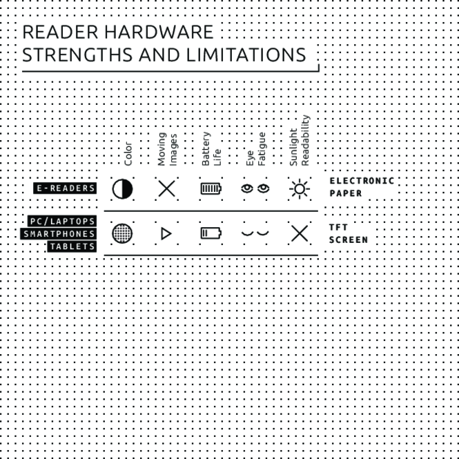
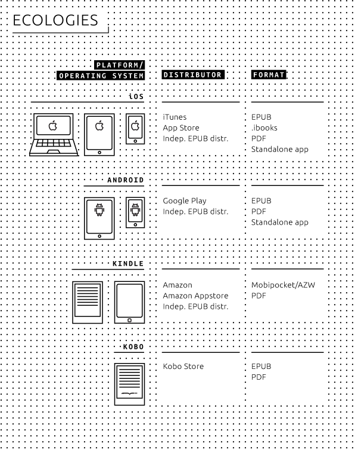

#04 Technologies for electronic reading 

 
- Users can choose from a multitude of hardware e-reader devices and software e-reading applications. 
- The possible combinations of software and hardware are complex and virtually unlimited. 
- EPUB is the most common format for electronic books, followed by Amazon's own proprietary ebook formats for its line of **Kindle** devices. 

 

 

##Reader hardware 
There are many ways of viewing electronic publications. Portable devices such as e-readers or tablets are by far the most popular way of accessing such content. Smartphones are, for the purposes of e-reading, basically miniature versions of their tablet counterparts. Finally there are desktop computers and laptops which can be used as e-reading devices, sometimes in combination with the physical book: particularly in the case of research publications, a digital version is often used for easy searching and copy/pasting of text selections. 

###E-readers 
E-readers became widely known with the introduction of the Amazon Kindle in 2007. Standard e-readers, unlike tablets, are only suitable for reading books and are relatively inexpensive. An important characteristic of e-reader devices is the use of a **monochrome** display technology known as electronic paper (e-paper). Electronic paper is designed to mimic as closely as possible the characteristics of paper, and has a very low energy consumption in comparison with other mobile displays such as the LCD screens used on tablets. The current generation of e-paper is not capable of rendering complex motion, therefore animations and videos cannot be viewed on these devices. Also, the monochrome display means that the current generation of e-readers is mainly suitable for text-based publications, such as novels or research publications. 

Some manufacturers of e-readers also offer more expensive models, such as Amazon's Kindle Fire (and Fire HD) or Barnes & Noble's NOOK Tablet (and NOOK HD+). However these models are not really e-readers anymore, but full-fledged, small-sized tablets. Instead of e-paper, they have backlit color LCD screens, a standard feature of tablets such as Apple's **iPad** and Samsung's Galaxy Tab. Often these models use a version of the Android operating system, in contrast to the traditional monochrome e-readers which use their own operating system, usually derived from a version of **Linux**. Conversely, Samsung's Galaxy Note and Apple's iPad Mini can be seen as these tablet manufacturers' answer to the smaller-sized e-reading tablets. 

 

###Tablets 
The tablet market is currently dominated by two main players, Apple and Samsung. [^sales-figures-tablet] Apple uses its own operating system (**iOS**) for the iPad, while Samsung has opted for Android as the operating system for its Galaxy Tab product line. In the Android market segment, several manufacturers offer similar hardware with variants of the Android operating system. There are various e-reader software applications for both iOS and Android. We will review the most important of these in the [reader software](#reader-software) section below. 

For viewing arts and design publications, tablets with color LCD screens are far more suitable than e-readers with monochrome e-paper displays. The color fidelity of the newest tablet displays offered by Apple and Samsung is comparable to that of professional **monitors** used by photographers and graphic designers. However, the tablet's color screen also has some serious drawbacks: backlit LCD screens cause a great deal more eye fatigue than either printed paper or e-paper, while viewing outdoors greatly diminishes image quality. Another issue with tablets is battery life: though newer models continue to provide significant improvements, their relatively large power consumption means they are still no competition in this respect for e-readers, which boast an average battery life of up to several weeks. 

###Smartphones 
For the purposes of viewing electronic publications, smartphones can be considered broadly similar to tablets, though the screen sizes are of course smaller (and also smaller than those of e-readers). Therefore we have clustered them here together with tablet devices. [^sales-figures-phone] 

###PCs/laptops 
Though ebooks can certainly be read on a laptop or personal computer, this may be ergonomically less natural for the user than reading on a handheld device. The drawbacks of increased eye fatigue and limited battery life are the same as with tablets. 

##Reader software 
Various applications for PCs, tablets and smartphones support an extended subset of the EPUB standard, allowing for extra features such as customized fonts, layout styling, etc. In the following section we will examine the most important applications for electronic reading on mobile devices, desktop and laptop computers, and the Web. 

 

###Mobile applications 
There are various software applications for tablets and smartphones, some of which are 'companion apps' to well-known e-reader devices such as Amazon's Kindle and **Kobo**'s range of e-reader hardware. Other applications were not developed for specific e-reader devices but are integrated into a storefront, such as Apple's **iBooks** and Aldiko. The applications generally support EPUB2 and EPUB3, though some require the user to convert files into a proprietary file format before the document can be opened, such as the Kindle e-reader device and application which support only Amazon's proprietary file formats (AZW, **KF8**, MOBI) along with plain text and PDF. 

####iBooks 
iBooks is Apple's ebook reader application for iPhone, iPad and Mac OS X. The user can purchase books from the iTunes Store or copy them from another source to the iBooks library. The latest version of iBooks supports many of the features of the EPUB3 standard, as well as PDF and the closed-source .ibooks file format (IBA), which is a derivative of EPUB3. 

####Aldiko 
Aldiko is both a storefront and ebook reader for Android which supports EPUB and PDF. As such it is comparable to Apple's iBooks. There is a paid version which offers some extra features (annotation, removal of advertisements) not found in the free version. 

####Kindle 
The Kindle application is Amazon's tablet and smartphone counterpart to their physical e-reader devices. The application is available for both iOS and Android. Books can be bought from inside the application on Android; on iOS the procedure is less straightforward, due to restrictions by Apple on in-app purchasing. Kindle for mobile devices only supports Amazon's proprietary file formats (AZW, KF8) and PDF. EPUBs need to be converted using third-party software (such as Calibre) before Kindle can import the files into its library. The application can sync its library so that a collection of ebooks is available on both the Kindle e-reader and within the application, for example on a smartphone. 

####Kobo 
Kobo, like Amazon, sells e-reader devices and has a large bookstore. The applications offered for Android and iOS are largely 'companion apps' to Kobo's e-reader devices. Libraries can be synced across devices, provided all the content was purchased in Kobo's bookstore. Kobo supports both EPUB and PDF files. 

####Marvin 
Marvin is a paid application which focuses mainly on managing existing collections of digital publications compiled from various sources. It does not have its own store. Marvin accepts only EPUB files, but allows users to convert other file formats using third-party software packages such as [Calibre](#calibre). 

###PC software 
There are also a many desktop applications which make it possible for users to view EPUBs. Of the five applications mentioned above, only Aldiko is not available on desktops, while iBooks is a Mac-only application. Kobo and Kindle both offer Windows and Mac versions of their software - but no Linux version, though Kobo does offer beta software for Debian Linux systems. [^kobo-debian] The functionality is similar to that of the mobile versions. 

####Calibre 
Calibre is an ebook management suite with a wide variety of features, including a few which are relevant in this particular context. (For a more detailed description of Calibre, see chapter 6.<!--- internal link needed -->) Calibre provides tools for managing large collections of ebooks, converting files to and from various formats (both ebook [^ebook] and other formats) [^calibre-file-formats], viewing all major ebook file formats, and even editing EPUB and AZW documents. 

####Adobe Digital Editions 
Adobe Digital Editions (ADE) is an ebook reader and management tool which can read EPUB and PDF documents. However, support for EPUB3 is incomplete; although Adobe claims that all the important features are supported, it doesn't elaborate on what these important features are. ADE also integrates with many e-reader devices and reader applications which provide syncing possibilities. Therefore a library managed with ADE could, at least in theory, be synced with a compatible device or application. [^ade-readers] 

###Web platforms 
There are several web platforms for reading EPUBs online, but their popularity is difficult to estimate. A project called Bookworm, developed by Threepress in 2008, was taken over by O'Reilly Labs in early 2009 and eventually shut down in 2012. [^bookworm-oreilly] The website now describes Bookworm as an 'interesting and useful experiment' and attributes the closure to dramatic changes in the ebook ecosystem over the past few years. Booki.sh, another project, is still online and offers a complete library of ebooks which can be viewed and stored online. [^bookish] However it does not appear to be operating commercially, and the ability to purchase books was removed in June 2013. [^bookish-blog] 

###Browser applications 
Besides web applications, there are also several browser extensions which allow users to read EPUBs in their web browser. However these extensions can best be understood as a convenient way of quickly viewing or previewing ebooks, rather than full-fledged e-reading applications. 

####Readium 
Readium is a project by various publishers and technology companies aiming to provide a reference system, a collection of best practices, for rendering EPUB3 publications. [^readium-goals] Readium offers a range of tools for online and offline use, mainly geared towards software developers. One of these tools is a browser extension [^readium-extension] for the Google Chrome web browser, allowing users to view an EPUB document inside the browser window. 

####EPUBReader 
EPUBReader is similar to the browser extension offered by Readium. The main difference is the supported browser: EPUBReader is only compatible with Mozilla Firefox. 

##File formats 
A file format is a standard for encoding information to be stored in a digital file. File formats may be either proprietary or free, unpublished or open. Each file format requires software which is able to read the file. 

###Reflowable documents (EPUB and AZW) 
The history of the modern ebook can be traced back to the late 1990s with the establishment of the Open eBook Forum, which defined a standard known as the Open eBook Publication Structure (OEBPS). This standard eventually resulted in the widely used ebook format known as EPUB, which is currently at version 3. Microsoft was heavily involved in the development of the Open eBook specification, based partly on technology developed by a company called SoftBook Press. [^businessweek-ebooks] SoftBook Press originally developed the format, based on XML and **XHTML**, as a companion to their hardware product, which was one of the earliest dedicated e-reader devices. The Open eBook specification was first released in 1999, and later renamed EPUB for the second version release. By this time the Open eBook Forum had become the International Digital Publishing Forum (IDPF). [^interoperability-of-ebook-formats] The new EPUB2 standard supported extended features such as basic styling, customized fonts, etc. [^epub2-specification] 

When Amazon made its entrance in the world of digital publishing, the online bookseller opted not to follow the EPUB standard, but instead to purchase a French company known as **Mobipocket** which had developed another format called MOBI with proprietary Mobipocket Reader software that ran on some personal digital assistants (**PDA**) and other hardware. [^amazon-acquires-mobipocket] One of the main reasons for this choice was the fact that, unlike EPUB, Mobipocket's products provided full support for **Digital Rights Management (DRM)**. However the practice of adding DRM to media is controversial, as it often makes it harder for paying customers to freely interact with the digital goods they have purchased. For example, files cannot in general be freely transferred to other devices.  (*The Book as Directory*) 

Technically, the MOBI file format is based partly on PalmDOC, an ebook file format readable on PDAs running the operating system developed by Palm, Inc., and with added support for guidelines taken from the Open eBook standard. [^mobileread-palmdoc] The MOBI format was further developed to be used exclusively with Mobipocket e-readers, and later with Amazon's Kindle e-readers. Finally, Amazon renamed the MOBI format AZW (presumably an acronym for 'Amazon Word'), which is now the generic term for all ebooks released by the company. [^amazon-azw] 

Currently there are roughly two 'generations' of widely used ebook formats. The first generation is based on the EPUB2 standard as introduced in 2007 (or on an earlier version released under the Open eBook specification): for example, Amazon's MOBI/AZW format. The second generation usually implements features from the EPUB3 standard, while often remaining backwardly compatible with older versions and subsets of EPUB2 (and to a certain extent earlier specifications as well). EPUB3, released in 2011, introduced new features such as support for HTML5 (whereas EPUB2 supported XHTML), the more advanced **Cascading Style Sheets** specification CSS3, scripting (which had been discouraged in EPUB2) and easy embedding of video and audio. [^epub3-changes] Most ebook file formats available today are based on EPUB3, including proprietary formats such as Amazon's AZW and Apple's iBooks. [^amazon-kf8] , [^ibooks]. For compatibility with older e-readers, the ebook package usually also includes a MOBI file. (*Crash Test Dummy*) 

###Other formats 
The file formats described above are all *reflowable* documents: their presentation can be adapted for each particular output device. There are of course other ways of presenting electronic publications, for example with a fixed layout, which preserves the look of the original, including fonts, colors, images, and formatting. A common way of doing this is to export the document as a PDF, though there are also more content-specific file formats (such as 'comic book archive'). [^comic-book-archive] However, not all such formats are supported by all e-readers. 

[^sales-figures-tablet]: *Gartner Says Worldwide Tablet Sales Grew 68 Percent in 2013, With Android Capturing 62 Percent of the Market*, <a href="http://www.gartner.com/newsroom/id/2674215">http://www.gartner.com/newsroom/id/2674215</a>. 
[^sales-figures-phone]: *Gartner Says Annual Smartphone Sales Surpassed Sales of Feature Phones for the First Time in 2013*, <a href="http://www.gartner.com/newsroom/id/2665715">http://www.gartner.com/newsroom/id/2665715</a>. 
[^kobo-debian]: MobileRead, *Any interest in Kobo Desktop for Linux?*, 5 March 2010, <a href="http://www.mobileread.com/forums/showthread.php?t=82378">http://www.mobileread.com/forums/showthread.php?t=82378</a>. 
[^ebook]: *Converting a Docx directly to EPUB using Calibre*, <a href="http://networkcultures.org/digitalpublishing/2014/03/28/converting-a-docx-directly-to-epub-using-calibre/">http://networkcultures.org/digitalpublishing/2014/03/28/converting-a-docx-directly-to-epub-using-calibre/</a>. 
[^calibre-file-formats]: <a href="http://manual.calibre-ebook.com/faq.html#what-formats-does-calibre-support-conversion-to-from">http://manual.calibre-ebook.com/faq.html#what-formats-does-calibre-support-conversion-to-from</a>. 
[^ade-readers]: *Digital Editions Supported Devices*, <a href="http://blogs.adobe.com/digitalpublishing/supported-devices">http://blogs.adobe.com/digitalpublishing/supported-devices</a>. 
[^bookworm-oreilly]: *Bookworm, "an experimental platform for storing and reading ePub-format books online," is closed as of March 31, 2012*, <a href="http://oreilly.com/bookworm">http://oreilly.com/bookworm</a>. 
[^bookish]: Booki.sh, <a href="https://booki.sh">https://booki.sh</a>. 
[^bookish-blog]: <a href="http://blog.booki.sh/blog/post/ebook-sales-via-booki-sh-to-end-on-june-30">http://blog.booki.sh/blog/post/ebook-sales-via-booki-sh-to-end-on-june-30</a>. 
[^readium-goals]: *Readium Project Goals*, <a href="http://readium.org/readium-project-goals">http://readium.org/readium-project-goals</a>. 
[^readium-extension]: *EPUB reader for Chrome*, <a href="https://chrome.google.com/webstore/detail/readium/fepbnnnkkadjhjahcafoaglimekefifl">https://chrome.google.com/webstore/detail/readium/fepbnnnkkadjhjahcafoaglimekefifl</a>. 
[^businessweek-ebooks]: *E-books: A Library on Your Lap*, <a href="http://www.businessweek.com/1998/46/b3604010.htm">http://www.businessweek.com/1998/46/b3604010.htm</a>. 
[^interoperability-of-ebook-formats]: Bläsi, C., Rothlauf, F., *On the Interoperability of eBook Formats*, Johannes Gutenberg-Universität Mainz, 2013, p. 12, <a href="http://wi.bwl.uni-mainz.de/publikationen/InteroperabilityReportGutenbergfinal07052013.pdf">http://wi.bwl.uni-mainz.de/publikationen/InteroperabilityReportGutenbergfinal07052013.pdf</a>. 
[^epub2-specification]: IDPF, *Open Publication Structure (OPS) 2.0.1 v1.0.1, Recommended Specification September 4, 2010*, 2010, <a href="http://www.idpf.org/epub/20/spec/OPS_2.0_latest.htm">http://www.idpf.org/epub/20/spec/OPS_2.0_latest.htm</a>. 
[^amazon-acquires-mobipocket]: Rosenblatt, B., *Amazon.com Acquires Mobipocket*, <a href="http://DRMWatch.com">DRMWatch.com</a>, 2005, <a href="https://web.archive.org/web/20050426003307/http://www.drmwatch.com/drmtech/article.php/3499386">https://web.archive.org/web/20050426003307/http://www.drmwatch.com/drmtech/article.php/3499386</a>. 
[^mobileread-palmdoc]: PalmDOC, <a href="http://wiki.mobileread.com/wiki/PalmDOC">http://wiki.mobileread.com/wiki/PalmDOC</a>. 
[^amazon-azw]: *Internal Formats*, <a href="http://wiki.mobileread.com/wiki/AZW#Internal_Formats">http://wiki.mobileread.com/wiki/AZW#Internal_Formats</a>. 
[^epub3-changes]: *EPUB3 Changes from EPUB 2.0.1*, <a href="http://www.idpf.org/epub/30/spec/epub30-changes.html#sec-new-changed-xhtml5">http://www.idpf.org/epub/30/spec/epub30-changes.html#sec-new-changed-xhtml5</a>. 
[^amazon-kf8]: *Kindle Format 8*, <a href="http://www.amazon.com/gp/feature.html?ie=UTF8&docId=1000729511">http://www.amazon.com/gp/feature.html?ie=UTF8&docId=1000729511</a>. 
[^ibooks-author]: *iBooks Author*, <a href="http://www.apple.com/ibooks-author/">http://www.apple.com/ibooks-author/</a>. 
[^azw3kf8-breakdown]: *KF8*, <a href="http://wiki.mobileread.com/wiki/KF8#Overview">http://wiki.mobileread.com/wiki/KF8#Overview</a>. 
[^epub-seller-apple]: *Your Books on iBooks* <a href="http://www.apple.com/itunes/working-itunes/sell-content/books/">http://www.apple.com/itunes/working-itunes/sell-content/books/</a>. 
[^epub-seller-kobo]: *Het begint met Kobo Writing Life*, <a href="http://nl.kobo.com/writinglife">http://nl.kobo.com/writinglife</a>. 
[^epub-google-play]: *Google Play, Books Partner Center*, <a href="https://play.google.com/books/publish/signup#settings">https://play.google.com/books/publish/signup#settings</a>. 
[^epub-seller-barnes]: *Frequently Asked Questions About NOOK Press*, <a href="https://www.nookpress.com/support/faq">https://www.nookpress.com/support/faq</a>. 
