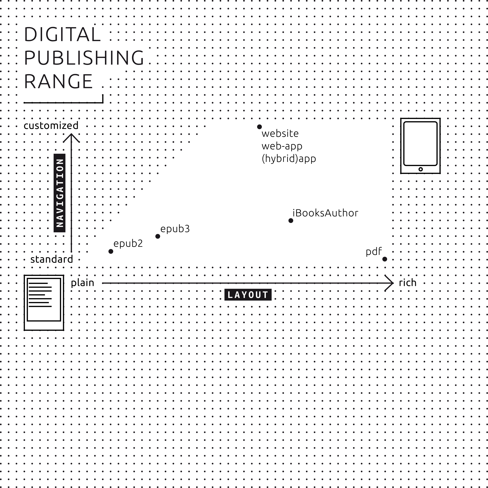

# 04 Ereading technologies

 

<!--Amy's suggestion about re-structuring: As I was reading this, it made more sense to me to change the ordering to: reader hardware, software, file formats – as talking about hardware is much more tangible and gives a bit more bridge to then understand software and then the most abstract, file formats -->

##File formats
A file format is a standard way that information is encoded for storage in a computer file. Technically, it specifies how bits are used to encode information in a digital storage medium. File formats may be either proprietary or free and may be either unpublished or open. A specific file format demands specific programs to read it.<!--Amy: I copied (and edited) this text from the glossary as I thought it would be helpful to have a brief explanation about what a file format is before going into the history! -->

In this chapter the history and characteristics of various important file formats that exist for ereaders, electronic devices capable of reading digital texts, <!--Amy: I added some text here as I thought it would be helpful to repeat a brief explanation --> will be explained. The development of the modern ebook started with the _Open eBook_ specification and has thus culminated in an ebook format called EPUB which is currently at version 3 .

###Reflowable documents (EPUB and AZW)
The history of the modern ebook can be traced back to the late 1990s with the establishment of the *Open eBook Forum* tasked with the creation of the *Open eBook Publication Structure* (OEBPS). Microsoft was heavily involved in the development of what became the *Open eBook* based partly on technology created by a company called SoftBook Press. [^businessweek-ebooks](http://www.businessweek.com/1998/46/b3604010.htm) SoftBook Press developed the format, based on [XML](#XML) and [XHTML](#XHTML) <!--Amy: Tried to link to chapter 11 glossary but not sure if it's working. I feel that this should be further explained, or make a note to refer to chapter 06 where it's described in greater detail -->, as a companion to their ereader. The *Open eBook* specification had its first release in 1999 and was later renamed to EPUB when the standard reached the 2.0 version milestone under the auspices of the *International Digital Publishing Forum* (IDPF, formerly the *Open eBook Forum*). [^interoperability-of-ebook-formats](http://wi.bwl.uni-mainz.de/publikationen/InteroperabilityReportGutenbergfinal07052013.pdf)  The EPUB 2.0 standard has support for basic styling, custom fonts, etc. [^epub2-specification](http://www.idpf.org/epub/20/spec/OPS_2.0_latest.htm)

At the beginning of Amazon's foray into the world of digital publishing, the online bookseller chose not to use EPUB but opted to buy a French company responsible for the development of *Mobipocket* and the MOBI file format that also produced Mobipocket Reader software and an ebook reader for some personal digital assistants (PDA). One of the main reasons for this move was the widely supported [Digital Rights Management](#Digital Rights Management) (DRM)<!--Amy: Tried to link to chapter 11 glossary but not sure if it's working. I feel that this should be further explained: what this is or what the consequences are. e.g 'The practice is controversial as it often hampers paying customers in freely interacting with digital goods' --> engineered by *Mobipocket*. [^amazon-aquires-mobipocket](https://web.archive.org/web/20050426003307/http://www.drmwatch.com/drmtech/article.php/3499386) Technically, the MOBI file-format is partly based on *PalmDOC*, an ebook file-format readable on PDAs running the Operating System (OS) developed by Palm Inc., with added support for the guidelines taken from the *Open eBook* standard. [^mobileread-palmdoc](http://wiki.mobileread.com/wiki/PalmDOC) Mobilepocket and Amazon then developed the format further in order for it to be used exclusively with *Mobipocket* and, later, Amazon *Kindle* ereaders. The MOBI format is now called AZW (probably an acronym for _Amazon Word_) by Amazon, their generic term for all ebooks released by the company. [^amazon-azw](http://wiki.mobileread.com/wiki/AZW#Internal_Formats)

Nowadays, roughly two generations of widely used ebook formats exist. One generation is based on the EPUB 2.0 standard as introduced in 2007, or an earlier version released under the *Open eBook* moniker. Amazon's MOBI/AZW is an example of this, as it's still widely used and supported by the *Kindle* ereaders. The other generally implements features from the EPUB 3.0 standard, while often remaining backwardly compatible with older versions and subsets of EPUB 2.0 and even 1.0 to a certain extent. EPUB 3.0, released in 2011[^reader-specification], brought support for HTML 5 (as opposed to XHTML 1.1 in EPUB 2.0), more advanced styling using **CSS3**, scripting (discouraged in EPUB 2.0) and easy embedding of video and audio, amongst others. [^epub3-changes](http://www.idpf.org/epub/30/spec/epub30-changes.html#sec-new-changed-xhtml5) EPUB 3.0 forms the basis of most of the ebook file formats available today. Most of the current file formats, like Amazon's AZW3/KF8 and Apple's iBooks, implement most of the EPUB standard, mainly to benefit from the HTML5 and CSS3 specifications, while adding their own proprietary extensions. [^amazon-kf8](http://www.amazon.com/gp/feature.html?ie=UTF8&docId=1000729511), [^ibooks-author](http://www.apple.com/ibooks-author/) These extensions are mainly geared towards extra support for more advanced (fixed) layout options, rich media integration and DRM. [^ibooks-photo-blocks](http://www.pigsgourdsandwikis.com/2011/01/expandible-photo-blocks-in-ibooks-on.html), [^ibooks-multicolumn](http://padilicious.com/multicolumn/index.html), [^amazon-kf8](http://www.amazon.com/gp/feature.html?ie=UTF8&docId=1000729511) An AZW3/KF8 ebook is basically an EPUB 3.0 wrapped in Amazon's DRM. For backwards compatibility a MOBI version of the publication is generally also present in the ebook package. [^azw3kf8-breakdown](http://wiki.mobileread.com/wiki/KF8#Overview)

Of course EPUB 3.0 files without proprietary extensions exist as well and are sold to various commercial channels. In addition to their own iBooks file format, Apple also sells ebooks in their online store. [^epub-seller-apple](http://www.apple.com/itunes/working-itunes/sell-content/books/) Other major players include Kobo, Google Play and Barnes & Nobles' NookPress. [^epub-seller-kobo](http://nl.kobo.com/writinglife), [^epub-google-play](https://play.google.com/books/publish/signup#settings), [^epub-seller-barnes](https://www.nookpress.com/support/faq) 

<!-- Margreet: an overwhelming amount of terminology and formats introduced. Perhaps we should introduce some terms earlier in the toolkit? --> 

<!--Amy: I agree with Margreet, there are a wave of new terms introduced over a very short piece of text. It is hard to get through it all without having previous knowledge or spending time in checking the glossary and references. So in conclusion i propose to link some terms to the glossary + reorder this chapter as mentioned in earlier note-->

###Other formats
The aforementioned file formats may be categorized as *reflowable* documents as they can adapt its presentation to the output device. There are of course other ways different ways to disseminate electronic publications, for example the fixed layout, which preserves the look of the original, complete with fonts, colours, images, and formatting. One way of doing this is exporting a document as a **PDF** (Portable Document Format), but there are also more content specific file formats like the *Comic Book Archive*, [^comic-book-archive](https://launchpad.net/acbf) however support for these file formats by ereaders varies greatly.

<!--Amy: here I elaborated on what a reflowable document is vs. what a fixed layout is. -->

##Reader hardware
There are several ways to peruse electronic publications. Portable devices like ereaders or tablets are by far the most popular gateway to digital content. Smartphones also offer some of the capabilities of an ereader, as most of these devices are a miniature version of their tablet counterparts. Lastly not to forget the desktop computer, which is often used in combination with the physical book, especially in the case of research publications.

###Ereaders
Ereaders became widely known with the introduction of the Amazon Kindle in 2007. Ereaders differ from tablets in the way that they are only suitable for reading books, are relatively cheap and have monochrome displays. An important characteristic of the ereader is the use of *electronic paper* (epaper), a so-called electrophoretic screen. Electronic paper is designed to mimic the characteristics of paper as closely as possible and is relatively low in energy consumption. The current generation of epaper is incapable of rendering complex motion, so animations and videos are impossible to use.

Both Amazon and Barnes & Noble also offer more expensive models, Amazon Fire (and Fire HD) and NOOK Tablet (and NOOK HD+) respectively. These models are not really ereaders anymore, but fully-fledged, small sized tablets. These models do not use epaper, but instead work with color LED screens with backlight – a standard component of tablets such as iPad and Galaxy Tab. Often these tablets use a version of the Android operating system as its core, in contrast to the classic monochromatic ereaders using their own operating system built on a version of Linux. The Samsung Galaxy Note and Apple iPad mini can be seen as an answer to the smaller sized tablets.

Because of the lack of a color screen the current generation of ereaders is best suited for prevalently text publications, i.e. novels or research publications. 

<!-- Amy: note about image; i think the eye fatigue icons should be switched as it now looks like you'll get tired eyes from ereader as opposed to the other way around.  -->

###Tablets
The tablet-market is dominated by two main players, [^sales-figures-tablet](http://www.gartner.com/newsroom/id/2674215) Apple and Samsung. Apple utilizes their own operating system (iOS) for the iPad, while Samsung with its Galaxy Tab product line has opted for Android. The Android-segment of the market consists of many manufacturers offering similar hardware with a variant of Android as its operating system. Several ereader applications exist for both iOS and Android, the most important ones will be reviewed in the [reader software](#Reader software) section.

Apple's and Samsung's most recent tablet screens cover nearly the entire sRGB color space<!-- add to glossary -->, which makes their color reproduction as good as that of professional monitors for photographers and graphic designers, and yields much better color reproduction than print. The upside of the tablet's color screen is at the same time also its weakness, as backlit LED screens are generally known to cause eye fatigue. Furthermore, reading in the sun is problematic, because direct sunlight obscures most of the visibility of the screen. Battery life is another issue with tablets. Although newer tablet models often claim impressive battery life, ereaders still reign supreme with an average battery life of up to several weeks.

###Smartphones
The story for tablets also largely applies to the realm of smartphones. [^sales-figures-phone](http://www.gartner.com/newsroom/id/2665715) Of course most smartphones have smaller screens than both ereaders and tablets. But the similarities between smartphones and tablets are large enough to justify clustering them with tablet devices. 

###PC/Laptops
Reading ebooks on a laptop or personal computer is a possibility but may be a less natural fit than handheld devices. A full range of software for ereading is available, but the same downsides of relatively limited battery life and increased chances of eye fatigue exist as with tablets.

## [Reader software](id:Reader software)
Standalone applications for desktops, tablets and smartphones offer some advantages to the software present on ereaders. Firstly, almost all devices offer a full color display, as opposed to the monochrome e-ink screens of ereaders. Secondly, a lot of applications support a larger subset of the EPUB standard, which allows for more features - like custom fonts, layout styling, etc.

 <!-- kimmy: very rough sketch -->

###Mobile applications
There are many existing applications for mobile devices (tablets and smartphones). Some of the available software constitutes of companion apps to well-known ereaders, like Amazon's Kindle and Kobo's range of reader hardware. The other category contains applications which are not for available ereaders but often offer their own storefront, viz. iBooks and Aldiko. EPUB 2.0 and 3.0 support is generally available, but some of the applications require the user to convert files into a proprietary file format in order for the ereader to be able to read the document. Kindle is an example, as it only supports Amazon's proprietary file formats (AZW, KF8, mobi and txt) <!-- add to glossary --> and PDF.
<!-- Silvio: ”Amazon's proprietary file formats (AZW, KF8, mobi ) along with txt and PDF. -->

####iBooks####
iBooks is Apple's ereader application for iPhone, iPad and Mac. Books may be bought in the iTunes Store or can be copied to the iBooks library. The latest version of iBooks offers support for many of the features of the EPUB3 standard, but also PDF and the closed-source `.ibooks` file format (IBA) - a derivative of EPUB3.

####Marvin####
Marvin is another application and one of the few paid entries. It does not offer its own store and is mainly geared towards managing existing collections of digital publications compiled from various sources. Marvin only accepts EPUBs and offers to convert incompatible file formats using third party software package such as [Calibre](#calibre).

####Aldiko####
Aldiko is both a storefront and an ereader for Android which supports EPUB and PDF. As such it is comparable to Apple's iBooks. There is a paid version which offers some extra features (annotation, removal of advertisements) which the free version does not offer.

####Kindle####
Kindle is Amazon's tablet and smartphone counterpart to their physical ereaders (Kindle Paperwhite, etc.). The application is available for both iOS and Android. Books can be bought from inside the application on Android. On iOS it is less straightforward due to the restrictions Apple places on in-app purchasing. Kindle for mobile devices only has support for Amazon's proprietary file formats (AZW, KF8) and PDF. EPUBs have to be converted using software, for example Calibre, in order for Kindle to be able to import the files into its library. The application is able to sync its library so that a collection of ebooks is available on both the Kindle ereader and in the application. It is not possible to copy-paste. 

####Kobo####
Kobo, like Amazon, produces ereader hardware and also has a large bookstore. As such the apps they offer for Android and iOS are largely complementary to the ereader companion devices manufactured by Kobo. Libraries are synced across devices, provided all the content is bought in Kobo's bookstore. Kobo supports both EPUB and PDF files.

###PC software
A plethora of desktop applications exists that allow users to read EPUBs. Of the five applications mentioned above only Aldiko is not available on desktops and iBooks is a Mac-only application. Kobo and Kindle both offer Windows and Mac versions of their software, Linux support isn't available - although Kobo offered beta software for Debian based systems. [^kobo-debian](http://www.mobileread.com/forums/showthread.php?t=82378) The functionality is similar to that of the mobile versions.

####[Calibre](id:calibre)
Calibre is an application of note here, because it's an ebook management suite with many features. It offers tools for managing large collections of ebooks, but also converts files to many different formats (both [^ebook](http://networkcultures.org/digitalpublishing/2014/03/28/converting-a-docx-directly-to-epub-using-calibre/) and other text based formats). [^calibre-file-formats](http://manual.calibre-e-book.com/faq.html#what-formats-does-app-support-conversion-to-from) Viewing all major ebook file formats, as well as editing EPUBs and AZWs is also part of the software package.

####Adobe Digital Editions
Adobe Digital Editions (ADE) is an ebook reader and management tool which is able to read EPUB and PDF. Support for EPUB3 is incomplete. Although Adobe claims support for all the important features is present, it doesn't elaborate on what those important features are. ADE also integrates with many ereaders offering syncing possibilities. So a library managed with ADE could in theory be synced with a compatible ereader.[^ade-readers](http://blogs.adobe.com/digitalpublishing/supported-devices)

###Web platforms
There are some web platforms for reading EPUBs online, their popularity is hard to gauge. A project called Bookworm, developed by Threepress, was closed by O'Reilly Labs in 2012. [^bookworm-oreilly](http://www.oreilly.com/bookworm/) The reason given for the closure mentions an 'interesting experiment' but also due to the dramatic changes in the ebook ecosystem over the past few years. Booki.sh, another project, is still online and offers a complete library of ebooks which may be view and stored online. [^bookish](https://booki.sh/) It doesn't appear to operate commercially though, and the ability to purchase books was removed in June 2013. [^bookish-blog](http://blog.booki.sh/blog/post/e-book-sales-via-booki-sh-to-end-on-june-30/)

###Browser applications
Apart from web applications, several browser extensions exist allowing users to read EPUBs in their web browser. These extensions are most likely more of a convenience method in order to quickly (pre)view ebooks, instead of being fully-fledged solutions for reading ebooks comparable to the functionality of ereaders.

####Readium
Readium is a project by several publishers and technology companies aiming to provide a reference system, a collection of best practices, for rendering EPUB 3 publications. [^readium-goals](http://readium.org/readium-project-goals) The Readium Project offers a range of tools for online and offline use, mainly geared towards software developers. One of the tools is a browser extension [^readium-extension](https://chrome.google.com/webstore/detail/readium/fepbnnnkkadjhjahcafoaglimekefifl) for the Google Chrome Browser. After installing the extension offers an EPUB reader inside the browser window.

####epubReader
epubReader is similar to the browser extension offered by Readium. However, the main difference is the supported browser, as epubReader is only compatible with Mozilla Firefox.

<!-- Amy: I noticed that 'Alternative ways of publishing' is repeated in chapter 09. I suggest to delete this, or at least to make a condensed summary. -->

###Alternative ways of publishing 

<!-- header title might change (app creators). this should be a chapter also covering layargloss and adobe digital publishing suites, sigil and calibre --> 
 
A single downloadable package like EPUB might be a great vehicle to monetize, but there could be other factors to consider when publishing. A consistent design and uniform interactivity across devices could be a requirement, in which case a reflowable document might not be the ideal solution. Some publishers opt to develop their own (mobile) applications, like The Guardian's iOS version of their newspaper, the amplified ebooks by Penguin or the children's book by Purple Carrot. [^guardian-ios](http://www.theguardian.com/global/ng-interactive/2014/may/29/-sp-the-guardian-app-for-ios-and-android), [^penguin-amplified], [^purple-carrot-publication] These solutions offer fine-grained control over user interaction and consistency of design, but come with the extra cost of hiring a development team to engineer the application. Also, publishing for different platforms is not that straightforward. Code written specifically with the iOS SDK (Software Development Kit) in mind will likely require a lot of editing before it's ready to run on the Android platform. Portability is another issue, it's fairly easy to transfer an ebook to another device. An application binary cannot be copied to another device that easily, partly because of incompatible platform architecture (iOS versus Android, or even iOS versus Mac OS X) and other, more artificial obstacles (DRM). 

<!-- Silvio: Adobe Digital Editions is the software used to read and manage e-books: http://www.adobe.com/it/solutions/ebook/digital-editions.html
- the Adobe Digital Publishing Suite is a sort of extension of InDesign that allows to produce 'enhanced' magazines and publications for iPad, etc: http://www.adobe.com/it/products/digital-publishing-suite-enterprise.html -->

Lastly, why not just publish essays, articles or even whole books on a website? The wealth of weblogs and other publishing platforms shows that this is a viable form of publishing. Monetising is less straightforward, most websites generate income by showing advertisements or sponsored articles. Paid membership is also used as a business model by some websites, like *De Correspondent*.[^de-correspondent](https://decorrespondent.nl) One of the major downsides is that content will only be available online and cannot be easily passed around as a single unit of information like an EPUB or a PDF.

[^businessweek-ebooks]: E-BOOKS: A LIBRARY ON YOUR LAP, http://www.businessweek.com/1998/46/b3604010.htm.
[^interoperability-of-ebook-formats]: Bläsi, C., Rothlauf, F., On the Interoperability of eBook Formats,  Johannes Gutenberg-Universität Mainz, 2013, p. 12, http://wi.bwl.uni-mainz.de/publikationen/InteroperabilityReportGutenbergfinal07052013.pdf.
[^epub2-specification]: idpf, 'Open Publication Structure (OPS) 2.0.1 v1.0.1, Recommended Specification September 4, 2010', 2010, http://www.idpf.org/epub/20/spec/OPS_2.0_latest.htm.
[^amazon-aquires-mobipocket]: Rosenblatt, B., 'Amazon.com Acquires Mobipocket', DRMWatch.com, 2005, https://web.archive.org/web/20050426003307/http://www.drmwatch.com/drmtech/article.php/3499386.
[^mobileread-palmdoc]: PalmDOC, http://wiki.mobileread.com/wiki/PalmDOC.
[^amazon-azw]: Internal Formats, http://wiki.mobileread.com/wiki/AZW#Internal_Formats.
[^epub3-changes]: EPUB 3 Changes from EPUB 2.0.1, http://www.idpf.org/epub/30/spec/epub30-changes.html#sec-new-changed-xhtml5.
[^amazon-kf8]: Kindle Format 8, http://www.amazon.com/gp/feature.html?ie=UTF8&docId=1000729511.
[^ibooks-author]: iBook Author, http://www.apple.com/ibooks-author/.
[^ibooks-photo-blocks]: Liz Castro, 'Expandable Photo Blocks in iBooks on iPad',  Pigs, Gourds and Wikis, 22 October 2014, http://www.pigsgourdsandwikis.com/2011/01/expandible-photo-blocks-in-ibooks-on.html.
[^ibooks-multicolumn]: Create Multi-Column Article for the iPad, http://padilicious.com/multicolumn/index.html.
[^azw3kf8-breakdown]: KF8, http://wiki.mobileread.com/wiki/KF8#Overview.
[^epub-seller-apple]: Your Books on iBooks, http://www.apple.com/itunes/working-itunes/sell-content/books/.
[^epub-seller-kobo]: Het begint met Kobo Writing Life, http://nl.kobo.com/writinglife.
[^epub-google-play]: Google play, Books Partner Cente, https://play.google.com/books/publish/signup#settings.
[^epub-seller-barnes]: Frequently Asked Questions About NOOK Press, https://www.nookpress.com/support/faq.
[^comic-book-archive]: Advanced Comic Book Format, https://launchpad.net/acbf.
[^sales-figures-tablet]: Gartner Says Worldwide Tablet Sales Grew 68 Percent in 2013, With Android Capturing 62 Percent of the Market, http://www.gartner.com/newsroom/id/2674215.
[^sales-figures-phone]: Gartner Says Annual Smartphone Sales Surpassed Sales of Feature Phones for the First Time in 2013, http://www.gartner.com/newsroom/id/2665715.
[^kobo-debian]: Any interest in Kobo Desktop for Linux?, http://www.mobileread.com/forums/showthread.php?t=82378.
<!--Amy: how to style a reference from a forum site [kobo-debian]? -->
[^ebook]: Converting a Docx directly to EPUB using Calibre, http://networkcultures.org/digitalpublishing/2014/03/28/converting-a-docx-directly-to-epub-using-calibre/.
[^calibre-file-formats]: http://manual.calibre-e-book.com/faq.html#what-formats-does-app-support-conversion-to-from.
<!--Amy: above [^calibre-file-formats] link is empty -->
[^ade-readers]: Digital Editions Supported Devices, http://blogs.adobe.com/digitalpublishing/supported-devices.
[^bookworm-oreilly]: Bookworm, “an experimental platform for storing and reading ePub-format books online,” is closed as of March 31, 2012., http://oreilly.com/bookworm.
[^bookish]: Booki.sh, https://booki.sh.
[^bookish-blog]: http://blog.booki.sh/blog/post/e-book-sales-via-booki-sh-to-end-on-june-30/.
<!--Amy: above [^bookish-blog] link is not found -->
[^readium-goals]: Readium Project Goals, http://readium.org/readium-project-goals.
[^readium-extension]: EPUB reader for Chrome, https://chrome.google.com/webstore/detail/readium/fepbnnnkkadjhjahcafoaglimekefifl.
[^guardian-ios]: The New Free Guardian app for iOS and Android, http://www.theguardian.com/global/ng-interactive/2014/may/29/-sp-the-guardian-app-for-ios-and-android.
[^penguin-amplified]: For example: Jack Kerouac's *On the Road* (A Penguin Books Amplified Edition), 2 July 2011, http://www.penguin.com/static/pages/features/amplified_editions/on_the_road.php and Ayn Rand's *Atlas Shrugged* (An NAL Amplified Edition), 12 October 2013, http://www.penguin.com/static/pages/features/amplified_editions/atlas_shrugged.php.
<!--Amy: [^penguin-amplified] unsure about how to deal with the above as there are two URL's in here. -->
[^purple-carrot-publication]: The Prisoner of Carrot Castle By Purple Carrot Books, https://itunes.apple.com/us/app/the-prisoner-of-carrot-castle/id499981407?mt=8&ign-mpt=uo%3D4.
[^de-correspondent]: De Correspondent, https://decorrespondent.nl.

<!-- Amy: removed this footnote as it was not in body text
[^epub3-specification]: idpf, 'epub 3 Overview, Recommended Specification 11 October 2011', 2011, http://www.idpf.org/epub/30/spec/epub30-overview.html
-->

