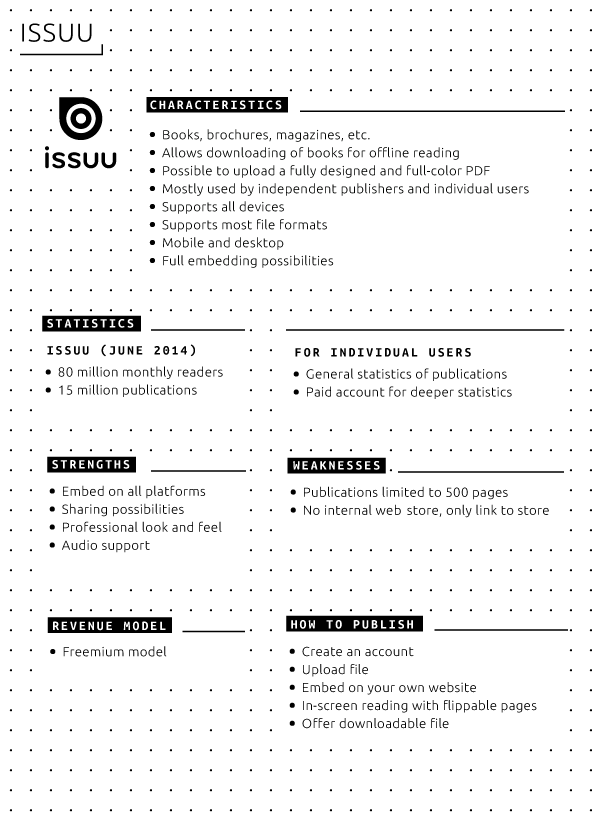
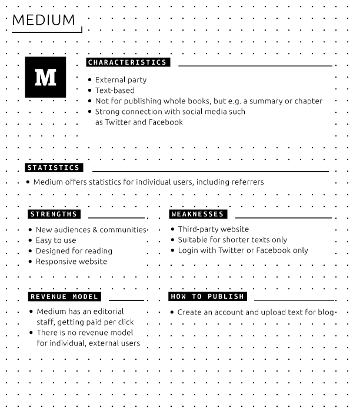
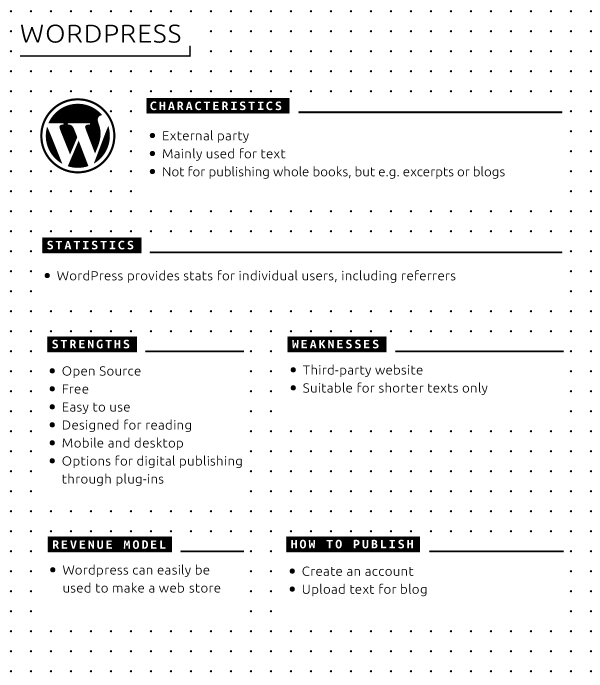
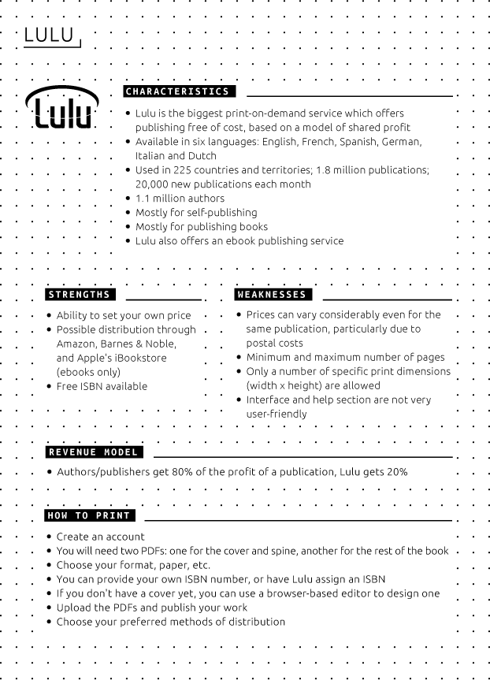
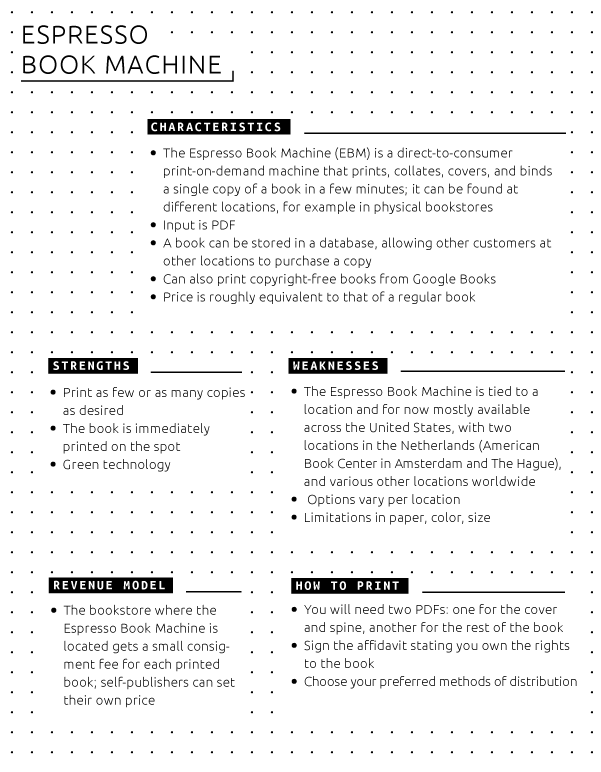

<<<<<<< HEAD
#5 Distribution platforms  

  
- Electronic book distribution currently takes place through ebook stores, online reading platforms, social reading
platforms, print-on-demand and self-publishing services, pirate download platforms and artists' ebook projects.  
- These platforms differ in their scope of content, their business strategies and the reading technologies they support.  
- The choice of one or more distribution platforms therefore also determines design choices for an ebook.  

  

##Ebook stores

There are many channels for the distribution of ebooks. Surprisingly, traditional retailers generally play no more than
a marginal role in selling electronic publications. A notable exception is Barnes & Noble with its range of NOOK devices
and dedicated ebook store. Major players in the field include Amazon, Apple, Google, Barnes & Noble and Kobo.  

These ebook stores typically charge a percentage for each publication sold, usually no less than 30% of the retail
price.[^apple-press-percentage]^,^[^guardian-amazon-hachette] With the exception of Google, most of the major retailers
sell their ebooks in a way that is closely integrated with their own branded e-reader hardware (Kindle, iPad, NOOK,
etc.). For example, publications purchased on Amazon's Kindle are immediately downloaded to the device, rather than
having to connect the device to a computer and then transfer the downloaded purchases manually.  

Each retailer requires publishers to upload files in a specific format or formats. Apple for example only supports EPUB
or publications made using iBooks Author, and doesn't allow PDFs.[^apple-publication-guidelines] Amazon with its Kindle
Direct Publishing program supports a broader range of formats, including AZW, EPUB, PDF and even Microsoft Word
documents.[^kindle-direct-publishing]  

##Online reading platforms

Online reading platforms are browser-based platforms for reading electronic publications. Publications can be presented
in a variety of formats. The choice of online platform (and thus of publication format) also has consequences for
distribution methods and accessibility.  

It is important to remember that publishers who make use of an online reading platform are effectively dependent on the
platform provider. If the platform changes its technology or terms of service, or simply goes out of business, the
publisher has no recourse, except possibly to find another platform. On the other hand, ebook stores which offer
downloadable files provide the publisher with much more control and freedom in this respect.  

The following is an overview of the main characteristics, statistics, strengths and weaknesses, revenue models and
publishing guidelines for three major online reading platforms (Issuu,[^Issuu] Scribd[^Scribd] and Internet
Archive[^Internet-Archive]) as well as two third-party blogs (Medium[^Medium] and WordPress[^WordPress]).  

  

  

  

  

  

###Social reading platforms  

Social reading, a combination of social networking and reading ebooks, is a relatively new phenomenon with much
potential for future developments. A detailed discussion of the topic would lead us beyond the scope of this Toolkit;
however, publishers working on electronic publications are advised to keep an eye on developments in social reading.  

Examples of social reading platforms:  

- *Goodreads* - 'Goodreads is the world's largest site for readers and book recommendations. Our mission is to help
people find and share books they love. Goodreads launched in January 2007.'  
- *Social Book* - 'Social Book, created by the Institute for the Future of the Book, is a social reading platform that
allows readers to add their own commentary to texts, share these ideas with others, follow others' comments, and create
communities of interactive readers/writers.'  
- *Wattpad* - 'Wattpad stories are free. Whether you're online or off, use the devices you already own to carry an
entire library wherever you go [...] Join the conversation about the stories you read: message the writer and interact
with other people who love the story as much as you.'  
- *Hebban* - A Dutch social reading platform, pre-released in beta version in 2014.  
- *Discussions on social media* are also part of the social reading experience: Twitter interviews, Facebook pages for
newly released books, book reviews in podcasts or on YouTube.  

##Print on demand (POD)  

There are many services which offer **print-on-demand** publishing; a simple Google search for the term will turn up a
myriad of results. The following section is a brief description of the most important services, in the Netherlands as
well as abroad. Of course many 'regular' printers also offer print-on-demand services, though they usually require a
minimum number of copies to be printed. The following is an overview of the main characteristics, strengths and
weaknesses, revenue models and publishing guidelines for two major print-on-demand services, Lulu[^Lulu] and the
Espresso Book Machine[^Espresso-Book-Machine].  

  

###International options  
* Kobo Writing Life[^Kobo-Writing-Life] - Allows authors and publishers to self-publish digital content in 160+
countries. The Kobo Writing Life website can be used to publish ebooks and to track sales.  
* PubIt![^PubIt!] - Automatically converts digital files for viewing on NOOK, mobile, and computing devices. Also helps
authors and publishers distribute their ebooks.  
* Smashwords[^Smashwords] - Makes it free and easy to publish, distribute and sell ebooks globally through the largest
ebook retailers, including Apple's iBookstore, Barnes & Noble, Sony, Kobo, Baker & Taylor, Diesel eBooks and more. There
are no setup fees and no extra costs for updating or revising a published book.  
* XinXii[^XinXii] - Allows authors to upload and sell their publications online on their XinXii author page: short
works, documents and ebooks, in multiple formats including PDF, EPUB and MOBI, as well as audiobooks. As an aggregator,
XinXii distributes to major international ebook retailers.  

###Options in the Netherlands  

* CB's print on demand service[^CB-Print-on-demand] - The largest Dutch supplier of non-specialist printed books to
bookstores and consumers. In addition to selling ebooks through Dutch and Belgian retailers, CB also facilitates
international sales. One of the services offered is print on demand. This is directed primarily at publishers already
working with the CB distribution center. The book will remain available through the databases used by bookstores and
publishers, in the same way as paper books.  
* Boekscout[^Boekscout] - Is one of the main print-on-demand publishers in the Netherlands, focused on self-publishing.  

##Pirate platforms: The Pirate Bay, library.ru, AAAAARG, Monoskop  
As with music and films, 'pirate' platforms haven often been at the avant-garde of electronic publishing. They provide
music, films, games and electronic books as free downloads - either in outright violation of copyrights, or in legal
'gray zones' (obscure and out-of-print books, films or recordings of which the rights owners are unknown). The mere
existence and popularity of pirate sites for digitized books is in itself an indication of the actual size of the market
for electronic reading. Pirate platforms are, by their nature, more volatile than online bookstores and e-reading
platforms. Worldwide there are various organizations dedicated to fighting piracy and shutting down pirate websites,
even small-scale ones. However pirate platforms have usually proven quite resilient to such crackdown attempts by
copyright enforcers, often reincarnating on a different web domain shortly after a forced closure.  

Commercial providers of digital content can (and do) learn a lot from pirate platforms. For example, Netflix,[^Netflix]
the most successful web service for **streaming** films and a growing competitor to paid cable television, has been
known to decide which films to show based on the popularity of these films on The Pirate Bay.[^The-Pirate-Bay]  

####All-purpose download sites  
Sites like The Pirate Bay offer every imaginable type of digital media for download: films, music, computer games and
software, and of course electronic books. The content listed on The Pirate Bay and other sites which make use of the
**BitTorrent** **protocol** tends toward the mainstream: Hollywood films, pop music, and non-fiction and technical
handbook literature as well as fantasy and science fiction. Since these sites are widely used and provide up-to-date
download statistics, and since their technology (BitTorrent) depends on user participation for downloads to remain
available, they provide a great deal of insight into which titles are truly popular among readers, as well as the
popularity of ebooks in general. For example, at a particular moment in June 2014, the book *Atlas of Ancient Worlds*
had been downloaded more than 2000 times in 48 hours (in comparison, the most popular film - an episode of the TV series
*Game of Thrones* - had been downloaded more than 70,000 times).  

####General ebook sites  

Besides sites such as Project Gutenberg,[^Project-Gutenberg] where users can legally download copyright-free ebooks,
there are many websites where ebooks are shared illegally. The most simple ebook pirate sites offer every kind of book -
very much like a large general-audience bookstore or Amazon's online bookstores. This type of site, which is in fact
little more than a simple search engine with downloadable content such as ebooks, is particularly popular in Russia. At
the time of writing, library.ru was the model for this type of site. After its forced closure, the vacuum was soon
filled by other sites such as bookfi.org.[^bookfi.org] Another example worth mentioning here is the online library
libgen.info.[^libgen.info]  

####Specialized sites  

Some websites which operate outside (or in 'gray zones') of copyright law are in fact art projects. In the 1990s the
website 'textz.com', created by the Berlin-based artist Sebastian Luetgert, was the first website to offer books on
culture, politics and media theory as simple, freely downloadable text files (incidentally, the name 'textz' was a pun
on 'warez', a slang term for illegally copied software). Later, other websites such as AAAAARG[^aaaaarg.org] and
Monoskop[^Monoskop] provided thematically linked collections of freely downloadable books on art, culture and media
studies, with the stated goal of stimulating reading and discussion groups, or of offering a carefully hand-selected
library according to the specific tastes of the website's owner.  

The most well-known of these is UbuWeb,[^Ubuweb] an website offering an encyclopedic scope of downloadable audio, video
and plain-text versions of avant-garde art recordings, films and books. Most of the books fall in the category of
small-edition artists' books and are presented here with the permission of the artists in question, who are not so
concerned with potential loss of revenue since most of the works are officially out of print and never made any money
even when they were commercially available.  

All these websites are operated much like small specialized bookstores - even though they don't sell anything. However
they demonstrate the viability of an approach which is the complete opposite of that of mainstream businesses such as
Amazon and bookfi.org - namely, offering a relatively small collection of personally selected publications. If the
website enjoys a strong reputation, as in the case of UbuWeb, AAAAARG or Monoskop, users will regularly return to the
site, and download and read works by authors they have never even heard of, simply based on the fact that the work is
available on a site they trust.  

What online booksellers could learn from these websites:  

* Simplicity combined with encyclopedic scope. No other website except Amazon makes it so easy to find and download
electronic books in any genre or language, from bestsellers to obscure out-of-print cult classics.  
* Simplicity of format. The sites provide mostly PDFs and EPUBs, depending on the format the work was presented in.  

##Artist and designer-run projects: Badlands Unlimited, KYUR8, artistsebooks.org  

In recent years there have been efforts to set up small presses and book download stores focusing exclusively on
artists' and designers' books: for example the writer, artist and publisher James Bridle (who coined the term 'new
aesthetics') created *Artists' eBbooks*, a website featuring freely downloadable EPUB files by experimental writers and
artists.[^artistsebooks.org] Another example is the more commercially oriented online press Badlands Unlimited, an
initiative of the American contemporary artist and designer Paul Chan, which sells artist-made visual electronic books,
available only in Apple's proprietary format for the iPad tablet and iBooks platform.  

The iPhone/iPad app KYUR8 ('curate') invites artists to quickly assemble their own electronic visual magazine using page
templates and photo collections taken from the user's cell phone. Other examples include
[gauss-pdf.com](http://www.gauss-pdf.com), a publisher of digital and printed works and
[trollthread.tumblr.com](http://trollthread.tumblr.com), a collective of poets with publications available for download
in PDF or for purchase through print on demand.  

Of course, none of these projects can be considered serious competition to mainstream ebook stores, online reading
platforms or even specialist pirate websites since they are, after all, experimental projects and artists' portfolio
pieces.  

[^apple-press-percentage]: *Apple Launches Subscriptions on the App Store*, <a
href="https://www.apple.com/pr/library/2011/02/15Apple-Launches-Subscriptions-on-the-App-Store.html">https://www.apple.com/pr/library/2011/02/15Apple-Launches-Subscriptions-on-the-App-Store.html</a>.

[^guardian-amazon-hachette]: Juliette Garside, 'Ebook sales: Amazon tells Hachette to give authors more, charge readers
less', *The Guardian*, 30 July 2014, <a
href="http://www.theguardian.com/books/2014/jul/30/amazon-hachette-ebook-sales-too-expensive">http://www.theguardian.com/books/2014/jul/30/amazon-hachette-ebook-sales-too-expensive</a>.

[^apple-publication-guidelines]: *Authors & Book Publishers: Frequently Asked Questions*, <a
href="https://www.apple.com/itunes/working-itunes/sell-content/books/book-faq.html">https://www.apple.com/itunes/working-itunes/sell-content/books/book-faq.html</a>.

[^kindle-direct-publishing]: *Kindle Direct Publishing: Types of Formats*, <a
href="https://kdp.amazon.com/help?topicId=A2GF0UFHIYG9VQ">https://kdp.amazon.com/help?topicId=A2GF0UFHIYG9VQ</a>.  
[^Project-Gutenberg]: Project Gutenberg, <a href="http://www.gutenberg.org/">http://www.gutenberg.org/</a>.  
[^National-and-University-Library-of-Iceland]: National and University Library of Iceland,
https://archive.org/details/landsbokasafn.
[https://archive.org/details/landsbokasafn](https://archive.org/details/landsbokasafn).  
[^OpenLibrary]: Open Library is an online catalog that aims to list every book ever published. It provides 'one web page
for every book' with extensive bibliographical information, download links (from Internet Archive), and links to online
retailers which sell the title. [https://openlibrary.org/](https://openlibrary.org/).  
[^IA_blog]: *3 Million Texts for Free*, blog post from September 17, 2011
[http://blog.archive.org/2011/09/17/3-million-texts-for-free/](http://blog.archive.org/2011/09/17/3-million-texts-for-free/).
'Archive.org is visited by more than 1 million different users every day. Books are downloaded or read on archive.org
about 10 million times each month, and approximately 2,000 books for the blind and dyslexic (print disabled) are
downloaded every day.'  
[^Espresso-Book-Machine]: Espresso Book Machine, <a
href="http://www.ondemandbooks.com/">http://www.ondemandbooks.com/</a>.  
[^Kobo-Writing-Life]: *Kobo Writing Life is where it all begins*, <a
href="http://www.kobobooks.com/kobowritinglife">http://www.kobobooks.com/kobowritinglife</a>.  
[^PubIt!]: *Self-Publishing Made Simple*, <a href="http://pubit.barnesandnoble.com/">http://pubit.barnesandnoble.com/</a>.  
[^Smashwords]: *How to Create, Publish, and Distribute Ebooks with Smashwords*, <a
href="http://www.smashwords.com/about/how_to_publish_on_smashwords">http://www.smashwords.com/about/how_to_publish_on_smashwords</a>.

[^XinXii]: Xin Xii, <a href="http://www.xinxii.com/">http://www.xinxii.com/</a>.  
[^CB-Print-on-demand]: CB print on demand, <a
href="http://www.cb-logistics.nl/markten/media/uitgeverijen/logistieke-diensten/print-on-demand/">http://www.cb-logistics.nl/markten/media/uitgeverijen/logistieke-diensten/print-on-demand/</a>.

[^Boekscout]: Boekscout, <a href="http://www.boekscout.nl/">http://www.boekscout.nl/</a>.  
[^Netflix]: Netflix, <a href="http://www.netflix.com">http://www.netflix.com</a>.  
[^The-Pirate-Bay]: The Pirate Bay, <a href="http://thepiratebay.se">http://thepiratebay.se</a>.  
[^bookfi.org]: <a href="http://Bookfi.org">Bookfi.org</a>, <a href="http://bookfi.org">http://bookfi.org</a>.  
[^libgen.info]: <a href="http://Bookfi.org">Bookfi.org</a>, <a href="http://libgen.info">http://libgen.info</a>.  
[^aaaaarg.org]: AAAAARG, <a href="http://aaaaarg.org/">http://aaaaarg.org/</a>.  
[^Monoskop]: Monoskop Log, <a href="http://monoskop.org/log">http://monoskop.org/log</a>.  
[^Ubuweb]: UbuWeb, <a href="http://www.ubu.com">http://www.ubu.com</a>.  
[^Issuu]: Issuu, <a href="http://www.issuu.com">http://www.issuu.com</a>.  
[^Scribd]: Scribd, <a href="http://www.scribd.com">http://www.scribd.com</a>.
[^artistsebooks.org]: <a href="http://artistsebooks.org">http://artistsebooks.org</a>.
<05_distribution_platforms.md>
=======
#5 Distribution platforms 

 
- Electronic book distribution currently takes place through ebook stores, online reading platforms, social reading platforms, print-on-demand and self-publishing services, pirate download platforms and artists' ebook projects. 
- These platforms differ in their scope of content, their business strategies and the reading technologies they support. 
- The choice of one or more distribution platforms therefore also determines design choices for an ebook. 

 

##Ebook stores

There are many channels for the distribution of ebooks. Surprisingly, traditional retailers generally play no more than a marginal role in selling electronic publications. A notable exception is Barnes & Noble with its range of NOOK devices and dedicated ebook store. Major players in the field include Amazon, Apple, Google, Barnes & Noble and Kobo. 

These ebook stores typically charge a percentage for each publication sold, usually no less than 30% of the retail price.[^apple-press-percentage]^,^[^guardian-amazon-hachette] With the exception of Google, most of the major retailers sell their ebooks in a way that is closely integrated with their own branded e-reader hardware (Kindle, iPad, NOOK, etc.). For example, publications purchased on Amazon's Kindle are immediately downloaded to the device, rather than having to connect the device to a computer and then transfer the downloaded purchases manually. 

Each retailer requires publishers to upload files in a specific format or formats. Apple for example only supports EPUB or publications made using iBooks Author, and doesn't allow PDFs.[^apple-publication-guidelines] Amazon with its Kindle Direct Publishing program supports a broader range of formats, including AZW, EPUB, PDF and even Microsoft Word documents.[^kindle-direct-publishing] 

##Online reading platforms

Online reading platforms are browser-based platforms for reading electronic publications. Publications can be presented in a variety of formats. The choice of online platform (and thus of publication format) also has consequences for distribution methods and accessibility. 

It is important to remember that publishers who make use of an online reading platform are effectively dependent on the platform provider. If the platform changes its technology or terms of service, or simply goes out of business, the publisher has no recourse, except possibly to find another platform. On the other hand, ebook stores which offer downloadable files provide the publisher with much more control and freedom in this respect. 

The following is an overview of the main characteristics, statistics, strengths and weaknesses, revenue models and publishing guidelines for three major online reading platforms (Issuu,[^Issuu] Scribd[^Scribd] and Internet Archive[^Internet-Archive]) as well as two third-party blogs (Medium[^Medium] and WordPress[^WordPress]). 

 
 
 

 

 

 

###Social reading platforms 

Social reading, a combination of social networking and reading ebooks, is a relatively new phenomenon with much potential for future developments. A detailed discussion of the topic would lead us beyond the scope of this Toolkit; however, publishers working on electronic publications are advised to keep an eye on developments in social reading. 

Examples of social reading platforms: 

- *Goodreads* - 'Goodreads is the world's largest site for readers and book recommendations. Our mission is to help people find and share books they love. Goodreads launched in January 2007.' 
- *Social Book* - 'Social Book, created by the Institute for the Future of the Book, is a social reading platform that allows readers to add their own commentary to texts, share these ideas with others, follow others' comments, and create communities of interactive readers/writers.' 
- *Wattpad* - 'Wattpad stories are free. Whether you're online or off, use the devices you already own to carry an entire library wherever you go [...] Join the conversation about the stories you read: message the writer and interact with other people who love the story as much as you.' 
- *Hebban* - A Dutch social reading platform, pre-released in beta version in 2014. 
- *Discussions on social media* are also part of the social reading experience: Twitter interviews, Facebook pages for newly released books, book reviews in podcasts or on YouTube. 

##Print on demand (POD) 

There are many services which offer **print-on-demand** publishing; a simple Google search for the term will turn up a myriad of results. The following section is a brief description of the most important services, in the Netherlands as well as abroad. Of course many 'regular' printers also offer print-on-demand services, though they usually require a minimum number of copies to be printed. The following is an overview of the main characteristics, strengths and weaknesses, revenue models and publishing guidelines for two major print-on-demand services, Lulu[^Lulu] and the Espresso Book Machine[^Espresso-Book-Machine]. 

 

###International options 
* Kobo Writing Life[^Kobo-Writing-Life] - Allows authors and publishers to self-publish digital content in 160+ countries. The Kobo Writing Life website can be used to publish ebooks and to track sales. 
* PubIt![^PubIt!] - Automatically converts digital files for viewing on NOOK, mobile, and computing devices. Also helps authors and publishers distribute their ebooks. 
* Smashwords[^Smashwords] - Makes it free and easy to publish, distribute and sell ebooks globally through the largest ebook retailers, including Apple's iBookstore, Barnes & Noble, Sony, Kobo, Baker & Taylor, Diesel eBooks and more. There are no setup fees and no extra costs for updating or revising a published book. 
* XinXii[^XinXii] - Allows authors to upload and sell their publications online on their XinXii author page: short works, documents and ebooks, in multiple formats including PDF, EPUB and MOBI, as well as audiobooks. As an aggregator, XinXii distributes to major international ebook retailers. 

###Options in the Netherlands 

* CB's print on demand service[^CB-Print-on-demand] - The largest Dutch supplier of non-specialist printed books to bookstores and consumers. In addition to selling ebooks through Dutch and Belgian retailers, CB also facilitates international sales. One of the services offered is print on demand. This is directed primarily at publishers already working with the CB distribution center. The book will remain available through the databases used by bookstores and publishers, in the same way as paper books. 
* Boekscout[^Boekscout] - Is one of the main print-on-demand publishers in the Netherlands, focused on self-publishing. 

##Pirate platforms: The Pirate Bay, library.ru, AAAAARG, Monoskop 
As with music and films, 'pirate' platforms haven often been at the avant-garde of electronic publishing. They provide music, films, games and electronic books as free downloads - either in outright violation of copyrights, or in legal 'gray zones' (obscure and out-of-print books, films or recordings of which the rights owners are unknown). The mere existence and popularity of pirate sites for digitized books is in itself an indication of the actual size of the market for electronic reading. Pirate platforms are, by their nature, more volatile than online bookstores and e-reading platforms. Worldwide there are various organizations dedicated to fighting piracy and shutting down pirate websites, even small-scale ones. However pirate platforms have usually proven quite resilient to such crackdown attempts by copyright enforcers, often reincarnating on a different web domain shortly after a forced closure. 

Commercial providers of digital content can (and do) learn a lot from pirate platforms. For example, Netflix,[^Netflix] the most successful web service for **streaming** films and a growing competitor to paid cable television, has been known to decide which films to show based on the popularity of these films on The Pirate Bay.[^The-Pirate-Bay] 

####All-purpose download sites 
Sites like The Pirate Bay offer every imaginable type of digital media for download: films, music, computer games and software, and of course electronic books. The content listed on The Pirate Bay and other sites which make use of the **BitTorrent** **protocol** tends toward the mainstream: Hollywood films, pop music, and non-fiction and technical handbook literature as well as fantasy and science fiction. Since these sites are widely used and provide up-to-date download statistics, and since their technology (BitTorrent) depends on user participation for downloads to remain available, they provide a great deal of insight into which titles are truly popular among readers, as well as the popularity of ebooks in general. For example, at a particular moment in June 2014, the book *Atlas of Ancient Worlds* had been downloaded more than 2000 times in 48 hours (in comparison, the most popular film - an episode of the TV series *Game of Thrones* - had been downloaded more than 70,000 times). 

####General ebook sites 

Besides sites such as Project Gutenberg,[^Project-Gutenberg] where users can legally download copyright-free ebooks, there are many websites where ebooks are shared illegally. The most simple ebook pirate sites offer every kind of book - very much like a large general-audience bookstore or Amazon's online bookstores. This type of site, which is in fact little more than a simple search engine with downloadable content such as ebooks, is particularly popular in Russia. At the time of writing, library.ru was the model for this type of site. After its forced closure, the vacuum was soon filled by other sites such as bookfi.org.[^bookfi.org] Another example worth mentioning here is the online library libgen.info.[^libgen.info] 

####Specialized sites 

Some websites which operate outside (or in 'gray zones') of copyright law are in fact art projects. In the 1990s the website 'textz.com', created by the Berlin-based artist Sebastian Luetgert, was the first website to offer books on culture, politics and media theory as simple, freely downloadable text files (incidentally, the name 'textz' was a pun on 'warez', a slang term for illegally copied software). Later, other websites such as AAAAARG[^aaaaarg.org] and Monoskop[^Monoskop] provided thematically linked collections of freely downloadable books on art, culture and media studies, with the stated goal of stimulating reading and discussion groups, or of offering a carefully hand-selected library according to the specific tastes of the website's owner. 

The most well-known of these is UbuWeb,[^Ubuweb] an website offering an encyclopedic scope of downloadable audio, video and plain-text versions of avant-garde art recordings, films and books. Most of the books fall in the category of small-edition artists' books and are presented here with the permission of the artists in question, who are not so concerned with potential loss of revenue since most of the works are officially out of print and never made any money even when they were commercially available. 

All these websites are operated much like small specialized bookstores - even though they don't sell anything. However they demonstrate the viability of an approach which is the complete opposite of that of mainstream businesses such as Amazon and bookfi.org - namely, offering a relatively small collection of personally selected publications. If the website enjoys a strong reputation, as in the case of UbuWeb, AAAAARG or Monoskop, users will regularly return to the site, and download and read works by authors they have never even heard of, simply based on the fact that the work is available on a site they trust. 

What online booksellers could learn from these websites: 

* Simplicity combined with encyclopedic scope. No other website except Amazon makes it so easy to find and download electronic books in any genre or language, from bestsellers to obscure out-of-print cult classics. 
* Simplicity of format. The sites provide mostly PDFs and EPUBs, depending on the format the work was presented in. 

##Artist and designer-run projects: Badlands Unlimited, KYUR8, artistsebooks.org 

In recent years there have been efforts to set up small presses and book download stores focusing exclusively on artists' and designers' books: for example the writer, artist and publisher James Bridle (who coined the term 'new aesthetics') created *Artists' eBbooks*, a website featuring freely downloadable EPUB files by experimental writers and artists.[^artistsebooks.org] Another example is the more commercially oriented online press Badlands Unlimited, an initiative of the American contemporary artist and designer Paul Chan, which sells artist-made visual electronic books, available only in Apple's proprietary format for the iPad tablet and iBooks platform. 

The iPhone/iPad app KYUR8 ('curate') invites artists to quickly assemble their own electronic visual magazine using page templates and photo collections taken from the user's cell phone. Other examples include [gauss-pdf.com](http://www.gauss-pdf.com), a publisher of digital and printed works and [trollthread.tumblr.com](http://trollthread.tumblr.com), a collective of poets with publications available for download in PDF or for purchase through print on demand. 

Of course, none of these projects can be considered serious competition to mainstream ebook stores, online reading platforms or even specialist pirate websites since they are, after all, experimental projects and artists' portfolio pieces. 

[^apple-press-percentage]: *Apple Launches Subscriptions on the App Store*, <a href="https://www.apple.com/pr/library/2011/02/15Apple-Launches-Subscriptions-on-the-App-Store.html">https://www.apple.com/pr/library/2011/02/15Apple-Launches-Subscriptions-on-the-App-Store.html</a>. 
[^guardian-amazon-hachette]: Juliette Garside, 'Ebook sales: Amazon tells Hachette to give authors more, charge readers less', *The Guardian*, 30 July 2014, <a href="http://www.theguardian.com/books/2014/jul/30/amazon-hachette-ebook-sales-too-expensive">http://www.theguardian.com/books/2014/jul/30/amazon-hachette-ebook-sales-too-expensive</a>. 
[^apple-publication-guidelines]: *Authors & Book Publishers: Frequently Asked Questions*, <a href="https://www.apple.com/itunes/working-itunes/sell-content/books/book-faq.html">https://www.apple.com/itunes/working-itunes/sell-content/books/book-faq.html</a>. 
[^kindle-direct-publishing]: *Kindle Direct Publishing: Types of Formats*, <a href="https://kdp.amazon.com/help?topicId=A2GF0UFHIYG9VQ">https://kdp.amazon.com/help?topicId=A2GF0UFHIYG9VQ</a>. 
[^Project-Gutenberg]: Project Gutenberg, <a href="http://www.gutenberg.org/">http://www.gutenberg.org/</a>. 
[^National-and-University-Library-of-Iceland]: National and University Library of Iceland, https://archive.org/details/landsbokasafn. [https://archive.org/details/landsbokasafn](https://archive.org/details/landsbokasafn). 
[^OpenLibrary]: Open Library is an online catalog that aims to list every book ever published. It provides 'one web page for every book' with extensive bibliographical information, download links (from Internet Archive), and links to online retailers which sell the title. [https://openlibrary.org/](https://openlibrary.org/). 
[^IA_blog]: *3 Million Texts for Free*, blog post from September 17, 2011 [http://blog.archive.org/2011/09/17/3-million-texts-for-free/](http://blog.archive.org/2011/09/17/3-million-texts-for-free/). 'Archive.org is visited by more than 1 million different users every day. Books are downloaded or read on archive.org about 10 million times each month, and approximately 2,000 books for the blind and dyslexic (print disabled) are downloaded every day.' 
[^Espresso-Book-Machine]: Espresso Book Machine, <a href="http://www.ondemandbooks.com/">http://www.ondemandbooks.com/</a>. 
[^Kobo-Writing-Life]: *Kobo Writing Life is where it all begins*, <a href="http://www.kobobooks.com/kobowritinglife">http://www.kobobooks.com/kobowritinglife</a>. 
[^PubIt!]: *Self-Publishing Made Simple*, <a href="http://pubit.barnesandnoble.com/">http://pubit.barnesandnoble.com/</a>. 
[^Smashwords]: *How to Create, Publish, and Distribute Ebooks with Smashwords*, <a href="http://www.smashwords.com/about/how_to_publish_on_smashwords">http://www.smashwords.com/about/how_to_publish_on_smashwords</a>. 
[^XinXii]: Xin Xii, <a href="http://www.xinxii.com/">http://www.xinxii.com/</a>. 
[^CB-Print-on-demand]: CB print on demand, <a href="http://www.cb-logistics.nl/markten/media/uitgeverijen/logistieke-diensten/print-on-demand/">http://www.cb-logistics.nl/markten/media/uitgeverijen/logistieke-diensten/print-on-demand/</a>. 
[^Boekscout]: Boekscout, <a href="http://www.boekscout.nl/">http://www.boekscout.nl/</a>. 
[^Netflix]: Netflix, <a href="http://www.netflix.com">http://www.netflix.com</a>. 
[^The-Pirate-Bay]: The Pirate Bay, <a href="http://thepiratebay.se">http://thepiratebay.se</a>. 
[^bookfi.org]: <a href="http://Bookfi.org">Bookfi.org</a>, <a href="http://bookfi.org">http://bookfi.org</a>. 
[^libgen.info]: <a href="http://Bookfi.org">Bookfi.org</a>, <a href="http://libgen.info">http://libgen.info</a>. 
[^aaaaarg.org]: AAAAARG, <a href="http://aaaaarg.org/">http://aaaaarg.org/</a>. 
[^Monoskop]: Monoskop Log, <a href="http://monoskop.org/log">http://monoskop.org/log</a>. 
[^Ubuweb]: UbuWeb, <a href="http://www.ubu.com">http://www.ubu.com</a>. 
[^Issuu]: Issuu, <a href="http://www.issuu.com">http://www.issuu.com</a>. 
[^Scribd]: Scribd, <a href="http://www.scribd.com">http://www.scribd.com</a>. 
[^artistsebooks.org]: <a href="http://artistsebooks.org">http://artistsebooks.org</a>.
>>>>>>> FETCH_HEAD
