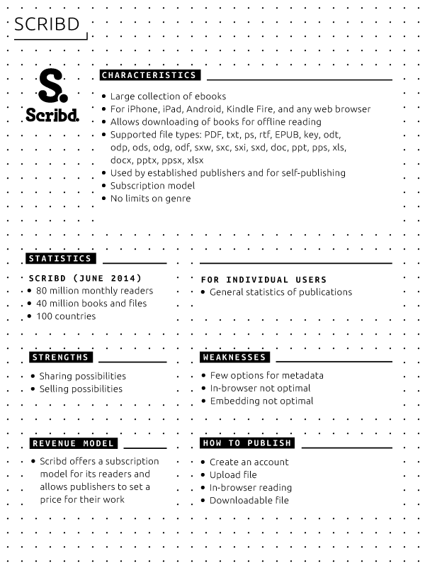

# 05 Distribution platforms 
 
## Ebook stores: Amazon, Apple, Google, Kobo, Sony 
 
Many channels exist for distributing ebooks. Curiously, most traditional retailers (large bookshops, like Libris or AKO in the Netherlands) play a marginal role in the selling of electronic publications, with the exception of a company like Barnes & Noble with their range of NOOK devices and associated storefront. Large players in the field include Amazon, Apple, Google, Barnes & Noble and Kobo. 
 
The aforementioned storefronts typically charge a percentage for each publication sold, this percentage generally is no less than 30% of the retail price.[^apple-press-percentage]^,^[^guardian-amazon-hachette] Apart from Google, most of the larger retailers offer tight integration with their own branded e-reader hardware (Kindle, iPad, NOOK, etc.) For example, publications bought on a Kindle via the Amazon Store are immediately downloaded to the device for further use, without hooking the device up to a computer and transferring the purchases manually. 
 
Each retailer accepts a different set of publications. Apple for example doesn't allow the sale of PDFs in its bookstore and only supports EPUB or publications made using iBooks Author.[^apple-publication-guidelines] Amazon, via their Kindle Direct Publishing program, supports a wider range of publications formats, including AZW, EPUB, PDF and even Microsoft Word documents.[^kindle-direct-publishing] 
 
## Online reading platforms: Issuu, Scribd, Internet Archive, website/blog 
 
Online reading platforms are browser-based platforms where digital publications are uploaded and made available. The publication can be presented in different formats. The choice for an online platform and the accompanying publication format also has effect on modes and reach of distribution. 
 
When using an online reading platform, publishers effectively become dependent on the platform provider. If the platform changes its technology, terms of service or goes out of business, the publisher will be out of control. Online reading platforms typically create a higher degree of dependence and vendor-lock-in than classical ebookstores that distribute downloadable files (and where it is easier for a publisher to make those files on an alternative download/shop platform). 
 
Below several platforms are discussed, including characteristics, statistics, strengths and weaknesses, and how-to-publish (Issuu [^Issuu], Scribd [^Scribd] and Internet Archive [^Internet-Archive]) 
 
 
 
 
 
 
 
 
###Third party blogs 
 
 
***Medium*** [https://medium.com](https://medium.com) 
 
**Characteristics** 
 
* External party 
* Text-based 
* Not for publishing whole books, but for example a summary or chapter 
* Strong connection with eg Twitter 
 
**Statistics** 
 
* Medium offers stats for individual users, including referrers 
 
**Strengths and weaknesses** 
*Strengths* 
 
* New audiences and communities 
* Easy-to-use 
* Designed specially for reading 
* Responsive website 
 
*Weaknesses* 
 
* Third party website 
* Suitable for shorter texts only 
* Login with Twitter or Facebook only 
 
**Revenue Model** 
 
* Medium has an editorial staff, getting paid per click. There is no revenue model for individual, external users 
 
**How-to-publish** 
 
* Create an account and upload text for blog 
 
***WordPress.com*** [https://wordpress.com/](https://wordpress.com/) 
 
**Characteristics** 
 
* External party 
* Prevalently text 
* Not for publishing whole books, but for example personal blogs 
 
**Statistics** 
 
* Medium offers stats for individual users, including referrers 
 
**Strengths and weaknesses** 
*Strengths* 
 
* Open Source 
* Free 
* Easy-to-use 
* Designed specially for reading 
* Also for mobile 
 
*Weaknesses* 
 
* Third party website 
* Suitable for shorter texts only 
 
**Revenue Model** 
 
**How-to-publish** 
 
* Create an account and upload text for blog 
 
 
###Social reading platforms 
 
Social reading has to do with the experience of reading ebooks. It is a field in great development, which lies beyond the scope of this Toolkit. However, it is good for publishers working on e-publications to keep an eye on the future of social reading. 
 
Examples of social reading platforms: 
 
- *Goodreads* ('Goodreads is the world's largest site for readers and book recommendations. Our mission is to help people find and share books they love. Goodreads launched in January 2007.') 
- *Social Book* ('Social Book, created by the Institute for the Future of the Book, is a social reading platform that allows reader to add their own commentary to texts, share these ideas with others, follow others' comments, and create communities of interactive reader/writers.') 
- *Wattpad* ('Wattpad stories are free. Whether you're online or off, use the devices you already own to carry an entire library wherever you go.' 'Join the conversation about the stories you read: message the writer and interact with other people who love the story as much as you.') 
- *Hebban* (A Dutch social reading platform that released in beta version in 2014) 
- *Social media discussions* are also part of the social reading experience. One can think here of Twitter interviews or when a book is being discussed online by a publisher. 
 
 
## Print on demand 
 
There are a lot of options for **print-on-demand** publishing. A simple Google query will return a myriad of services. Below are discussed the most important ones, international and Dutch. Of course, 'regular' printers also offer print-on-demand services. However, they usually ask for a minimum of copies ordered. 
 
 
###Lulu.com 

 
Lulu is the biggest print-on-demand service that offers publishing free of costs, based on a model of shared profit. [https://lulu.com](https://lulu.com) 
 
 
**Characteristics** 
 
* Available in six languages: English, French, Spanish, German, Italian and Dutch 
* One of the main independent actors 
* Used in 225 countries and territories 
* 1.8 million publications 
* 20,000 new publications each month 
* 1.1 million authors 
* Mostly for self-publishing 
* Mostly for publishing books 
* Lulu also offers ebook publishing service 
 
**Strengths and weaknesses** 
*Strengths* 
Ability to set your own price 
Distribution through Amazon and **iBookstore** (ebooks only) is possible 
Free ISBN is available 
 
*Weaknesses* 
Prices can rise quickly per publication, especially because of postal services 
Minimum and maximum on number of pages 
Not a very user friendly interface and help section 
 
**Revenue Model** 
Authors/publishers get 80% of the profit on a publication, Lulu gets 20% 
 
**How-to-print** 
Create an account 
You will need two PDFs: a single page PDF for the inside and front, back, and spine in one PDF for the outside 
Choose your format, paper, etc. It's very important to have precise formats for the PDFs, otherwise Lulu can't make a printable book 
You can add your own ISBN or have Lulu assign an ISBN to the publication 
One can use a browser based editor to design a cover 
Upload the PDFs and publish your work 
Choose your preferred ways of distribution 
 
 
 
###Espresso Book Machine 

 
 
The Espresso Book Machine [^Espresso-Book-Machine] is a print on demand (POD) machine that prints, collates, covers, and binds a single book in a few minutes. 
It can be found on different locations, for example in a physical bookstore. It allows to print a (digital) book on the spot in a direct-to-consumer model. 
 
 
**Characteristics** 
Input is PDF 
Print as many copy as needed 
A book can be stored in a database so other customers on other locations can buy a copy 
Print copyright-free books from Google 
Limitations in format, paper, and color 
Price is almost equivalent to a general book 
 
**Strengths and weaknesses** 
*Strengths* 
The book is printed while you wait for it 
Green technology 
 
*Weaknesses* 
The Espresso Book Machine (EBM) is tied to location and for now mostly available across the United States, two locations in the Netherlands (American Book Store in Amsterdam and The Hague), and scattered worldwide locations 
Options vary per location 
Limitations in paper, color, size 
 
**Revenue Model** 
The EBM location gets a small consignment fee for each printed book, self-publishers can set their price according to their wishes 
 
**How-to-print** 
You will need two PDFs: a single page PDF for the inside and front, back, and spine in one PDF for the outside 
Sign the affidavit stating you own the rights to the book 
Choose your preferred ways of distribution 
 
 
###Global options 
* Kobo Writing Life[^Kobo-Writing-Life] - lets authors and publishers self-publish digital content in 160+ countries. One can use Kobo Writing Life to publish ebooks and track sales. 
 
* PubIt![^PubIt!] - automatically converts your digital files for viewing on NOOK, mobile, and computing devices. It helps you distribute your ebooks to all kind of readers. 
 
* Smashwords[^Smashwords] - makes it free and easy to publish, distribute and sell ebooks globally at the largest ebook retailers, including the Apple iPad iBookstore, Barnes & Noble, Sony, Kobo, Baker & Taylor, Diesel eBooks store and more. There are no setup fees and no cost to update or revise your book. 
 
* XinXii[^XinXii] - facilitate authors to upload and sell their work online on their XinXii author page: short works, documents and books (as ebook or audiobook) - in multiple formats including PDF, EPUB and MOBI. As an aggregator, XinXii distributes to major international ebook retailers. 
 
###Options in the Netherlands 
 
* CB print on demand[^CB-Print-on-demand] - is the largest Dutch supplier of non-specialist printed books to bookshops and consumers. In addition to selling ebooks through Dutch and Belgian retailers, CB also facilitates international sales. One of the services is print-on-demand. This is directed primarily at publishers already working with the CB distribution center. The book will stay available through the book databases used by book stores and publishers in the same way when it is in stock as a paper edition. 
 
* Boekscout[^Boekscout] - is one of the biggest print-on-demand publishers in the Netherlands, aimed at self-publishing. 
 
 
## Pirate platforms: AAAAARG, Monoskop, The Pirate Bay, library.ru 
As with music and films, 'pirate' platforms haven often been the avant-garde of electronic publishing. They provide music, films, games and electronic books as free downloads - either in outright copyright violation or in gray zones (when, for example, providing obscure and out-of-print books, films or recordings whose rights owners are unknown). Whether one likes it or not, pirate platforms have best met customer demand. Often, they are user friendlier than many Internet shops. The mere existence and popularity of pirate sites for digitized book shows, by the way, how large the market for electronic reading really is. Pirate platforms are, by their nature, even more volatile than online bookstores and e-reading platforms. Worldwide, many organizations exist aiming to combat piracy and shut down facilitators of said practice, even when operating on a small scale. As a general rule pirate platforms have proven to be mostly resistant to the crackdown attempts by copyright enforcers, often reincarnating on a different web domain shortly after a forced closure. 
 
Commercial providers of digital content can learn a lot from the pirates. Netflix,[^Netflix] the most successful web service for **streaming** films and growing competitor for pay TV, is known for buying films based on their popularity on The Pirate Bay.[^The-Pirate-Bay] 
 
#### All-purpose download sites 
Sites like The Pirate Bay offer all kinds of media for download: films, music, computer games and software, and electronic books. Since they are widely used, display current download statistics and since their technology (BitTorrent) depend on user participation for their downloads to stay alive, they can provide great insight into what is really popular among readers. 
 
The content listed on The Pirate Bay and other sites for the BitTorrent **protocol** tends to be mainstream: Hollywood films, pop music, and a tendency towards non-fiction and technical handbook literature alongside fantasy and science fiction among the ebook downloads. For example, on a particular day and minute in June 2014, the book 'Atlas of Ancient Worlds' had more than 2000 downloads in 48 hours. In comparison, the most popular film - an episode of the TV series 'Game of Thrones' - had more than 70000 downloads. 
 
 
#### General ebook sites 
 
The most simple pirate ebook sites offer any kind of book - very much like a large all-audience book store or Amazon.com's online bookstores. They are little more than a simple search engine that spits out downloadable ebooks. These types of sites have become particularly popular in Russia. At the time of this writing, library.ru has been the model for this kind of site and, after its crackdown, it was superseded by bookfi.org.[^bookfi.org] Also libgen.info,[^libgen.info] an online library, is an example to mention here. 
 
What online booksellers could learn from these sites: 
 
* Simplicity combined with encyclopedic scope. With no other site except Amazon's, it is as easy to find and download an electronic book, no matter which genre, language, whether bestselling or obscure. 
* Simplicity in formats. The sites provide mostly PDFs as well as EPUBs, depending on whatever file format they have available (and obtained from hacker networks). 
 
#### Specialized sites 
 
Some websites outside or in gray areas of copyright are artistic projects. In the 1990s, 'textz.com' by the Berlin-based artist Sebastian Luetgert was the first site to offer cultural, political and media theory books as simple, gratis-downloadable text files - among them, theory classics by Theodor W. Adorno. The name 'textz' was a pun on 'warez', a slang name for illegally copied software. Later, the websites aaaaarg.org[^aaaaarg.org] and Monoskop[^Monoskop] provided related collections of freely downloadable art, cultural and media studies books, yet with different thematic emphases: to stimulate reading and discussion groups, or to provide a carefully hand-selected library mirroring the taste of the site owner. 
 
Best known, and factually legendary, is UbuWeb,[^Ubuweb] an encyclopedic site providing downloadable sound, video and text file version of avant-garde arts records, films and books. Most of them fall under the category of small edition artists' books, and are provided with the artists' permission - since most these works never created revenue when they were commercially released. 
 
All these sites run like small specialty bookstores (although they don't sell anything). They show that the opposite of Amazon and bookfi.org can work as well, namely the personal selection and combination of books. If they are as strong as in the case of UbuWeb and Monoskop, they create their own public that will download a work not because of having heard of it or of the author, but because being on such a particular site is recommendation enough. 
 
 
 
 
## Artist-/designer-run projects: Badlands Unlimited, KYUR8, artists ebooks 
 
In the last couple of years, there have been first attempts to create only small presses and book download stores for [artists' and designer's books](#artistdesigner-book): writer, artist and publisher, James Bridle (who coined the term 'new aesthetics') created the website 'artistsebooks.org' with freely downloadable EPUB files by experimental writers and artists. American contemporary artist and designer Paul Chan initiated the more commercial online press Badlands Unlimited that sells artist-made visual electronic books that are proprietary to the iPad and Apple's iBooks platform. The iPhone/iPad app 'KYUR8' (slang riff on 'curate') invites artists' to quickly make their own electronic visual zines using page templates and user's cell phone photo collections. Other examples are [http://www.gauss-pdf.com](http://www.gauss-pdf.com), a publisher of digital and print works and [http://trollthread.tumblr.com](http://trollthread.tumblr.com), a collective of poets that produces publications available for download in PDF or purchase as print on demand volumes. 
 
None of these projects compete with classical ebook stores, online reading platforms or even specialist pirate sites. They are, after all, experimental projects and artists' portfolio pieces. 
 
 
[^apple-press-percentage]: Apple Launches Subscriptions on the App Store, <a href="https://www.apple.com/pr/library/2011/02/15Apple-Launches-Subscriptions-on-the-App-Store.html">https://www.apple.com/pr/library/2011/02/15Apple-Launches-Subscriptions-on-the-App-Store.html</a>. 
[^guardian-amazon-hachette]: Juliette Garside, 'Ebook sales: Amazon tells Hachette to give authors more, charge readers less', The Guardian, 30 July 2014, <a href="http://www.theguardian.com/books/2014/jul/30/amazon-hachette-ebook-sales-too-expensive">http://www.theguardian.com/books/2014/jul/30/amazon-hachette-ebook-sales-too-expensive</a>. 
[^apple-publication-guidelines]: Authors & Book Publishers: Frequently Asked Questions, <a href="https://www.apple.com/itunes/working-itunes/sell-content/books/book-faq.html">https://www.apple.com/itunes/working-itunes/sell-content/books/book-faq.html</a>. 
[^kindle-direct-publishing]: Kindle Direct Publishing: Types of Formats, <a href="https://kdp.amazon.com/help?topicId=A2GF0UFHIYG9VQ">https://kdp.amazon.com/help?topicId=A2GF0UFHIYG9VQ</a>. 
[^Freemium]: Freemium is a pricing strategy by which a product or service (typically a digital offering such as software, media, games or web services) is provided free of charge, but money (premium) is charged for proprietary features, functionality, or virtual goods. 
<!--[^Project-Gutenberg]: Project Gutenberg, <a href="http://www.gutenberg.org/">http://www.gutenberg.org/</a>.--><!-- Andre: missing reference --> 
[^National-and-University-Library-of-Iceland]: National and University Library of Iceland, https://archive.org/details/landsbokasafn. [https://archive.org/details/landsbokasafn](https://archive.org/details/landsbokasafn). 
[^OpenLibrary]: Open Library is an online catalog that aims to list every book ever published. It provides *one web page for every book* with extensive bibliographic information, download links (from Internet Archive), and online sellers of that title. [https://openlibrary.org/](https://openlibrary.org/). 
[^IA_blog]: 3 Million Texts for Free - blog post from September 17, 2011 [http://blog.archive.org/2011/09/17/3-million-texts-for-free/](http://blog.archive.org/2011/09/17/3-million-texts-for-free/). 'Archive.org is visited by more than 1 million different users every day. Books are downloaded or read on archive.org about 10 million times each month, and approximately 2,000 books for the blind and dyslexic (print disabled) are downloaded every day.' 
<!--Amy: I added these links as footnotes also, so that these URL's can be seen in the printed version --> 
[^Espresso-Book-Machine]: Espresso Book Machine, <a href="http://www.ondemandbooks.com/">http://www.ondemandbooks.com/</a>. 
[^Kobo-Writing-Life]: Kobo Writing Life is where it all begins, <a href="http://www.kobobooks.com/kobowritinglife">http://www.kobobooks.com/kobowritinglife</a>. 
[^PubIt!]: Self-Publishing Made Simple, <a href="http://pubit.barnesandnoble.com/">http://pubit.barnesandnoble.com/</a>. 
[^Smashwords]: How to Create, Publish, and Distribute Ebooks with Smashwords, <a href="http://www.smashwords.com/about/how_to_publish_on_smashwords">http://www.smashwords.com/about/how_to_publish_on_smashwords</a>. 
[^XinXii]: Xin Xii, <a href="http://www.xinxii.com/">http://www.xinxii.com/</a>. 
[^CB-Print-on-demand]: CB print on demand, <a href="http://www.cb-logistics.nl/markten/media/uitgeverijen/logistieke-diensten/print-on-demand/">http://www.cb-logistics.nl/markten/media/uitgeverijen/logistieke-diensten/print-on-demand/</a>. 
[^Boekscout]: Boekscout, <a href="http://www.boekscout.nl/">http://www.boekscout.nl/</a>. 
[^Netflix]: Netflix, <a href="http://www.netflix.com">http://www.netflix.com</a>. 
[^The-Pirate-Bay]: The Pirate Bay, <a href="http://thepiratebay.se">http://thepiratebay.se</a>. 
[^bookfi.org]: <a href="http://Bookfi.org">Bookfi.org</a>, <a href="http://bookfi.org">http://bookfi.org</a>. 
[^libgen.info]: <a href="http://Bookfi.org">Bookfi.org</a>, <a href="http://libgen.info">http://libgen.info</a>. 
[^aaaaarg.org]: AAAAARG, <a href="http://aaaaarg.org/">http://aaaaarg.org/</a>. 
[^Monoskop]: Monoskop Log, <a href="http://monoskop.org/log">http://monoskop.org/log</a>. 
[^Ubuweb]: UbuWeb, <a href="http://www.ubu.com">http://www.ubu.com</a>. 
[^Issuu]: Issuu, http://www.issuu.com 
[^Scribd]: Scribd, http://www.scribd.com 
[^Internet-Archive]: Internet Archive, https://archive.org/

