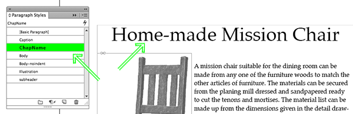
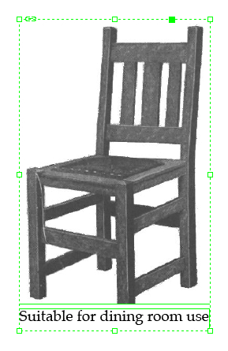
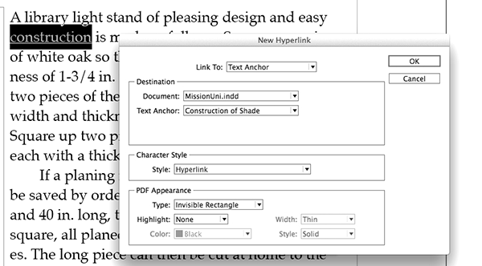
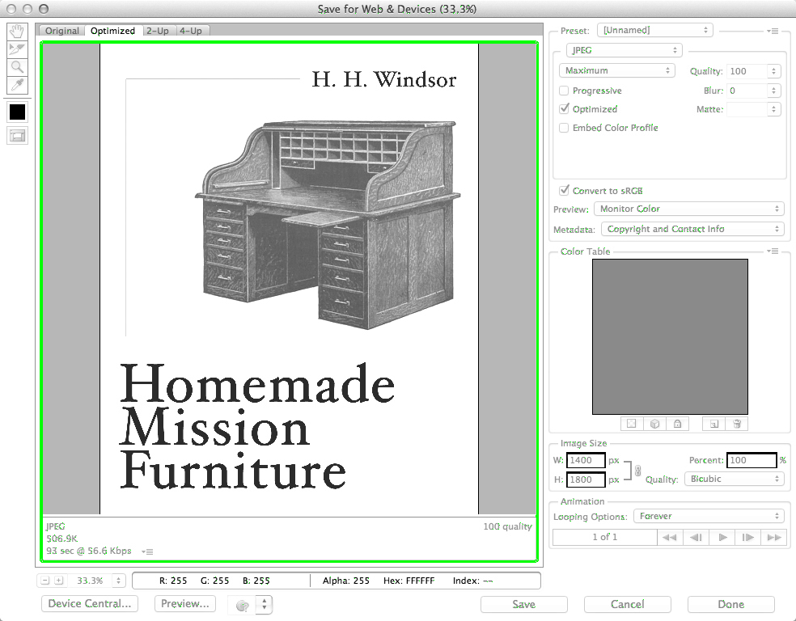

#6 Guide: How to make a simple EPUB 

 
- An EPUB file can be seen as a self-contained website with some metadata files, packed together in a zip archive. 
- EPUBs can be created from scratch, with any text editor, simply by creating some HTML files and the required metadata files, and placing all these files inside specific folders. 
- EPUBs can also be exported from InDesign projects, provided the workflow within InDesign was done in a highly structured way, and preferably using the very latest version of the software. 
- The Open Source command-line program Pandoc is a powerful tool for converting various types of text-based files into EPUB. However, the quality of the converted document is highly dependent on the degree to which the markup of the input file is well-structured. 
- The Open Source software Calibre, which features a graphical user interface, can alternatively be used for document conversion and editing. 

Making an EPUB doesn't have to be a complicated process. Since the EPUB standard is open and based on HTML (the same standard used for designing web pages), there's an increasingly large number of ways of converting and exporting different types of source file formats to EPUB. For very simple publications, it may be possible to use a software tool that directly converts your document to EPUB. However, before exploring in detail any of these do-it-yourself tools, we will first explain what an EPUB contains, how it works, and how to make one from scratch. 

This chapter consists of four sections: 

1) Do-it-yourself EPUB from scratch 
2) Do-it-yourself EPUB using InDesign 
3) Do-it-yourself EPUB using Pandoc 
4) Using Calibre and custom plug-ins 

##Do-it-yourself EPUB from scratch 

The process of creating an EPUB from scratch is similar to that of developing a simple website. The main difference is that while websites can and often do embed material located elsewhere in the **internet**, an EPUB is 'self-contained' and made for offline reading. This means that all pages or images displayed must be part of the collection. Making an EPUB from scratch, or manually, is useful for creating small and simple publications, for creating or modifying publications that make extensive use of the particularities of the EPUB format, or in order to explore and better understand the functionalities and inner workings of this format, which is what we will now do. 

An EPUB file is in fact a ZIP archive, but with the **filename extension** '.epub' instead of '.zip'. As such, it is a **compressed** collection of HTML files, style sheets and images, much like the files found on a website, compiled together with some extra files which define the format and structure of the documents so that an e-reader can display them. Any file archiving software that can handle ZIP files can open and decompress an EPUB. In some cases this can be done simply by renaming the '.epub' extension to '.zip'.[^epub-zipping-process] 

For a better understanding of the following explanation of what an EPUB is and how to create one, we suggest downloading a working example of a rudimentary EPUB, which can be found on Toolkit project's **GitHub** page (a direct link can be found in the footnote).[^rudimentary-epub] 

###Structure of an EPUB package 

Decompressing an EPUB file will reveal its internal folder (or directory) structure. Examining this structure will help us understand how an EPUB is put together. As explained above, the EPUB is a compressed ZIP archive. Start by decompressing or 'unzipping' the EPUB file using the built-in archive utility of your computer operating system, or archiving/compression software such as The Unarchiver (Mac), WinZip (Windows), etc. The unzipped contents should look like this: 

The *META-INF* and *OEBPS* directories and the *mimetype* file are required components, and are an important part of what constitutes an EPUB: 

* The *META-INF* folder contains an XML file (*container.xml*) which directs the e-reader device or application to an inventory (an .opf file) of all the files used by the publication. 

* The *OEBPS* folder is the location where all of the publication's content (HTML files, images, audio, video, etc.) is stored; subdirectories are allowed but not mandatory. The .opf file (traditionally named *content.opf*) is a key component; this file contains the metadata for the EPUB, and is in turn referenced by the aforementioned *container.xml* file. You may also see another file with a .ncx extension (traditionally *toc.ncx*), which contains the hierarchical table of contents for the EPUB, however this file is optional as it is not part of the EPUB specification. 

* *Mimetype* is a file which contains a single line describing the EPUB file as 'application/epub+zip'; this file allows e-readers to check whether the file is actually an EPUB which they can read. 

These three components form the basic structure of an EPUB, and are required in order for the file to be a valid EPUB.[^idpf.org] 

###Creating your own EPUB 

Most of the elements of an EPUB can be manually typed in a **text editor**. Text editors are used for editing plain-text files such as HTML files, and should not to be confused with word processors such as Microsoft Word or Apple's Pages (though it is of course entirely possible to create and edit text plain-files using a word processor). Popular text editors include BBEdit, TextWrangler or TextMate for Mac, or NotePad++ and PSPad for Windows. The following is a step-by-step description of the process of creating a very simple EPUB. 

####Creating the required files and directories 

Now that we've seen the internal structure of an EPUB by unzipping it, we can also work the other way round and make the files and directories ourselves, thus creating a simple EPUB. We will work from our *Documents* folder where we will add subdirectories as in the image above, and create the necessary files using a text editor. 

1. Create a subfolder in the *Documents* folder and name it *Example*; 
2. Create two more subdirectories under the one you've just created, one called *META-INF* and the other called *OEBPS*; 
3. Using a text editor, create a plain-text file and type (or copy-paste) the line 'application/epub+zip' (without quotation marks) in this file; 
4. Save this plain-text file and name it *mimetype* (without a filename extension). Save it in the same folder (named *Example*) as the two subdirectories created in step 2. This way the e-reader device or application can see that these elements together constitute an EPUB. 

Now there are the two directories and one text file, just as we saw when we decompressed the EPUB which we used as an example. 

####*container.xml* 

Next we will create the file *container.xml*, the XML file (located in the *META-INF* folder) that directs the e-reader device or application to an inventory of all the files present in the publication. 

1. Again using a text editor, create a new plain-text file and save it to the *META-INF* folder with the name *container.xml*; 
2. The file *container.xml* contains a simple structure definition written in XML. Below is a complete version of the XML, followed by an explanation of its separate components. (The technical explanations are not essential to understanding the text and may be skipped.) 

        <?xml version="1.0" encoding="UTF-8"?> 
         <container version="1.0" xmlns="urn:oasis:names:tc:opendocument:xmlns:container"> 
         	<rootfiles> 
         	<rootfile full-path="OEBPS/content.opf" media-type="application/oebps-package+xml"/> 
         	</rootfiles> 
         </container> 
 

The first line is a declaration statement, which should always be present in XML files. This is followed by a 'container' tag indicating that the publication is based on the *Open Container Format* as specified by the EPUB standard.[^epub-standard] Next, the 'rootfiles' tag indicates a collection of rootfiles: these are the possible starting points where the e-reader can begin processing the content. In this case the rootfiles statement contains only one entry, called 'rootfile'; this tag has two attributes, 'full-path' and 'media-type'. The first attribute is the path to an inventory file (in this case *content.opf*) containing metadata describing the publication and its content. Finally, 'media-type' is a restatement of the EPUB's mimetype. 

The most important part of this document is the information in quotes following the 'full-path' attribute: 'OEBPS/content.opf'. This attribute should indicate the name of an .opf file which we will create in the next step. 

3. Save and close the text file *container.xml*. 

####The .opf file 

The .opf (Open Packaging Format) file is an important part of the structure of an EPUB. It is located in the *OEBPS* folder and contains the metadata necessary to accurately describe the publication. It can also contain the linear reading order which, in combination with the contents of *toc.ncx*, may be used by e-readers to build navigation menus or a table of contents. The .opf file is too long to be included verbatim in the present document, but the most important sections are referenced below. An example of a complete .opf file can be found in the rudimentary example EPUB, in the *OEBPS* folder and under the name *Example.opf*. 

    <metadata xmlns:dc="http://purl.org/dc/elements/1.1/" 
     	xmlns:opf="http://www.idpf.org/2007/opf" 
     	xmlns:xsi="http://www.w3.org/2001/XMLSchema-instance"> 
     	<dc:title>Example EPUB</dc:title> 
     	<dc:language>en</dc:language> 
     	<dc:identifier id="BookId">http://digitalpublishingtoolkit.org/ExampleEPUB.html</dc:identifier> 
     	<meta property="dcterms:modified">2014-03-28T14:11:50Z</meta> 
     	... 
     </metadata> 
 

The 'metadata' section contains a description of the publication: title, author, publisher, etc. Most of these entries are identical to what librarians use for cataloguing publications. Parts of the metadata section are used by e-readers to organize ebook collections. 

 
    <manifest> 
     	<item href="styles.css" id="css1" media-type="text/css"/> 
     	<item href="cover.png" id="cover" media-type="image/png" properties="cover-image"/> 
     	<item id="chapter1" href="Cover.html" media-type="application/xhtml+xml" /> 
     	<item id="chapter2" href="Page-01.html" media-type="application/xhtml+xml" /> 
     	<item properties="nav" id="toc" href="toc.html" media-type="application/xhtml+xml" /> 
     	<item href="toc.ncx" id="ncx" media-type="application/x-dtbncx+xml"/> 
     </manifest> 
 

The 'manifest' section lists all the resources used in the EPUB package, with the exception of subdirectories, the *mimetype* file, the contents of the *META-INF* folder, and the .opf file itself. Manually producing a manifest section can be extremely time-consuming for large EPUBs, as the list of resources used in the publication is bound to be long. Every resource has a unique 'id' and should be referenced by a relative path in the 'href' attribute and described in the 'media-type' attribute. The entry with the *cover.png* is of special interest, as its 'properties' attribute specifies that the image may be used by e-readers as a cover image for the publication, for example in collection overviews. 

 
    <spine toc="ncx"> 
     	<itemref idref="chapter1" /> 
     	<itemref idref="chapter2" /> 
     </spine> 
 

Finally, the 'spine' section lists all the HTML or XHTML pages present in the publication; the order of this list indicates to the e-reader the linear reading order of the publication. The 'spine' section contains only HTML or XHTML pages, no images or other content. The 'toc' attribute refers to the 'id' attribute of the 'toc.ncx' file already described in the 'manifest' section. 

####The content 

As mentioned in the introduction of this section, an important part of an EPUB consists of a collection of HTML files, often connected through hyperlinks. The process of creating the pages of an EPUB is similar to that of building a website, but with the particular limitations of e-readers in mind - limited support for rich media, color, etc. (see also Chapter 4: Technologies for electronic reading <!-- internal link to chapter 4-->). Pages should be written in XHTML, a variant of HTML that was created to make HTML more 'extensible' and increase its interoperability with other data formats. Cascading Style Sheets (CSS) may freely be used, although many e-readers will ignore at least some of the style definitions. 

####Packaging 

Putting together the EPUB file is quite simple: select the *META-INF* and *OEBPS* directories together with the *mimetype* file, and create a ZIP archive. This may be done by using the built-in archive utility of your computer operating system, or an external program or utility.[^epub-zipping-process] The .zip extension of the archive must then be renamed to .epub. 

Because some archive programs create unnecessary (hidden) files inside the archive which might make your EPUB invalid, it's important to 'validate' your EPUB to see if it actually works (although in practice, most e-readers will safely ignore superfluous files and still interpret the document properly). Invalid EPUBs are files that do not conform to the EPUB specification, or have other issues such as incorrect code. Fixing validation errors will minimize (but not eliminate) the chance of e-readers refusing to read an EPUB. Validation of the EPUB can be done online using the EPUB Validator[^epub-validator] or with a specialized desktop application. 

And your EPUB is ready! 

##Do-it-yourself EPUB using InDesign 

InDesign is an excellent tool for creating and managing print projects. It also includes a powerful EPUB production tool which has steadily improved over time. InDesign's omnipresence and importance in print design make it an obvious choice for projects that have both print and electronic outputs. InDesign is so powerful that it will be useful even if print isn't part of the equation - though cost considerations may preclude its use if print is not going to be a requirement. Below we will describe step-by-step how to create an EPUB with custom layout using InDesign. 

Another option when using InDesign is to import files in the ICML file format. There are a number of tools for converting text files from various formats to ICML. The files can then be used to create print PDFs and EPUBs from the same InDesign document. For a step-by-step description of this process, please go to the Toolkit blog. ")(*Markdown to InDesign with Pandoc (via ICML)*) 

InDesign can generate both reflowable and fixed-layout EPUB files. Reflowable layout means that the size and positioning of text and images are adjusted according to the screen size as well as the user's individual preferences. Fixed layout means that the text and images are always shown in the same (relative) size and positions on a page, regardless of the screen size or other factors. Fixed-layout text and images are usually reduced in size to fit on smaller screens, often to the point of becoming completely illegible on mobile phones. Finally, reflowable EPUB is supported by a broader range of e-readers and tablets, while fixed layout is supported by only a few. 

<!-- the following 3 images missing or wrongly named -->
") 

 

 

 

 

InDesign's features for print layouts - such as master pages, control of headers and footers, and precise positioning of text, images and other elements - are ignored in reflowable EPUB documents. However reflowable EPUB does permit choosing settings such as (initial) font size, leading, font type, spacing before and after paragraphs, whether a paragraph should begin on a new page, etc. Keep in mind however that individual users are often able to partially or completely override these settings in their e-reader devices or applications. 

InDesign can also be used purely for EPUB production, with no print output. In this case you can simply ignore how the book looks in print, and focus instead on generating flexible EPUB documents that look good and work well across a range of e-readers. 

The most important thing when creating EPUBs using InDesign (or any other tool for that matter) is to make sure that the layout of the documents you are working with is as structured as possible. Therefore we will begin this guide by applying structured formatting (known as 'styles') to the various elements of the manuscript. 

Keep in mind that this is a very brief step-by-step guide, while InDesign is a very complex general-purpose software package with many more options than those described here. 

###Styles 
One of the most powerful tools provided by InDesign is the ability to identify different kinds of paragraphs (headings, sub-headings, body text, captions, etc.) and to instantly apply a whole set of formatting rules to such a group of paragraphs. Each defined set of rules is called a 'style'. These styles can later be exported to the EPUB in Cascading Style Sheets (CSS) format, allowing for any subsequent editing and adjustments which may be necessary in order to adapt the EPUB to a range of different devices, and/or to define layout settings for the EPUB which are different from those in the print document. 

First we must define the styles, then apply them, and finally make sure they are properly mapped for export to EPUB. 

####Creating styles 

1. To create a new style, open the Paragraph Styles panel (accessed through Type > Paragraph Styles) and select New Paragraph Style from the panel menu (panel menus are accessed by clicking the **icon** in the upper right-hand corner). Any formatting in the active paragraph will be incorporated automatically into the new style.  

 

2. Give the style a name. 

 

3. Select any additional options. The right-hand side of the dialog box will show different options, depending on the category selected on the left-hand side.  

Tips: 

- Besides paragraph styles, you can also create character styles, which apply formatting to a selection of text rather than an entire paragraph. 
- Using defined styles rather than directly applying formatting improves reliability across e-readers and makes later editing and updating of the layout much easier and more consistent. 

####Applying styles 

1. Click anywhere in the paragraph to which you want to apply the style.

 

2. Choose the desired style from the Paragraph Styles panel.

 

3. Repeat steps 1 and 2 for all paragraphs in the document.

Tips: 

- You can apply a basic style to all paragraphs at once by choosing Select All and then choosing a basic style such as Body or Normal, after which you can individually apply the less frequent heading, caption and other paragraph styles to the relevant paragraphs. 
- If you have imported a document with large quantities of existing bold or italic text, you can automatically apply a character style using the search and replace function. 

 

####Mapping styles to tags 

Though InDesign can perform this step automatically, for more control you can specify exactly which Paragraph Styles should be mapped to which tags in the resulting CSS. 

1. Choose Edit All Export Tags from the Paragraph Styles panel menu. 
2. In the dialog box that appears, verify that each style in the Style column is mapped to the appropriate CSS in the Tag column. It's a good idea, for example, for heading paragraphs in your book to be exported as 'h1', 'h2', etc., and also for each style to have its own 'Class'. 

 

Tips: 

- If you import XML documents, you can have InDesign automatically map specific XML tags to the desired paragraph styles (which later will be mapped to the proper EPUB CSS tags as shown above). 
- You can also map a style to a tag by selecting Export Tagging in the Paragraph Style and Character Style dialog boxes. 

 

- Earlier versions of InDesign were not so good at exporting all of a document's styles to CSS. The most recent version InDesign CC offers a substantial improvement in this respect. 
- Besides (or in addition to) the formatting from the styles provided by InDesign, you can apply your own CSS in the 'EPUB - Reflowable Layout Export Options' dialog box (see the Export Options section of this step-by-step guide). 

###Images 

InDesign places images in the layout in one of three ways: inline, anchored or independent: 

- Inline images are placed or pasted directly in the text. When exported, they are rasterized (rendered as **pixels** or dots); thus if any inline object contains text, this text will also be rasterized. The image is then included in the flow of the text in which it was placed. Inline images cannot have text wrapped around them. 
- Anchored images are linked to a particular location in the text, known as an **anchor**; when exported to EPUB they will appear at that location. Anchored images may have text wrapped around them, and are exported as floating objects in an EPUB. Text contained in anchored objects is not rasterized. However it will sometimes be resized incorrectly by the e-reader device or application. 
- Independent images are placed alongside text and other objects, without any explicit link between the two. InDesign exports text and independent image objects sequentially according to their location on the page, from the top down and from left to right. Since an entire text flow is exported before any other objects on the same page, independent images may appear much further in the EPUB than they did in the print version. The order of exported objects can be adjusted in the Articles panel (accessed through Window > Articles). 

####Anchoring images 

Generally it's a good idea to use anchored images for a layout that will be exported to EPUB. This gives you more control over where the image appears in the exported EPUB, and also allows the text to wrap around the image. 

1. Place an image on the pasteboard. 

 

2. If desired, you can create a caption, apply a style to the caption, and then group the caption with the image. 

 

 

3. Select the image in order to make its controls visible. Click and drag the blue box (near the upper right-hand corner of the image) to the desired location in the text. The blue box now changes to an anchor symbol. 

 

<!--- the following image missing or wrongly named -->
 

4. If the layout of the print output is important, adjust the location of the image. This does not affect the image's location in the EPUB. 
5. If you want the text to wrap around the image, select the image and then choose Object > Object Export Options. 

 

a. Select the 'EPUB and HTML' options tab. 
b. Check the Custom Layout check box, and choose Float Left or Float Right from the pull-down menu. 
c. To specify the amount of space between the image and the text, select the image, display the Text Wrap dialog box, click the second icon from the left, and specify the amount of space above, below, left and right in each field. 

 

You can also use this option to adjust how the image appears in the print edition. 

 

###Links and cross-references 
One of the main advantages of ebooks over print is that they can contain links to additional information, whether in the same book or on an external website. InDesign makes it easy to incorporate links into your ebook. 

There are two main types of links: links which specify both the destination and the link text, and links in which the link text is automatically generated based on the text at the specified destination. This second type of link is called a cross-reference. It's a good idea to apply a character style to each type of link. 

###Creating internal links within a book 

1. First, determine the destination by selecting the location in the book where you want the link to point to, and choose New Hyperlink Destination from the panel menu of the Hyperlinks panel (accessed through Window > Interactive > Hyperlinks). Note the name of the Text Anchor, you'll need it later. By default, the name of the Text Anchor is the first few words of the destination text. Then click OK. 

 

 
2. Next select the text that you want to convert into a link and choose New Hyperlink from the Hyperlinks panel menu. 
3. Choose Text Anchor from the 'Link To' pull-down menu, then select the name of the document in which the destination Text Anchor can be found, and select the name of the Text Anchor. 

 

4. It's also a good idea to apply a style so that you can format all the links later. 
5. Click OK to create the link. 

 

###Creating cross-references 
Cross-references are links in which the link text is automatically generated based on the text at the specified destination. A typical example of a cross-reference is a link to a different chapter or heading name. InDesign will always use the most up-to-date text in the heading. 

1. To create a cross-reference, first place the cursor in the text where you want the link to appear. 
2. To view the Cross-References panel, choose Window > Type & Tables > Cross-References. 
3. Choose Insert Cross-Reference from the panel menu. 
4. Under Destination, specify the desired Document. Then, from the list on the left-hand side, choose the type of paragraph you wish to link to. 

 

All paragraphs formatted with that particular style will show up in the list on the right-hand side, allowing you to choose the paragraph you want the cross-reference to link to. 
5. Select a Cross-Reference Format, and click OK. 
The text from the destination will now appear in the body of your document. It will be exported as a link in the EPUB document. 

 

###Tables of contents 
Ebooks have two different types of tables of contents: the conventional one which is part of the text (more or less like any chapter in your book, only with links to the other chapters and sections); and one that is accessed through the menus of the user's e-reader device or application, regardless of which page the user is currently viewing. InDesign facilitates the creation of both types. 

InDesign generates tables of contents based on styled paragraphs. For example, you might want to generate a table of contents based on all paragraphs formatted with the Heading 1 and Heading 2 styles, or as in the following example, based on all of the 'ChapName' elements. 

####Creating a Table of Contents Style 

1. Choose Layout > Table of Contents Styles and then click New in the dialog box that appears. The New Table of Contents Style dialog box will now appear. 

 

2. Fill in the Title, for example 'Contents'. This will be used for the heading above the generated table of contents. Then choose which paragraph style to apply to that heading. 
3. Choose which types of paragraph will be used to populate the table of contents, such as headings or chapter names. 
4. Click More Options on the upper right-hand side of the dialog box (if this option is already selected, the option Fewer Options will appear instead). 
5. In the area titled Style, choose which style to apply to each type of element in the table of contents. It's a good idea to create special styles for these elements. 
6. In the Page Number menu box, choose No Page Number, since page numbers are not necessary in an ebook. 

 

7. Click OK to save the Table of Contents Style. This is the first step for creating both a navigational and an in-document table of contents. 

####Generating the in-document table of contents 

1. Once you've created a Table of Contents Style, choose Layout > Table of Contents to have InDesign generate the table of contents by extracting the text from the paragraphs formatted in the styles you have selected. 
2. Use the 'loaded' pointer to place the table of contents at the desired location in the document. 

 

You are not required to place the table of contents at the beginning of the book, or indeed to include it all. 
3. You will learn how to generate the navigational table of contents in the Export Options section of this step-by-step guide. 

Tips: 

- If you export a multi-document book to EPUB without having first created a Table of Contents Style, InDesign automatically creates a table of contents based on the filenames of the individual documents in the book. If you export a single-document book to EPUB, InDesign will not automatically generate a table of contents. 
- You can create a navigational table of contents, an in-document table of contents, or both. Most e-readers will display an error message if no navigational table of contents is found. Some ebook stores will complain if you don't include an in-document table of contents. 

###Metadata 
Metadata is information about your book, including the title of the publication, the name of the author, the names of other contributors, the publisher, date of publication, a description of the subject matter, keywords, copyright status, etc. It's a good idea to provide as much metadata as possible to make it easy for prospective readers to find your book. 

InDesign gives you two opportunities to add metadata: in the File Info dialog box, and when you export your file to EPUB. The two sets of information overlap but are not identical. Empty fields will be filled in with data from the other set of information. 

1. To add metadata to your file, go to File > File Info. 

 

2. You can add additional metadata as you export the document to EPUB as discussed further below. 

###Cover 
The final step before exporting to EPUB is to create and add a cover image for your ebook. Because ebook covers are often viewed at small sizes, it's important to have large, clear text and to visually preview the cover at a very small ('icon') size. Of course the resolution of the image should also be high enough to look good at full-screen size as well. Most ebook stores require images that are at least 1000 pixels on the shortest side. 

1. Create or edit the cover image (either in InDesign or in a graphics editor such as Photoshop) and save it in the **JPEG** format. 

 

2. You will indicate the cover image to be used when you export to EPUB in the next section. 

###Checklist and export options 
Before finally exporting to EPUB, first make sure that all formatting has been applied using styles, that all images are properly placed and anchored, that you have defined all the necessary links and cross-references, that you have defined a Table of Contents Style, that you have specified all the necessary and desired metadata, and that you have created a high-resolution cover image that can also be viewed adequately at small sizes. 

1. Select File > Export, then fill in a filename and destination, and select EPUB (Reflowable) from the Format pull-down menu. 

 

2. Click Save. The 'EPUB - Reflowable Layout Export Options' dialog box appears with eight separate panels of options. 
3. In the General panel, choose EPUB 3.0 from the Version pull-down menu to ensure that your document complies with the latest standards. 

 

4. Select the Choose Image option from the Cover pull-down menu; then navigate to the folder where you have saved the JPEG cover image you created earlier, and select that file. If you select the Rasterize Front Page option from the Cover pull-down menu instead, InDesign will create a snapshot of the first page of your book and use that image for the cover. 
5. Select the option Multi Level (TOC Style) from the Navigation TOC pull-down menu; then choose the TOC Style that you created earlier in the New Table of Contents Style dialog box. 
6. On the left-hand side of the dialog box, select the Metadata panel. 
7. If the book has an ISBN, enter it in the Identifier field. 

 

8. All the other fields besides the Date field should be automatically populated with data entered earlier in the File Info dialog box. You can add any missing information now. InDesign uses the information in the Date field for the EPUB2 element 'dc:date', but will use the actual date and time to automatically fill in this information in a format compatible with EPUB3. In other words, you don't have to enter anything in the Date field. 
9. There are many other export options: for controlling how images and text are exported, for adding **JavaScript** and CSS, and for choosing how the ebook should be previewed. Feel free to explore these at your own leisure. The CSS panel has some of the most interesting options, since it allows you to override or even completely substitute the sometimes bulky and awkward CSS generated by InDesign with your own carefully crafted CSS. 
10. Finally, click OK to generate the EPUB file. 

 

###Testing and validating 
Be sure to test the EPUB file with as many e-reader devices and applications as possible. You can use the application Kindle Previewer to open the EPUB in a Kindle simulator and/or to convert the EPUB to the Kindle format so that you can test it on actual Kindle devices. Finally, it's always a good idea to validate your EPUB documents before releasing them.[^epub-validator] 

##Do-it-yourself EPUB using Pandoc 
Pandoc and Calibre are two popular tools for converting documents to and from a wide variety of formats.[^pandoc-calibre] Both can be used to make EPUBs. First we will explore Pandoc; Calibre will be described in the next section. Using Pandoc, it is possible to convert even a Microsoft Word .docx file directly to EPUB; however this is not advisable. It is best to first convert the .docx file to a format which can be directly manipulated by the designer, such as Markdown which we will discuss more in detail in chapter 7.  (*Hybrid Workflow How-To: Making Automated Workflows, Part 1*) (*Hybrid Workflow How-To: Making Automated Workflows, Part 2*) 

In this guide we will use the Old English epic poem *Beowulf* as a working example. The text is available from the Project Gutenberg website in a variety of formats (including EPUB). The 'plain text' version is the complete text of the poem in a single file with no styling whatsoever (no fonts, font sizes, formatting such as bold or italic, etc.). We will use this text to show how a simple conversion to EPUB can be done. Before starting, first download and install Pandoc.[^pandoc-installation-page] Pandoc is a 'command-line' program, as opposed to a **graphical user interface** environment, so once the software is installed you will not see a desktop icon with which to 'open' it. In the following step-by-step guide we will explain how to use the tool. 

In order to make an EPUB of the *Beowulf* text using Pandoc, start by downloading the 'plain text' file from Project Gutenberg.[^plain-text] In your *Documents* folder, make a new subfolder and call it *pandoc-test*. This is the folder where we will be storing the documents to be converted, and retrieving the documents created by Pandoc. Save the file in this folder and name it *beowulf.txt*. To convert the file into an EPUB, follow the steps below. 

1. First open *beowulf.txt* with Microsoft Word or a similar word processor. Save the file as a .docx document, named *beowulf.docx* and located in the same *pandoc-test* folder. 
2. Pandoc is a command-line tool. To use it, you'll need to open a Terminal window (Mac) or Command Prompt window (Windows): 

Mac: Open the Terminal from the *Utilities* subfolder in the *Applications* folder, or through the search bar at the top right of the screen. Note: Pandoc does not work on older Mac operating systems. 

Windows: To open the Command Prompt window, first type Windows+R (hold down the Windows key and briefly press the R key) and then type 'cmd' and hit the enter key. You will see a new black-and-white window with a command prompt which should look something like C:\\user\\yourusername\>. 
<!-- \\ used to display \ in Markdown --> 
<!-- \> used to display > in Markdown --> 

3. Whether in Mac or Windows, type 'cd documents' in order to 'change directory' (i.e. navigate) to the *Documents* folder. 
4. Now type 'cd pandoc-test', again to change directory, this time to the subfolder within the *Documents* folder called *pandoc-test*. Now we can work with the documents in this folder. 
5. To get a list of files in the current folder, on Mac type 'ls' (l as in lima, referring to 'list'), on Windows type 'dir'. The file *beowulf.docx* should be included in the list. 
6. To convert the file from .docx to EPUB, type the following command line: 

`pandoc beowulf.docx -f docx -t epub -s -o beowulf.epub ` 

The first term of the command line ('pandoc') indicates which program will process the command, in this case Pandoc. The second term tells Pandoc which file to process, in this case *beowulf.docx*. The following terms '-f docx -t epub' mean that the conversion will be from the .docx format to the EPUB format. The next term '-s' instructs Pandoc to create a 'standalone' file, with an appropriate header and footer, in other words a file which can be used immediately and doesn't need to be combined with other converted fragments. And the final term '-o beowulf.epub' tells Pandoc that the output file should be called *beowulf.epub*. 
7. To check that the file was indeed created, type 'ls' or 'dir' again. You should now see the new file *beowulf.epub*. 
8. Open the EPUB from the folder, or in the Terminal (Mac) type: 

`open beowulf.epub ` 

9. Note that you can also start with Markdown as a source format (we will explore Markdown in detail in the following chapter). Open the text file in your Markdown editor and save it as a Markdown (.md) file. Type the following command in Pandoc to convert the Markdown file to EPUB: 

`pandoc beowulf.md -f markdown -t epub -s -o beowulf.epub ` 

While developing this Toolkit we created an online graphical user interface which makes it possible to use Pandoc to convert .docx files to HTML, plain text, ICML (InDesign) and Markdown. This browser-based converter is freely accessible online.[^pandoc-convert] 

##Using Calibre and custom plug-ins 

Many other publishing tools are available, which roughly fall into two categories. One can be described as full-fledged editors, the other are tools which allow publishers to enhance existing publications with interactive features. 

###Calibre 

Calibre[^calibre] has been described as a 'Swiss army knife' for reading, converting, authoring and cataloging ebooks. It is Open Source, runs on Windows, Mac OS X, and Linux (with identical graphical interfaces on all these platforms) and is being very actively developed, with frequent version updates. We recommend it, along with Pandoc, as a standard tool for all ebook publishers. There are also (older) alternatives such as Sigil[^Sigil] which was discontinued in February 2014, and the inexpensive commercial program Jutoh[^Jutoh], which also runs on Windows, Mac OS X and Linux. Jutoh provides an easy-to-use editor for ebooks, with a graphical user interface similar to that of Microsoft Word. However, it is less powerful as a document converter and ebook database. 

Calibre can be used to: 

* open and read EPUB files on a personal computer; 
* import documents in various ebook and electronic text formats (including .docx, **RTF**, HTML and plain text) and convert them to EPUB and other document formats including Amazon Kindle, PDF and RTF; 
* manage a local library/database of all imported ebooks, with easy editing of the bibliographical metadata of each ebook; 
* synchronize the user's ebook library with e-reader devices; 
* edit ebooks in HTML source code, with a live preview in a graphical user interface. 

Calibre advertises itself as 'the one stop solution to all your ebook needs'. And indeed, (small) publishers can use Calibre as their single, one-size-fits-all tool for ebook production. Calibre is the most accessible and straightforward authoring software currently available for creating text-oriented, standards-compliant ebooks. However, Calibre's user **interface** can be confusing. The program has so many features and modules that it can feel like several programs jammed into one. When it comes to converting files, the graphical user interface of Calibre is perhaps more user-friendly, but Pandoc produces better results. Despite these limitations, Calibre is an excellent program for importing simple text documents, adjusting the formatting, and exporting the result to the most common ebook formats. 

At the time of writing, the easiest and least expensive method of hybrid publishing is to convert the source text to Markdown, manually edit the Markdown into a well-structured document, use Pandoc to convert Markdown to EPUB, and import the EPUB into Calibre for final adjustments and conversion into other ebook formats (including Amazon Kindle). 

 

###Enhancement utilities: Adobe Digital Publishing Suite, Mag+ 

These applications usually integrate (as custom plug-ins) with a previously installed Adobe InDesign package and allow designers to add interactive content (media, animations, etc.) to an ebook design. As such these tools are often used to convert print magazines into digital products suitable for sale on platforms such as Apple's Newsstand. Mag+ for example 'is based upon an InDesign plugin and made for creating tablet and smartphone apps without the need for programming skills'.[^magplus] 

###Other possibilities 

For publications which require consistent design and uniform interactivity across devices, a reflowable document will probably not be the best solution. Therefore various publishers have developed their own (mobile) applications, such as The Guardian's iOS[^guardian-ios] version of its newspaper, the 'amplified' ebooks series by Penguin,[^penguin-amplified] or the children's books published by Purple Carrot Books.[^purple-carrot-publication] These solutions offer detailed control over interactivity as well as consistency of design, but at the extra cost of hiring a specialist (or even a team of specialists) to engineer the application. Transferring an EPUB to another device is fairly easy; however, publishing specifically for many platforms is by no means straightforward, due to the relatively closed nature of mobile operating systems. For example, an application designed specifically for the iPhone/iPad iOS **Software Development Kit (SDK)** will practically require a rewrite from scratch, even in a different programming language, before it can run on the Android platform. 

Finally, why not simply publish essays, articles or even whole books on a website? The abundance of blogs and other publishing platforms shows that this is indeed a viable form of publishing. Monetizing is less straightforward: most websites generate income by showing the user advertisements or sponsored articles. Paid membership is also a model used by some websites, such as the Dutch news platform *De Correspondent*.[^de-correspondent] One of the major downsides is that the content will only be available online, and cannot be easily transferred as a single unit of information the way an EPUB or PDF can. 

[^plain-text]: *Beowulf by J. Lesslie Hall*, <a href="http://www.gutenberg.org/ebooks/16328">http://www.gutenberg.org/ebooks/16328</a>. 
[^calibre]: Calibre, <a href="http://calibre-ebook.com/">http://calibre-ebook.com/</a>. 
[^pandoc-installation-page]: *Installing pandoc*, <a href="http://www.johnmacfarlane.net/pandoc/installing.html">http://www.johnmacfarlane.net/pandoc/installing.html</a>. 
[^epub-zipping-process]: More information on how to automate the EPUB zipping process can be found here: *EPUB Zip/Unzip AppleScript application for Mac OS X*, <a href="http://www.mobileread.com/forums/showthread.php?t=55681">http://www.mobileread.com/forums/showthread.php?t=55681</a>. 
[^rudimentary-epub]: Example EPUB, <a href="https://github.com/DigitalPublishingToolkit/Hybrid-Publishing-Toolkit-for-the-Arts/raw/master/examples/Example.epub">https://github.com/DigitalPublishingToolkit/Hybrid-Publishing-Toolkit-for-the-Arts/raw/master/examples/Example.epub</a>. 
[^idpf.org]: The following overview at <a href="http://idpf.org">idpf.org</a> defines the semantics and conformance requirements for EPUB publications: *EPUB Publications 3.0.1. Recommended Specification 26 June 2014*, <a href="http://www.idpf.org/epub/301/spec/epub-publications.html">http://www.idpf.org/epub/301/spec/epub-publications.html</a>. 
[^epub-standard]: EPUB Open Container Format (OCF) 3.0, <a href="http://www.idpf.org/epub/30/spec/epub30-ocf.html">http://www.idpf.org/epub/30/spec/epub30-ocf.html</a>. 
[^epub-validator]:EPUB Validator (beta), <a href="http://validator.idpf.org">http://validator.idpf.org</a>. 
[^desktop-application]: pagina EPUB-Checker (Freeware), <a href="http://www.pagina-online.de/produkte/epub-checker/">http://www.pagina-online.de/produkte/epub-checker/</a>. 
[^guardian-ios]: Guardian app for iOS and Android, <a href="http://www.theguardian.com/global/ng-interactive/2014/may/29/-sp-the-guardian-app-for-ios-and-android">http://www.theguardian.com/global/ng-interactive/2014/may/29/-sp-the-guardian-app-for-ios-and-android</a>. 
[^pandoc-convert]: An overview can be found on the Digital Publishing Toolkit Software Showcase, <a href="http://pandoc.networkcultures.org/">http://pandoc.networkcultures.org/</a> or go directly to <a href="http://pandoc.networkcultures.org/hybrid.html">http://pandoc.networkcultures.org/hybrid.html</a>. 
[^penguin-amplified]: For example: Jack Kerouac's *On the Road* (A Penguin Books Amplified Edition), July 2, 2011, <a href="http://www.penguin.com/static/pages/features/amplified_editions/on_the_road.php">http://www.penguin.com/static/pages/features/amplified_editions/on_the_road.php</a> and Ayn Rand's *Atlas Shrugged* (An NAL Amplified Edition), October 12, 2013, <a href="http://www.penguin.com/static/pages/features/amplified_editions/atlas_shrugged.php">http://www.penguin.com/static/pages/features/amplified_editions/atlas_shrugged.php</a>. 
[^purple-carrot-publication]: *The Prisoner of Carrot Castle*, November 19, 2013, <a href="https://itunes.apple.com/us/app/the-prisoner-of-carrot-castle/id499981407?mt=8&ign-mpt=uo=4">https://itunes.apple.com/us/app/the-prisoner-of-carrot-castle/id499981407?mt=8&ign-mpt=uo%3D4</a>. 
[^de-correspondent]: *De Correspondent*, <a href="https://decorrespondent.nl">https://decorrespondent.nl</a>. 
[^pandoc-calibre]: Pandoc: <a href="http://www.johnmacfarlane.net/pandoc/">http://www.johnmacfarlane.net/pandoc/</a>; Calibre ebook management: <a href="http://calibre-ebook.com/">http://calibre-ebook.com/</a>. 
[^Sigil]: *Sigil, The EPUB Editor*, <a href="http://code.google.com/p/sigil">http://code.google.com/p/sigil</a>. 
[^Jutoh]: *Jutoh, epublishing made easy*, <a href="http://www.jutoh.com">http://www.jutoh.com</a>. 
[^magplus]: Mag + Mobile Publishing, <a href="https://www.magplus.com">https://www.magplus.com</a>.

