# 07 Guide: How to make a simple EPUB


Making an EPUB doesn't have to be complicated. As the EPUB standard is open and based on HTML (the same format as web pages), there's a large and growing variety of ways to convert and export to EPUB from different kinds of sources. For very simple publications, it may be possible to use a tool that directly converts your document to  EPUB. The following options are being explained 

1) Do it yourself EPUB from scratch
2) Do it yourself EPUB using InDesign
3) Do it yourself EPUB using pandoc


## Do it yourself EPUB from scratch

The process of creating an EPUB from scratch is similar to developing a simple website. The main difference is that while websites can and often link to other websites, an EPUB is 'self-contained', any pages that are linked to, or images that are displayed must be part of the collection. Creating an EPUB by hand is useful for creating small personal publications, or for making publications that explore the particularities of the EPUB format in detail.

An EPUB is a zip archive typically named with the extension '.epub' instead of '.zip'. The EPUB is a compressed collection of HTML files, stylesheets, and images, like the files found on a website, compiled together with some extra files that mark and structure the files so that an ereader can display them. Any file archiver that works with zip files (Archive Utility, The Unarchiver, WinZip, etc.) can open and decompress an EPUB. In some cases, it might simply be done by renaming the '.epub' with '.zip'. Here is more information on how to automate the EPUB zipping process. [^epub-zipping-process]

You can download an example of a rudimentary EPUB that explains several of these ideas.[^rudimentary-epub]


###Layout of an EPUB package

Decompressing an EPUB will reveal its directory layout and in that way makes clear how an EPUB is set up. As explained above, the EPUB can be seen as a compressed zip archive. First unzip it using an archive program. After unzipping it, it looks as follows:


<!--Kimmy: image is still in progress-->

The *META-INF* and *OEBPS* directories and *mimetype* should always be present in an EPUB file and form a large part of what constitutes an EPUB: 

* *META-INF* contains an XML file (*container.xml*) which directs ereaders to an inventory (an .opf file) of all the files present in the publication.

* *OEBPS* is the location where all the content (HTML files, images, audio, video, etc.) of the publication is stored; (nested) subcategories are possible but not mandatory. The .opf file (traditionally named *content.opf*) is important; this contains the metadata for the EPUB and is in turn referenced by the aforementioned *container.xml*. You might see another file with a .ncx extension (traditionally *toc.ncx*), it holds the hierarchical table of contents for the EPUB and is entirely optional as it isn't part of the EPUB specification.

* *Mimetype* is a file that contains a single line describing the EPUB file as `application/epub+zip`, this file allows ereaders to check whether the file is actually an EPUB and thus if they can read it.

These three components form the basic structure of an EPUB and are required in order for the file to be a valid EPUB. For a formal specification of EPUB3, see the overview by IDPF.org which defines semantics and conformance requirements for EPUB publications.[^idpf.org]

###Creating your own EPUB

Most of the elements of an EPUB can be produced by hand in a text editor. Text editors are used for editing plain text files (for example HTML files) and should not to be confused with word processors like Microsoft Word or Apple's Pages. Popular text editors include BBEdit, TextWrangler or TextMate for Mac or NotePad++ and PSPad for Windows. Below follows a step by step process of creating a very simple EPUB.


####Creating the required files and directories

Now that we've seen the insides of an EPUB after unzipping it, we can work the other way around and make the files and folders ourselves, thus creating a simple EPUB. We will work from our Documents directory where we can add folders like in the image above, and using a text editor to create the necessary files.

1. Create a directory under Documents to store the files and subdirectories for your EPUB, and name it *Example*;
2. Create two more directories inside the one you've just created, one called *META-INF* and the other *OEBPS*;
3. Using a text editor create a plain text file and add the line `application/epub+zip` to the file;
4. Save the plain text file, without a file extension, and name it *mimetype*. Put it alongside the two directories you created in step 2. In this way ereaders can see that this is an EPUB.

Now there are the two directories and one text file, like we saw when we decompressed the EPUB used as an example.


####container.xml

Next we make the file 'container.xml', the XML file that directs ereaders to an inventory of all the files present in the publication, and that is located in *META-INF*. 

1. Again using a text editor, create a new file and save it to the *META-INF* directory with the name *container.xml*;
2. The *container.xml* contains a simple structure written in XML. Below is a complete version of the text, followed by an explanation of its separate parts. (You may ignore the explanation without much consequence if its too technical in nature.) 

	```
	<?xml version="1.0" encoding="UTF-8"?> 
	<container version="1.0" xmlns="urn:oasis:names:tc:opendocument:xmlns:container"> 
		<rootfiles>
			<rootfile full-path="OEBPS/content.opf" media-type="application/oebps-package+xml"/>
		</rootfiles>
	</container>
	```
	
The first line is a `declaration statement` which should always be present in XML files. This is followed by the `container` which denotes that the publication is based on the *Open Container Format* as specified by the EPUB standard.[^epub-standard] The `rootfiles` tag denotes a collection of rootfiles, which is the possible starting point(s) for ereaders to begin processing and parsing the content. In this case the rootfiles contains only one entry, called `rootfile`, this tag has two attributes - `full-path` and `media-type`. The first attribute holds the path to an inventory file (in this case *content.opf*) containing metadata regarding the publication and its content. Finally, `media-type` is a reaffirmation of the EPUB's mimetype.
	
The important part of this document is the information in quotes following the attribute `full-path`: 'OEBPS/content.opf'. This attribute should point to an .opf file created in the next step.  

3. Save and close *container.xml*.  


####The OPF file

The OPF file <!-- write out full description --> is an important part of the structure of an EPUB. It is located in the OEBPS directory and contains the necessary metadata to accurately describe the publication. Next to that it can contain the linear reading order which, in combination with the contents of toc.ncx, may be used by ereaders to build navigation menus or a table of contents. The OPF file is too long to be included verbatim in this document, but the most important sections are referenced below. The file 'Example.opf' in the rudimentary EPUB used here, is an example of a complete opf file.

```
	<metadata xmlns:dc="http://purl.org/dc/elements/1.1/"
		xmlns:opf="http://www.idpf.org/2007/opf"
		xmlns:xsi="http://www.w3.org/2001/XMLSchema-instance">
		<dc:title>Example EPUB</dc:title>
		<dc:language>en</dc:language>
		<dc:identifier id="BookId">http://digitalpublishingtoolkit.org/ExampleEPUB.html</dc:identifier>
    	<meta property="dcterms:modified">2014-03-28T14:11:50Z</meta>
    	...
	</metadata>
```

The metadata section describes the current publication. It lists information such as the title, author, publisher, etc. Most of these entries are identical to what librarians use to catalogue publications. Parts of the metadata section are used by ereaders to organize collections.
	
```	
  <manifest>
    <item href="styles.css" id="css1" media-type="text/css"/>
    <item href="cover.png" id="cover" media-type="image/png" properties="cover-image"/>
	<item id="chapter1" href="Cover.html" media-type="application/xhtml+xml" />
	<item id="chapter2" href="Page-01.html" media-type="application/xhtml+xml" />
	<item properties="nav" id="toc" href="toc.html" media-type="application/xhtml+xml" />
    <item href="toc.ncx" id="ncx" media-type="application/x-dtbncx+xml"/>
  </manifest>
```

A manifest lists all the resources available in the EPUB package, with the exception of directories, the *mimetype* file, the contents of *META-INF* and the .opf file itself. A manifest file can be a pain to produce by hand for large EPUBs, as the list of resources utilised in the publication is bound to be long. Every resource has a unique `id` and should be referenced by a relative path in the `href` tag and described in the `media-type` attribute. The entry with the *cover.png* is of special interest, as the attribute `properties` describes the fact that the image may be used by ereaders as the cover image for the publication - e.g. for use in collection overviews.

```
  <spine toc="ncx">
  	<itemref idref="chapter1" />
  	<itemref idref="chapter2" />
  </spine>
```
Lastly, the `spine` lists all the pages present in the publication and it's listing arrangement tells an ereader the linear reading order of the publication. The `spine` can only contain (X)HTML pages, not images or other content. The `toc` attribute refers to the `id`  of the `toc.ncx` in the manifest.
	

####The content

As stated in the introduction of this section a large part of an EPUB is a collection of HTML files which are often interlinked. The process of creating the pages of an EPUB is similar to building a website, but with the particular limitations of ereaders in mind - limited support for rich media, colour, etc. An overview of the limitations can [be found here] <!-- internal link needed to limitations -->. Pages should be written in XHTML, a variant of HTML which was created to make HTML more extensible and increase the interoperability with other data formats. Cascading Style Sheets (CSS) may freely be used, though a lot of ereaders ignore or do not parse many of the style definitions.


####Packaging

Creating an EPUB file is as simple as selecting both the *META-INF* and *OEBPS* directories and the *mimetype* file and creating a ZIP archive. This may be done by using the built-in archive utility of the operating system, or an external program like The Unarchiver (Mac), WinZip (Windows) or a special purpose utility.[^EPUB zipping process] The .zip extension of the archive may then be renamed to .epub. 

Because some archive programs create unnecessary (hidden) files inside the archive which might invalidate your EPUB, it's important to validate your EPUB to see if it works (although most ereaders will safely ignore extraneous files and parse the document properly). Invalid EPUBs are files that do not conform to the EPUB specification or have other issues, such as incorrect. Fixing validation errors will minimize but not eliminate the chance of ereaders refusing to read an EPUB. Validation of the EPUB can be done online using the EPUB Validator[^epub-Validator] or a desktop application.

And again your EPUB is ready! 


## Do it yourself EPUB using InDesign

InDesign is an excellent tool for creating and managing print projects. It also has a powerful EPUB production tool that has gotten better and better with time. InDesign's omnipresence and importance in print make it an obvious choice for projects that have both a print and electronic output. InDesign is so powerful that it's useful even if print isn't part of the equation—though cost considerations might preclude its use if print is never a requirement.

InDesign can generate both flowing and fixed layout EPUB files. Flowing EPUB is characterized by text and images that can adapt to fill any size screen and which can be enlarged or reduced to suit the preferences of the reader. Fixed layout EPUB features text and images that are always shown in the same positions on a page, regardless of the size of the screen. Indeed, they are often reduced in size to fit on smaller screens and are often barely illegible on mobile phones. Finally, flowable EPUB is better supported by a larger range of ereaders, fixed layout is available in only a few.  
")
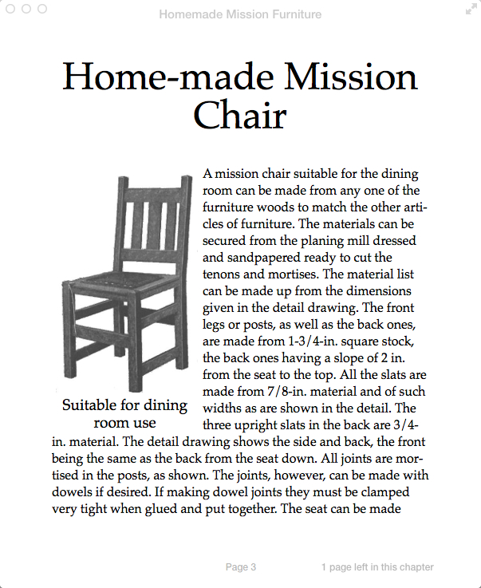
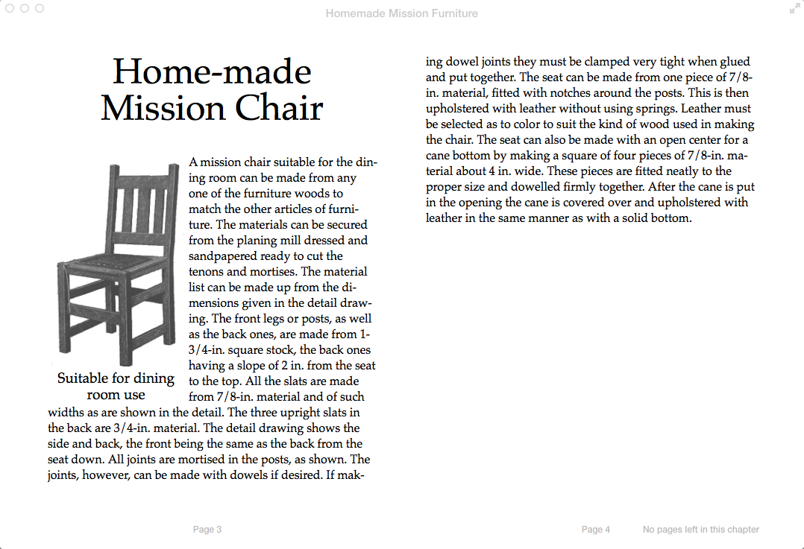

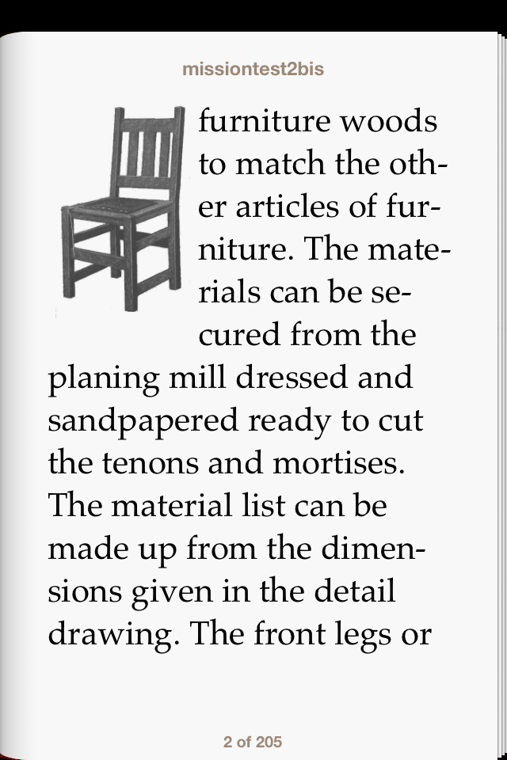
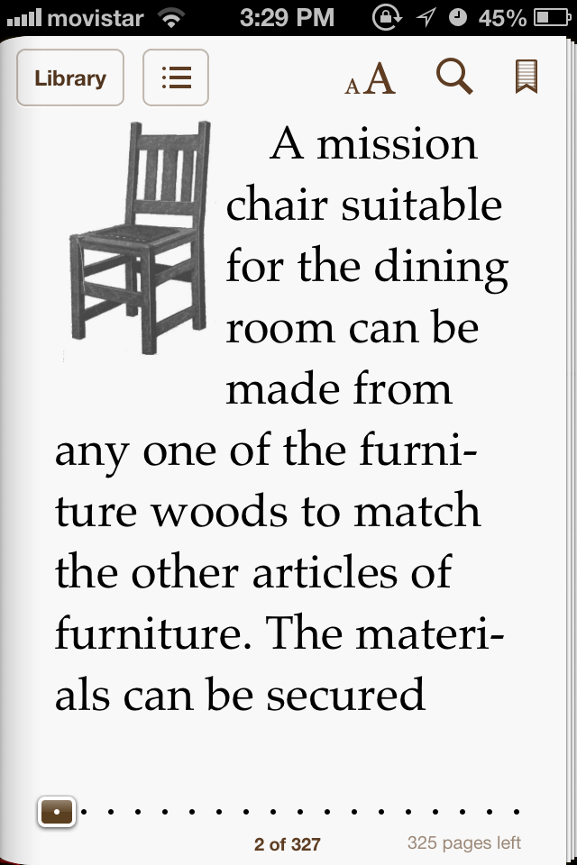


InDesigns print features—including master pages and the control of headers and footers, and precise positioning of elements and text—are ignored in flowable EPUB documents. Flowable EPUB does permit choosing an (initial) font-size, leading, font, space before and after a paragraph, whether a paragraph should begin on a new page, and more, though the reader may be able to partially or completely override these settings in individual ereaders. 

You can use InDesign just for EPUB production and not print. In this case, you can simply ignore how the book looks in print and focus on generating flexible EPUB documents that look good across a range of ereaders.

This is a very short guide and InDesign is a very complex and complete software package. There are many more options than those described here.

### Styles 
One of the most effective tools that InDesign offers is the ability to identify different kinds of paragraphs (headers, subheaders, body text, captions, etc)  and apply a whole set of formatting rules to them—called a 'style'—in one fell swoop. These styles can later be exported into EPUB in CSS format, enabling subsequent editing and adjustments, if necessary, in order to adapt to a range of different ereaders and/or offer a different look than in the print document.

You must first create styles, then apply them, then make sure they are properly mapped for export to EPUB.

#### Creating styles
1. Open the Paragraph Styles panel and click the New Style button to create a new style. Any formatting in the active paragraph is incorporated automatically into the new style. 
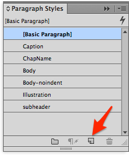
2. Give the style a name.
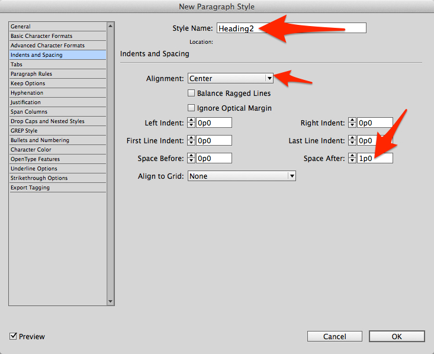
3. Choose any additional options on the right from the different categories available at left, and save.

Tips

- You can also create Character Styles for applying formatting to just a selection of text rather than an entire paragraph. 
- Applying all formatting with styles instead of applying formatting directly improves reliability across ereaders and facilitates later editing. 

#### Apply styles
1. Click in a paragraph that you want to style.
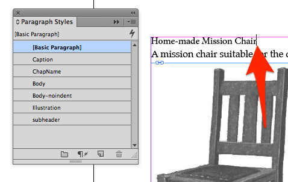

2. Choose the desired style from the Paragraph Styles panel that you wish to apply.
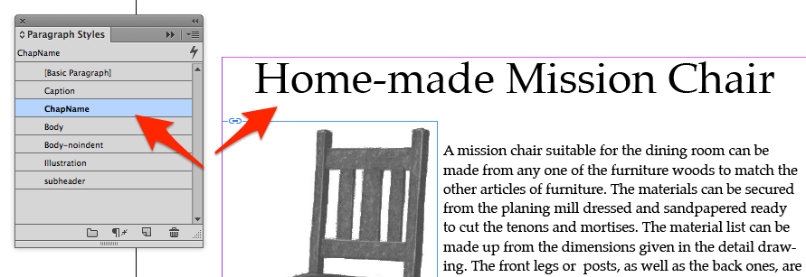

3. Repeat for every paragraph in the document.

Tips

- You can style all of the text at once by selecting all and then choosing the Body or Normal style. Then apply the less frequent headers and captions and other paragraphs individually.
- If you have imported a document with large quantities of existing bold or italic text, you can search and replace to automate applying the character style.
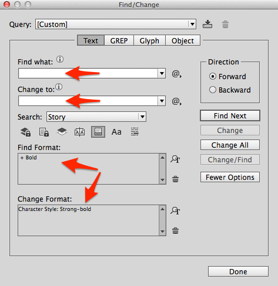


#### Map styles to tags
Though InDesign can do this step automatically, you can precisely specify which Paragraph Styles should be mapped to which tags in the resulting CSS to get more control.

1. Choose Edit All Export Tags from the Paragraph Styles Panel menu. 

2. In the dialog box that appears, verify that each style is mapped as desired to the appropriate tag. It's a good idea, for example, for header paragraphs in your book to be output as h1, h2, etc. and for each style to have its own class. 
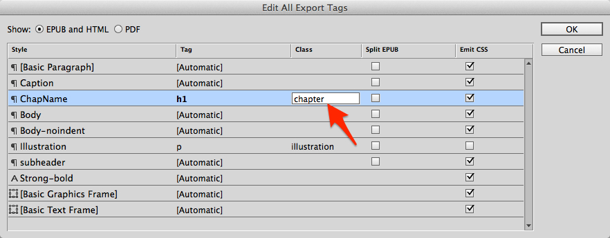


Tips

- If you import XML documents, you can have InDesign automatically map specific XML tags to the desired Paragraph Styles (which later will be mapped to the proper EPUB CSS tags as above).
- You can also set Export mapping in the Paragraph and Character Style dialog boxes.
 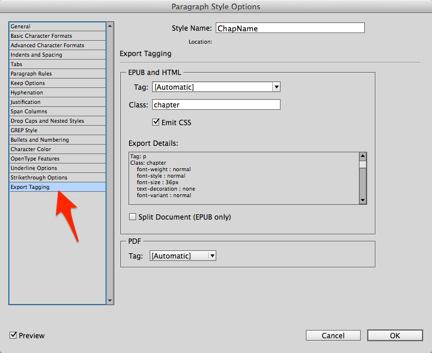

- Earlier versions of InDesign were not as good at exporting all of its styles to CSS. CC is substantially better.

- You can apply your own CSS in addition to or in substitution of the formatting from the styles from InDesign through the Export Options dialog box.

###Images
InDesign has three kinds of images: inline, **anchored** and independent. 

Inline images are placed or pasted directly within the text. When exported, they are rasterized (and thus if any inline objects contain text, this text is also rasterized), and exported in the flow of the text in which they are placed. Inline images cannot be wrapped with text.

Anchored images are tied to a particular part of the text, and when exported to EPUB will appear next to that text in the code. Anchored images can have text wrapped around them and are properly exported as floating objects in EPUB. Text within anchored groups of objects is not rasterized, but sometimes resizes incorrectly in ereaders.

Independent images are placed on the page adjacent to text and other objects, without any explicit link between the two. InDesign exports text and and independent image objects sequentially according to their location on the page, starting with those objects that are farther up and to the left. Because an entire story is exported before other objects on the same page, images may often appear several pages after the text in the EPUB than they did in the print version. The order of exported objects can be adjusted in the Articles panel.  

####Anchoring images
Generally, it's more effective to use anchored images with text that will be exported to EPUB. This gives you more control over where the image appears in the exported EPUB and also permits the use of text wrap.

1. Place an image on the pasteboard.  
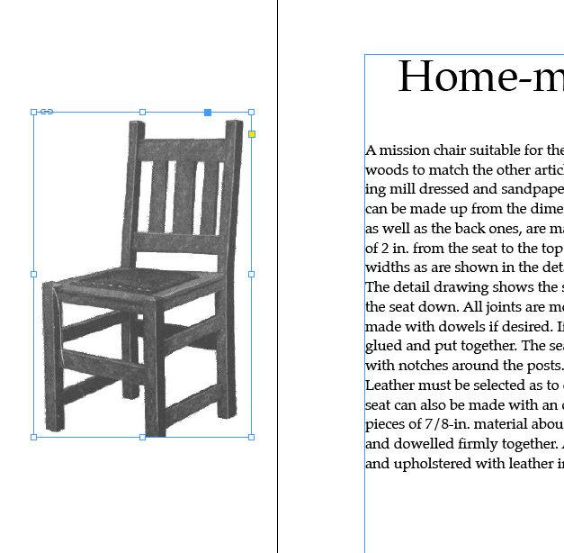  
2. If desired, you can create a caption, style the caption, and then group the caption with the image.  
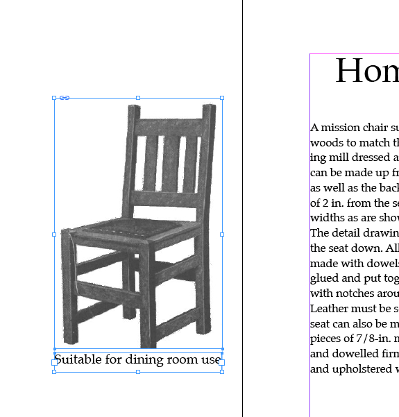   
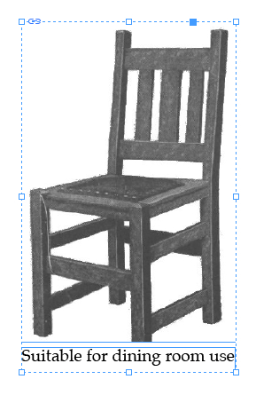  

3. If it's not already, select the image to make its controls visible. Drag the blue box in the upper right corner of the image to the desired location in the text. The blue box changes to an anchor symbol.  
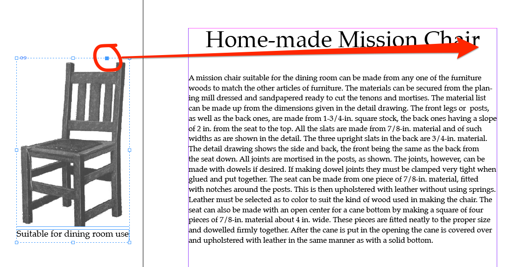  
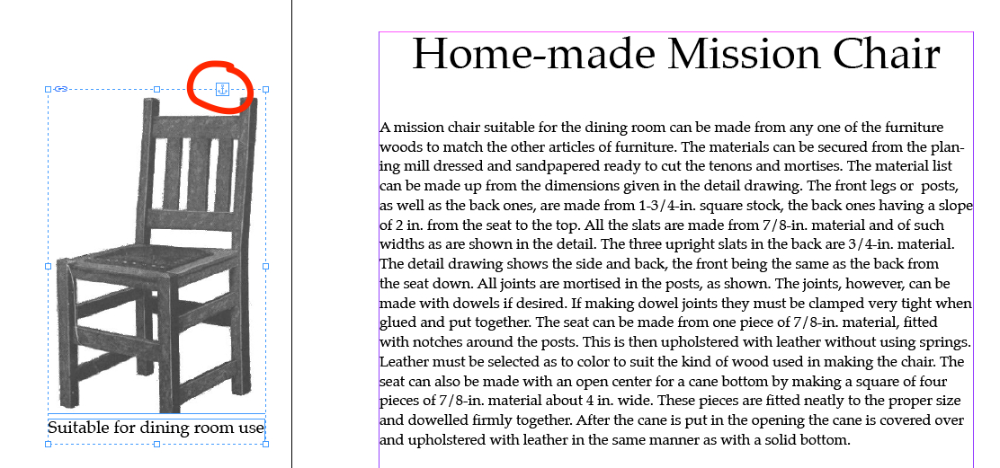  
4. If the print output is important, adjust the location of the image. This does not affect the image's location in the EPUB. 
5. If you want text to wrap around the image, select the image and then choose Object > Object Export Options.  
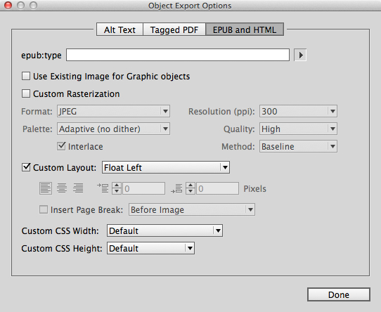  
	a. Display the EPUB and HTML options panel.
	b. Check the Custom Layout option and then choose Float Left or Float Right from the menu. 
	c. In order to specify the desired amount of space between the image and the text, choose the image, display the Text Wrap box, click the second option, and specify the amount of space in each box.  
	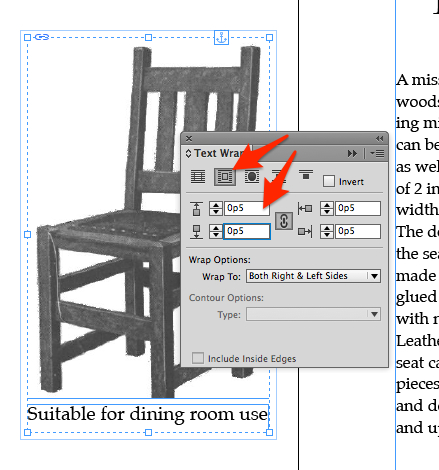  
	
	You might also want to do this to adjust how the image appears in the print edition.
	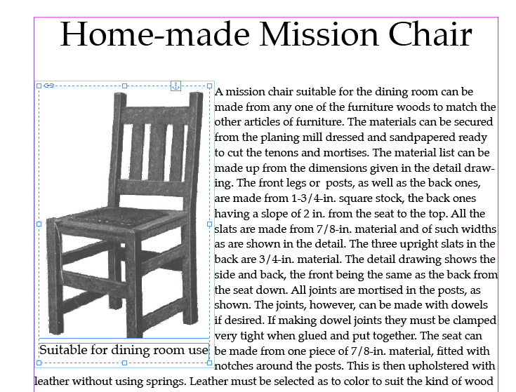  

	
###Links and cross references
One of the main advantages of ebooks over print is that they can contain links to additional information, whether it be in the same book, or on a web site somewhere out on the internet. InDesign makes it easy to incorporate links into your ebook.

There are two principal kinds of links: links in which you specify both the destination and the link text, and links that get the link text automatically from the destination. This second kind of links are called cross-references. It's a good idea to apply a character style to all kinds of links.

###Creating links within a book
1. First, create the destination by selecting the point in the book where you want the link to point to, and then choosing New Hyperlink Destination from the Hyperlinks panel menu. Note the name of the Text Anchor, you'll need it later. By default, it's the first few words of the destination text. Then click OK.   
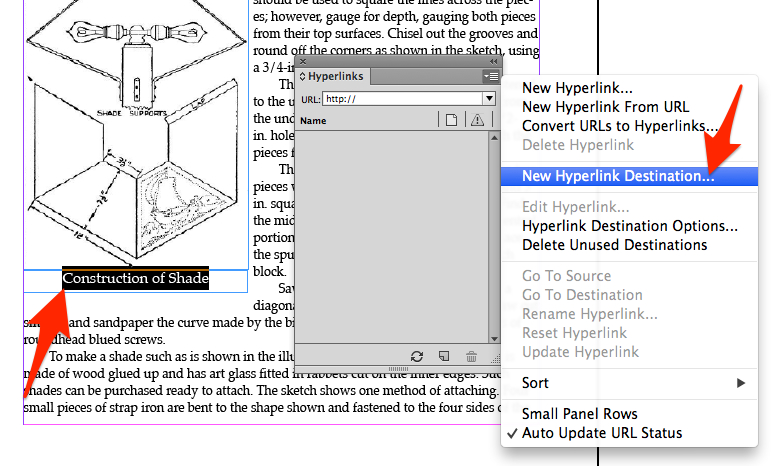  
  
2. Next select the text that you want to convert into a link and choose New Hyperlink from the Hyperlinks panel menu.  
3. Choose Text Anchor next to Link To:, choose the Document that the destination is in and then choose the name of the Text Anchor.  
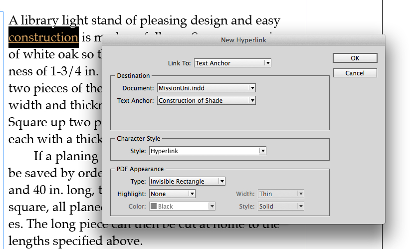  
4. It's also a good idea to apply a style so that you can format all the links later.
5. Click OK to create the link.  
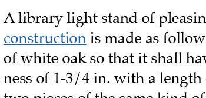  


###Creating cross references
Cross references are links in which the text you click on is automatically generated from the text in the destination. A typical example of cross references is to link to a different chapter or header name. InDesign will always use the most up to date text in the Header.

1. To create a cross reference, place the cursor in the text where the link will go.
2. Choose Window > Type & Tables > Cross-References to view the Cross-References panel. 
3. Choose Insert Cross-Reference.
4. Choose the desired document and then the kind of paragraph that you want to link to in the left half of the New Cross-Reference box.  
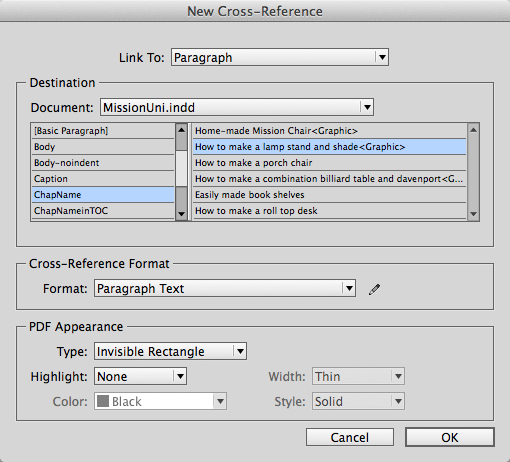  
The specific paragraphs tagged with that style will show up on the right so you can choose the one you want for the cross-reference.
5. Select a Format for the Cross-Reference, and click OK.
The text from the destination appears in the body of your document. It will be exported as a link in the EPUB document. 
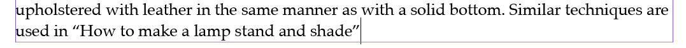  


###Table of Contents
Ebooks have two different kinds of tables of contents, the conventional one that is part of the text, just like any other chapter in your book, but with links to the remaining chapters and sections, and one that is accessed through the menus of the user's ebook reader regardless of which page they're looking at at the moment. InDesign facilitates the creation of both types. 

InDesign generates tables of contents from styled paragraphs. For example, you might want to create a table of contents with all of paragraphs marked with the Heading 1 and Heading 2 styles, or as in this example, with just all of the ChapName elements.

####Creating a Table of Contents Style
1. Choose Layout > Table of Contents Styles and then click New in the dialog box that appears.  
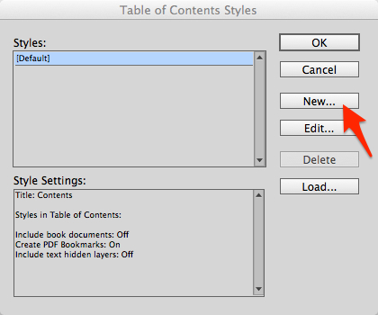
2. Give the table of contents a name, like "Contents" and choose the paragraph style that should be applied to that header in the book. 
3. Choose the kind of paragraphs that should be used to populate the table of contents, like headings or chapter names.
4. Click More Options if it's not already chosen.
5. In the center area, choose the style that should be applied to each kind of element in the table of contents. It's a good idea to create special styles to be applied to these elements.
6. Choose No page number in the Page Number box since these are not necessary in an ebook.  
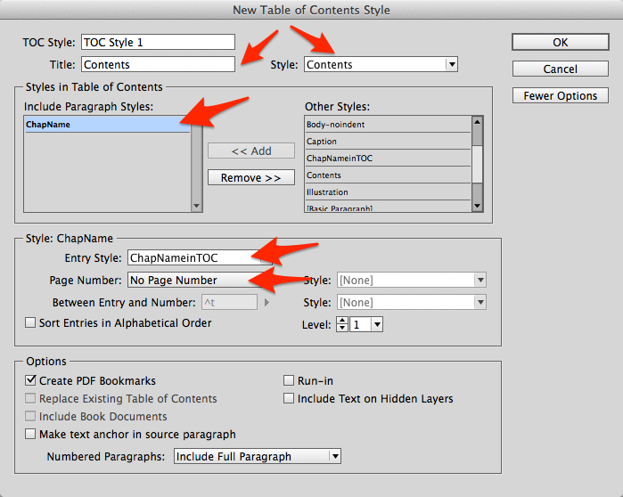
7. Click OK to save the TOC Style. This is the first step to creating both a navigational and in-document table of contents.

####Generate the in-document table of contents 
1. Once you've created a TOC Style, choose Layout > Table of Contents to have InDesign generate the table of contents by extracting the text from the paragraphs marked with the styles you selected.
2. With the "loaded" pointer, place the table of contents in the desired location of the document.  
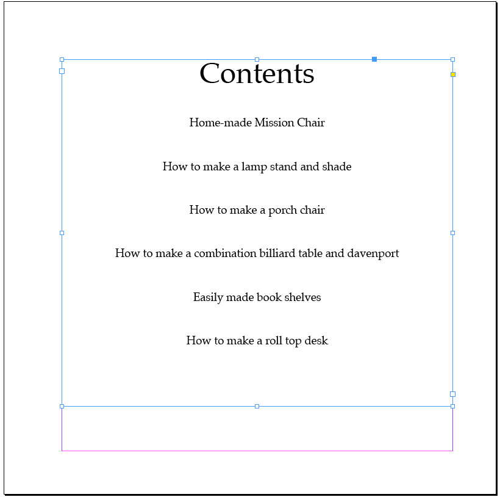  
You don't have to put the table of contents at the front of the book, or indeed include it all. 
3. You'll learn how to generate the navigational table of contents in the Export Options section of this guide.

Tips

- If you export a multi-document book to EPUB and don't create a Table of contents style, InDesign automatically creates a TOC based on the file names of the individual documents in the book. If you export a single document book to EPUB, InDesign will not automatically generate a table of contents.
- You can create a navigational table of contents or an in-document table of contents or both. Most ereaders will throw an error if the navigational TOC is not present. Some ebook stores will complain if you don't include an in-document TOC. 

###Metadata
Metadata is information about your book, including the names of the author and other creators, the publisher, date of publication, subject matter, and more. It's a good idea to provide as much metadata as possible to make it easy for prospective readers to find your book.  

InDesign gives you two opportunities to add metadata, in the File Info dialog box and when you export your file to EPUB. The two sets of information overlap but are not identical. Further, only empty fields are overwritten by data in the other system. 

1. Go to File > Info to add metadata to your file about the name of your publication, the author, a description, keywords, and copyright status. 
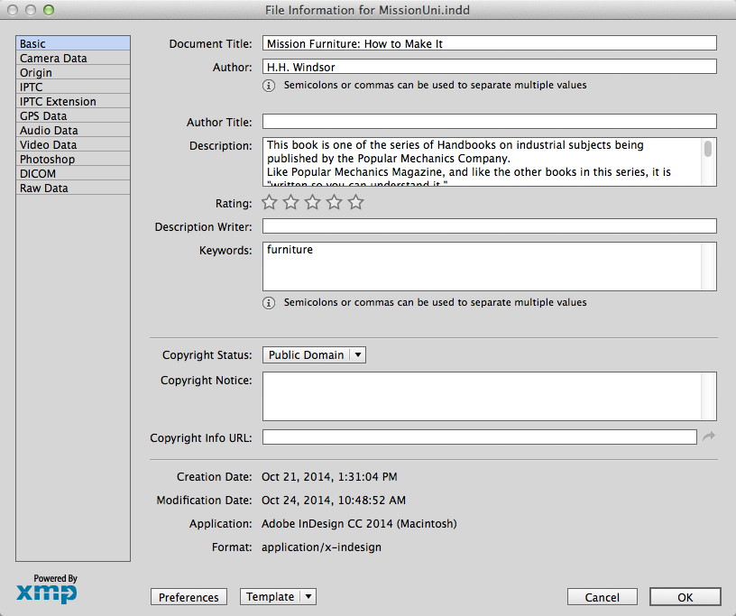

2. You can add additional metadata as you export the document to EPUB as discussed further ahead. 

###Cover
The final step before you export to EPUB is to create and add a cover for your ebook. Because ebook covers are often viewed at small sizes, it's important to have large, clear text and to preview the cover at icon size. Most ebook stores ask for images that are at least 1000 pixels on the shortest side. 

1. Save the cover image as a JPEG.
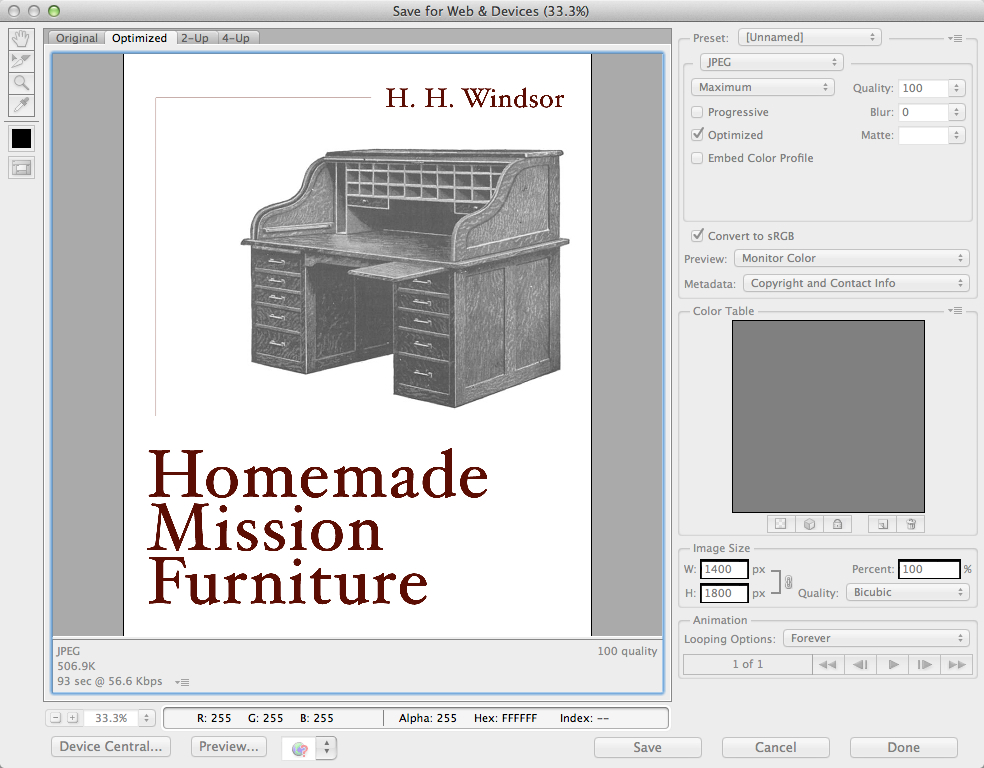
2. You indicate the cover image that you want to use to InDesign when you export to EPUB in the next section.

###Export options
Before exporting to EPUB make sure that all formatting is applied with styles, all images are properly placed and anchored, you've created all the necessary links and cross-references, there is a defined Table of Contents style, you've specified as much metadata as necessary and desired, and you've created a high-resolution cover image that can be viewed adequately at small sizes. 

1. Start by choosing File > Export and then choose a filename and destination, and EPUB (Reflowable) in the Format menu. 
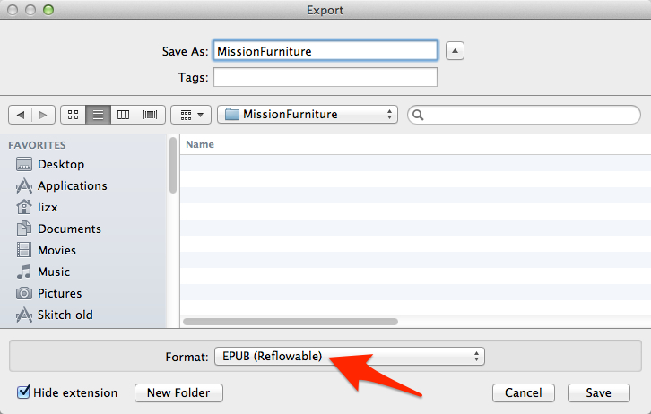

2. Click OK. The EPUB - Reflowable Layout Export Options box appears with eight separate panels of options.
3. In the General panel, choose EPUB 3.0 next to Version to ensure your document is up to the latest standards.  
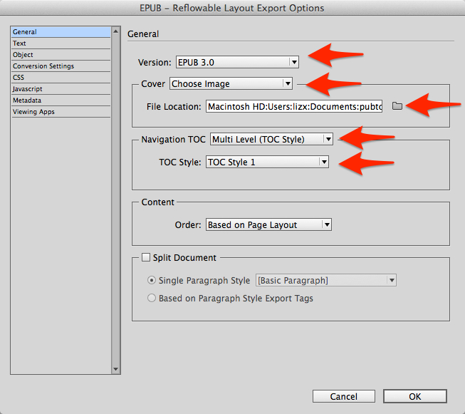
4. Select Choose image next to Cover, and then click the folder to select the desired cover image that you created earlier. If you choose Rasterize Front Page, InDesign creates a screenshot of the first page of your book and uses that for the cover. 
5. Next to Navigation TOC choose Multi Level (TOC Style) and then choose the Table of Contents Style that you created earlier in the TOC Style menu.
6. Click the Metadata panel.
7. If the book has an ISBN, enter it into the Identifier field.
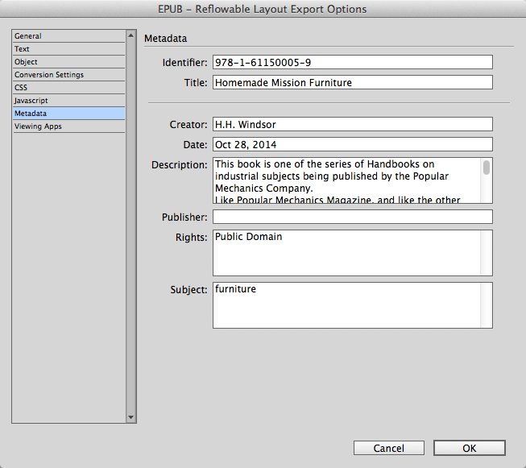
8. All the other fields besides the Date field should be automatically populated with data entered in the File Info box earlier. You can add any missing information now. InDesign uses the information in the Date field for the EPUB 2.0 dc:date element but will always automatically set the EPUB 3.0 compatible date format with the date and time of export. In other words, you don't have to put anything in the Date field.
9. There are many other export options, for controlling the way images and text are exported, for adding JavaScript and CSS, and for choosing how the ebook should be previewed. Explore these at your leisure. The CSS is perhaps my favorite option since it allows you to override or even completely substitute the sometimes bulky and awkward CSS generated by InDesign with your own carefully crafted CSS. 
10. Finally, click OK to generate the EPUB file.   
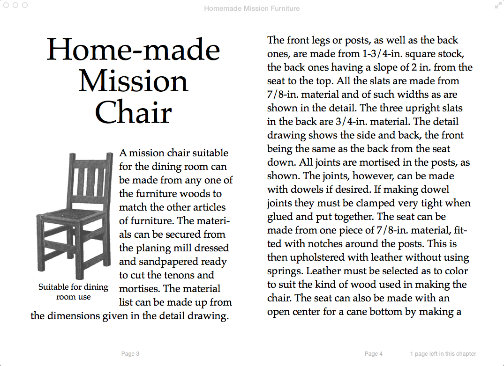


###Testing
Be sure to test the EPUB file in as many ereaders as possible. You can use Kindle Previewer to open the EPUB in a Kindle simulator and/or to convert the EPUB to Kindle format so that you can test it on actual Kindle devices.

###Validating
It's always a good idea to validate your EPUB documents with ePubCheck before you release them.


## Do it yourself EPUB using pandoc
Two popular conversion programs that can convert from a wide variety of input formats and produce EPUBs are pandoc (see also chapter 6 <!-- internal link needed-->) and Calibre's conversion tool.[^ebook-convert]

For example, consider *Beowulf* available from Project Gutenberg in a variety of formats (including EPUB). The 'plain text' version [^plaintext], is the complete text of the book in a single file with no styling (no fonts, sizes, or bold etc). We can use this to show how a simple conversion to EPUB works.


To make an EPUB of *Beowulf*, download the 'plain text' version (the complete text of the book in a single file with no styling). [^plain-text] In your Documents folder, make a sub folder named 'pandoc-test'. This is the folder where we’ll store and retrieve documents to be converted and which are made by pandoc. Save the file in this folder with the name beowulf.txt. Download and install pandoc. [^pandoc-installation-page] Pandoc is working in the so-called command line mode and not in a user interface environment. Hence you can’t ‘open’ the program and don’t see an icon. To convert the file into an EPUB follow the steps below.

1. First open the file with Microsoft Word or a similar program. Save the file as a docx-document, in the same folder called 'pandoc-test'.

2. Pandoc is a command-line tool. There is no **graphical user interface**. So to use it, you’ll need to open a terminal window: 

Windows: To start pandoc type cmd in the RUN (also called ‘search programs and files’ in the start panel which can be found under the MS window icon down in the toolbar), this will enable you to start the command mode. You'll get a white/black window saying C:\\user\\yourusername\>. There you type pandoc (enter) and the same line reappears, waiting for pandoc input (see further below).<!-- Double \ used to espace meta value of \ in Mardown and display C:\\ literaly  -->

Mac: To use pandoc open the Terminal from your Utilities folder in your Applications folder, or through the search bar in the top right of your screen. Pandoc will be used to convert files in the steps below. Note: Pandoc does not work on older Mac operating systems.

1. Go to the Terminal and type cd Documents. This means the Terminal will ‘change directory’ to the Documents folder.
2. Now type cd pandoc-test. The Terminal will change directory to the folder within the Documents folder called pandoc-test. Now you can work with the documents in there.
3. On Mac, type ls [l as in lima, referring to ‘list’], on Windows dir to get a list of files in the current folder. The beowulf.docx should be listed.
4. To convert the file from docx to EPUB, type the following into the terminal: 

		pandoc beowulf.docx -f docx -t epub -s -o beowulf.epub
		
5. The filename beowulf.docx tells pandoc which file to convert, -f docx -t epub, so from docx to EPUB. The -s option says to create a ‘standalone’ file, with a header and footer, not just a fragment. And the -o beowulf.epub says to put the output in a file named beowulf.epub. (Note: in Mac you can copy-paste the command, in Windows you can’t copy-paste.)
6. Check that the file was created by typing ls or dir again. You should see beowulf.epub.
7. Open the EPUB from the folder or  in the Terminal type 

 	 	open beowulf.epub 
 	
8. Note that you can also start from Markdown. Then open the text file in your Markdown editor and save as a markdown file. Type the following command in pandoc to convert into EPUB:

		pandoc beowulf.md -f markdown -t epub -s -o beowulf.epub

### Cleaning up Markdown

Since Markdown is a document format and not a word processing program, it does not offer functions like automatic renumbering of footnotes and list items during text editing. In fact, such numbers don't matter since everything will be renumbered during the document conversion anyway. 

However, to also make the Markdown text source coherent and tidy, pandoc can be used to clean it up. The trick is to tell pandoc to convert a document from Markdown to Markdown. Open the comand line and type in the following line (be sure to put the file in the approriate folder and to navigate to that folder first, as explained above):

    pandoc beowulf.md -f markdown -t markdown -o beowulf_clean.md 

This means you give pandoc the command to convert your beowulf.md file from (-f) markdown to (-t) markdown - in this process it will clean up itself, and produce a new output file (-o) with the name beowulf_clean.md.


[^ebook-convert]:ebook-convert, http://manual.calibre-ebook.com/cli/ebook-convert.html.
[^plain-text]:Beowulf by J. Lesslie Hall, http://www.gutenberg.org/ebooks/16328.
<!-- [^calibre]: Calibre, http://calibre-ebook.com/.--> <!-- Andre: no reference to this f.note -->
[^pandoc-installation-page]: Installing Pandoc, http://www.johnmacfarlane.net/pandoc/installing.html.
[^epub-zipping-process]: ePub Zip/Unzip AppleScript application for Mac OS X, http://www.mobileread.com/forums/showthread.php?t=55681.
[^rudimentary-epub]: Example EPUB, https://github.com/DigitalPublishingToolkit/Hybrid-Publishing-Toolkit-for-the-Arts/raw/master/examples/Example.epub.
[^idpf.org]: EPUB Publications 3.0.1. Recommended Specification 26 June 2014, http://www.idpf.org/epub/301/spec/epub-publications.html.
[^epub-standard]: EPUB Open Container Format (OCF) 3.0, http://www.idpf.org/epub/30/spec/epub30-ocf.html.
[^epub-validator]:EPUB Validator (beta), http://validator.idpf.org.
[^desktop-application]: pagina EPUB-Checker (Freeware), http://www.pagina-online.de/produkte/epub-checker/.


