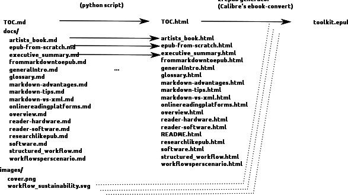
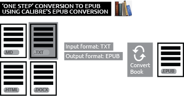
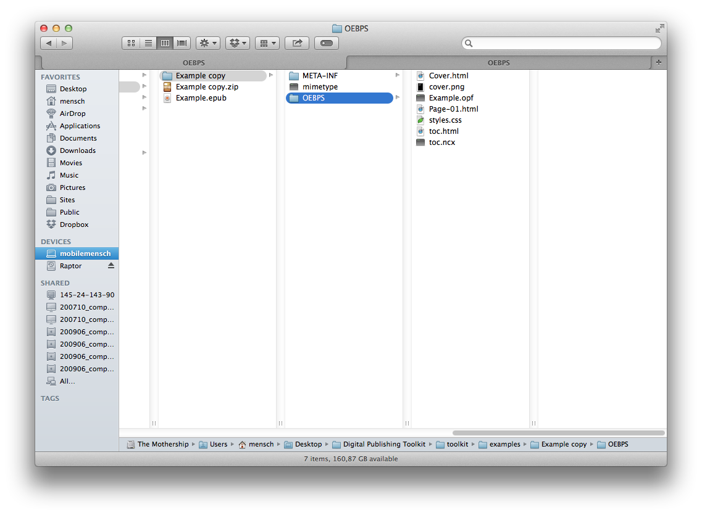

# 07 Guide: How to make a simple EPUB

<!--Focus: EPUB 2/3, HTML5 (app) + PDF

example Manifesto, El Lissitzky

Miriam: are we still going to use this example?-->
    

## Direct conversion


<!-- @Michael could you take this up with Loes and Kimmy? Margreet: where should this image go? What is it's purpose? There is also a small portion missing at the top-->


Making an EPUB doesn't have to be complicated. As the EPUB standard is open and based on HTML (the same format as web pages), there's a large and growing variety of ways to convert and export to EPUB from different kinds of sources. For very simple publications, it may be possible to use a tool that directly converts your document to  EPUB.

Two popular conversion programs that can convert from a wide variety of input formats and produce EPUBs are pandoc (see also chapter 6 <!-- internal link needed-->) and Calibre's conversion tool [ebook-convert](http://manual.calibre-ebook.com/cli/ebook-convert.html). 

For example, consider *Beowulf* available from Project Gutenberg in a variety of formats (including EPUB). The ['plain text' version](http://www.gutenberg.org/ebooks/16328), is the complete text of the book in a single file with no styling (no fonts, sizes, or bold etc). We can use this to show how a simple conversion to EPUB works.

### Calibre



[Calibre](http://calibre-ebook.com) is an open source management and reading program for epublications. A more detailed description can be found in chapter 9 (<!--internal link needed-->). Calibre can also be used to convert files, for example into EPUB. How it works is shown below. Within a few simple steps Calibre allows you to make your own EPUB.

After downloading and installing the program, follow these steps:

Step 1: Open Calibre and import the original file you want to convert.
Step 2: Select the file and click 'Convert books'.
Step 3: Choose the file format for input and output.
step 4: Click OK; Calibre starts converting.
step 5: your EPUB is ready.


### Direct conversion to EPUB with pandoc

To make an EPUB of *Beowulf*, download the ['plain text' version](http://www.gutenberg.org/ebooks/16328) (the complete text of the book in a single file with no styling). In your Documents folder, make a sub folder named 'pandoc-test'. This is the folder where we’ll store and retrieve documents to be converted and which are made by pandoc. Save the file in this folder with the name beowulf.txt. Download and install pandoc [pandoc installation page](http://www.johnmacfarlane.net/pandoc/installing.html). Pandoc is working in the so-called command line mode and not in a user interface environment. Hence you can’t ‘open’ the program and don’t see an icon. To convert the file into an EPUB follow the steps below.

* First open the file with Microsoft Word or a similar program. Save the file as a docx-document, in the same folder called 'pandoc-test'.

* Pandoc is a command-line tool. There is no graphic user interface. So to use it, you’ll need to open a terminal window: 

Windows: To start pandoc type cmd in the RUN (also called ‘search programs and files’ in the start panel which can be found under the MS window icon down in the toolbar), this will enable you to start the command mode. You'll get a white/black window saying C:\\user\\yourusername\>. There you type pandoc (enter) and the same line reappears, waiting for pandoc input (see further below).<!-- Double \ used to espace meta value of \ in Mardown and display C:\\ literaly  -->

Mac: To use pandoc open the Terminal from your Utilities folder in your Applications folder, or through the search bar in the top right of your screen. Pandoc will be used to convert files in the steps below. Note: Pandoc does not work on older Mac operating systems.

* Go to the Terminal and type cd Documents. This means the Terminal will ‘change directory’ to the Documents folder.
* Now type cd pandoc-test. The Terminal will change directory to the folder within the Documents folder called pandoc-test. Now you can work with the documents in there.
* On Mac, type ls [l as in lima, referring to ‘list’], on Windows dir to get a list of files in the current folder. The beowulf.docx should be listed.
* To convert the file from docx to EPUB, type the following into the terminal: 

		pandoc beowulf.docx -f docx -t epub -s -o beowulf.epub
		
* The filename beowulf.docx tells pandoc which file to convert, -f docx -t epub, so from docx to EPUB. The -s option says to create a ‘standalone’ file, with a header and footer, not just a fragment. And the -o beowulf.epub says to put the output in a file named beowulf.epub. (Note: in Mac you can copy-paste the command, in Windows you can’t copy-paste.)
* Check that the file was created by typing ls or dir again. You should see beowulf.epub.
* Open the EPUB from the folder or  in the Terminal type 

 	 	open beowulf.epub 
 	
* Note that you can also start from Markdown. Then open the text file in your Markdown editor and save as a markdown file. Type the following command in pandoc to convert into EPUB:


		pandoc beowulf.md -f markdown -t epub -s -o beowulf.epub


##Do it yourself EPUB from scratch

The process of creating an EPUB from scratch is similar to developing a simple website. The main difference is that while websites can and often link to other websites, an EPUB is 'self-contained', any pages that are linked to, or images that are displayed must be part of the collection. Creating an EPUB by hand is useful for creating small personal publications, or for making publications that explore the particularities of the EPUB format in detail.

An EPUB is a zip archive typically named with the extension '.epub' instead of '.zip'. The EPUB is a compressed collection of HTML files, stylesheets, and images, like the files found on a website, compiled together with some extra files that mark and structure the files so that an ereader can display them. Any file archiver that works with zip files (Archive Utility, The Unarchiver, WinZip, etc.) can open and decompress an EPUB. In some cases, it might simply be done by renaming the '.epub' with '.zip'. More information about how to automate the EPUB zipping process can be found [here](http://www.mobileread.com/forums/showthread.php?t=55681). 

A rudimentary EPUB is used as an example to explain several of its concepts and may be [downloaded here](https://github.com/DigitalPublishingToolkit/Hybrid-Publishing-Toolkit-for-the-Arts/raw/master/examples/Example.epub).

###Layout of an EPUB package

Decompressing an EPUB will reveal its directory layout and in that way makes clear how an EPUB is set up. As explained above, the EPUB can be seen as a compressed zip archive. First unzip it using an archive program. After unzipping it, it looks as follows:


<!--@Kimmy Margreet: Can the image be cleaned, i.e take out shared media and also raptor, etc. Miriam: and zoom in on the filenames, can't read it like this. Kimmy: image is still in progress-->

The *META-INF* and *OEBPS* directories and *mimetype* should always be present in an EPUB file and form a large part of what constitutes an EPUB: 

* *META-INF* contains an XML file (*container.xml*) which directs ereaders to an inventory (an .opf file) of all the files present in the publication.

* *OEBPS* is the location where all the content (HTML files, images, audio, video, etc.) of the publication is stored; (nested) subcategories are possible but not mandatory. The .opf file (traditionally named *content.opf*) is important; this contains the metadata for the EPUB and is in turn referenced by the aforementioned *container.xml*. You might see another file with a .ncx extension (traditionally *toc.ncx*), it holds the hierarchical table of contents for the EPUB and is entirely optional as it isn't part of the EPUB specification.

* *Mimetype* is a file that contains a single line describing the EPUB file as `application/epub+zip`, this file allows ereaders to check whether the file is actually an EPUB and thus if they can read it.

These three components form the basic structure of an EPUB and are required in order for the file to be a valid EPUB. For a formal specification of EPUB3, see the overview by [IDPF.org](http://www.idpf.org/epub/301/spec/epub-publications.html) which defines semantics and conformance requirements for EPUB publications.

###Creating your own EPUB

Most of the elements of an EPUB can be produced by hand in a text editor. Text editors is used for editing plain text files (for example HTML files) and should not to be confused with word processors like Microsoft Word or Apple's Pages. Popular text editors include BBEdit, TextWrangler or TextMate for Mac or NotePad++ and PSPad for Windows. Below follows a step by step process of creating a very simple EPUB.


####Creating the required files and directories

Now that we've seen the insides of an EPUB after unzipping it, we can work the other way around and make the files and folders ourselves, thus creating a simple EPUB. We will work from our Documents directory where we can add folders like in the image above, and using a text editor to create the necessary files.

<!--Margreet: Underneath steps go to fast to my opinion. Files and directories?! It would help to write a small introduction here maybe?
Miriam: is it clearer now?-->
1. Create a directory under Documents to store the files and subdirectories for your EPUB, and name it *Example*;
2. Create two more directories inside the one you've just created, one called *META-INF* and the other *OEBPS*;
3. Using a text editor create a plain text file and add the line `application/epub+zip` to the file;
4. Save the plain text file, without a file extension, and name it *mimetype*. Put it alongside the two directories you created in step 2. In this way ereaders can see that this is an EPUB.

Now there are the two directories and one text file, like we saw when we decompressed the EPUB used as an example.


####container.xml

Next we make the file 'container.xml', the XML file that directs ereaders to an inventory of all the files present in the publication, and that is located in *META-INF*. 

1. Again using a text editor, create a new file and save it to the *META-INF* directory with the name *container.xml*;
2. The *container.xml* contains a simple structure written in XML. Below is a complete version of the text, followed by an explanation of its separate parts. (You may ignore the explanation without much consequence if its too technical in nature.) 

	```
	<?xml version="1.0" encoding="UTF-8"?> 
	<container version="1.0" xmlns="urn:oasis:names:tc:opendocument:xmlns:container"> 
		<rootfiles>
			<rootfile full-path="OEBPS/content.opf" media-type="application/oebps-package+xml"/>
		</rootfiles>
	</container>
	```
	
The first line is a `declaration statement` which should always be present in XML files. This is followed by the `container` which denotes that the publication is based on the *Open Container Format* as specified by the EPUB standard[^epub-standard]. The `rootfiles` tag denotes a collection of rootfiles, which is the possible starting point(s) for ereaders to begin processing and parsing the content. In this case the rootfiles contains only one entry, called `rootfile`, this tag has two attributes - `full-path` and `media-type`. The first attribute holds the path to an inventory file (in this case *content.opf*) containing metadata regarding the publication and its content. Finally, `media-type` is a reaffirmation of the EPUB's mimetype.
	
The important part of this document is the information in quotes following the attribute `full-path`: 'OEBPS/content.opf'. This attribute should point to an .opf file created in the next step.  

3. Save and close *container.xml*.  


####The OPF file

The OPF file is an important part of the structure of an EPUB. It is located in the OEBPS directory and contains the necessary metadata to accurately describe the publication. Next to that it can contain the linear reading order which, in combination with the contents of toc.ncx, may be used by ereaders to build navigation menus or a table of contents. The OPF file is too long to be included verbatim in this document, but the most important sections are referenced below. The file 'Example.opf' in the rudimentary EPUB used here, is an example of a complete opf file.

```
	<metadata xmlns:dc="http://purl.org/dc/elements/1.1/"
		xmlns:opf="http://www.idpf.org/2007/opf"
		xmlns:xsi="http://www.w3.org/2001/XMLSchema-instance">
		<dc:title>Example EPUB</dc:title>
		<dc:language>en</dc:language>
		<dc:identifier id="BookId">http://digitalpublishingtoolkit.org/ExampleEPUB.html</dc:identifier>
    	<meta property="dcterms:modified">2014-03-28T14:11:50Z</meta>
    	...
	</metadata>
```

The metadata section describes the current publication. It lists information such as the title, author, publisher, etc. Most of these entries are identical to what librarians use to catalogue publications. Parts of the metadata section are used by ereaders to organize collections.
	
```	
  <manifest>
    <item href="styles.css" id="css1" media-type="text/css"/>
    <item href="cover.png" id="cover" media-type="image/png" properties="cover-image"/>
	<item id="chapter1" href="Cover.html" media-type="application/xhtml+xml" />
	<item id="chapter2" href="Page-01.html" media-type="application/xhtml+xml" />
	<item properties="nav" id="toc" href="toc.html" media-type="application/xhtml+xml" />
    <item href="toc.ncx" id="ncx" media-type="application/x-dtbncx+xml"/>
  </manifest>
```

A manifest lists all the resources available in the EPUB package, with the exception of directories, the *mimetype* file, the contents of *META-INF* and the .opf file itself. A manifest file can be a pain to produce by hand for large EPUBs, as the list of resources utilised in the publication is bound to be long. Every resource has a unique `id` and should be referenced by a relative path in the `href` tag and described in the `media-type` attribute. The entry with the *cover.png* is of special interest, as the attribute `properties` describes the fact that the image may be used by ereaders as the cover image for the publication - e.g. for use in collection overviews.

```
  <spine toc="ncx">
  	<itemref idref="chapter1" />
  	<itemref idref="chapter2" />
  </spine>
```
Lastly, the `spine` lists all the pages present in the publication and it's listing arrangement tells an ereader the linear reading order of the publication. The `spine` can only contain (X)HTML pages, not images or other content. The `toc` attribute refers to the `id`  of the `toc.ncx` in the manifest.
	

####The content

As stated in the introduction of this section a large part of an EPUB is a collection of HTML files which are often interlinked. The process of creating the pages of an EPUB is similar to building a website, but with the particular limitations of ereaders in mind - limited support for rich media, colour, etc. An overview of the limitations can [be found here](<!--link missing-->). Pages should be written in XHTML, a variant of HTML which was created to make HTML more extensible and increase the interoperability with other data formats. Cascading Style Sheets (CSS) may freely be used, though a lot of ereaders ignore or do not parse many of the style definitions.


####Packaging

Creating an EPUB file is as simple as selecting both the *META-INF* and *OEBPS* directories and the *mimetype* file and creating a ZIP archive. This may be done by using the built-in archive utility of the operating system, or an external program like The Unarchiver (Mac) or WinZip (Windows) or a special purpose utility.[^epub-zip-unzip] The .zip extension of the archive may then be renamed to .epub. 

Because some archive programs create unnecessary (hidden) files inside the archive which might invalidate your EPUB, it's important to validate your EPUB to see if it works (although most ereaders will safely ignore extraneous files and parse the document properly). Invalid EPUBs are files that do not conform to the EPUB specification or have other issues, such as incorrect. Fixing validation errors will minimize but not eliminate the chance of ereaders refusing to read an EPUB. Validation of the EPUB can be done online using the [EPUB Validator](http://validator.idpf.org) or [a desktop application](http://www.pagina-online.de/produkte/epub-checker/).

Now your EPUB is ready! It can be opened and enjoyed in an ereader like Calibre, iBooks or a similar application.


[^epub-standard]: [http://www.idpf.org/epub/30/spec/epub30-ocf.html](http://www.idpf.org/epub/30/spec/epub30-ocf.html)
[^epub-zip-unzip]: [http://www.mobileread.com/forums/showthread.php?t=55681](http://www.mobileread.com/forums/showthread.php?t=55681)


