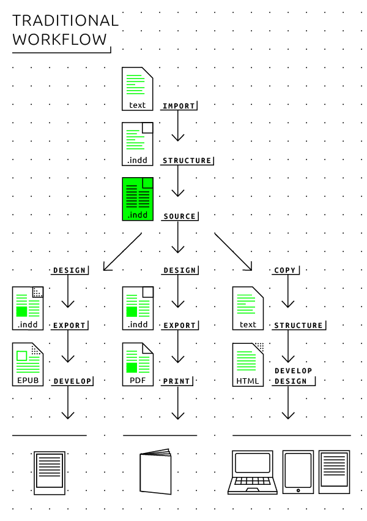

#7 Towards a hybrid workflow based on Markdown 

 
- Hybrid publishing gives the best results based on a single source document which can then be converted to different output formats (InDesign document, EPUB, website, etc.). 
- The traditional Microsoft Word + Adobe InDesign workflow does not work well for ebook publishing. 
- Markdown, a plain-text format with simple markup, has many pragmatic advantages as a source format for hybrid publications. 
- Markdown can be learned quickly, and makes it easy to verify whether a source document has been cleanly formatted. 
- There are many text editing and document conversion programs that support Markdown. 
- XML is technically superior, but often too complex for small publishers. 
- Hybrid publication projects can also be authored in database-driven content management systems, which have their own advantages and limitations. 

 

Creating a workflow that is both structured and flexible enough to cater to a variety of demands is a key step towards establishing an efficient electronic or hybrid publishing strategy. What we propose here is a hybrid workflow based on the need for publishing across different media, while keeping the main part of the work process in-house rather than outsourcing it. 

Instead of developing a digital publication based on the printed book at the end of a production process, as is common practice by publishers, the main workflow should be adapted at an earlier stage, and made efficient and practical for hybrid publishing. Development of each publication format from scratch is thus superseded by single-source, multi-format publishing. In other words: rather than working separately on the PDF for the print book, the EPUB version, and a Kindle edition, the workflow is instead focused on a single source file (in the Markdown format) which can easily be converted into these different output formats using a relatively small number of digital tools. 

The workflow described below starts at the point when the author hands in the final manuscript, in other words after the editing and rewriting process has been completed. In reality this is of course not the beginning of the publishing process. However, rewriting and editing is still most efficiently done using word processing applications with full tracking and commenting functions, such as Microsoft Word. Also, in our experience manuscripts are mainly written in Word and delivered in .doc or .docx files. Should the author already be working or submitting manuscripts in the Markdown, HTML or even XML format, this will of course affect the workflow. 
 
Note: an important step preceding the publication process lies in the formulation of an in-house style guide in which authors and editors can find the requirements for the manuscript. This style guide must be adapted according to the hybrid workflow before starting any work on the manuscript itself. For example: specification of the required file format, structuring of the text (headings, styles), image specifications, etc. See Chapter 8, Guide: hybrid publishing per genre <!-- internal link needed--> for more information on adapting the style guide.  (*Style Guide for Hybrid Publishing*) 

We will now focus on the implementation of the new workflow for small-edition and low-budget publishing houses.  (*Hybrid workflow how-to: introduction & editorial steps*) 

##Electronic publishing workflows: desktop publishing and Markdown 

###Desktop publishing workflow (from Word to InDesign to electronic book) 

A brief description of the desktop publishing (DTP) workflow currently used by many publishers would be: a Microsoft Word file is imported into InDesign and, after designing and editing, exported to PDF, ready to be printed. After work on the printed edition has been completed, the book may be converted into an electronic version which follows the design of the 'original' as closely as possible. This traditional, print-oriented workflow can be seen as the standard for one-to-one publications. 

 

There are certain advantages to this workflow: it is simple and linear, and there are no version branches. You end up with one consolidated manuscript, and What You See Is What You Get (WYSIWYG) when it comes to design. For example, in the case of a fixed-layout print design, adjustments in the hyphenation may need to be done manually in the InDesign document. In digital publishing however, hyphenations are never fixed, but are subject to change as the layout is reflowed according to the requirements of the device used. Therefore, if an editorial correction involves a change in hyphenation, this need not (or cannot) be adjusted in the digital file. This saves some work, but also means a limitation in the possibilities for electronic design. 

The main disadvantage of the DTP workflow in 'going electronic' is that it is focused on one single medium, and that the steps to go from there to a digital edition are quite laborious and do not make full use of the possibilities offered by electronic publishing. It is relatively straightforward to generate an EPUB based on the InDesign file, <!-- internal link chapter 6--> however in order to make use of the full possibilities offered by hybrid publishing (such as modular publishing, immediate updating, optimal uses of audio and visual formats), one should take these possibilities into consideration from the very beginning. A workflow that is based on print publishing generally attempts to convert the paper book into an electronic book at the last stage of the process. 

Converting an InDesign document to an electronic publication is not an ideal solution, especially when working with older versions of the software. The InDesign file in this case is automatically converted to HTML code which can be messy, sometimes even too messy to be rendered properly on an e-reader device or application.  (*Notes on EPUB Development in Adobe InDesign CS6*) The results of the conversion may require additional steps in order to finalize the publication.[^EPUBStraighttothePoint] The most recent version of InDesign (InDesign CC) has improved functionality for electronic publishing, but requires very careful structuring and preparation of documents in order to yield good results within reasonable work times. It is best suited for projects in which the content is generated from databases, imported as XML into InDesign and from there exported to EPUB. For a detailed look at these developments, see also the step-by-step guide describing how to convert a document from InDesign to EPUB. <!-- internal link chapter 6--> 

It is possible to create 'interactive' publications in the PDF format, working with Microsoft Word and InDesign. In the end however these are also static InDesign documents, upgraded with some interactive layers. This is still a limited vision of the possibilities of digital publishing. 

###From Microsoft Word (.docx) to EPUB 

Desktop publishing applications such as InDesign, and WYSIWYG word processors such as Microsoft Word or OpenOffice, are generally not well suited for processing structured text (see Chapter 2, The basics <!-- internal link chapter 2-->). Though it is possible to work in a structured manner, for example by using style definitions rather than manually applying formatting, the user is not required to make a distinction between formatting and structure, which is essential in the world of digital publishing. 

There is a viable solution for generating an EPUB from a Microsoft Word .docx file using the latest version of the command-line tool Pandoc, a powerful universal document converter.[^pandoc] However, since Word does not, as explained above, enforce good structure in a document, the EPUB generated by Pandoc will always be imperfect and thus not ready for publishing. Still, it should provide a relatively clean foundation for a designer to produce the final ebook. Other Word-to-EPUB programs, such as the built-in document converter of Calibre, (*Converting a Docx directly to EPUB using Calibre*) produce less satisfying results. 

In order to obtain the best possible EPUB file, the .docx file should be formatted using only Word's standard paragraph styles such as 'Normal', 'Title', 'Subtitle', 'Quote' and most importantly 'Heading 1', 'Heading 2', 'Heading 3' for the headings according to their logical hierarchy. For example: 'Heading 1' for chapters, 'Heading 2' for sections, 'Heading 3' for sub-sections. Since the resulting EPUB document will contain a table of contents and document navigation menu based on the 'Heading' hierarchy, a proper structuring of headings is crucial. Word footnotes will appear as linked endnotes in the EPUB, thereby elegantly simplifying an otherwise tedious document redesign task. 

Word unfortunately lacks two features that would make it more suitable for hybrid publishing projects: 

1. Word does not have a 'strict mode' that would 'force' all writers and editors of a document to use only defined paragraph styles instead of manual formatting. This means that your document will likely contain headings that haven't been defined as headings, but are just bold-faced text, quotes that haven't been defined as quotes, etc. Unfortunately, if the manual formatting has the same visual appearance as the predefined paragraph styles, it can be hard or even impossible to locate all instances in the document. 
2. Word provides no automatic or semi-automatic tools for finding manual formatting and replacing it with predefined paragraph styles. The only way to achieve this is to manually review and adjust the whole document. 

Often, such inconsistencies in a Word document will only become visible after the EPUB conversion, for example as a missing chapter heading in the table of contents of the ebook. These are the inherent risks and limitations of using Word in the editorial workflow. Nevertheless, the Word-plus-Pandoc option will likely be the easiest and least painful solution for publishers. 

We recommend two ways of working with Word + Pandoc. 

1. Conversion from Word to EPUB using Pandoc directly from the Terminal (Mac) / Command Prompt (Windows), or using the browser-based converter developed for this Toolkit.[^pandoc-convert2] This should only be done only at the very end of the editorial process, because after this conversion no further editorial changes can be applied to the Word document. A graphic designer can quite easily transform the converted document into the final electronic publication (for example, by modifying the typographic design to make it suitable for e-readers, by scaling and optimizing images for screen reading, by adding bibliographical metadata, etc.). 

2. Conversion from Word to Markdown using Pandoc. Since Pandoc can also convert files *to* the Markdown format, this is often the preferable option, especially for complex publishing projects. The resulting Markdown file can then be used as the 'master file' for conversions to various other file formats (such as EPUB, or HTML for publishing on a website). The advantage of converting to Markdown is that any formatting glitch in the Word document will now become clearly visible. For example, a heading formatted manually will be converted as \*\*heading\*\* while a heading formatted with the proper style definition will be converted as \#heading. This makes it much easier to clean up the internal formatting of the document and produce a 'clean' master file for all subsequent document conversions. The EPUB generated from this Markdown file will in most cases be much better structured than an EPUB directly generated from the Word file, making the subsequent work to be performed by the designer much easier. It is also possible to customize the Pandoc conversion by defining style templates. This in turn may make it possible, depending on the type and complexity of the publication, to automatically generate a complete and well-formatted EPUB from the Markdown files without even having to hire a designer. 

We would advise against using Pandoc to convert back and forth between Word and EPUB. If the Word document is subject to further editorial changes, then the conversion to EPUB (as in the first scenario) should be done again, as would any work already done by the designer on the previously exported EPUB file. Therefore, if possible the editorial changes should be implemented directly in the EPUB or Markdown file. 

###Cleaning up Markdown 

Since Markdown is not a word processing application but a document format, it does not provide functions such as automatic renumbering of footnotes and list items. In fact, such numbers don't matter since everything will be renumbered during the document conversion anyway. 

However, Pandoc can be used to 'clean up' the Markdown source text; the trick is to convert the document *from* Markdown *to* Markdown. Open a Terminal window (Mac) or Command Prompt window (Windows) and type the following line (be sure to first place the file in the appropriate folder and to navigate to that folder, as explained in detail in chapter 6 <!-- internal link chapter 6-->): 

`pandoc beowulf.md -f markdown -t markdown -o beowulf_clean.md ` 

This means that the program Pandoc is instructed to convert the file *beowulf.md* file from markdown ('-f markdown') to markdown ('-t markdown') and save the (cleaned up) result in a new file called led *beowulf_clean.md* ('-o beowulf_clean.md'). 

###Markdown workflow 

As mentioned above, we recommend the use of the markup language Markdown as part of a hybrid workflow. Though Markdown is not perfect, it is much easier to work with than, say, the complex markup language XML. Markdown allows for the creation of structured texts, an important requirement in hybrid publishing.  (*Mark me up, mark me down*) 

 

####Introduction: advantages and limitations 

John Gruber, the creator and main developer of Markdown, describes Markdown on his website as follows: 'Markdown allows you to write using an easy-to-read, easy-to-write plain-text format, then convert it to structurally valid XHTML (or HTML).'[^gruber] In other words, Markdown is a way of formatting plain text using human-readable formatting symbols, rather than HTML-style tags such as `<b\>` for bold or `<h1\>` to define a top-level heading. For example, this is what the beginning of *Alice's Adventures in Wonderland* would like in Markdown: 

 

In this example, the tag '\#' defines a top-level heading, '\#\#' a second-level heading, '\_' italic text, '\*\*' bold text, and '\>' a block quote. Markdown also provides tags for defining lists, embedded images, and links. The popular extended version **MultiMarkdown** provides further support for footnotes, tables, mathematical formulas, cross-references, bibliographies and definition lists. Using simple Open Source conversion applications such as Pandoc, text formatted using Markdown can be automatically converted to well-structured HTML, EPUB, PDF, RTF or other document formats, requiring no manual adjustments. 

Markdown is a product of internet culture. It uses ad-hoc formatting signs commonly used in e-mail and chat platforms, and further popularized on blogging platforms, to provide a standardized, human-readable, user-friendly and well-structured document format, suitable for long-term storage and as a basic source for conversions to contemporary and future document formats. While its formatting **syntax** is simple, it is also both strict and unambiguous enough to allow multiple writers and editors to work on a single document without unnecessary confusion. Another advantage of Markdown is that it can be written and edited in any software application capable of processing basic text: unlike the proprietary file formats of Microsoft Word or other word processors, Markdown can be opened using a simple text editor. 

Why do we recommend Markdown in particular? For certain publishing projects - for example, handbooks or books derived from wikis, it may be worth considering alternatives to Markdown, such as reStructuredText. There are, however, two reasons why we recommend Markdown as a practical tool for electronic and mixed-media publishing: 

1. Excellent software support. There are many user-friendly, high quality applications for writing and editing documents in Markdown and for converting Markdown to other formats. While Markdown may be written and edited in any text editor, there are several user-friendly text editing applications that make it easier to edit and immediately view the results, such as Mou, MacDown, Texts, MarkdownPad, UberWriter and MdCharm. 

2. The extended version MultiMarkdown provides all the necessary formatting and document syntax needed for text-oriented publishing in the arts and humanities, or the text component (complete with footnotes and bibliographical references) of an exhibition catalog. 

However, Markdown/MultiMarkdown is not a magical one-size-fits-all solution. It is particularly well suited for text-oriented documents, but quite limited for creating visually oriented documents, and not really of much use for interactive publishing formats. 

Markdown and similar formatting/markup languages are designed for workflows in which there is a clear separation between editorial work (involving writers, translators and editors) and publication design. For publications requiring extensive interaction between writers/editors and visual designers/artists from the very beginning of the authoring process, other tools and workflows are preferable. 

####Markdown vs. XML 

XML is designed for creating structured documents with a clear separation between logical structure and visual formatting. It is the most detailed structuring and formatting language ever developed, and provides the foundation for many other such languages. For example, both HTML and Microsoft Word's .docx are XML-based document formats. So why shouldn't we use XML then? While XML theoretically provides an ideal way of working with single-format files to produce multiple output formats, we do not recommend it for small, independent publishing houses. 

The main reason for this is that the broad versatility of XML adds several layers of complexity. Markdown on the other hand can easily be used by non-technical users while still providing good structure and better document conversion into HTML, EPUB and many other formats than Microsoft Word and similar word processing applications. 

Technically speaking, Markdown provides some of the same features and advantages as XML does, namely separation of content structure from visual layout and painless conversion into multiple output formats. However, unlike XML, it cannot be extended with custom, self-defined markup tags. Still, and particularly for those just getting started with digital or hybrid publishing, Markdown should be more than adequate in almost all circumstances. 

####Word processing / editing applications for Markdown 

**Mac** 

Freeware: 

- [Mou](http://www.mouapp.com)[^Mou], with features such as live preview, sync scroll, auto save, auto pair, custom themes, CSS, HTML and PDF export, enhanced CJK support, and more. 
- [MacDown](http://macdown.uranusjr.com/)[^MacDown], released under the MIT License and with a design and setup influenced by Mou. 

Paid: 

- [Byword](http://bywordapp.com)[^Byword], a user-friendly, distraction-free text writing program with built-in MultiMarkdown support and export to HTML, RTF, PDF and Microsoft Word. The program runs on Mac, iPhone and iPad. 
- [iA Writer](http://www.iawriter.com/mac/)[^iAWriter], a program similar to Byword. The program runs on Mac, iPhone and iPad. 
- [Scrivener](http://www.literatureandlatte.com/scrivener.php)[^Scrivener], a word processing application popular among professional writers, available for Mac OS X and Windows. Fully supports MultiMarkdown internally. 

**Windows** 

- [MarkdownPad](http://markdownpad.com/)[^MarkdownPad], free for personal use; a paid upgrade to MarkdownPad Pro unlocks additional features. 

**Linux** 

- [UberWriter](http://uberwriter.wolfvollprecht.de)[^UberWriter], this editor also includes built-in support for Pandoc. 
- [MdCharm](http://www.mdcharm.com)[^MdCharm], supports MultiMarkdown. 

####Document conversion programs 

- MultiMarkdown[^MultiMarkdown]: the original application converts MultiMarkdown files into HTML, PDF, and OpenDocument (for later conversion to RTF or Microsoft Word). Open Source, runs on Linux, Mac OS X and Windows. 
- Pandoc[^Pandoc]: similar in functionality to MultiMarkdown, but much more powerful. Pandoc reads more input formats (including HTML and reStructuredText) and can output HTML5, XHTML, **LaTeX**, RTF, Word, EPUB2 and EPUB3, PDF and many more. Typographical templates for the conversion can be easily customized.  
- Calibre[^Calibre]: an Open Source application which allows users to manage ebook collections and to create, edit, and view ebooks. It supports a variety of formats (including the common Amazon Kindle and EPUB formats), ebook syncing with a variety of ebook readers, and conversion (within DRM restrictions) from various ebook and non-ebook formats. It runs on Linux, Mac OS X and Windows. 

We recommend working with Pandoc in combination with Markdown. Both tools were used extensively in creating this publication. 

####A note on limitations 

A major downside of Markdown is that it exists in several variants, each with its own extensions of the basic Markdown syntax. In the context of this Toolkit, we recommend the widespread variant MultiMarkdown which includes syntax for footnotes, tables, citations, cross-references, image captions and document metadata. It is also fully supported by Pandoc. 

Another downside is that Markdown allows some formatting to be marked in alternative ways (for example, \_underlines\_ or \*asterisks\* both produce italic text) which can introduce inconsistency in a collaboratively edited document. However, as mentioned earlier, Pandoc can be used for eliminating such inconsistencies by converting from Markdown to Markdown. 

At the time of writing, in late 2014, a standardization effort of Markdown and its extensions is underway, under the name 'CommonMark'.[^commonmark-controversy] 

##Database publishing 
What are the advantages of shifting to a hybrid publishing workflow? First of all, it will make much more efficient the process of creating a publication with multiple output formats. But this is only the beginning: when the hybrid workflow is comprehensively applied, when you really 'change your life', many new possibilities will open up. The most important of these, database publishing using a content management system, will be briefly discussed here. 

A database is a collection of independent, yet mutually related, objects. These objects can be everything from structured texts to images of eighteenth-century paintings. An important point here is that we need clear structures that go beyond the short-term use of the database. Consider for example a company mailing list. We may take a person's full name and address as a single object. But if we wish to select by postal code or any other subcategory within the full name and address, or if we want to add more information to the person's name, such as age, e-mail address and previous purchases, we have to define a more detailed structure of objects and sub-objects, including their interdependencies (for example, a house number requires a street name and vice versa), whether or not they are mandatory (age may be optional), and so on. This makes building and maintaining the all-encompassing database difficult and time-consuming. 

The best option is therefore to explicitly define the goals of the publication program as well as any practical limitations. The four publishing genres discussed in this publication all have their own requirements regarding the creation and distribution of publications. An art catalog requires clear descriptors for the identity of the artist, the materials used, the sizes, the image source, copyright, keywords according to established lists, etc. Other collections of images may require other data. 

In pure text databases we also have to be careful. On one hand we have the data related to the author's name, affiliation, address, etc. But it becomes a different proposition when illustrations and diagrams are included and perhaps even shared between publications. If this is the case, we might consider a special section in our database that pertains only to illustrations and their descriptions. The same is true for bibliographical references and the collection of hyperlinks used in the text. Therefore we would advise that various objects such as image or text entities are provided with as many consistent metadata (field descriptors) as possible. 

[^iAWriter]: iA Writer, <a href="http://www.iawriter.com/mac/">http://www.iawriter.com/mac/</a>. 
[^EPUBStraighttothePoint]: Elizabeth Castro has provided a thorough guide for InDesign-to-EPUB publication in her book *EPUB Straight to the Point*, San Francisco: Peachpit Press, 2010. 
[^pandoc]: *Pandoc a universal document converter*, <a href="http://www.johnmacfarlane.net/pandoc/">http://www.johnmacfarlane.net/pandoc/</a>. 
[^UberWriter]: UberWriter, <a href="http://uberwriter.wolfvollprecht.de/">http://uberwriter.wolfvollprecht.de/</a>. 
[^MdCharm]: MdCharm, <a href="http://www.mdcharm.com/">http://www.mdcharm.com/</a>. 
[^Mou]: Mou, <a href="http://25.io/mou/">http://25.io/mou/</a>. 
[^MacDown]: *MacDown, The Open Source Markdown editor for OS X*, <a href="http://macdown.uranusjr.com/">http://macdown.uranusjr.com/</a>. 
[^Byword]:Byword 2, <a href="http://bywordapp.com/">http://bywordapp.com/</a>. 
[^Scrivener]: Scrivener 2, <a href="http://www.literatureandlatte.com/scrivener.php">http://www.literatureandlatte.com/scrivener.php</a>. 
[^MarkdownPad]: MarkdownPad, <a href="http://markdownpad.com/">http://markdownpad.com/</a>. 
[^MultiMarkdown]: MultiMarkdown, <a href="http://fletcherpenney.net/multimarkdown/">http://fletcherpenney.net/multimarkdown/</a>. 
[^Calibre]: *Calibre ebook management*, <a href="http://calibre-ebook.com/">http://calibre-ebook.com/</a>. 
[^commonmark-controversy]: Jeff Atwood, 'Standard Markdown is now Common Markdown', *Coding Horror*, 5 Sep 2014, <a href="http://blog.codinghorror.com/standard-markdown-is-now-common-markdown/">http://blog.codinghorror.com/standard-markdown-is-now-common-markdown/</a>. 
[^EpubCheck]: EpubCheck is a tool for validating IDPF EPUB files, version 2.0 and later. <a href="https://github.com/IDPF/epubcheck">https://github.com/IDPF/epubcheck</a>. 
[^pandoc-convert2]: An overview can be found on the Digital Publishing Toolkit Software Showcase, <a href="http://pandoc.networkcultures.org/">http://pandoc.networkcultures.org/</a> or go directly to <a href="http://pandoc.networkcultures.org/hybrid.html">http://pandoc.networkcultures.org/hybrid.html</a>. 
[^gruber]: John Gruber, *Markdown: Introduction*, daringfireball.net/projects/markdown/. 
