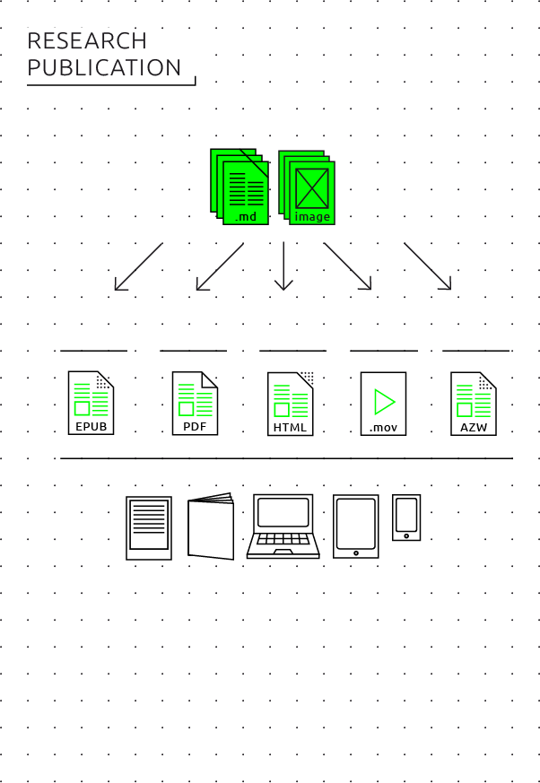
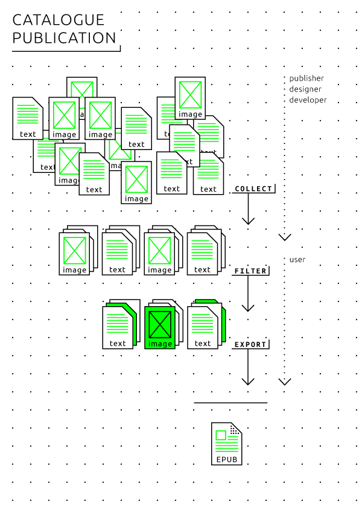
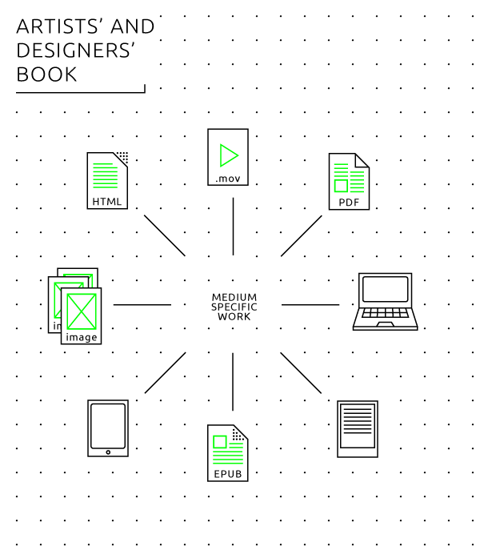
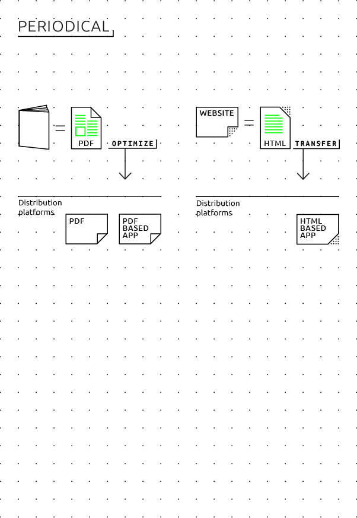

#8 Guide: Hybrid publishing for each genre 

 
- Research publications can be converted or adapted to electronic publishing in a relatively straightforward manner. This often involves working with document conversion software. 
- Enforcing clearly defined style guides for all contributors can help simplify the process of hybrid publishing. 
- Exhibition catalogues can best be broken up into micro-publications, thus making them more suitable for reading on electronic devices. If this is not an option, then PDF is usually a more suitable format than EPUB for such publications. 
- There is no 'standard recipe' for electronic artists' and designers' books. These books can be published in a wide variety of formats, even as plain-text files or animated GIFs. More conventional scenarios include publishing artists' blogs as ebooks. 
- PDF files and WordPress blogs are currently the two most common electronic publication formats for art and design periodicals. With the emergence of HTML5 and new distribution platforms such as Blendle, this field of publishing is currently in a state of ongoing transition. 

 

##General considerations 

Following the step-by-step guide to making a simple EPUB (chapter 6) <!-- internal link needed--> and the general introduction to workflows for hybrid publishing (chapter 7), <!-- internal link needed--> we will now address a number of considerations that are specific to each of the most common publication genres in the field of arts and culture, as described in chapter 3. <!-- internal link needed-->

The following points, which apply to all genres, should be clearly defined at the beginning of any hybrid publication project: 

* Will the publication be medium-specific or medium-neutral? In other words, is the project a one-to-one conversion of a print book into an electronic book, or will the project include content and design elements that can only be realized with electronic media? One should also consider that many of the advantages of a hybrid publishing approach, as pointed out earlier, lie in modularized or database publishing. By dividing a larger work into small modules or 'building blocks', it is easier to generate custom publications, to apply updates to some parts only, to replace 'heavy' high-resolution images or other media files with 'lighter' ones when necessary, etc. 
* Metadata is significantly more important in the context of hybrid publishing than it is in traditional print publishing. Carefully applied metadata will ensure that the publication can be found online in databases and bookstores such as Amazon, and will also make the electronic editing and design process more efficient. Especially in the case of modularized or database publishing, it is of utmost importance to start gathering metadata as early as possible in the production process. Otherwise it soon becomes impossible to meaningfully keep track of, and put together, the modular building blocks of the source document. 
* For publishers in the field of arts and culture, file sizes pose a fundamental problem: on one hand, electronic publication seems to offer new opportunities for including multimedia and other possibilities not provided by 'static' print publishing; on the other hand, in the real world this often results in files that will be too large to be downloaded, stored or 'flipped through' in a practical manner. 

When it comes to choosing a publication format, the following general recommendations should be kept in mind: 

* EPUB is a good choice for ebooks, less so for periodicals. EPUB potentially combines the advantages of PDF (single-file distribution) with HTML (reflowable/screen size-independent design, small file sizes, modularity/reusability, automation). 
* At the time of writing, HTML5 is theoretically the 'ideal' format. It is increasingly used in multimedia journalism (a good example is the report 'Snow Fall' published in the *New York Times* in December 2012 <!-- link to: <a href="http://www.nytimes.com/projects/2012/snow-fall/#/?part=tunnel-creek">http://www.nytimes.com/projects/2012/snow-fall/#/?part=tunnel-creek</a> --> ). However this poses three important problems for publishers: the format is not supported by ebook stores such as iBooks and Kobo; it lacks the rich metadata support of EPUB; and it requires technical workarounds in order to allow for single-file distribution. 
* PDF is the easiest format to integrate in existing workflows, but since it is essentially meant for print, it too has disadvantages when it comes to electronic publishing. It is a fixed-layout format, meaning that it does not dynamically reflow to adapt to different screen dimensions; it provides only rudimentary multimedia support; and the files can quickly become too large for the purposes intended. 

##Research publication 

In pragmatic terms, electronic research publishing in the near future will focus on converting print versions of conventionally designed papers, journals and textbooks into digital editions. The fact that research publications tend to have highly structured formatting and are mainly text-based makes them ideal candidates for modularization and database publishing. This can lead to new possibilities in which the electronic publication takes on new forms which are not possible in the print edition. 

###Workflows 
In print research publications, the typical workflow is as follows: 
* An editor works with the author(s) on the manuscript. 
* Several versions of the manuscript are passed back and forth between several people in different roles (editor, author, copy editor, designer). 
* The final version of the manuscript is established in a word processor (typically Microsoft Word) or a desktop publishing program (typically Adobe InDesign). 
* A graphic designer designs the publication in InDesign. 
* Corrections are made to the print proof and implemented in the InDesign file. 
* A PDF file of the corrected InDesign file is sent to the printer. 

In Chapter 6 <!-- internal link needed--> we described how to generate an electronic book based on an InDesign project. This requires a meticulous internal structuring of the InDesign document, something that is untypical for the typical workflow in book projects, and for which most graphic designers working with InDesign have not been trained. There is also another way to make use of the possibilities offered by hybrid publishing: rather than designing for print and then adding the electronic book as an afterthought at the end of the process, the publishing process is instead geared towards multiple output formats from the start. 

This new workflow allows for a hybrid output to various media (including print, ebook and web) and is centered on a single editorial and archival file format, a finalized version of the source document from which multiple outputs can be generated. Instead of a Word document which is further modified in InDesign - both of which are less than optimal formats for converting to EPUB - the editorial and archival file will instead be in a format that can easily be converted to InDesign for the print edition and to EPUB, MOBI or web for the electronic publication. As explained earlier in chapters 6 <!-- internal link needed--> and 7, <!-- internal link needed--> the most suitable format for this workflow is Markdown, augmented with the additional MultiMarkdown extension (which allows for footnotes, cross-references and bibliographies), and subsequent conversion to InDesign, EPUB and web, which is then a very straightforward procedure using the Open Source software tool Pandoc. 

 

A hybrid workflow, focused on print as well as electronic publications, offers a number of advantages: 

* Easy conversion into various electronic file formats. 
* The possibility of collaborative editing and revision control, using resources ranging from simple user-friendly tools such as wikis and blogs to sophisticated revision control systems such as Git and GitHub (originally used for software development by teams of programmers working internationally on large projects). 
* The possibility of adding elements other than text (videos, images, links) while keeping these separate from the main document files. This way, the size of the central editorial document remains very small, while images and videos in various resolutions for various publication media are easier to maintain. 
* Easy extraction of output derived from the book itself, such as abstracts, video book trailers, newsletters, or personalized electronic publications. 
* Easier extraction of parts of a publication which can then be published separately. 
* Independence from any particular software program (such as Word and InDesign). 
* Long-term archivability. 

###Style guide 
A new workflow will require taking a number of measures in order to ensure suitable source documents for publication. First of all, it is necessary to communicate the details of the workflow to all contributors (authors, editors, designers) involved in the publishing process. Publication style guides must be adjusted accordingly and must specify: 

* The file format to be submitted by contributors (for example: Markdown or .docx). 
* If the file format is .docx, contributors should be required to use predefined paragraph and character styles for all formatting (such as 'Heading 1', 'Heading 2', 'Quote', etc.), and to absolutely avoid any direct text formatting other than italic or bold. Microsoft provides [a useful introduction](https://support.office.com/en-us/article/Style-basics-in-Word-d382f84d-5c38-4444-98a5-9cbb6ede1ba4) on this subject. 
* Image style and format: only high-resolution images that are suitable for print but can also be downsized to lower resolutions for electronic publication. 
* Metadata to be provided by the contributors such as keywords, contact information, abstract, biography. 

There may also be different editorial criteria for the content in a hybrid workflow: 

* Different style of writing: 'writing for the web' vs. 'writing for print'. 
* The inclusion of interactive material, audio and video, as well as additional or other images for print. 
* Metadata to be added by the editor/publisher. (*Style Guide for Hybrid Publishing*) 

##Art/design catalogue 

The traditional workflow for an art/design catalogue is roughly the same as the InDesign workflow described for research publications, and focused on the production of one 'unified' book. The 'new' workflow however is based on a highly modularized publication process. The catalogue is built up of multiple modules or building blocks, for example different paintings, each with its own description, all following a standardized format. By considering these modules as separate entities and by storing, describing and tagging them as such, it becomes possible to generate customized publications using specific selections of the building blocks. 

 

This also provides a solution for the problem of the publication's file size. In most cases, due to current limitations in **bandwidth** and storage space, an art catalogue is difficult to convert one-to-one to an electronic publication which can be downloaded within a reasonable amount of time. Therefore it is advisable to split up the publication into smaller sub-publications, such as monographic micro-ebooks on single art works, or collections of articles from which each reader can individually choose, thereby automatically generating a customized ebook. Modularized content can also lead to different commercial strategies, for example by offering parts of a publication through an 'in-app' download. An example of this is a project by the Stedelijk Museum in Amsterdam, which resulted in the MyHighlights app. <!--internal link to 12--> 

On a more philosophical level, we may well wonder whether a catalogue in the traditional sense actually constitutes a desirable publication genre for electronic publishing. It is of course interesting and exciting to consider new forms of small and smart catalogues, such as the micro-ebooks mentioned above. However, we will have to wait for increased storage capacity on portable devices, as well as faster mobile network speeds, before we can start to enjoy the full potential of these new forms. Currently, producing a high-resolution electronic catalogue of 100 pages or more only really makes sense as a large PDF file designed for desktop computer viewing. 

###Workflows 

In the specific case of art and design catalogues, the following changes to the workflow should be taken into consideration: 

* Modularize the content and offer multiple small portions of a catalogue, i.e. one art work for each entry, separate images, videos, texts, etc. 
* Make sure that each module is tagged with relevant metadata as early as possible in the workflow; this is absolutely necessary in order to enable the selection and filtering process which will lead to the aggregation of the various modules for a specific ebook. 
* Create separate low-resolution and high-resolution versions of the EPUB files, for example through **server-side scripting**. This can also be used as a business model: offer the low-resolution book cheap or for free, and the high-resolution version for the regular price. 
* For a more or less direct conversion of a print book into an electronic publication, it may be a good idea to target only one specific reading platform (in most cases: tablets), simply because the market for the publication is often limited, and because there are still major technical constraints regarding practical file sizes, download times and development costs. In this case we would recommend PDF rather than EPUB if the publication/catalogue is primarily focused on images, since PDF offers a fixed (and thus limited but easy-to-design) image layout, and can be quickly generated from an InDesign project. When cost constraints play a central role in the decision-making process, it makes sense to focus on tablets and desktop computers since these currently provide the best screen resolution, color fidelity and reading comfort for image-oriented publications. PDF is also suitable for at least some degree of interactive and multimedia content. However, such a publication should be considered a short- to medium-term product which may become technically obsolete or outmoded within three to five years. The pragmatic advice for such a rather short-lived publication is to design for a 10" tablet screen with a resolution of 1024x768 to 1920x1080 pixels, to work in InDesign, and to create if necessary a customized new page layout for these specific screen dimensions. For possible small additions of interactive and multimedia elements, consider using Adobe Acrobat Pro as a final authoring tool, but be sure to test whether the resulting PDF is also viewable in the default PDF viewing applications on iPad and Android devices. 
* For a custom electronic publication which isn't conceived as a print-to-ebook conversion but rather as a modularized hybrid publishing project, EPUB is the file format of choice since it is internally modular (being a ZIP archive of individual HTML files, images, fonts etc.). It is easy to generate an EPUB on demand from a database or a content management system (possibly in collaboration with a web developer and/or web designer) but it can be very difficult and costly to generate a high-quality PDF from the same source materials. 

Some practical tips: 

* Save text in the Markdown format, and make use of images in the highest resolution. 
* Use a tool like Pandoc to convert the Markdown document to EPUB and to any of the other file formats you will need once the source document has been consolidated. Test the EPUB file with several e-reader devices and applications, unpack (decompress) it and adjust the HTML and CSS if necessary, and then repack (compress) it into EPUB when these customizations are done. 

The step-by-step guides in the previous chapters provide a detailed description of how to use these tools. 

##Artists'/designers' book 

There is a rich tradition of artists' audio-visual electronic books, beginning in the 1990s with hypertext and interactive multimedia literary experiments on floppy disks, CD-ROMs, websites and mobile apps. The Electronic Literature Organization[^electronic-literature-organization] and the international research project ELMCIP[^elmcip] have extensively documented these historical developments. Much of this documentation can now be considered 'media archeology' since the multimedia formats have gradually become obsolete: CD-ROM applications that no longer run on contemporary computers, websites whose links or plug-ins are no longer working or no longer compatible with today's browsers, etc. This problem was actually greater in the 1990s and early 2000s, at a time when open, cross-platform multimedia standards barely existed. And yet, still today, the more complex the audio-visual materials contained in an electronic book, the less compatible it will be with various electronic reading devices, and the greater the number of technical updates it will likely require over the course of time. A good example of this problem is the massive use of Macromedia/Adobe Flash by 'e-lit' artists. 

More recently, artists' and designers' (print) books have grown from a niche phenomenon to a major genre within arts and design publishing. It could be argued that print books are increasingly becoming art or design objects in their own right, as electronic media is quickly replacing print as the standard carrier of generic, mundane information (such as telephone directories, dictionaries, or run-of-the-mill novels and non-fiction paperbacks). However, even before the days of the internet, artists' and designers' books were considered as conceptual design works or even sculptural objects. The more medium-specific an artists' book is, the less sense it makes to attempt to convert it one-to-one into an electronic book. For example, an electronic reproduction of Dieter Roth's sculptural book objects[^roth-book-art] would no longer be book artworks, but mere depictions of a book artworks. 

### Workflows 

<!-- the following image missing or wrong filename -->
 

Since the artists' book is not a defined genre, there is no such thing as a standard methodology or workflow. The whole spectrum of the medium can be used and experimented with. On the other hand, many contemporary artists, designers and media activists actively experiment with electronic publishing as a 'poor' (i.e. simple low-tech) medium of social sharing rather than a 'rich' visual and tactile medium; this is particularly the case in the context of artists' pirate book-sharing projects. 

For artists' and designers' books that are characterized by elaborate use of typography and images, the simplest possibility is to design electronic books as a series or sequence of page-size images which can be easily converted into screen-readable PDF, EPUB and HTML5 documents. This approach would be suitable for conceptual-visual artists' books as pioneered by the Californian artist Ed Ruscha in the 1960s[^ruscha-books]. This would require no drastic change of workflow, and can be standardized as described in the sections on the other genres. 

When creating an electronic artists'/designers' book, the editorial and design workflow - even if it is non-standard and continuously changing from one publication to the next - should nevertheless take into account the following considerations: 

* Consider first the specific medium being targeted: a print book will require a completely different approach than a mobile app, a web page, an EPUB, etc. 
* Depending on the final output medium, different input materials may be included or excluded. 
* An artists' ebook can be based on a 'media art' approach: experiments with computer/server-generated EPUBs, use of collage and cut-up methods, and generative art or appropriation art methodologies. (An early example is the Yes Men's appropriation of the World Trade Organization website, for which they used a self-designed software tool which automatically modified the content of the mirrored pages to suit to the Yes Men's own subversive purposes. The same could be done with electronic books.) 
* An artists' blog such as those found on **Tumblr** can quite easily be turned into an artists' electronic book.  
* Some artists have based their work on distribution processes such as Pirate Bay-style file sharing: existing books are scanned and quickly converted into downloadable ebooks, with an emphasis on spreading and on alternative ways of networking (such as person-to-person exchange of files on flash drives). 
* Electronic artists' books can be based on experimentation with existing easy-to-use authoring apps and online authoring platforms such as *The People's E-Book* or *KYUR8*. 
* Proprietary authoring tools and distribution platforms such as Apple's iBooks Author can be used out of pragmatic considerations (as pioneered by Paul Chan's artists' book publishing house Badlands Unlimited). However, this will greatly limit the scope of distribution as well as the long-term readability of the project, as was the case with CD-ROM and Flash multimedia books in the past. 
* Other standard file formats creatively used and abused as document formats for visual books include: **animated GIF** graphics files for the digital equivalent of flip books, **MP4** video files displaying a book with pages that turn by themselves, **MP3** audio files triggering abstract art on the volume meter display of an audio player, JPEG files with encoding artifacts of corrupted **bits**, etc.[^other-formats] Such files are relatively easy to create, and there are substantial communities of artists/designers actively working with such media. However, in most cases, the resulting works will only be viewable in web browsers, not on e-reader devices and applications. They also cannot be distributed through electronic bookstores. 
* Self-contained HTML/HTML5; using Pandoc, it is possible to store an HTML file and all its images and style sheets as one single, large file. 
* Plain (ASCII) text files: these were the standard medium for self-published electronic magazines ('e-zines') and electronic 'samizdat' (Soviet hand-copied underground) books from the 1970s to the early 1990s. Since the plain-text format has remained stable since 1963, this is in fact the most resilient form of experimental electronic publishing. The website [textfiles.com](http://www.textfiles.com) provides a rich archive of the plain-text electronic publishing subculture from the 1970s to the 1990s. 

##Art/design periodical 

Periodicals such as yearbooks and magazines are an important part of the art and culture publishing scene. Examples of influential electronic art periodicals include OPEN <!-- link to <a href="http://www.openthemagazine.com/">http://www.openthemagazine.com/</a> --> and e-flux <!-- link to <a href="http://www.e-flux.com/">http://www.e-flux.com/</a> -->. The spectrum includes everything from non-commercial websites or PDF publications, to academic and public magazines, to commercial websites and **app store** subscription models. At the moment, digital magazine publishing is in a process of gradually transitioning from traditional to new workflows. On a scale from traditional to new, offering a magazine as a downloadable PDF file is the most traditional solution, while turning a magazine into a website (running on a content management system such as WordPress) is the least traditional. All of these technical solutions are now finally mature after two decades of online news publishing. WordPress would be our standard recommendation for small-to-medium scale online news and journal publishing, since it is a highly developed, user-friendly, customizable and furthermore Open Source system. The main problem for publishing electronic periodicals is no longer the technology but rather the revenue model. 

Aside from revenue, the main editorial question is: should the publication still be considered as *one* medium, or is it better to give up entirely on the traditional system of periodical appearance in bundled issues? Alternatively, the model could be a continuously updated website (similar to a news website or a blog), or with a focus on providing single articles rather than bundled issues, based on search engine hits, social media recommendations, etc. The difference between a 'blog' and a 'magazine', however, is becoming increasingly difficult to define. 

###Workflows 

 

We distinguish between two major types of workflow, the first based on a print publication which is digitized for electronic distribution, the second based on the electronic medium itself, such as a website or blog which can make use of several distribution channels. 

* Print-based workflow: The magazine is designed and put together as a print publication, using desktop publishing software such as InDesign, and exported as a printable PDF. This PDF is then optimized for reading and/or downloading on the web, meaning that the file is often smaller and the publication is distributed on different platforms which allow for online PDF reading, such as Issuu and Scribd. <!-- internal link to ch. 5--> This provides a low-cost solution with a traditional revenue model (in-app purchase). We will not cover this field in detail here, as it is highly unstable and specific to certain countries and geographic regions. For large-scale periodicals, companies such as WoodWing offer (expensive) content management systems made for hybrid print/electronic publishing of magazines based on standard Adobe software and the PDF file format. 
* HTML5-based workflow: In the Netherlands and, thanks to a strategic investment by *The New York Times*, elsewhere in the world, the Dutch electronic news platform Blendle is currently gaining ground as an 'iTunes for newspapers and magazines'. It serves as an electronic newsstand where readers can purchase access to whole issues or single articles of all major newspapers and magazines available in their country, and is run as an open, publisher-neutral platform. It remains to be seen whether this model will provide a viable solution for smaller publishers or for selling (articles from) art periodicals. At the moment, it is too early to offer any practical recommendations on this subject. Currently, only small numbers of readers in the field of arts, design and culture are likely to be users of apps such as Blendle. 
* Web-based workflow: The magazine is a self-published website. There are many ways of building websites, but the easiest Open Source, free solution is to use a content management system like WordPress with a custom design template for your own publication. This allows you to have a responsive design that adapts to all available reading devices. An additional technical benefit is that this workflow allows you to have a structured database of everything ever published on the site, which is easy to use as a basis for exporting to custom publications such as downloadable ebooks, InDesign layout for print yearbooks, PDFs, a tablet app, etc. 

[^bookworks]: Carrión, Ulises. *The New Art of Making Books*, Aegean Editions, 2001. 
[^e-zines]: The Textfile Directory, <a href="http://www.textfiles.com/directory.html">http://www.textfiles.com/directory.html</a>. 
[^electronic-literature-organization]: Electronic Literature Organization, <a href="http://eliterature.org">http://eliterature.org</a>. 
[^elmcip]: Electronic Literature Knowledge Base, <a href="http://elmcip.net/knowledgebase">http://elmcip.net/knowledgebase</a>. 
[^PDF/A]: PDF/A stands for *archival PDF* and is an ISO standard originally formulated by Adobe in collaboration with non-profit organizations in the field of information management. As opposed to generic PDF, PDF/A requires that all fonts, references and color profiles must be fully embedded in a document, <a href="http://en.wikipedia.org/?title=PDF/A">http://en.wikipedia.org/?title=PDF/A</a>. 
[^other-formats]: Used as a medium of artistic experimentation among by various artists and designers, including net artists since the 1990s, and also by the conceptual poet and UbuWeb founder Kenneth Goldsmith. 
[^roth-book-art]: Electronic reproduction of Dieter Roth's sculptural book objects, <a href="http://www.moma.org/visit/calendar/exhibitions/129">http://www.moma.org/visit/calendar/exhibitions/129</a>. 
[^ruscha-books]: Ed Ruscha’s conceptual-visual artists’ books, <a href="http://www.artnet.com/artists/ed-ruscha/">http://www.artnet.com/artists/ed-ruscha/</a>. 
