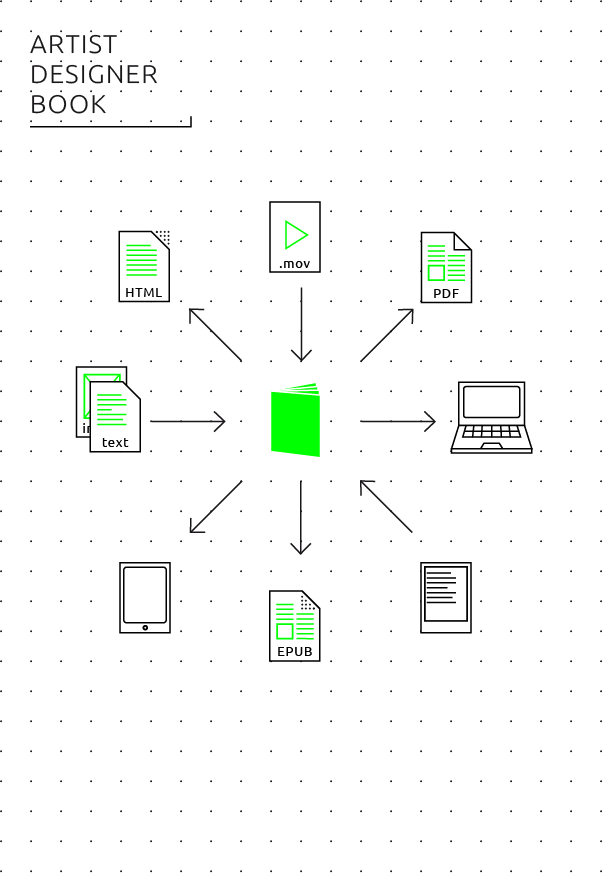

# 08 Guide: Epublications per Genre

## General questions

* One to one translation or defining the content with the medium in mind?
* Modularized / database publishing
* The importance of metadata - to be applied from the start of the production process
* The question of file size: image and multimedia use looks easy, but means a too heavy file in most cases.
* In short: hybrid publishing

## Research publication

<!-- moved paragraph to chapter 3. Miriam -->
Pragmatically and for the near future, electronic research publishing will mean the publishing of conventionally designed papers, journals and textbooks in electronic form. In other words, electronic research publishing will typically evolve around text-centered works which are issues on multiple platforms and in multiple formats. The highly structured internal setup research publications often have, make them suitable for modularization or database publishing.

### Workflows
In print research publications, the typical workflow looks like this:
* An editor works with the author(s) on the manuscript.
* Several versions of the manuscript are going back and forth between different people in different roles (editor, author, copyeditor, designer).
* The final version of the manuscript will be established in a word processing program (typically Microsoft Word) or desktop publishing program (typically Adobe InDesign).
* A graphic designer will design the publication in InDesign.  
* Corrections are made to the print proof and added in the InDesign file.  
* A PDF file of the corrected InDesign file goes to printer.

In Chapter 7 <!-- internal link needed-->we describe how to create electronic books from an InDesign project. However, this entails careful planning and meticulous internal structuring of the InDesign document that is untypical for the way book projects are being made today, and for which most graphic designers working with InDesign have not been trained. 

To make full use of the possibilities hybrid publishing has to offer, it is more advisable to change the conception of the publication from the beginning of the workflow, instead of adding the electronic book at the end, as a desired one-to-one translation of the work. 
 
We propose a new workflow that is directed towards diverse sources and hybrid output to various media (including print, ebook and web). It is centered around a single editorial and archival file format, a definitive version of the document that enables multiple output. Instead of a final Word file which is changed in InDesign - both of which are not very good formats to convert to EPUB – the editorial and archival file will be in a format that can easily translate into InDesign for the print edition and EPUB / mobi / web for the electronic publication. The most suitable format for this is Markdown with the MultiMarkdown extensions - because it allows footnotes, cross-references and bibliographies, and translation to InDesign, EPUB and web is very straightforward using the open source software tool pandoc.

 

<!-- Image: will be updated with new version -->

A hybrid workflow geared towards epublications as well as print, offers a number of advantages:

* Easy translation into various electronic file formats, as explained above.
* User-friendly tools like wikis and blogs can be used for collaborative editing and revision control, leading up to even more sophisticated systems like Git and GitHub (traditionally used for software development by large teams of programmers distributed over the whole world).
* Adding elements other than text (videos, images, links) while keeping them separate from the document file. This prevents gigantic file sizes of the central editorial document. It also makes it easier to maintain images and videos in different resolutions for different publication media. 
* Easy extraction of derived output from the book itself, such as abstracts, video book trailers, newsletters, personalized epublications; easier extraction of parts of a publication that will be separately published.
* Independence from one particular software program (such as Word and InDesign), long-time archivability.

### Style guide
A new workflow requires certain actions to obtain the suitable input for the publication. First of all, it is necessary to communicate this to all contributors (authors, editors, designers) in the publishing process. <!--internal link to chapter 6. And check if it is not double - Miriam--> Publication style guides must be adjusted accordingly and specify:

* the file format to be delivered by contributors (for example: Markdown, or .docx pending later conversion and formatting clean-up);
* in case of .docx, the author should be required to use defined paragraph and character styles for all formatting (such as 'header 1', 'header 2', 'quotation' etc.) - and to strictly avoid direct formatting of text other than italics or bolds. Microsoft provides [a useful introduction](https://support.office.com/en-us/article/Style-basics-in-Word-d382f84d-5c38-4444-98a5-9cbb6ede1ba4) on this;
* image style and format; high-resolution images that are suitable for print but can be downsized to lower resolutions for electronic publication;  
* metadata the author needs to provide such as keywords, contact information, abstract, biography.

Editorial criteria for the content can also differ in a hybrid workflow:  

* differents style of writing, 'writing for the web' vs. 'writing for print';  
* the inclusion of interactive material, more or other images than can be published in print, video, audio, etc.
* metadata to be added by the editor/publisher.

## Art/design catalogue

 

The traditional workflow for an art/design catalogue is roughly the same as the InDesign workflow described for the research publication, directed at the production of one integral book. The new workflow on the contrary, is based on a highly modularized publication process. The catalogue is built up of multiple modules or building blocks, for example different paintings with a description, following a standardized format. When these modules are treated as separate entities, and stored, described and tagged as such, it will be possible to cater for customized publications using only a selection of the building blocks.

This also provides with a solution for the problem of the size of the publication. In most cases, with contemporary standards in bandwith and storage space, an art catalogue is difficult to translate one-to-one to an electronic publication, simply because of file sizes. It is therefore advizable to split the whole up into smaller publications, such as monographic micro-ebooks on single art works, or collections of articles that each reader can individually choose from and obtain as an automatically customized ebook. Moreover, modularized content can lead to different commercial strategies, for example by offering parts of a publication through an in-app download. An example of this is the Stedelijk Museum project. <!--internal link to 12-->

An important question to ask in the background is whether a catalogue in the traditional definition provides for a desirable publication format for epublishing. Perhaps it is better to firstly think up new forms of small and smart catalogues such as the micro-ebooks mentioned' or, secondly, wait for more device storage capacity and network speed to arrive in the future. At the moment, producing a 100+ pages hi-resolution catalogue electronically makes sense only as heavy PDF files for desktop computer viewing. 

### Workflows

In the specific case of art and design catalogues, the following changes to the workflow should be taken into consideration:

* Modularize the content, giving multiple small portions of a catalogue, most evident one file per entry, separate images, videos, texts, etc.
* Make sure that from the start of the workflow each module is tagged with the significant metadata; this is absolutely necessary for the selection and filtering process which leads to the aggregation of the modules in a specific ebook.
* Create separate low-res and hi-res versions of the EPUB files, for example by using (computer) **server-side scripting**. This can also be used as a business model: offer the low-res book cheap or for free, and the hi-res book at normal price. 
* For a more or less direct translation of a print book into an electronic publication it can be wise to target one reading medium (in most cases: tablets).<!--why? Miriam--> In that case consider PDF over EPUB if the focus is on images, because PDF offers a fixed layout for image composition.<!--In the workflow visualization there is no mention of PDF. Miriam--> Small additions of interactive and multimedia elements are valid options.  However, such a project should be considered a short- to medium-term project that might have become technically obsolete/outmoded in three to five years.<!-- Target a 10" tablet screen with a resolution between 1024x768 and 1920x1080. Work in InDesign, and make - if necessary - a customized new page layout that fits these dimensions. Consider small additions of interactive and multimedia elements by using Adobe Acrobat Pro as a final authoring tool. (This is part of the Adobe Creative Suite). >> Isn't this too specific? Needs argumentation at least. Miriam-->
* For a custom epublication that isn't conceived as a print-to-ebook translation but as a hybrid publishing project using modularization, EPUB is the file format of choice because it is internally modular (being a zip archive of individual HTML files, images, fonts etc). This can be developed into a database or content management system. <!--Have a web developer program a simple custom server application that can customize, zip and upload an EPUB file according to a user's web form input. Also consider generating this EPUB from a database/content management system. >> Needs examples. Do we really want to put it like that: get a web developer? Miriam-->

<!-- Practical pointers:

* consolidate text in Markdown, consolidate images in highest resolution;

* for EPUB and HTML5: use thumbnails for images in order to avoid excessive file sizes and convert with Markdown, employ designer;

* employ editorial/interaction designer to think up new publication format.

Pia: I dont think this is finished yet right?

Miriam: I have a problem with giving as final advice: employ these and those experts. That's precisely not the point of the book I'd think?-->

## Artist/designer book 
<!--less oriented from publishers perspective. Loes might have a proposal. //1000 words //Florian-->
 

The traditional way of handling an artist/designer book is to view it as a conceptual design object or even sculptural object.

A new workflow should take into account the following points:

- It is possible to make a book simply as a series of page-size images, that can be easily converted into screen-readable PDF, EPUB and HTML5.

- Look at visual tools like Calibre and The People's Ebook, or authoring/sharing apps such as KYUR8 <!--pia: Why? what do these do??-->

- Use Liz Castro's recipe for turning an artists'/designer's tumblr into downloadable artists' ebooks <!--Pia: Liz castro's receipe is unclear, what is this where can it be found? -->

- Media artist approach: experiment with computer/server-generated epub, using collage/cut-up methods, generative or appropriation art recipe (similar to the Yes Men's "Ream Weaver" web site mirroring tool)

- Pirate site approach: easy conversions of publications into ebooks, emphasis on spreading, and alternative ways of networking (such as person-to-person USB stick file exchange.

- Since the artists' book is not a defined genre, any methodology / workflow that can be thought of

### Instructions

<!-- Pia see Headers above, section is not finished -->

<!--Florian's text:-->

Lately, artists' and designer's books have grown from a niche phenomenon to a major genre within arts and design publishing. It could be argued that the book as an art or design object in its own right has become more prominent now that the function of the book as a generic carrier of information (such as in a telephone directory, a dictionary or a run-of-the-mill novel or non-fiction paperback) is increasingly taken over by the World Wide Web and by ereaders. 

#### Transfer from paper to electronic?

The more medium-specific an artist's book is, the less sense it makes to translate it 1:1 into an electronic book. Dieter Roth's sculptural book objects <!--Pia: insert footnote-->, for example, would change from book art works to mere depictions of book art works when reproduced electronically. 

On the other hand, many contemporary artists, designers and media activists experimented with electronic publishing as a 'poor' (i.e. simple low tech) medium of social sharing rather than a 'rich' visual and tactile medium:

* In the 1980s and early 1990s, many makers of zines (do-it-yourself small press periodicals) became makers of _e-zines_, electronic zines that used dial-up computer bulletin boards and the Internet as noncommercial samizdat media. Their typical publication format were simple plain text files.[^e-zines] Many e-zines worked around their technical limitations by using ASCII art, typograms as they had also been produced in 1960s and 70s concrete poetry on typewriters, and with homebrew formatting codes ('_' for underlines, '#' for headlines etc.), the immediate precursors of the Markdown format described here in this toolkit.
* In the early 1990s, there also existed a hacker culture of 'disk mags' for the Commodore Amiga and Atari ST home computers. These electronic magazines were anonymously published on floppy disks and were based on self-written computer programs (factually, early 'apps') that displayed their animated text and visual contents.
* Since the late 1990s, there have been a number of artist-run sites * textz.com, ubu.com, aaaaarg.org, monoskop.org - that offer free downloads of cultural theory and arts-related books, typically in simple formats such as plain text, PDF and EPUB.
In these examples, the focus is not on the book as a visual object, but on concepts and politics of its sharing and dissemination; in other words, artists' publishing as electronic samizdat. In such scenarios, artists' publishing as simple 1:1 transfers from print originals to electronic reproductions can make sense.

##### Technical solutions for samizdat publications <!--Pia: introduce term samizdat pls -->

For such activist or minimalist projects, the lowest technical denominator and most easily readable file formats are advisable:

* plain text (ASCII) as the most simple, compatible and minimalist solution
* single-file HTML. It is possible to directly embed images into an HTML file (without providing them as separate files); technical instructions can be found [here](...). <!--Amy: empty link! -->
* PDF. This format is widely readable and best suited for faithfully reproducing print books, but limited in its readability on different devices and hardly editable (more explanation [here](...)).<!--Amy: empty link! -->
* EPUB. This format is factually just HTML for offline reading, with improved publication meta data and improved compatibility to ereaders. Projects can very easily be made and provided both in HTML and EPUB.
Since the design of most samizdat books does not differ from that of [research publications](#Research publication) or other visually simple publishing formats, no special design advice is necessary here, except the principle of 'worse is better': the smaller the file size, the most compatible and universally readable the file format, the better, even if this comes at the expense of typographic and visual quality. An plain text files, then, might be preferable to a nicely designed PDF file. <!-- Silvio suggests also to focus on the technical solution for  sharing texts, like etherpad, textb.org -->

#### How to make visually oriented artists' books

##### Pre-history and general issues

There is, factually, a rich tradition of artists' audiovisual electronic books: It began in the 1990s with hypertext and interactive multimedia literary experiments on floppy disk, CD-ROMs, later web sites and mobile apps. The Electronic Literature Organization[^electronic-literature-organization] and the international research project ELMCIP[^elmcip] document it extensively. Much of this documentation has become media archeology since multimedia formats have become obsolete: CD-ROM applications that no longer run on contemporary computers, websites whose links or plug-ins are no longer working or not compatible to today's browsers anymore. 

This problem was greater in the 1990s and early 2000s when working open, cross-platform multimedia standards barely existed. But even today, the rule explained in chapter ... <!-- cross-reference to Arjen's overview graph of non-visual vs. visual epublishing technologies--> still applies: The more complex the audiovisuality of an electronic book, the less compatible it will be to all kinds of different electronic reading devices, and the more technical updates it will likely need over the course of time. <!-- Silvio: This problem was also exemplified by the massive use of Flash by e-lit artists --> 

##### Simple solutions

Electronic visual books can be made in very simple ways:

* As a sequence of images, embedded into an EPUB file <!-- add reference-->, a self-contained HTML file <!-- add reference--> or a PDF file.
* As a PDF file. This is generally the most easy-to-use straightforward format for visual publications in a universally working format. However, for long-time durability, the PDF/A format is preferable to run-of-the mill PDF.[^PDF/A]  PDF documents can be graphically designed to work on different screen sizes, and resolution of embedded visuals can be decreased to keep the file size friendly for downloading. Still, the format is essentially limited to fixed document sizes and remains an electronic representation of printed matter. 
* Other standard file formats creatively (ab)used as document formats for visual books: animated GIF graphics files for the digital equivalent of flip books, for example, **mp4** video files displaying a real-time book, mp3 audio files triggering abstract art on the volume meter display of an audio player, JPEG files with encoding artefacts of corrupted bits.[^other-formats] <!-- should this be mentioned as simple? not all of these formats work on e-readers. mention reference to image of Arjen or overview of strengths and weaknesses -->
* Self-contained HTML. <!-- explain the use of self-contained HTML with base64-->

(- iBooks author: medium solution between EPUB and PDF: example Badlands Unlimited)

(- self-contained HTML5)

(- EPUB2, EPUB3)

(- plain text: e-zines, BBS era ebooks, typograms/typoscripts) 

(- Problem with it: distribution, books only available in the Apple ecosystem)

## Art/design periodical

- Art OPEN Magazine of e-Flux journal, advise to use the web, instead of EPUB. 

- Non-commericial website / PDF 

- Academic magazine (jStor) 

- Public Magazine 

- Commercial / app store model. <!--1000 words -->

### General
 

(a) magazine as downloadable PDF file; 

(b) magazine as PDF-based app in a tablet, via commercial app platform (such as Scribd or Issuu) or PDF-to-app software. Low-cost solution with a traditional revenue model (in-app purchase). Commercial authoring solution: Woodwing.

(c) magazine as HTML5-based publication in a platform app. Commercial distribution platform solution: Blendle.

(d) magazine as self-published website. Best solution: CMS like WordPress, with custom design template. Most independent magazines work this way, but revenue model is difficult. Additional technical benefit: structured database of everything ever published on the site, easy to use as a basis for exporting to custom publications (downloadable e-books, InDesign layout for print yearbooks - see Elizabeth Castro's chapter - etc.)

### Decision making
Should it be a 1:1 transfer from paper book to e-journal? There are now gradual transitions from traditional to new workflows in digital magazine publishing which break up the old-vs-new dichotomy. On this scale, providing a magazine as a downloadable PDF file is the most traditional solution, and turning the magazine into a website (running on a content management systems such as WordPress) the least traditional. On the upside, all these technical solutions are now mature thanks to 20 years of online news publishing.

### Instructions
See above. 

### Specific issues for this publication type
The main issue is to which extent the integrity of the publication as _one_ medium is important, or whether to entirely give up the traditional system of periodical appearance in bundled issues. Alternatively, the model could be (a) a continuously updated web site (similar to a news website or a blog), (b) focus on providing single articles rather than bundled issues based on search engine hits, social media recommendations etc. In the end, there is no hard difference between a "blog" and a "magazine" online.

### Based on the above, what to choose?

How to make an arts/design periodical in epub2/3, HTML5 (/app), PDF

A step-by-step guide

Advantages, disadvantages:

- epub2/3 is, at the moment, an esoteric choice for a magazine and would be rather an option for scholarly journals. However, if cleverly used, it can combine advantages of PDF (single file distribution) with HTML (responsive design, small file sizes, modularity/reusability, automation).
- HTML5: theoretically ideal, gets increasingly used for multimedia journalism (following the example of the "Snow Fall" reportage by the New York Times from December 2012. Problem of design complexity when making 'responsive' design pages.
- PDF: easiest to integrate in existing workflows, disadvantage: clumsy, non-responsive, high file size, meant for print.

[^bookworks]: Carrión, Ulises. The New Art of Making Books, Aegean editions, 2001.

[^e-zines]: The Textfile Directory, http://www.textfiles.com/directory.html.

[^electronic-literature-organization]: Electronic Literature Organization, http://eliterature.org.

[^elmcip]: Electronic Literature Knowledge Base, http://elmcip.net/knowledgebase. 

[^PDF/A]: PDF/A stands for _archival PDF_ and is an ISO standard originally crafted by Adobe in collaboration with non-profit organizations for information management. As opposed to generic PDF, PDF/A requires that all fonts, references and color profiles are fully embedded into a document, http://en.wikipedia.org/?title=PDF/A.

[^other-formats]: Used as a medium of artistic experimentation among others by net artists since the 1990s and by conceptual poet and Ubuweb founder Kenneth Goldsmith. 

