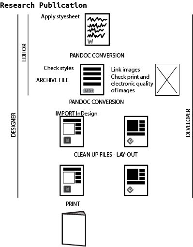
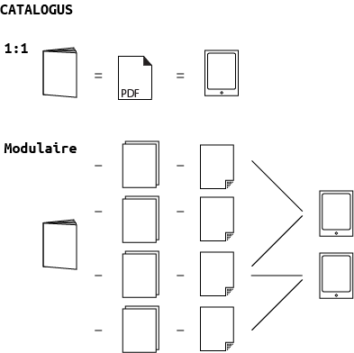
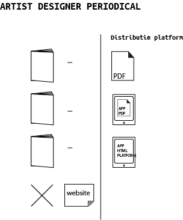

# 08 Guide: E-publications per genre

## General questions
<!--Visual by Arjen--> <!-- This is already added to chapter 5. What is the purpose of that visual in this chapter? what should it depict? (kimmy asked this question)-->

## [Research publication](id:Research publication)
### General
Traditional, print oriented workflow for text-centred works, with additional illustrations / videos / resources online, and extended referencing and/or indexing  
See Kimmy's visualized workflow for the INC, which will be generalized for [research-type publications](researchlikepub.html) 

* Editor works with author(s) on manuscript  
* Several versions going back and forth between different people in different roles (editor, author, copyeditor, designer)  
* Final version of the text will be in a text editor or Microsoft Word format  
* This is then designed in InDesign  
* Corrections made to the print proof and added in the InDesign file  
* Certified PDF goes to printer  
* How to make an electronic publication from InDesign - this is the big problem. Going from InDesign to electronic publication is not easy and needs a lot of manual work

*New workflow*  
This is why the new workflow is directed towards **hybrid input** and **hybrid output** - which leads to a **workflow that is also hybrid**, but centered around **a single 'archive format'** - the definitive version that enables multiple output. 

<!-- pia: this is why? unclear-->

So instead of having a final text file (e.g. Word) which is changed in InDesign - both of which are not good formats to convert to an EPUB – the storage / archive file has to be in a format that can translate into InDesign for the print edition and EPUB / mobi / web for the e-publication. The most suitable format for this is **html** - because it allows footnotes (which Markdown does not). The html can easily be converted to EPUB, though not so easily to InDesign... (working on this) <!-- Also check <a href="http://digitalpublishingtoolkit.org/2014/05/import-html-into-indesign-via-xml/">http://digitalpublishingtoolkit.org/2014/05/import-html-into-indesign-via-xml/</a> --> <!-- Kimmy: I thought we are promoting markdown as archival file and not html? markdown to indesign is very straightforward using pandoc -->

Flow chart: workflow -
 <!-- very rough sketch -->

### Decision making

**Should it be a 1:1 transfer from paper book to ebook?**  
This is the traditional view.  
The book is a unique, one off publication.  
A lot of different people working on separate parts of the project, but all towards one single goal: the end product, mostly print, sometimes translated 1:1 to an ebook.

With text oriented files this may seem the most straightforward, maybe even the only useful way. There is not more than text, perhaps accompanied by a couple of images. Most important is e.g. to get references right, and a nice advantage is that making an index will be much easier digitally.

**What are alternative possibilities?**  
What is possible when using a hybrid workflow, focused as much on e-publications as on print? (Next to having digital publications running naturally from the workflow, instead of having to be forced out of the print oriented workflow, of course)  

* Version control can be more transparant   
* Adding elements other than text (videos, (color) images, links)  
* Extracting outputs from the material different from the book itself, such as abstract, booktrailers, personalized e-publications  
* Better archiving as one can keep the structure of the text as well
* ...

### Instructions

**How to adjust the style guide?**  
The decision about the desired output leads to certain steps to get the right input. First of all it is therefore necessary to communicate this to the authors and others involved in the publishing process. Adjust your style guide which is leading in the communication with authors/designers/programmers etc.

Specify for example:  

* file format - for example, if you are following the proposed workflow, request the file to be sent in either html directly (which can be converted into EPUB) or docx (which can be easily converted into html)  
* image style and format - while the print book has b/w pictures, <!-- Amy: I don't quite understand this point. a printed research  publication can also have color images --> the ebook enables color images; print requires large quality 300 dpi .tiff images, while these may be too heavy for an electronic publication, skyrocketing the size of the book, which is bad for download / and or storage space on an ereader.
* formatting styles - use Header 1 style for title and author, Header 2 for article sections and Header 3 for subsections <!-- The structuring in programs like Microsoft Word might need a bit more explanation? or at least a link to a website which clearly explains how to work with this ^kimmy --> 
* URL style - full URLs should be clickable but not stylized as links (color or underlining)  
* What kind of metadata does the author have to provide - e.g. keywords, contact information, abstract, biography     
* an extended example of a style guide adjusted for a hybrid workflow can be found in the appendix <!-- Is this possible and desirable? ^Miriam -->

**What metadata to add?** <!-- shouldn't we explain why you need to add this metadata? Or is this explained elsewhere? if so add a link to that. -->
Make a list of metadata to be added to the texts  

* metadata provided by the author(s)  
* metadata added by the editor/publisher
* an extended example of a metadata list adjusted for a hybrid workflow can be found in the appendix <!-- Is this possible and desirable? ^Miriam -->

**Do editorial criteria regarding the content change?**  
Editorial criteria for the content can also differ in a hybrid workflow and depending on the desired output and the answer to the question of the relationship between the print and electronic edition:  

* (not discussed in this guide) consider another style of writing, 'writing for the web'   
* is interactive material needed, more or other images than can be published in print, video, audio, etc.  

### Specific issues for this publication type
Important issues in the hybrid workflow for research publications ar
1. the editorial process, with comments and copyediting
2. footnotes and referencing

### Based on the above, what to choose?

 
How to make a research publication in EPUB2/3, HTML5 (/app), PDF

A step-by-step guide

<!---Converting a Docx directly to EPUB using Calibre (post Silvio). It was superseded by Florian's respective section on docx conversion with pandoc-->

Pressbooks as an example of available open source tools? (post Silvio)

From InDesign - when it's 1:1 use the certified PDF that goes to the printer, downsized when needed.  

Possibilities for reading online: Scribd, Issuu, in-browser reading

Advantages, disadvantages

## Art/design catalogue
Catalogue Digital Approaches
 <!-- very rough sketch -->

<!--4000 words-->

### General
traditional workflow = InDesign workflow as described before, production of one integral publication

vs. new workflow = highly modularized publication. 

### Decision making
Should it be a 1:1 transfer from paper book to ebook?, What are alternative possibilities?

In most cases, today, an art catalogue is difficult to translate 1:1 to an electronic publication, simply because of file sizes. It's advisable to split it up into smaller publications, such as monographic micro-ebooks on single art works, or collections of articles that each reader can individually choose and obtain as an automatically customized e-book.

### Instructions
1:1 translation into electronic publication: target one reading medium (in most cases: tablets). Strongly consider PDF over EPUB if the focus is on images, and image composition requires a fixed layout. Target a 10" tablet screen with a resolution between 1024x768 and 1920x1080. Work in InDesign, and make - if necessary - a customized new page layout that fits these dimensions. Consider small additions of interactive and multimedia elements by using Adobe Acrobat Pro as a final authoring tool. (This is part of the Adobe Creative Suite). Consider this project a short- to medium-term project that might have become technically obsolete/outmoded in 3-5 years.

Custom translation into modularized publications: EPUB is the file format of choice because it is internally modular (being nothing more than a zip archive of individual HTML files, images, fonts etc). Have a web developer program a simple custom server application that can customize, zip and upload an EPUB file according to a user's web form input. Also consider generating this EPUB from a database/content management system (see previous chapter xxx).

### Specific issues for this publication type
Above all: file size because of number and resolution of included images.
Solutions: 

- Modularize content (by in-app download, see Stedelijk project)

- Create separate low-res and hi-res versions; can also be used as a business model (gratis or cheap low-res book, pay for hi-res book). Explain how on-the-fly resolution adjustment is easy with epub (using server-side scripting for resizing images and zipping the epub file), not so easy with PDF.

- Question/issue: Is a catalogue in the traditional definition a desirable publication format for e-publishing, or do we (a) have to think up new forms of small/smart catalogues, or (b) wait for more device storage capacity and network speed to arrive in the future? At the moment, producing a 100+ pages hi-resolution catalogue electronically does not make sense, except as heavy PDF files for desktop computer viewing.

### Based on the above, what to choose?

How to make an art/design catalogue in EPUB2/3, HTML5 (/app), PDF

A step-by-step guide

- Consolidate text in Markdown, consolidate images in highest resolution

- For EPUB and HTML5: Use thumbnails for images in order to avoid excessive file sizes, convert with Markdown, employ designer

- Employ editorial/interaction designer to think up new publication format

Advantages, disadvantages

## Artist/designer book <!--less oriented from publishers perspective. Loes might have a proposal. //1000 words //Florian-->

<!--  -->

Flow chart: workflow

### General
traditional vs new workflow

Traditional workflow: book as conceptual design object or even sculptural object

New workflows:

- make a book simply as a series of page-size images, can be easily converted into screen-readable PDF, EPUB and HTML5

- Look at visual tools like Calibre and The People's Ebook, or authoring/sharing apps such as KYUR8

- Use Liz Castro's recipe for turning an artists'/designer's tumblr into downloadable artists' ebooks

- media artist approach: experiment with computer/server-generated epub, using collage/cut-up methods, generative or appropriation art recipe (similar to the Yes Men's "Ream Weaver" web site mirroring tool)

- pirate site approach: quick & dirty conversions of publications into ebooks, emphasis on spreading, and alternative ways of networking (such as person-to-person USB stick file exchange, as described in Henry Warwick, Radical Tactics of the Offline Library)

- since the artists' book is not a defined genre, any methodology / workflow that can be thought of

### Decision making
Should it be a 1:1 transfer from paper book to ebook?, what are alternative possibilities?

### Instructions
How to adjust the style guide? What metadata to add? Do editorial criteria regarding the content change?

### Specific issues for this publication type

### Based on the above, what to choose?

How to make an arts/design periodical in EPUB2/3, HTML5 (/app), PDF

A step-by-step guide

Advantages, disadvantages

<!--Florian's text:-->

Lately, artists' and designer's books have grown from a niche phenomenon to a major genre within arts and design publishing. It could be argued that the book as an art or design object in its own right has become more prominent now that the function of the book as a generic carrier of information (such as in a telephone directory, a dictionary or a run-of-the-mill novel or non-fiction paperback) is increasingly taken over by the World Wide Web and by ereaders. 

The history of artists' books - or 'bookworks',[^bookworks] as the Mexican-Dutch writer and visual artist Ulises Carrión called them  - is often traced to the beginnings of concrete poetry, Fluxus and conceptual art, and the artists' books (and book-like objects) made among others by Dieter Roth and Ed Ruscha. But one could just as well include the Bauhaus book series ('Bauhausbücher') of the 1920s, earlier Dadaist and Futurist pamphlets and self-published books, the books made in the 19th century Arts and Crafts movement and even 16th century illustrated books like Sebastian Brant's and Albrecht Dürer's 'Ship of Fools' that were crafted in workshop collaborations between writers, visual artists and printmakers.

The common denominator of these books is that they defy easy categorization and genre characteristics, making it difficult to give standard recommendations for their design as electronic books. 

#### Transfer from paper to electronic?

The more medium-specific an artist's book is, the less sense it makes to translate it 1:1 into an electronic book. Dieter Roth's sculptural book objects, for example, would change from book art works to mere depictions of book art works when reproduced electronically. 

On the other hand, many contemporary artists, designers and media activists experimented with electronic publishing as a 'poor' (i.e. simple low tech) medium of social sharing rather than a 'rich' visual and tactile medium:

* In the 1980s and early 1990s, many makers of zines (do-it-yourself small press periodicals) became makers of _e-zines_, electronic zines that used dial-up computer bulletin boards and the Internet as noncommercial samizdat media. Their typical publication format were simple plain text files.[^e-zines] Many e-zines worked around their technical limitations by using ASCII art, typograms as they had also been produced in 1960s and 70s concrete poetry on typewriters, and with homebrew formatting codes ('_' for underlines, '#' for headlines etc.), the immediate precursors of the Markdown format described here in this toolkit.
* In the early 1990s, there also existed a hacker culture of 'disk mags' for the Commodore Amiga and Atari ST home computers. These electronic magazines were anonymously published on floppy disks and were based on self-written computer programs (factually, early 'apps') that displayed their animated text and visual contents.
* Since the late 1990s, there have been a number of artist-run sites * textz.com, ubu.com, aaaaarg.org, monoskop.org - that offer free downloads of cultural theory and arts-related books, typically in simple formats such as plain text, PDF and EPUB.
In these examples, the focus is not on the book as a visual object, but on concepts and politics of its sharing and dissemination; in other words, artists' publishing as electronic samizdat. In such scenarios, artists' publishing as simple 1:1 transfers from print originals to electronic reproductions can make sense.

##### Technical solutions for samizdat publications

For such activist or minimalist projects, the lowest technical denominator and most easily readable file formats are advisable:

* plain text (ASCII) as the most simple, compatible and minimalist solution
* single-file HTML. It is possible to directly embed images into an HTML file (without providing them as separate files); technical instructions can be found [here](...). <!--Amy: empty link! -->
* PDF. This format is widely readable and best suited for faithfully reproducing print books, but limited in its readability on different devices and hardly editable (more explanation [here](...)).<!--Amy: empty link! -->
* EPUB. This format is factually just HTML for offline reading, with improved publication meta data and improved compatibility to ereaders. Projects can very easily be made and provided both in HTML and EPUB.
Since the design of most samizdat books does not differ from that of [research publications](#Research publication) or other visually simple publishing formats, no special design advice is necessary here, except the principle of 'worse is better': the smaller the file size, the most compatible and universally readable the file format, the better, even if this comes at the expense of typographic and visual quality. An plain text files, then, might be preferable to a nicely designed PDF file. <!-- Silvio suggests also to focus on the technical solution for  sharing texts, like etherpad, textb.org -->

#### How to make visually oriented artists' books

##### Pre-history and general issues

There is, factually, a rich tradition of artists' audiovisual electronic books: It began in the 1990s with hypertext and interactive multimedia literary experiments on floppy disk, CD-ROMs, later web sites and mobile apps. The Electronic Literature Organization[^electronic-literature-organization] and the international research project ELMCIP[^elmcip] document it extensively. Much of this documentation has become media archeology since multimedia formats have become obsolete: CD-ROM applications that no longer run on contemporary computers, websites whose links or plug-ins are no longer working or not compatible to today's browsers anymore. 

This problem was greater in the 1990s and early 2000s when working open, cross-platform multimedia standards barely existed. But even today, the rule explained in chapter ... <!-- cross-reference to Arjen's overview graph of non-visual vs. visual epublishing technologies--> still applies: The more complex the audiovisuality of an electronic book, the less compatible it will be to all kinds of different electronic reading devices, and the more technical updates it will likely need over the course of time. <!-- Silvio: This problem was also exemplified by the massive use of Flash by e-lit artists --> 

##### Simple solutions

Electronic visual books can be made in very simple ways:

* As a sequence of images, embedded into an EPUB file <!-- add reference-->, a self-contained HTML file <!-- add reference--> or a PDF file.
* As a PDF file. This is generally the most easy-to-use straightforward format for visual publications in a universally working format. However, for long-time durability, the PDF/A format is preferable to run-of-the mill PDF.[^PDF/A]  PDF documents can be graphically designed to work on different screen sizes, and resolution of embedded visuals can be decreased to keep the file size friendly for downloading. Still, the format is essentially limited to fixed document sizes and remains an electronic representation of printed matter. 
* Other standard file formats creatively (ab)used as document formats for visual books: animated GIF graphics files for the digital equivalent of flip books, for example, mp4 video files displaying a real-time book, mp3 audio files triggering abstract art on the volume meter display of an audio player, JPEG files with encoding artefacts of corrupted bits.[^other-formats] <!-- should this be mentioned as simple? not all of these formats work on e-readers. mention reference to image of Arjen or overview of strengths and weaknesses -->
* Self-contained HTML. <!-- explain the use of self-contained HTML with base64-->

(- iBooks author: medium solution between EPUB and PDF: example Badlands Unlimited)

(- self-contained HTML5)

(- EPUB2, EPUB3)

(- plain text: e-zines, BBS era ebooks, typograms/typoscripts) 

(- Problem with it: distribution, books only available in the Apple ecosystem)

## Art/design periodical

- Art OPEN Magazine of e-Flux journal, advise to use the web, instead of EPUB. 

- Non-commericial website / PDF 

- Academic magazine (jStor) 

- Public Magazine 

- Commercial / app store model. <!--1000 words -->

### General
 <!-- very rough sketch -->

(a) magazine as downloadable PDF file; 

(b) magazine as PDF-based app in a tablet, via commercial app platform (such as Scribd or Issuu) or PDF-to-app software. Low-cost solution with a traditional revenue model (in-app purchase). Commercial authoring solution: Woodwing.

(c) magazine as HTML5-based publication in a platform app. Commercial distribution platform solution: Blendle.

(d) magazine as self-published website. Best solution: CMS like WordPress, with custom design template. Most independent magazines work this way, but revenue model is difficult. Additional technical benefit: structured database of everything ever published on the site, easy to use as a basis for exporting to custom publications (downloadable e-books, InDesign layout for print yearbooks - see Elizabeth Castro's chapter - etc.)

### Decision making
Should it be a 1:1 transfer from paper book to e-journal? There are now gradual transitions from traditional to new workflows in digital magazine publishing which break up the old-vs-new dichotomy. On this scale, providing a magazine as a downloadable PDF file is the most traditional solution, and turning the magazine into a website (running on a content management systems such as WordPress) the least traditional. On the upside, all these technical solutions are now mature thanks to 20 years of online news publishing.

### Instructions
See above. 

### Specific issues for this publication type
The main issue is to which extent the integrity of the publication as _one_ medium is important, or whether to entirely give up the traditional system of periodical appearance in bundled issues. Alternatively, the model could be (a) a continuously updated web site (similar to a news website or a blog), (b) focus on providing single articles rather than bundled issues based on search engine hits, social media recommendations etc. In the end, there is no hard difference between a "blog" and a "magazine" online.

### Based on the above, what to choose?

How to make an arts/design periodical in epub2/3, HTML5 (/app), PDF

A step-by-step guide

Advantages, disadvantages:

- epub2/3 is, at the moment, an esoteric choice for a magazine and would be rather an option for scholarly journals. However, if cleverly used, it can combine advantages of PDF (single file distribution) with HTML (responsive design, small file sizes, modularity/reusability, automation).
- HTML5: theoretically ideal, gets increasingly used for multimedia journalism (following the example of the "Snow Fall" reportage by the New York Times from December 2012. Problem of design complexity when making 'responsive' design pages.
- PDF: easiest to integrate in existing workflows, disadvantage: clumsy, non-responsive, high file size, meant for print.

[^bookworks]: Carrión, Ulises. The New Art of Making Books, Aegean editions, 2001.

[^e-zines]: The Textfile Directory, http://www.textfiles.com/directory.html.

[^electronic-literature-organization]: Electronic Literature Organization, http://eliterature.org.

[^elmcip]: Electronic Literature Knowledge Base, http://elmcip.net/knowledgebase. 

[^PDF/A]: PDF/A stands for _archival PDF_ and is an ISO standard originally crafted by Adobe in collaboration with non-profit organizations for information management. As opposed to generic PDF, PDF/A requires that all fonts, references and color profiles are fully embedded into a document, http://en.wikipedia.org/?title=PDF/A.

[^other-formats]: Used as a medium of artistic experimentation among others by net artists since the 1990s and by conceptual poet and Ubuweb founder Kenneth Goldsmith. 

