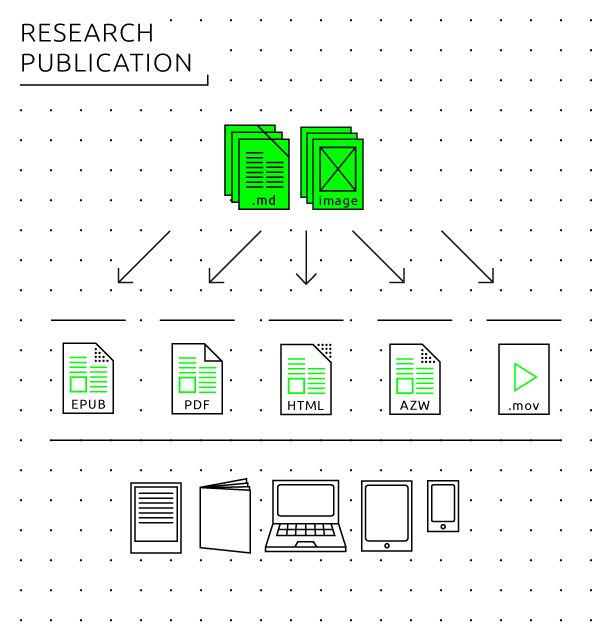
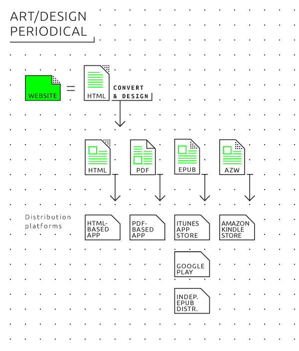

# 08 Guide: Hybrid publishing per genre 

## General questions 

After the step-by-step guide to making a simple EPUB and the general introduction into workflows for hybrid publishing, and the we will now address some questions that are specific to the most common genres of publications in the arts and cultural sector. 

The following points should be clearly defined at the beginning of any hybrid publication project, since they apply to all genres: 
* Is the project a one-to-one translation of a print book into other media, or will the content be specific to electronic media? In other words, will the publication be medium-specific or medium-neutral? One should also consider that many of the advantages of a hybrid publishing approach, as pointed out earlier, lie in modularized or database publishing. By dividing a larger work into small modules or 'bricks', it is easier to generate custom publications, to apply updates to some parts only, to replace 'heavy' images or files with 'lighter' ones when needed, etc. 
* Metadata is significantly more important in hybrid publishing. Carefully applied metadata will ensure that the publication can be found online, in databases and bookstores such as Amazon, and will make the electronic editing and design process more efficient. Especially in the case of modularized or database publishing, it is of utmost importance to properly gather metadata from the start of the production process. Otherwise the modular building blocks of the source document can't be meaningfully traced and put together. 
* For arts and culture publishers, file sizes pose a fundamental problem: electronic publication seems to offer great new opportunities for including images and multimedia as opposed to 'static' paper publishing, but in the real world, this can result in files that are too large to be easily downloaded, stored or flipped through. 

When it comes to choosing a file format, the following general recommendations apply: 
* EPUB is a good choice for ebooks, not so much for periodicals. EPUB can combine advantages of PDF (single file distribution) with HTML (responsive/screen size-independent design, small file sizes, modularity/reusability, automation). 
* HTML5 is theoretically the ideal format. It is increasingly used for multimedia journalism (following the example of the 'Snow Fall' reportage by the New York Times from December 2012 <!-- link to: http://www.nytimes.com/projects/2012/snow-fall/#/?part=tunnel-creek -->. It poses three problems for publishers however: the format is not supported by ebook stores (such as iBooks and Kobo), it lacks the rich metadata support of EPUB, and it requires technical workarounds for single file distribution. 
* PDF is the easiest to integrate in existing workflows, but as it is essentially meant for print, it too has disadvantages when it comes to e-publishing. It is non-responsive so it does not dynamically adapt to different screen formats, has only rudimentary multimedia support, and can result in a heavy file size. 

## Research publication 

Pragmatically and for the near future, electronic research publishing will center on translating conventionally designed papers, journals and textbooks as they are produced in print form into digital editions. The fact that research publications tend to have highly structured formatting and typically revolve around text-centered works makes them perfect for modularization and database publishing. This would lead to new possibilities with the e-publication taking on new and different forms from the print edition. 

### Workflows 
In print research publications, the typical workflow looks like this: 
* An editor works with the author(s) on the manuscript. 
* Several versions of the manuscript are going back and forth between different people in different roles (editor, author, copyeditor, designer). 
* The final version of the manuscript will be established in a word processing program (typically Microsoft Word) or desktop publishing program (typically Adobe InDesign). 
* A graphic designer will design the publication in InDesign. 
* Corrections are made to the print proof and added in the InDesign file. 
* A PDF file of the corrected InDesign file goes to printer. 

In Chapter 6 <!-- internal link needed-->we describe how to create electronic books from an InDesign project. This entails a meticulous internal structuring of the InDesign document that is untypical for the way book projects are usually being made, and for which most graphic designers working with InDesign have not been trained. There is also another way to make use of the possibilities hybrid publishing has to offer, where rather than designing for print and adding the electronic book as an afterthought at the end of the process, the publishing process is geared towards multiple output formats from the start. 

This new workflow enables a hybrid output to various media (including print, ebook and web) and is centered around a single editorial and archival file format, a definitive version of the document that enables multiple output. Instead of a final Word file which is changed in InDesign - both of which are suboptimal formats to convert to EPUB - the editorial and archival file will be in a format that can easily translate into InDesign for the print edition and EPUB / MOBI / web for the electronic publication. As argued earlier, the most suitable format for this is Markdown with the MultiMarkdown extensions - because it allows footnotes, cross-references and bibliographies, and translation to InDesign, EPUB and web is very straightforward using the Open Source software tool Pandoc. 

 

A hybrid workflow geared towards print as well as electronic publications, offers a number of advantages: 

* Easy translation into various electronic file formats. 
* User-friendly tools like wikis and blogs can be used for collaborative editing and revision control, leading up to even more sophisticated systems like Git and GitHub (traditionally used for software development by large teams of programmers distributed over the whole world). 
* Adding elements other than text (videos, images, links) while keeping them separate from the document file. This prevents gigantic file sizes of the central editorial document. It also makes it easier to maintain images and videos in different resolutions for different publication media. 
* Easy extraction of derived output from the book itself, such as abstracts, video book trailers, newsletters, personalized e-publications. 
* Easier extraction of parts of a publication that will be separately published. 
* Independence from one particular software program (such as Word and InDesign). 
* Long-time archivability. 

### Style guide 
A new workflow requires certain actions to obtain the suitable input for the publication. First of all, it is necessary to communicate this to all contributors (authors, editors, designers) in the publishing process. Publication style guides must be adjusted accordingly and specify: 

* The file format to be delivered by contributors (for example: Markdown or .docx). 
* In case of .docx, the author should be required to use defined paragraph and character styles for all formatting (such as 'heading 1', 'heading 2', 'quotation' etc.) - and to avoid direct formatting of text other than italics or bolds. Microsoft provides [a useful introduction](https://support.office.com/en-us/article/Style-basics-in-Word-d382f84d-5c38-4444-98a5-9cbb6ede1ba4) on this. 
* Image style and format; high-resolution images that are suitable for print but can be downsized to lower resolutions for electronic publication. 
* Metadata the author needs to provide such as keywords, contact information, abstract, biography. 

Editorial criteria for the content can also differ in a hybrid workflow: 

* Different style of writing, 'writing for the web' vs. 'writing for print'. 
* The inclusion of interactive material, more or other images than can be published in print, video, audio, etc. 
* Metadata to be added by the editor/publisher. 

(Style Guide for Hybrid Publishing) 

## Art/design catalogue 

The traditional workflow for an art/design catalogue is roughly the same as the InDesign workflow described for research publications, directed at the production of one integral book. The new workflow, on the contrary, is based on a highly modularized publication process. The catalogue is built up of multiple modules or building blocks, for example different paintings with a description, following a standardized format. When these modules are treated as separate entities, and stored, described and tagged as such, it will be possible to cater for customized publications using only a selection of the building blocks. 

 

This also provides with a solution for the problem of the size of the publication. In most cases, with contemporary standards in bandwidth and storage space, an art catalogue is difficult to translate one-to-one to an electronic publication, simply because of file sizes. It is therefore advisable to split up the publication into smaller publications, such as monographic micro-ebooks on single art works, or collections of articles that each reader can individually choose and obtain as an automatically customized ebook. Moreover, modularized content can lead to different commercial strategies, for example by offering parts of a publication through an in-app download. An example of this is the Stedelijk Museum project which resulted in the MyHighlights app. <!--internal link to 12--> 

A more philosophical question is whether a catalogue in the traditional definition provides for a desirable publication format for electronic publishing. It is interesting to think about new forms of small and smart catalogues such as the micro-ebooks mentioned. For the full potential to take form we will have to wait for more device storage capacity and network speed to arrive in the future. At the moment, producing a 100+ pages high resolution catalogue electronically makes sense only if one produces large PDF files meant for desktop computer viewing. 

### Workflows 

In the specific case of art and design catalogues, the following changes to the workflow should be taken into consideration: 

* Modularize the content and offer multiple small portions of a catalogue, i.e. one art work per entry, separate images, videos, texts, etc. 
* Make sure that from the start of the workflow each module is tagged with the significant metadata; this is absolutely necessary for the selection and filtering process which leads to the aggregation of the modules in a specific ebook. 
* Create separate low-res and hi-res versions of the EPUB files, for example by using (computer) **server-side scripting**. This can also be used as a business model: offer the low-res book cheap or for free, and the hi-res book at normal price. 
* For a more or less direct translation of a print book into an electronic publication it can be wise to target only one reading medium (in most cases: tablets) - simply because the market for such a publication will be limited, and because there are still major technical constraints for viable file sizes, download times and development costs. What we recommend for this scenario is PDF over EPUB if the publication/catalogue is primarily relying on images, because PDF offers a fixed (and thus limited but easy-to-design) layout for image composition, and can be quickly created from an InDesign project. Under these low cost constraints, it makes sense to target tablets (next to desktop computers) because they currently provide the best screen resolution, color fidelity and reading comfort for image-heavy publications. Small additions of interactive and multimedia elements can also be done in PDF. However, such a publication should be considered a short- to medium-term product that might have become technically obsolete/outmoded in three to five years. The pragmatic advice for such a rather short-lived publication is to target a 10" tablet screen with a resolution between 1024x768 and 1920x1080, to work in InDesign, and make - if necessary - a customized new page layout that fits these dimensions. Consider small additions of interactive and multimedia elements by using Adobe Acrobat Pro (part of the Adobe Creative Suite) as a final authoring tool, but test whether these will also be viewable in the default PDF viewing applications on the Apple iPad and Android devices. 
* For a custom electronic publication that isn't conceived as a print-to-ebook translation but as a hybrid publishing project using modularization, EPUB is the file format of choice because it is internally modular (being a ZIP archive of individual HTML files, images, fonts etc.). It is easy to generate EPUB on demand from a database or content management system (but very difficult and costly to do the same with high quality PDF) if you collaborate with a web developer/web designer. 

Practical pointers: 

* Save text in Markdown, set images in highest resolution. 
* Use a tool like Pandoc to convert the Markdown document to EPUB and other file formats you need once the source document has been consolidated. Test the EPUB file with several e-reading devices and applications, unpack it and tweak the HTML and CSS if necessary, repack it into EPUB when these customizations are done. 

How to use these tools is described in detail in the previous chapters with step-by-step guides. 

## Artist/designer book 

There is a rich tradition of artists' audiovisual electronic books that began in the 1990s with hypertext and interactive multimedia literary experiments on floppy disk, CD-ROMs, later websites and mobile apps. The Electronic Literature Organization[^electronic-literature-organization] and the international research project ELMCIP[^elmcip] document this extensively. Much of this documentation has become media archeology since multimedia formats have become obsolete: CD-ROM applications that no longer run on contemporary computers, websites whose links or plug-ins are no longer working or not compatible to today's browsers anymore. This problem was greater in the 1990s and early 2000s when open, cross-platform multimedia standards barely existed. But today the rule explained still applies that the more complex the audiovisuality of an electronic book, the less compatible it will be to all kinds of different electronic reading devices, and the more technical updates it will likely need over the course of time. This problem is exemplified by the massive use of Macromedia/Adobe Flash by e-lit artists. 

Lately, artists' and designer's (print) books have grown from a niche phenomenon to a major genre within arts and design publishing. It could be argued that print books are increasingly becoming art or design objects because the medium of print is losing its function as a generic, 'dull' carrier of information (such as telephone directories, dictionaries or run-of-the-mills novel and non-fiction paperbacks) to electronic media. But even before the Internet, artist/designer books were conceptual design works or even sculptural objects. The more medium-specific an artist's book is, the less sense it makes to translate it one-to-one into an electronic book. Dieter Roth's sculptural book objects[^roth-book-art], for example, would change from book art works to mere depictions of book art works when reproduced electronically. 

### Workflows 

<!-- image missing or wrong filename
 
-->

Since the artists' book is not a defined genre, there is no such thing as a standard methodology or workflow. The whole spectrum of the medium can be used and experimented with. On the other hand, many contemporary artists, designers and media activists experiment with electronic publishing as a 'poor' (i.e. simple low tech) medium of social sharing rather than a 'rich' visual and tactile medium; this is particularly the case in artists' projects of pirate book sharing. 

For artist/designers books that are characterized by heavy use of typography and images, the most simple possibility is to design electronic books simply as a series or sequence of page-size images that can be easily converted into screen-readable PDF, EPUB and HTML5. This approach would fit conceptual-visual artists' books as they had been pioneered by the Californian artist Ed Ruscha in the 1960s [^ruscha-books]. This requires no drastic change of workflows and can be standardized as described in the sections on the other genres. 

When creating an electronic artist's/designer's book, the editorial and design workflow - be it a non-standard one, ever-changing from one publication to the next - should involve the following considerations: 

* Start from the specific medium that is targeted: the print book will demand a completely different approach from a mobile app, a web page, an EPUB, etc. 
* The final output medium can then be seen to pull in different input material. 
* An artists' ebook can be based on a 'media art' approach: experiments with computer/server-generated EPUB, using collage and cut-up methods, generative art or appropriation art methodologies. (An early example is the Yes Men's appropriation of the World Trade Organization website for which a self-written software tool was used to automatically modify the content of the mirrored pages to suit it to the Yes Men's purpose. The same could be done with electronic books.) 
* An artists' blog such as Tumblr can be quite easily turned into an artists' electronic book. 
( Elizabeth Castro: CatalanTalk - Publishing multilingual interviews, from Twitter to ebooks to paper) 
* Other artists put the distribution process at the center of their work, such as The Pirate Bay-style file sharing: existing books are scanned and quickly turned into downloadable ebooks, with emphasis on spreading and alternative ways of networking (such as person-to-person USB flash drive file exchange. 
* Artists' electronic books can be made by experimenting with existing easy-to-use authoring apps and online authoring platforms such as *The People's E-Book* or *KYUR8*. 
* The use of a proprietary authoring tool and distribution platform such as iBooks Author by Apple as a pragmatic solution (as pioneered by Paul Chan's artists' book publishing house Badlands Unlimited). However, this will greatly limit the scope of readers and long-term readability of the project, similar to CD-ROM and Flash multimedia books before. 
* Other standard file formats creatively (ab)used as document formats for visual books: animated GIF graphics files for the digital equivalent of flip books, for example, **MP4** video files displaying a real-time book, MP3 audio files triggering abstract art on the volume meter display of an audio player, JPEG files with encoding artifacts of corrupted bits.[^other-formats] Such files can be relatively easily created, and large artists/designer communities do already exist for them. However, in most cases, the resulting works will only be viewable in web browsers, not on e-readers and e-reading applications. They also cannot be distributed via the established electronic bookstores. 
* Self-contained HTML/HTML5; using Pandoc, it is possible to store an HTML file and all images and style sheets it contains in one single, large file. 
* plain (ASCII) text files: these were the standard medium for electronic zines ('e-zines') and electronic samizdat books from the 1970s to the early 1990s. Since the plain text format has remained stable since 1963, this is the most resilient form of experimental electronic publishing. The website [textfiles.com](http://www.textfiles.com) provides a rich archive of the 1970s-1990s plain text electronic publishing subculture. 

## Art/design periodical 

Periodicals like year books and magazines are an important part of the art and culture publishing scene. Examples of influential electronic arts periodicals are OPEN<!-- link to http://www.openthemagazine.com/ --> and e-flux <!-- link to http://www.e-flux.com/ -->. The spectrum includes everything from non-commercial websites or PDFs via academic and public magazines to commercial websites and app store subscription models. At the moment, digital magazine publishing is gradually transitioning from traditional to new workflows. On the scale of gradations from traditional to new, providing a magazine as a downloadable PDF file is the most traditional solution, while turning a magazine into a website (running on a content management systems such as WordPress) is the least traditional. All these technical solutions are now mature after two decades of online news publishing. WordPress is our standard recommendation for small-to-medium scale online news and journal publishing since it's a highly developed, user-friendly, customizable and, on top of everything, Open Source system. The problem for electronic periodicals publishing is no longer the technology but the revenue model. 

Next to revenue, the main editorial issue is to what extent the integrity of the publication as *one* medium is important, or whether to entirely give up the traditional system of periodical appearance in bundled issues. Alternatively, the model could be a continuously updated website (similar to a news website or a blog), or a focus on providing single articles rather than bundled issues based on search engine hits, social media recommendations etc. The difference between a 'blog' and a 'magazine', however, seems to be increasingly unclear. 

### Workflows 
 

We distinguish between two major types of workflow, the first starting from a print publication which is digitized for electronic distribution, the second starting from the electronic medium, such as a website or blog which can use several distribution channels. 

* Print based workflow: The magazine is designed and made-up as a print publication, using a desktop publishing program such as InDesign and exported as a PDF suited for print. This PDF is then optimized for (reading and downloading) on the Web, meaning the file size is often decreased and it is distributed on different platforms offering PDF reading online, such as Issuu and Scribd. <!-- internal link to ch. 5-->. This offers a low-cost solution with a traditional revenue model (in-app purchase). We won't cover this field in detail here as it is highly volatile, specific to certain countries and geographic regions. For large-scale periodicals, companies like Woodwing offer (expensive) content management systems made for hybrid print/electronic publishing of magazines on the basis of standard Adobe programs and the PDF file format. 
* HTML5-based workflow: In the Netherlands and, thanks to a strategic investment by *The New York Times*, elsewhere in the world, the electronic news platform Blendle is currently making waves as an 'iTunes for newspapers and magazines'. It serves as an electronic kiosk where readers can buy access to whole issues or single articles of all major newspapers and magazines of their country, and is run as an open, publisher-neutral platform. It remains to be seen whether this model will provide a viable solution for smaller publishers or for selling (articles in) art periodicals. At the moment, it is too early to give practical recommendations. Currently, only few readers in the arts/design/culture field are likely to be users of apps like Blendle. 
* Web-based workflow: The magazine is a self-published website. There are many ways to build websites, but the easiest Open Source, free solution is to use a content management system like WordPress with a custom design template for your own publication. This lets you have a responsive design that adapts to all available reading devices. An additional technical benefit is that this workflow lets you have a structured database of everything ever published on the site, which is easy to use as a basis for exporting to custom publications such as downloadable ebooks, InDesign layout for print yearbooks, PDFs, a tablet app etc. 

[^bookworks]: Carrión, Ulises. *The New Art of Making Books*, Aegean Editions, 2001. 
[^e-zines]: The Textfile Directory, http://www.textfiles.com/directory.html. 
[^electronic-literature-organization]: Electronic Literature Organization, http://eliterature.org. 
[^elmcip]: Electronic Literature Knowledge Base, http://elmcip.net/knowledgebase. 
[^PDF/A]: PDF/A stands for *archival PDF* and is an ISO standard originally crafted by Adobe in collaboration with non-profit organizations for information management. As opposed to generic PDF, PDF/A requires that all fonts, references and color profiles are fully embedded into a document, http://en.wikipedia.org/?title=PDF/A. 
[^other-formats]: Used as a medium of artistic experimentation among others by net artists since the 1990s and by conceptual poet and UbuWeb founder Kenneth Goldsmith. 
