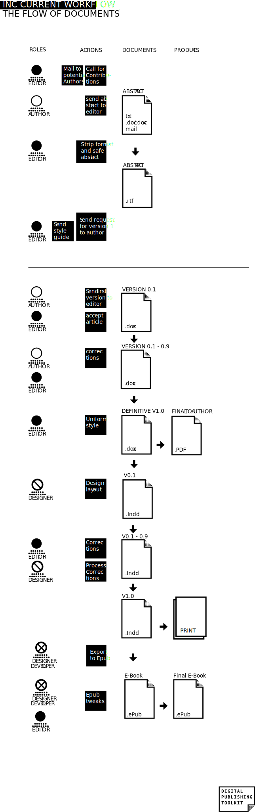

#Structured Workflow //executive management advies /keuze van workflow

Flow charts: workflows

##Single source cross-media with established software tools (Word, InDesign)

Advantages, limitations

##XML

Advantages, limitations

Does it work for me?

##Markdown

Advantages, limitations

Is it an easier alternative to XML?

##Database publishing / Content Management System

_question: shouldn't we add html and use of tools like calibre / pandoc? A large part of the workflow can stick with Word and use these tools to convert to the necessary output. Or is this part of Single source cross media?_

