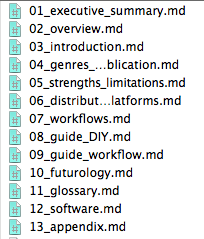

# image instructions

1. Use the following syntax to place images or to point out an visualisation is needed in the text:

<pre></pre>

  

Do not use extensions in the file name.

example:

<pre></pre>

2. Specify the name of the image and the caption, which both will be used in the actual publication, as well as the document name.
Do this both for actual images and for visualisation requests. In the case of a visualisation request it will generate a placeholder image in the text.

3. Leave an additional description of your ideas about the visualisation as follows: <!— description—>
and/or add images as inspiration.

4. Put your image in the toolkit/images folder and start your document name with the numbers to refer to the chapter it belongs to. This will make sure the images are structured by chapter.  

####chapters and abbreviations 

<b>Don’t put images in the folder which are not linked in the text.</b>

Image specifications:  
RGB and 300 dpi  
.svg if not a vector than .tiff  

##Important Changes by Michael
Actually we need to reconsider using SVG as the image standard.
(1) The SVGs as committed to the repo don't seem to be "self-contained" as my attempts to view them produce odd results (no embedded fonts perhaps). Perhaps this is fixable in making the SVG; I don't know.
(2) Formats like PDF (at least as prepared by pandoc using latex) need PNG instead of SVG.

What I've done:
1. I've changed the "makefile" to automatically attempt to convert svg's to png
2. I've changed the links to images in the documents to NOT HAVE AN EXTENSION, so like:

   

becomes:

   

Pandoc then uses svg's to make the epub, and png's to make the pdf.

3. Image references should be made with no extension. Either a PNG version should be provided or else an SVG that will be converted to PNG.

