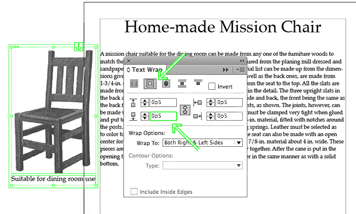

# Colophon 

### From Print to Ebooks: a Hybrid Publishing Toolkit for the Arts 
 
 **Authors:** DPT Collective, consisting of: Marc de Bruijn, Liz Castro, Florian Cramer, Joost Kircz, Silvio Lorusso, Michael Murtaugh, Miriam Rasch, Margreet Riphagen and Pia Pol\
**Editing:** Joe Monk and Amy Wu\
**Images:** Loes Sikkes and Kimmy Spreeuwenberg\ 
**Print design :** Loes Sikkes and Kimmy Spreeuwenberg\ 
**EPUB design :** André Castro\ 
**Cover design:** [Studio Mooijman en Mittelberg](www.mooijmanenmittelberg.nl/)
 
 
**Printer:** Drukkerij Printvisie B.V., Rotterdam\ 
**Publisher:** Institute of Network Cultures\ 
**Supported by:** SIA National Regieorgaan Praktijkgericht Onderzoek 
 
 
**An EPUB and PDF edition of this publication are freely downloadable from:** [http://networkcultures.org/publications/](http://networkcultures.org/publications/) 
 
**Order a copy of this book by email**: books@networkcultures.org 
 
 
**Contact:**\ 
Institute of Network Cultures\ 
Hogeschool van Amsterdam\ 
Rhijnspoorplein 1\ 
1091 GC Amsterdam\ 
The Netherlands\ 
[http://www.networkcultures.org](http://www.networkcultures.org)\ 
books@networkcultures.org\ 
t: +31 (0)20 59 51 865 
 
 
This publication is licensed under Creative Commons Attribution NonCommercial ShareAlike 4.0 Unported (CC BY-NC-SA 4.0). To view a copy of this license, visit [http://creativecommons.org/licenses/by-nc-sa/4.0/](http://creativecommons.org/licenses/by-nc-sa/4.0/). 
 
 
 
For background material, blog posts, videos and the software created within this Digital Publishing Toolkit <!-- Hybrid Publishing Toolkit for the Arts, a Guide from Print to Ebooks -->
please visit: [http://networkcultures.org/digitalpublishing](http://networkcultures.org/digitalpublishing/). Throughout the book the following symbol  will appear, pointing to blog posts relevant to the discussed topic. 
 
 
Amsterdam, 2014\ 
ISBN 978-90-822345-3-4 (print)\ 
ISBN 978-90-822345-4-1 (EPUB)\ 
 
 
 
 
 
 
 
 
 
 
 
 
 
 
 
 
 

# 01 Introduction

'You must change your life' – borrowing from the philosopher Peter Sloterdijk, this could be the summary of our message to art-oriented and design-oriented publishers, writers, editors and designers who are transitioning from traditional book making to electronic publishing or – more typically – **hybrid** print and electronic publishing. Hybrid publishing will sooner or later confront them with the need to re-think traditional publication formats, editorial and production workflows, and distribution. The changes required may well be greater and more extensive than initially expected! 
  
*Change will be minor for scientific publishers and large publishers* 
 
Having said that, there are exceptions. Workflow changes can be minor for publishers who already do all their editorial work in highly structured digital document formats (such as **XML** or databases); but typically, this is only the case in scientific and technology-oriented publishing. Changes may also be minor for larger publishers who can afford outsourcing. Making an electronic (digital) publication in parallel to a printed publication is then simply a matter of paying an external service provider, such as a document engineering company or a media design agency, to turn a Microsoft Word or InDesign file into an **ebook**. This process can be quick if the book is visually simple – such as a novel or a textbook with few illustrations – and economically worthwhile if many ebooks will be sold. 
 
*Change will be major for small, arts-oriented publishers* 
 
Since this Toolkit – consisting of this manual and of an online software kit – is meant for publishers who publish visually oriented books in mostly smaller print runs, we propose here an alternative to the route mentioned above. Neither a complex internal IT infrastructure, nor costly outsourcing will be viable solutions for these types of publishers. Unfortunately, there is no magic software button that will turn a print book design into an electronic publication just like that. Since the two media are so different, each with its own specific editorial and visual design needs, such a button will probably not materialize in the future either. Hybrid publishing will ultimately require changes in the way the editorial work is done. The good news is that such change is possible. This Toolkit includes instructions on how to deal with the many issues that arise when making the transition from traditional to hybrid or electronic publishing. 
 
For art and design publishers, the challenge of going electronic with their publications is greater than that faced by other fields of publishing, for a number of reasons: 
 
- visually oriented publications are still more difficult to realize technically in the electronic medium, particularly when designing for a multitude of different reading devices and ebook **platforms**; 
- small publishers are under a great deal of pressure to keep project costs low, often due to smaller budgets – however, the need to publish in multiple forms (e.g. print and electronic) will inevitably increase costs, unless one does as much work as possible in a way that is not dependent on the medium; 
- in order to make the investment in an electronic publication durable, electronic publications must be sustainable: they should not require constant investment in technical maintenance and version updates. 
 
## Industry promises vs. reality 
 
There is a stark contrast between the promises of the computer industry, and the reality of the new digital medium. On one hand, publishers, editors, designers and artists tend to overestimate the interactive and **multimedia** possibilities of electronic publishing. These extra possibilities do exist, but in most cases bring with them higher development costs, and remain specific to one particular technical reading platform. 
 
On the other hand, publishers tend to underestimate how even technically simple and seemingly trivial types of electronic publications can lead to a re-thinking of established publishing practices and formats. When traditional publishing formats go electronic or hybrid, there is a real possibility for transformation. Once the book becomes electronic or hybrid, the permanence, immutability and stability typical of physical books is likely to mutate into dynamic, modular, and participative forms, which can benefit from the networked environment in which ebooks exist. 
 
Various types of electronic publications may be subject to different kinds of significant change. An exhibition catalog for instance can be split up into interrelated micro-monographs which readers can download and read as individual ebooks. An ebook can be assembled from a variety of sources selected by individual readers, as is currently the case with Wikipedia, where visitors to the website can compile their own collection of Wikipedia articles and export this compilation to an **EPUB** or PDF using the [Book Creator tool](http://en.wikipedia.org/wiki/Help:Books). 
 
The possibilities for change can go beyond the rethinking of publishing formats, eventually going so far as to redefine what a book actually is. 
 
 
## What this Toolkit provides 
 
Going electronic – or going hybrid – means that you need to change the way you work in the publishing process, from manuscript to publication. The software tools currently in use, from **word processors** such as Microsoft Word to **desktop publishing** suites such as Adobe InDesign, were created for the analog or desktop-publishing world. Although it's possible to create electronic publications from Microsoft Word ( Converting a DOCX directly to EPUB using Calibre) and InDesign (Notes on EPUB Development in Adobe InDesign CS6) documents, which are likely to be the standard format used in current publishing workflows, in most cases this will be a painful, slow, inefficient and expensive process. This Toolkit focuses on technical do-it-yourself (DIY) alternatives, in the first place because the Toolkit is primarily aimed at publishers who, in most cases, cannot afford to outsource ebook design to external service providers, and also because it is aimed at those who want to keep the process in their own hands. 
 
This Toolkit focuses particularly (but not exclusively) on EPUB 3 as an electronic publication format, and on Markdown as a word processing format, because of the specific needs of small-edition publishers in the field of art and design: low costs, ease of use, sustainability and platform independence. The recommendations stem from our practical experience in collaborating with four Dutch art, design and research publishers on electronic publication projects: BIS Publishers, Valiz, NAI010 and Institute of Network Cultures. 
 
  
## Whom is this Toolkit written for 
 
You may be a publisher, a designer, or someone who is just starting out with making books. You probably identify with or work in the arts. You may hope to find answers, gain knowledge, pick up some tips, and consult various resources. This Toolkit intends to provide all of that. The overall focus is on pragmatic solutions for publishers within the sector of art and culture. No prior knowledge of creating an ebook is required – having said that, a familiarity with various computer software applications is helpful, as is the willingness to learn and the inquisitive curiosity to look beyond this guide for specific answers. This publication is not a tutorial on how to make an electronic publication, it merely intends to provide the reader with guidance on how to make a first attempt at creating an electronic publication. 
 
As we said at the beginning of this introduction, 'you must change your life', so there may be something of a culture shock while reading through this document. If electronic publishing is to be no more than an afterthought in the production chain and the product portfolio, the amount of change may be relatively small. However, if electronic publishing is to become just as important as print, the change may be radical. What this means is that if you wish to make visual electronic publications, you should be willing to change your current way of working, and to gradually get used to the less mainstream alternatives offered here. 
 
 
## How to use this Toolkit 
 
The Toolkit aims to provide a practical guide on how to develop electronic publications, for publishers as well as for anyone else interested in this subject matter. The Toolkit will attempt to provide insight into the preconditions of electronic publishing, providing Open Source tools where possible, and to allow publishers active in the art and culture sector to navigate the diverse and complex landscape of digital publishing in a more informed way. 

Furthermore, the Toolkit will help the reader to develop e-publications, specifically art and design 
publications, which generally make use of a greater variety of fonts, graphics and layout than publications focused exclusively or mainly on text. 

After going into the basics of (electronic) publishing in Chapter 2, Chapter 3 will provide a general introduction to these publications, sketching out various scenarios on how to develop e-publications. We will discuss a number of issues and opportunities in going electronic. In Chapter 4 we focus on the strengths and limitations of specific types of e-reader hardware and software, different file formats, moving on to describe a number of distribution platforms in Chapter 5. In Chapter 6 we give a step-by-step guide to creating your own EPUB, Chapter 7 offers a practical, how-to guide for workflows (both structured and specific to each scenario) and finally in Chapter 8 we go into designing electronic publications for the various scenarios addressed earlier. In Chapter 9 we look into the future of e-publishing. The manual ends with a glossary and a description of the developed software within the different project groups. 

We wish to stress here that the structure of the manual isn’t as linear as this outline may suggest. Particularly further on in the manual, some of the terminology may seem confusing at first, but will be explained in more detail later. We chose to focus on delivering a practical how-to guide for e-publishing, starting with the step-by-step guide to creating an ebook (in Chapter 6) and leaving the more detailed argumentation for the next chapters (particularly Chapter 7).
 
 
## Who worked on this Toolkit 
 
This publication is part of the Digital Publishing Toolkit [^DPT-blog] RAAK-MKB [^RAAK-MKB] research project. The following research question was stated: *'In what way can a platform be created with new tools for Open Source publishing, which will allow publishers in the sector of art and culture to produce interactive e-publications by themselves?'* 
 
To answer this research question, the Institute of Network Cultures (lectoraat Netwerkcultuur) of the Amsterdam University of Applied Sciences, and the Research Centre Creating 010 (kenniscentrum Creating 010) of the Rotterdam University of Applied Sciences jointly conducted state-of-the-art research. In collaboration with an already existing consortium [^DPT-Consortium] of eleven small businesses including publishers, designers and developers, five sub-projects were formulated. Within these sub-groups, publishers, designers and developers, researchers and students of the participating applied universities collaborated. 
 
The result is the present publication, as well as a software repository consisting of tools for electronic publishing, based on Open Source software of which the source code is published and freely accessible[^DPT-GitHub]. With a single command, one can get hold of the code repository, downloading not only the current state of 'source' files for the book, but also the full history of changes and comments made by each collaborator to the Toolkit up to that point. With another command, the various 'sources' are pulled together into an EPUB produced at that moment. In this way both the 'content' and the 'machine' used for making the book are bundled and shared. 
 
We are not claiming that all ebooks will follow, or should follow this path. We are simply laying out one of the many directions ebook creators can already take with their publications, by using simple and inexpensive tools, and without needing to buy into the industry's glossy scenarios of multimedia and interactivity.  
 
[^DPT-blog]: Blog of the Digital Publishing Toolkit research program, http://networkcultures.org/digitalpublishing. 
[^RAAK-MKB]: http://www.innovatie-alliantie.nl/stimuleringsregeling/regeling/item/54-raak-mkb.html. 
[^DPT-GitHub]: http://networkcultures.org/digitalpublishing/github/. 
[^DPT-Consortium]: http://networkcultures.org/digitalpublishing/consortium/.

02 The basics 
 
## Layout and structure of a text
A text is a collection of words and words are composed of letters. In order to read a text, we make use of a variety of layout aids. The most simple and basic of these is the use of spaces between words. Classical Greek and Roman texts were written in what is called 'continuous script', without spaces, which was not considered a problem since reading was a craft which only a few people mastered. Gradually an increasing number of design and **layout** aids were introduced: not only spaces between words but also capital letters at the beginning of sentences, line breaks, and a variety of punctuation marks such as commas, semicolons, colons and periods.[^hist] Also, concepts such as paragraphs and chapters  developed into a standardized system that allowed the structure intended by the authors to be transmitted to readers familiar with these standards. 
 
In the electronic processing of texts, this hierarchical ordering of words into sentences, sentences into paragraphs and so on, as well as additional reading aids such bold or italic text, is made possible by using specific formatting codes. This process is called **markup** and the codes are called markup elements. It goes without saying that all these markup elements require stable definitions and clear relationships if they are to be of any use. In order to establish which markup is allowed and how it should be used, **markup languages** were defined. 
 
With the emergence of computer networks and the increasing need to standardize texts for multiple usages, an international ISO standard was defined in 1982, known as Standardized General Markup Language (SGML). This was an extremely important development, as it established a strict division between the *conceptual* structure and formatting of the text, and the final *representation* of that structure and formatting. This is radically different from the 'What You See Is What You Get' (**WYSIWYG**) markup languages used in word processors such as Microsoft Word, WordPerfect or OpenOffice, where text which is marked up in certain way (such as italic or bold) is immediately displayed that way. SGML and its derivatives, **HTML** (HyperText Markup Language, used mainly in web design) and the expanded XML (Extensible Markup Language), allow instead for formatting *concepts* such as 'emphasis' or 'strong emphasis', (rather than ‘italic’ or ‘bold’) as well as structuring concepts such as 'chapter heading' or 'quotation', to be linked logically, in a separate list of definitions known as a **style sheet**, to specific display representations for each concept.

This is especially important and relevant in the context hybrid publishing because it makes it possible, at the later stage of visual design, not only to define how each of these markup elements will be displayed, but also to provide different definitions for each specific output. For example, we can decide that for output A (say the printed book), text marked as 'chapter heading' will be centered on the page, in a different font and larger font size than the running text, while text marked as 'quotation' will be rendered in the same font and size as the running text, but in italics; while for output B (say a display screen) we could instead decide to render chapter headings as bold and quotations as underlined text.
 
 
 
By combining the structured text with a different style sheets for each output formats, a variety of end products can thus be generated using one single structured text. However, in order to make this possible, the source text must be as systemically structured as possible. 
 
 
### What is an electronic text? 
 
An electronic text is generally understood as a text which is represented on a display screen of some sort. However, the most important difference between a paper text and an electronic text, in the context of hybrid publishing, is the notion that the electronic text becomes a structured file. As we have seen, the use of markup allows us to create different layouts, or representations, for different media. It is also crucial to understand that electronic publishing introduces a paradigm shift away from the page-centered culture of book printing. Book printing traditionally allows for various printing sizes, depending on the wishes of the author, designer and publisher. For example, when making an art book based on a collection of paintings or drawings, a decision will be made as to what the ideal book size is, and whether it should be printed in portrait or landscape format. In the world of screens however, there are other decisions to be made since there are a variety of screen sizes to deal with, and a screen of course cannot be cut to the required size, as is the case with paper book publishing. 

Many electronic reading devices now support **reflowable** text, which means that the layout of the text is automatically adapted to fit the dimensions of the device. This works well for genres such as novels which usually consist only of text. However when the overall design cannot so easily be modified, for example if there are crucial relationships between the body text and illustrations or other elements such as footnotes or tables (as is the case for art and design books as well as research publications), then the transposition from an existing print work to an electronic representation can pose some serious difficulties, which will be further addressed in the following chapters. 

 
## Possibilities offered by electronic publishing 
 
One of the most widespread forms of e-publishing consists of scanning existing paper books and converting them into digital media such as images, electronic texts, or an ebook. **Optical character recognition** (OCR) is often used to convert the printed text of a book into a digital text format such as **ASCII** or **Unicode**. After this conversion the text can be re-formatted, searched, or processed using other software applications. Examples of organizations or projects for book scanning on a large scale are: Project Gutenberg[^Project-Gutenberg], the Million Book Project[^Million-Book-Project], Google Books[^Google-Books], and the Open Content Alliance [^Open-Content-Alliance]. 
 
New electronic technologies allow for a variety of publication outlets, bringing new opportunities as well as new challenges. Page numbering and indexing for example, which for centuries were essential book-making concepts, are problematic in e-publications, where page numbers are unstable or even non-existent (a historical illustration of this problem is the numbering of chapters and verses in the Bible, which make it possible for readers to refer to the same passage even though they may be using different editions, or even different languages). Fixed page numbers and indexes referring to page numbers have traditionally allowed readers, writers and researchers to refer to the same publication (or at least the same edition) across time and space. However, in an electronic environment with non-fixed screen sizes this is much more complicated. Though the text itself usually remains fixed, since the original text file exists independently from its representation format (**e-ink**, **LCD**, paper), the actual representation in each format can vary substantially, making it much harder to refer to the location of a passage in the text. The challenge becomes even greater if we widen our ambition to include not only tables, references and notes but also pictures, audio and video, hyperlinks. 
 
Just as cultural standardization of typography and layout over the centuries has made it possible to instantly distinguish a novel, an educational textbook, or a ‘coffee table book’ of art reproductions, this will in all likelihood eventually be the case as well for different genres of electronic books. With the notable exception of electronic (or paper) books as art objects in their own right, electronic art book publishing is already quickly developing many common features as a genre, though differences between individual publications will always remain. 

At the most basic level, all files in an ebook are nothing but bitstreams (streams of binary code: zeros and ones). As we have seen, the great novelty in the world of electronic art books is that based on standardized but flexible structures, the same content can be published in a wide variety of formats. This not only depends on the capabilities of the output (reading/viewing/listening) device, but also on the function of the book, such as a dictionary, a study book, a reference work, a catalogue, or a work of fiction. 
 
All these new possibilities of course will require thorough, and potentially more labor-intensive, editorial and production strategies. Not only because of the possibility of representing the same content in a variety of forms, but more importantly because once properly edited and stored electronically, the content and its constituting parts can be endlessly used and re-used in different ways, now and in the future. 
 
 
 
[^hist]: Guglielmo Cavallo and Roger Chartier (eds.), A History of Reading in the West, Polity Press 1999. 
[^Project-Gutenberg]: Project Gutenberg, https://www.gutenberg.org. 
[^Million-Book-Project]: Million Book Project, https://archive.org/details/millionbooks 
[^Google-Books]: Google Books, http://books.google.nl/ 
[^Open-Content-Alliance]: Open Content Alliance, www.opencontentalliance.org/

# 03 Genres of Publication 
 
 
## Five genres 
In the present project we deal with a variety of publication products which we have categorized into five genres: 
 
 1) Research publication; 
 
 2) Art/design catalogue; 
 
 3) Artist's/designer's book; 
 
 4) Art/design periodical; 
 
 5) New genres. 
 
 
###1) Research publication 
- Mainly text-based; 
- Texts play a central role; 
- Visuals are secondary (images refer to text); 
- Often longer texts; 
- Often with a standardized structure; 
- Often with complex referencing (table of contents, footnotes, endnotes, cross-references, citations, bibliography, keyword and name indexes, list of illustrations, glossary). 
 
**Going electronic: advantages and issues** 
Discussions on digital opportunities for research publications in the sciences and humanities mostly revolve around the transition from the traditional textbook model to new forms of publication, which allow for more complex forms of visualization, inclusion of real-time data, and computation. However, if one wishes to publish in standard ebook formats and target a broad range of electronic reading platforms and devices, the visual and multimedia possibilities of current ebook technology are in fact quite limited – mainly because the file quickly becomes too large to quickly download. The alternative, developing research publications as visual apps, will in most cases not be a viable solution since apps have short lifespans of technical compatibility, while research publishing is almost by definition long-term (and long-tail) publishing. 
 
The first, most obvious advantage of 'going electronic' with research publications is that it makes things easier for users: ebooks allow researchers, students and other readers to search, copy and paste text in a simple and natural way. Also, the **datasets** used in the research can be included within the publication, allowing more serious readers and researchers to engage directly with the research material itself. For publishers, making texts available digitally has huge advantages in terms of accessibility, particuarly on an international level, since distribution of ebooks is not limited by logistical issues of shipment and storage. On the other hand there are also specific problems related to digital research publications. One of these has to do with referencing: without fixed page numbers, there is no standard way of specifying the location of a reference within a publication. This is one reason why scientific ebooks are still often issued as **PDF**s. 
 
'Going electronic' also opens up new possibilities for creating content. A high degree of standardized structure and ensuing 'modularization' allow for new ways of reading and writing essays. Particularly when different authors refer to each other, they often share data, quotations, tables, figures, etc. Multiple use and reuse of 'modules' can help foster communication within a community. However, this remains a future dream for the time being, since comments and annotations are not linked to (a specific place in) the book the way they are in the case of physical books, which makes sharing more complicated.[^Kircz](http://elpub.scix.net/data/works/att/234_elpub2008.content.pdf) Another option that comes with modularization is that different users or readers of a text can each extract the modules they need. For example, if we consider an anthology of essays, a user could generate a customized ebook of all bibliographical references in the various texts. 
 
 
###2) Art/design catalogue 
- Mainly image-based;
- Visuals play a central role; 
- Text is secondary (text refers to visuals); 
- Descriptive texts of various lengths. 
 
**Going electronic: advantages and issues** 
Most art/design catalogues are mainly image-based, and here lies the greatest challenge for electronic publishing in this genre. A publication containing many images with high **resolution** and high color fidelity will take a long time to download and will occupy a great deal of storage space on the user's device as well as the publisher's servers. And as download speeds and storage space continue to increase exponentially, there is of course an endless temptation to continue increasing the file size accordingly. 
 
Possibilities in this direction lie in offering high-quality zoomable images and adding additional material such as video (documentary, animation, etc.), audio (interviews, lectures, etc.) or even 'interactive' media. Also, most **tablet** computers offer much better color fidelity than the printed page, a fact which can be used to good advantage when offering ebooks optimized specifically for reading on a tablet. A possibly problematic issue is that such catalogues often require a fixed page layout: image and text that belong together should appear next to each other; however, changes in size (of the device or of the user's settings) affect the flow of content, so that the images and text will tend to 'drift apart'. 
 
As with research publications, modularization offers interesting opportunities for writing and presenting material. Since a catalogue often consists of components which are already modular in nature, there is much to be gained from using these features in electronic publishing. For example by providing readers with the opportunity to 'build' their own publication; by publishing different editions (small, medium, large) of a catalogue with little extra effort; or by easily updating specific parts of the catalogue. 
 
 
###3) Artist's/designer's book 
- Book *by* an artist, rather than *about* an artist; 
- Complex use of images and typography, often pushing the possibilities of the medium; 
- In print: making use of the book as a material, visual and tactile object; 
- Often difficult or impossible to adapt/convert to other media; 
- Text is often used in a non-descriptive or non-narrative way. 
 
**Going electronic: advantages and issues** 
Since an artist's/designer's book often constitutes a reflection upon the medium itself, the question of choosing between a digital format or a print edition, of 'going electronic' and weighing the ensuing advantages and issues, does not apply here as it does with other genres. Rather, it is a fundamental choice which will determine from the start many basic characteristics of the book itself. Also, choosing an electronic format such as EPUB for an artist's/designer's book requires a good working knowledge of the specific features of such a format. This seems to be one of the reasons why there are few digital artist's books, if we exclude the electronic (scanned) reproductions of printed artist's books which can be found on repository websites such as UbuWeb and Monoskop. 
 
When working on an electronic edition of an existing printed artist's/designer's book, the choice of the file format is crucial. The end result is to a large extent determined by 
the specifications of each format, and more generally of each medium. Here too, as with art/design catalogues, the quality of images and the relation between text and images is crucial. 
 
In the case of artist's books or pamphlets which are not primarily a reflection of their medium (for example Sol LeWitt's 1968 'Sentences on Conceptual Art' which consists of handwritten text on paper pages) and are not particularly difficult to adapt/convert to electronic media, the advantages of doing so are similar to those for other genres: access and distribution, reaching new audiences, the ability to easily copy and paste text and images, and the possibility of incorporating interactive materials. 
 
 
###4) Art/design periodical 
- Both text-based and image-based; 
- Images as well as texts play a central role; 
- Use of images is primary as well as secondary; 
- Texts of various lengths; 
- More or less fixed page layout format; 
- Recurring or periodical publication format (e.g. magazines, series etc.). 
 
**Going electronic: advantages and issues** 
An important part of the appeal of a periodical is its physical presence. It can be easily picked up from a newsstand or a table, casually tossed in a bag, and eventually disposed of. Though the digital domain has its own ways of informing or reminding the readers of a publication's existence and presence (for example, through 'push messages' on tablets and smartphones, e-mail notifications, and sharing via social media) this is of course not quite the same thing. 
 
In terms of archiving, 'going electronic' also provides a number of opportunities and challenges for art/design periodicals. New articles can refer to older ones, and even integrate parts of these older articles. The periodical as such becomes a repository and therefore a breeding ground for new work. 
 
The advantages are mostly the same as with the other genres listed: increased possibilities for extending content (interactivity, video etc.); lower distribution costs; outreach to a larger audience; and modularity. However, storage and download/update speeds can present a challenge, as described above. 
 
###5) New genres 
New genres of publication will continue to emerge as a result of the ongoing digitization of the publishing industry. These could fall outside of what we would normally consider a 'book': for example, short pamphlets, poems, essays, sketches, or – in the world of digital media – apps, a series of tweets, a blog, etc. We could also imagine an interactive approach, similar to adventure games, where the reader is able to control the narrative or to build or customize the publication. 
 
 
## Three levels of electronic publishing 
Independently of the different genres listed above, we can distinguish three levels of electronic publishing. The scope of e-publishing ranges from the simple conversion of a paper book to an electronic publication (offering the PDF of the print edition as an ebook) to full-scale electronic publications which incorporate advanced digital formats such as video, or are published as 'native apps' (applications developed for a particular platform or device). When we consider the different genres of publishing from this perspective, the role and use of metadata also becomes an important factor.  (Embedding a Custom Set of Metadata Based on Dublin Core Metadata Initiative Into a MultiMarkdown Document) 
 
Electronic publishing can be divided into three levels, as described in further detail below: (From print to what?) 
 
**1. One-to-one**: the book is considered as a specific product or project where text authors, illustrators, artists, photographers and designers work together to create the book, which then is published as a single edition. The print book can also be converted or adapted into an ebook. 
 
**2. One-to-many**: the publication has a variety of appearances, depending on the context and the available presentation media (type and size of screen/paper). The book is offered in formats such as print, EPUB, PDF, **MOBI**, web, each with an appearance and functionality suitable to the format being used. 
 
**3. One-to-database**: here the book is not a separate, defined, and limited entity. Rather, a publication is put together from various independent components, defined as modules, which can be used and re-used a number of times by anyone who has access to the database. For example a reader can compile a selection of available chapters and generate a customized ebook. 
 
 
 
 
###1) One-to-one 
On the first level there is the single edition. Each publication is considered as a separate product or project where text authors, illustrators, artists, photographers and designers work together as an ad-hoc team. The production workflow may be unique from book to book, but will usually follow a traditional pattern, from a manuscript to a designed PDF ready to be printed. Images and/or full layout pages are not suitable as reusable (digital) objects. The independent components which together make up the end product are usually not archived separately. 
 
'Going electronic' in this case usually means no more than generating some kind of electronic representation, as accurate as possible, of the printed book. Sometimes the files used for making the printed book will be converted into an EPUB by a third party. This electronic edition is then checked for readability and accuracy of layout (for example, making sure that images and captions are on the same page). 
 
The publisher may make use of a content management system, which in its simplest form is just a collection of folders/directories on a hard drive. Archiving is important: often publishers have had to scan their own books for a reprint, simply because they failed to properly archive the files. Maintaining an archive of semantically structured content also offers many new possibilities, not only for efficiently reissuing the publication but also for doing so in new formats which were not previously available. 
 
There are many common characteristics between individual publications within each genre. A better understanding of these characteristics allows publishers and designers to make good use of new possibilities. 
 
 
###2) One-to-many 
On the next level we see a split between the manifestation of the (single) printed version, and the (one or many) electronic versions. The electronic version, unlike the paper version, is not a single object but has a different appearance for each ebook format. Also, due to the variety and flexibility of reading devices, different users will see the book differently on their display. The display sizes of reading devices are not standardized and generally allow for both portrait and landscape viewing. Furthermore, the popular (and more or less standard) EPUB 3 allows for reflowable pages and variable fonts and font sizes. 
 
Workflow schemes are crucial in one-to-many publications, as the same texts and images will be used across various formats and devices. This requires a structured and detailed workflow, and the use of a set of descriptors (metadata) related to the objects or entities of the publication. Here the ebook is no longer a by-product of the print book, but is produced simultaneously, often in a variety of formats. 
 
###3) One-to-database 
The final level is database publishing, in which all objects or entities of a publication can be used independently of each other. This is possible only when the editorial workflow has defined these objects or entities as individual and unique items within the database, along with the characteristics and features (metadata) of each item. 
 
Particularly for publications which have a more or less fixed layout, database publishing opens up new ways of designing books. For example in the case of a collection of essays, a catalogue, or a journal, readers can compile a personal selection from the available texts. A structured presentation of all material is made possible based on the metadata, 
allowing readers to navigate and put together a collection based on their own personal interests. Of course this means that **tagging**, describing, and storing all the components must be done in the early stages of publication and with utmost care. 
 
It is important to note that there will never be one single workflow which fits all requirements. However, by making available the relevant metadata, publications can be created in a variety of formats. 
 
 
 
[^Kircz]: Anita de Waard and Joost Kircz, Modeling Scientific Research Articles –
Shifting Perspectives and Persistent Issues, Proceedings of the 12th International Conference on Electronic Publishing held in Toronto, Canada, 25-27 June 2008, http://elpub.scix.net/data/works/att/234_elpub2008.content.pdf.

# 04 Technologies for electronic reading
 
 
 
##Reader hardware 
There are several ways of viewing electronic publications. Portable devices such as e-readers or tablets are by far the most popular way of accessing such content. Smartphones are, for the purposes of e-reading, basically miniature versions of their tablet counterparts. Finally there are desktop computers and laptops which can be used as e-reading devices, sometimes in combination with the physical book: particularly in the case of research publications, a digital version is often used for easy searching and copy/pasting of text selections. 
 
 
###E-readers 
E-readers became widely known with the introduction of the Amazon Kindle in 2007. E-readers, unlike tablets, are only suitable for reading books, are relatively inexpensive, and have **monochrome** displays. An important characteristic of the e-reader is the use of electronic paper (e-paper), also known as an electrophoretic display. Electronic paper is designed to mimic as closely as possible the characteristics of paper, and has a very low energy consumption in comparison with other mobile displays such as the LED screens used on tablets. The current generation of e-paper is not capable of rendering complex motion, therefore animations and videos cannot be viewed on these devices. Also, the monochrome display means that the current generation of e-readers is mainly suitable for text-based publications, such as novels or research publications. 
 
Some manufacturers of e-readers also offer more expensive models, such as Amazon's Kindle Fire (and Fire HD) or Barnes & Noble's NOOK Tablet (and NOOK HD+). However these models are not really e-readers anymore, but full-fledged, small-sized tablets. Instead of e-paper, they have backlit color LED screens, a standard feature of tablets such as Apple's **iPad** and Samsung's Galaxy Tab. Often these models use a version of the Android operating system, in contrast to the traditional monochrome e-readers which use their own operating system, usually derived from a version of **Linux**. Conversely, Samsung's Galaxy Note and Apple's iPad Mini can be seen as these tablet manufacturers' answer to the smaller-sized e-reading tablets. 

 
 
###Tablets 
The tablet market is currently dominated by two main players, Apple and Samsung.[^sales-figures-tablet] Apple uses its own operating system (**iOS**) for the iPad, while Samsung has opted for Android as the operating system for its Galaxy Tab product line. In the Android market segment, a large number of manufacturers offer similar hardware running variants of the Android operating system. There are various e-reader software applications for both iOS and Android. We will review the most important of these in the [reader software](#reader-software) section below. 
 
For viewing arts and design publications, tablets with color LED screens are far more suitable than e-readers with their monochrome e-paper displays. The color fidelity of the newest tablet displays offered by Apple and Samsung is comparable to that of professional **monitors** used by photographers and graphic designers. However, the tablet's color screen also has some serious drawbacks: backlit LED screens cause a great deal more eye fatigue than either printed paper or e-paper, while viewing outdoors greatly diminishes image quality. Another issue with tablets is battery life: though newer models continue to offer significant improvements, their relatively large power consumption means they are still no competition in this respect for e-readers, which boast an average battery life of up to several weeks. 
 
###Smartphones 
For the purposes of viewing electronic publications, smartphones can be considered broadly similar to tablets, though the screen sizes are of course smaller (and also smaller than those of e-readers). Therefore we have clustered them here together with tablet devices.[^sales-figures-phone] 
 
###PCs/laptops 
Though ebooks can certainly be read on a laptop or personal computer, this may be ergonomically less natural for the user than reading on a handheld device. The drawbacks of increased eye fatigue and limited battery life are the same as with tablets. 
 
##Reader software 
Various applications for PCs, tablets and smartphones support an extended subset of the EPUB standard, allowing for extra features such as customized fonts, layout styling, etc. In the following section we will examine the most important applications for electronic reading on mobile devices, desktop and laptop computers, and the Web. 
 
 
 
###Mobile applications 
There are various software applications for tablets and smartphones, some of which are 'companion apps' to well-known e-reader devices such as Amazon's **Kindle** and **Kobo**'s range of e-reader hardware. Other applications were not developed for specific e-reader devices but are integrated into a storefront, such as Apple's **iBooks** and Aldiko. The applications generally support EPUB 2 and EPUB 3, though some require the user to convert files into a proprietary file format before the document can be opened, such as the Kindle e-reader and app which support only Amazon's proprietary file formats (AZW, **KF8**, MOBI) along with plain text and PDF (Portable Document Format). 
 
####iBooks#### 
iBooks is Apple's ebook reader application for iPhone, iPad and Mac OS X. The user can purchase books from the iTunes Store or copy them from another source to the iBooks library. The latest version of iBooks supports many of the features of the EPUB 3 standard, as well as PDF and the closed-source .ibooks file format (IBA), which is a derivative of EPUB 3. 
 
####Aldiko#### 
Aldiko is both a storefront and ebook reader for Android which supports EPUB and PDF. As such it is comparable to Apple's iBooks. There is a paid version which offers some extra features (annotation, removal of advertisements) not found in the free version. 
 
####Kindle#### 
The Kindle application is Amazon's tablet and smartphone counterpart to their physical e-reader devices. The application is available for both iOS and Android. Books can be bought from inside the application on Android; on iOS the procedure is less straightforward, due to restrictions by Apple on in-app purchasing. Kindle for mobile devices only supports Amazon's proprietary file formats (AZW, KF8) and PDF. EPUBs need to be converted using third-party software (such as calibre) before Kindle can import the files into its library. The application can sync its library so that a collection of ebooks is available on both the Kindle e-reader and within the application, for example on a smartphone. 
 
####Kobo#### 
Kobo, like Amazon, produces physical e-reader devices and also has a large bookstore. Therefore the applications offered for Android and iOS are largely 'companion apps' to Kobo's e-reader devices. Libraries can be synced across devices, provided all the content was purchased in Kobo's bookstore. Kobo supports both EPUB and PDF files. 
 
####Marvin#### 
Marvin is a paid application which focuses mainly on managing existing collections of digital publications compiled from various sources. It does not have its own store. Marvin accepts only EPUB files, but allows users to convert other file formats using third-party software packages such as [calibre](#calibre). 
  
 
###PC software 
There are also a great deal of desktop applications which make it possible for users to view EPUBs. Of the five applications mentioned above, only Aldiko is not available on desktops, while iBooks is a Mac-only application. Kobo and Kindle both offer Windows and Mac versions of their software – but no Linux version, though Kobo does offer beta software for Debian Linux systems.[^kobo-debian] The functionality is similar to that of the mobile versions. 
 
####Calibre 
Calibre is an ebook management suite with a wide variety of features, and a noteworthy application in this context. Calibre provides tools for managing large collections of ebooks, converting files to and from various formats (both ebook[^ebook] and text-based formats)[^calibre-file-formats], viewing all major ebook file formats, and even editing EPUBs and AZWs. 
 
####Adobe Digital Editions 
Adobe Digital Editions (ADE) is an ebook reader and management tool which can read EPUB and PDF documents. However, support for EPUB 3 is incomplete, and although Adobe claims that all the important features are supported, it doesn't elaborate on what these important features are. ADE also integrates with many e-reader devices and reader applications which offer syncing possibilities. Therefore a library managed with ADE could in theory be synced with a compatible device or application.[^ade-readers] 
 
 
###Web platforms 
There are several web platforms for reading EPUBs online, but their popularity is difficult to estimate. A project called Bookworm, developed by Threepress in 2008, was taken over by O'Reilly Labs in early 2009 and eventually shut down in 2012.[^bookworm-oreilly] The website now describes Bookworm as an 'interesting and useful experiment' and attributes the closure to dramatic changes in the ebook ecosystem over the past few years. Booki.sh, another project, is still online and offers a complete library of ebooks which can be viewed and stored online.[^bookish] However it does not appear to be operating commercially, and the ability to purchase books was removed in June 2013.[^bookish-blog] 
 
###Browser applications 
Besides web applications, there are also several browser extensions which allow users to read EPUBs in their web browser. However these extensions can best be understood as a convenient way of quickly viewing or previewing ebooks, rather than full-fledged e-reading applications. 
 
 
####Readium 
Readium is a project by various publishers and technology companies aiming to provide a reference system, a collection of best practices, for rendering EPUB 3 publications.[^readium-goals] Readium offers a range of tools for online and offline use, mainly geared towards software developers. One of these tools is a browser extension[^readium-extension] for the Google Chrome web browser, allowing the user to view an EPUB document inside the browser window. 
 
####EPUBReader 
EPUBReader is similar to the browser extension offered by Readium. The main difference is the supported browser: EPUBReader is only compatible with Mozilla Firefox. 
 
 
##File formats 
A file format is a standard for encoding information to be stored in a digital file. File formats may be either proprietary or free, unpublished or open. Each file format requires software which is able to read the file. 
 
###Reflowable documents (EPUB and AZW) 
The history of the modern ebook can be traced back to the late 1990s with the establishment of the Open eBook Forum, which defined a standard known as the Open eBook Publication Structure (OEBPS). This standard eventually resulted in the widely used ebook format known as EPUB, which is currently at version 3.  Microsoft was heavily involved in the development of the Open eBook specification, based partly on technology developed by a company called SoftBook Press.[^businessweek-ebooks] SoftBook Press originally developed the format, based on XML and **XHTML**, as a companion to their hardware product, which was one of the earliest dedicated e-reader devices. The Open eBook specification was first released in 1999, and later renamed EPUB for the second version release. By this time the Open eBook Forum had become the International Digital Publishing Forum (IDPF).[^interoperability-of-ebook-formats] The new EPUB 2 standard supported extended features such as basic styling, customized fonts, etc.[^epub2-specification] 
 
When Amazon made its entrance in the world of digital publishing, the online bookseller opted not to follow the EPUB standard, but instead to purchase a French company known as **Mobipocket** which had developed another format called MOBI and the proprietary Mobipocket Reader software that ran on some personal digital assistants (**PDA**) and other hardware.[^amazon-acquires-mobipocket] One of the main reasons for this choice was the fact that, unlike EPUB, Mobipocket's products provided full support for **Digital Rights Management (DRM)**. However the practice of adding DRM to media is controversial, as it often makes it harder for paying customers to freely interact with the digital goods they have purchased. For example, files cannot in general be freely transferred to other devices. 
 (The Book as Directory) 
 
Technically, the MOBI file format is based partly on PalmDOC, an ebook file format readable on PDAs running the operating system developed by Palm, Inc., with added support for guidelines taken from the Open eBook standard.[^mobileread-palmdoc] The MOBI format was further developed to be used exclusively with Mobipocket e-readers, and later with Amazon's Kindle e-readers. Finally, Amazon renamed the MOBI format AZW (presumably an acronym for 'Amazon Word'), which is now the generic term for all ebooks released by the company.[^amazon-azw] 
 
Currently there are roughly two 'generations' of widely used ebook formats. The first generation is based on the EPUB 2 standard as introduced in 2007 (or on an earlier version released under the Open eBook specification): for example, Amazon's MOBI/AZW format. The second generation usually implements features from the EPUB 3 standard, while often remaining backwardly compatible with older versions and subsets of EPUB 2 (and to a certain extent earlier specifications as well). EPUB 3, released in 2011, introduced new features such as support for HTML5 (whereas EPUB 2 supported XHTML), the more advanced style sheets of **CSS3**, scripting (which had been discouraged in EPUB 2) and easy embedding of video and audio.[^epub3-changes] Most ebook file formats available today are based on EPUB 3, including proprietary formats such as Amazon’s AZW and Apple’s iBooks.[^amazon-kf8][^ibooks]. For compatibility with older e-readers, the ebook package usually also includes a MOBI file. 

(Crash Test Dummy) 

 
###Other formats 
The file formats described above are all *reflowable* documents: their presentation can be adapted for each particular output device. There are of course other ways of presenting electronic publications, for example with a fixed layout, which preserves the look of the original, including fonts, colors, images, and formatting. A common way of doing this is to export the document as a PDF, though there are also more content-specific file formats (such as 'comic book archive').[^comic-book-archive] However, not all such formats are supported by all e-readers. 
 
 
[^sales-figures-tablet]: Gartner Says Worldwide Tablet Sales Grew 68 Percent in 2013, With Android Capturing 62 Percent of the Market, <a href="http://www.gartner.com/newsroom/id/2674215">http://www.gartner.com/newsroom/id/2674215</a>. 
[^sales-figures-phone]: Gartner Says Annual Smartphone Sales Surpassed Sales of Feature Phones for the First Time in 2013, <a href="http://www.gartner.com/newsroom/id/2665715">http://www.gartner.com/newsroom/id/2665715</a>. 
[^kobo-debian]: MobileRead, *'Any interest in Kobo Desktop for Linux?'*, 5 March 2010, <a href="http://www.mobileread.com/forums/showthread.php?t=82378">http://www.mobileread.com/forums/showthread.php?t=82378</a>. 
[^ebook]: Converting a Docx directly to EPUB using calibre, <a href="http://networkcultures.org/digitalpublishing/2014/03/28/converting-a-docx-directly-to-epub-using-calibre/">http://networkcultures.org/digitalpublishing/2014/03/28/converting-a-docx-directly-to-epub-using-calibre/</a>. 
[^calibre-file-formats]: <a href="http://manual.calibre-ebook.com/faq.html#what-formats-does-calibre-support-conversion-to-from">http://manual.calibre-ebook.com/faq.html#what-formats-does-calibre-support-conversion-to-from</a>. 
[^ade-readers]: Digital Editions Supported Devices, <a href="http://blogs.adobe.com/digitalpublishing/supported-devices">http://blogs.adobe.com/digitalpublishing/supported-devices</a>. 
[^bookworm-oreilly]: Bookworm, 'an experimental platform for storing and reading ePub-format books online,' is closed as of March 31, 2012., <a href="http://oreilly.com/bookworm">http://oreilly.com/bookworm</a>. 
[^bookish]: Booki.sh, <a href="https://booki.sh">https://booki.sh</a>. 
[^bookish-blog]: <a href="http://blog.booki.sh/blog/post/ebook-sales-via-booki-sh-to-end-on-june-30">http://blog.booki.sh/blog/post/ebook-sales-via-booki-sh-to-end-on-june-30</a>. 
[^readium-goals]: Readium Project Goals, <a href="http://readium.org/readium-project-goals">http://readium.org/readium-project-goals</a>. 
[^readium-extension]: EPUB reader for Chrome, <a href="https://chrome.google.com/webstore/detail/readium/fepbnnnkkadjhjahcafoaglimekefifl">https://chrome.google.com/webstore/detail/readium/fepbnnnkkadjhjahcafoaglimekefifl</a>. 
[^businessweek-ebooks]: E-BOOKS: A LIBRARY ON YOUR LAP, <a href="http://www.businessweek.com/1998/46/b3604010.htm">http://www.businessweek.com/1998/46/b3604010.htm</a>. 
[^interoperability-of-ebook-formats]: Bläsi, C., Rothlauf, F., On the Interoperability of eBook Formats, Johannes Gutenberg-Universität Mainz, 2013, p. 12, <a href="http://wi.bwl.uni-mainz.de/publikationen/InteroperabilityReportGutenbergfinal07052013.pdf">http://wi.bwl.uni-mainz.de/publikationen/InteroperabilityReportGutenbergfinal07052013.pdf</a>. 
[^epub2-specification]: IDPF, 'Open Publication Structure (OPS) 2.0.1 v1.0.1, Recommended Specification September 4, 2010', 2010, <a href="http://www.idpf.org/epub/20/spec/OPS_2.0_latest.htm">http://www.idpf.org/epub/20/spec/OPS_2.0_latest.htm</a>. 
[^amazon-acquires-mobipocket]: Rosenblatt, B., 'Amazon.com Acquires Mobipocket', <a href="http://DRMWatch.com">DRMWatch.com</a>, 2005, <a href="https://web.archive.org/web/20050426003307/http://www.drmwatch.com/drmtech/article.php/3499386">https://web.archive.org/web/20050426003307/http://www.drmwatch.com/drmtech/article.php/3499386</a>. 
[^mobileread-palmdoc]: PalmDOC, <a href="http://wiki.mobileread.com/wiki/PalmDOC">http://wiki.mobileread.com/wiki/PalmDOC</a>. 
[^amazon-azw]: Internal Formats, <a href="http://wiki.mobileread.com/wiki/AZW#Internal_Formats">http://wiki.mobileread.com/wiki/AZW#Internal_Formats</a>. 
[^epub3-changes]: EPUB 3 Changes from EPUB 2.0.1, <a href="http://www.idpf.org/epub/30/spec/epub30-changes.html#sec-new-changed-xhtml5">http://www.idpf.org/epub/30/spec/epub30-changes.html#sec-new-changed-xhtml5</a>. 
[^amazon-kf8]: Kindle Format 8, <a href="http://www.amazon.com/gp/feature.html?ie=UTF8&docId=1000729511">http://www.amazon.com/gp/feature.html?ie=UTF8&docId=1000729511</a>. 
[^ibooks-author]: iBook Author, <a href="http://www.apple.com/ibooks-author/">http://www.apple.com/ibooks-author/</a>. 
[^azw3kf8-breakdown]: KF8, <a href="http://wiki.mobileread.com/wiki/KF8#Overview">http://wiki.mobileread.com/wiki/KF8#Overview</a>. 
[^epub-seller-apple]: Your Books on iBooks, <a href="http://www.apple.com/itunes/working-itunes/sell-content/books/">http://www.apple.com/itunes/working-itunes/sell-content/books/</a>. 
[^epub-seller-kobo]: Het begint met Kobo Writing Life, <a href="http://nl.kobo.com/writinglife">http://nl.kobo.com/writinglife</a>. 
[^epub-google-play]: Google Play, Books Partner Center, <a href="https://play.google.com/books/publish/signup#settings">https://play.google.com/books/publish/signup#settings</a>. 
[^epub-seller-barnes]: Frequently Asked Questions About NOOK Press, <a href="https://www.nookpress.com/support/faq">https://www.nookpress.com/support/faq</a>. 
[^comic-book-archive]: Advanced Comic Book Format, <a href="https://launchpad.net/acbf">https://launchpad.net/acbf</a>. 

# 05 Distribution platforms 
 
## Ebook stores: Amazon, Apple, Google, Kobo, Sony 
 
There are many channels for the distribution of ebooks. Perhaps surprisingly, traditional retailers (for example, large bookstores such as Libris or AKO in the Netherlands) generally play no more than a marginal role in selling electronic publications. A notable exception is Barnes & Noble with its range of NOOK devices and dedicated ebook store. Major players in the field include Amazon, Apple, Google, Barnes & Noble and Kobo. 
 
These ebook stores typically charge a percentage for each publication sold, usually no less than 30% of the retail price.[^apple-press-percentage]^,^[^guardian-amazon-hachette] With the exception of Google, most of the major retailers sell their ebooks in a way that is closely integrated with their own branded e-reader hardware (Kindle, iPad, NOOK, etc.). For example, publications purchased on Amazon's Kindle are immediately downloaded to the device, rather than having to connect the device to a computer and then transfer the downloaded purchases manually. 
 
Each retailer requires publishers to upload files in a specific format or formats. Apple for example only supports EPUB or publications made using iBooks Author, and doesn't allow PDFs. [^apple-publication-guidelines] Amazon with its Kindle Direct Publishing program supports a broader range of formats, including AZW, EPUB, PDF and even Microsoft Word documents.[^kindle-direct-publishing] 
 
 
## Online reading platforms: Issuu, Scribd, Internet Archive, websites/blogs  
 
Online reading platforms are browser-based platforms for reading electronic publications. Publications can be presented in a variety of formats. The choice of online platform (and thus of publication format) also has consequences for distribution methods and accessibility. 
 
It is important to remember that publishers who make use of an online reading platform are effectively dependent on the platform provider. If the platform changes its technology or terms of service, or simply goes out of business, the publisher has no recourse, except possibly to find another platform. On the other hand, ebook stores which offer downloadable files provide the publisher with much more control and freedom in this respect. 
 
The following diagrams show the main characteristics, statistics, strengths and weaknesses, and publishing guidelines for three major online reading platforms (Issuu [^Issuu], Scribd [^Scribd] and Internet Archive [^Internet-Archive] ).
 
 
 
 
 
 
 
 

 
 
###Social reading platforms 
 
Social reading, a combination of social networking and reading ebooks, is a relatively new phenomenon with much potential for future developments. A detailed discussion of the topic would lead us beyond the scope of this Toolkit; however, publishers working on e-publications are advised to keep an eye on developments in social reading. 
 
Examples of social reading platforms: 
 
- *Goodreads* ('Goodreads is the world's largest site for readers and book recommendations. Our mission is to help people find and share books they love. Goodreads launched in January 2007.') 
- *Social Book* ('Social Book, created by the Institute for the Future of the Book, is a social reading platform that allows readers to add their own commentary to texts, share these ideas with others, follow others' comments, and create communities of interactive readers/writers.') 
- *Wattpad* ('Wattpad stories are free. Whether you're online or off, use the devices you already own to carry an entire library wherever you go […] Join the conversation about the stories you read: message the writer and interact with other people who love the story as much as you.') 
- *Hebban* (A Dutch social reading platform, pre-released in beta version in 2014.)
- *Discussions on social media* are also part of the social reading experience: Twitter interviews, Facebook pages for newly released books, book reviews in podcasts or on YouTube. 
 
 
## Print on demand (POD)
 
There are many services which offer **print-on-demand** publishing; a simple Google search for the term will turn up a myriad of results. The following section is a brief description of the most important services, in the Netherlands as well as abroad. Of course many 'regular' printers also offer print-on-demand services, though they usually require a minimum number of copies to be printed. 
 
 
###Lulu.com 
 
 
Lulu is the biggest print-on-demand service which offers publishing free of cost, based on a model of shared profit. [https://lulu.com](https://lulu.com) 
 
 
**Characteristics** 
 
* Available in six languages: English, French, Spanish, German, Italian and Dutch 
* One of the main independent services 
* Used in 225 countries and territories 
* 1.8 million publications 
* 20,000 new publications each month 
* 1.1 million authors 
* Mostly for self-publishing 
* Mostly for publishing books 
* Lulu also offers an ebook publishing service 
 
**Strengths and weaknesses** 
*Strengths* 
Ability to set your own price 
Possible distribution through Amazon, Barnes & Noble, and Apple's **iBookstore** (ebooks only) 
Free ISBN is available 
 
*Weaknesses* 
Prices can vary considerably even for the same publication, particularly due to postal costs 
Minimum and maximum number of pages 
Interface and help section are not very user-friendly 
 
**Revenue model** 
Authors/publishers get 80% of the profit of a publication, Lulu gets 20% 
 
**How to print** 
Create an account 
You will need two PDFs: one for the cover and spine, another for the rest of the book
Choose your format, paper, etc. It's very important to have precise formats for the PDFs, otherwise Lulu can't make a printable book 
You can provide your own ISBN number, or have Lulu assign an ISBN to the publication 
If you don't have a cover yet, you can use a browser-based editor to design one 
Upload the PDFs and publish your work 
Choose your preferred methods of distribution 
 
 
###Espresso Book Machine 
 
The Espresso Book Machine (EBM) [^Espresso-Book-Machine] is a direct-to-consumer print-on-demand machine that prints, collates, covers, and binds a single copy of a book in a few minutes. It can be found at different locations, for example in physical bookstores. 
 
**Characteristics** 
Input is PDF 
A book can be stored in a database, allowing other customers at other locations to purchase a copy 
Can also print copyright-free books from Google Books
Price is roughly equivalent to that of a regular book 
 
**Strengths and weaknesses** 
*Strengths* 
Print as few or as many copies as desired 
The book is immediately printed on the spot 
Green technology 
 
*Weaknesses* 
The Espresso Book Machine is tied to a location and for now mostly available across the United States, with two locations in the Netherlands (American Book Center in Amsterdam and The Hague), and various other locations worldwide 
Options vary per location 
Limitations in paper, color, size 
 
**Revenue Model** 
The bookstore where the Espresso Book Machine is located gets a small consignment fee for each printed book; self-publishers can set their own price
 
**How to print** 
You will need two PDFs: one for the cover and spine, another for the rest of the book
Sign the affidavit stating you own the rights to the book 
Choose your preferred methods of distribution 
 
 
###Global options 
* Kobo Writing Life[^Kobo-Writing-Life] – allows authors and publishers to self-publish digital content in 160+ countries. The Kobo Writing Life website can be used to publish ebooks and to track sales. 
 
* PubIt![^PubIt!] – automatically converts digital files for viewing on NOOK, mobile, and computing devices. Also helps authors and publishers distribute their ebooks. 
 
* Smashwords[^Smashwords] – makes it free and easy to publish, distribute and sell ebooks globally through the largest ebook retailers, including Apple's iBookstore, Barnes & Noble, Sony, Kobo, Baker & Taylor, Diesel eBooks and more. There are no setup fees and no extra costs for updating or revising a published book. 
 
* XinXii[^XinXii] – allows authors to upload and sell their publications online on their XinXii author page: short works, documents and ebooks in multiple formats including PDF, EPUB and MOBI, as well as audiobooks. As an aggregator, XinXii distributes to major international ebook retailers. 
 
###Options in the Netherlands 
 
* CB's print on demand service[^CB-Print-on-demand] – the largest Dutch supplier of non-specialist printed books to bookstores and consumers. In addition to selling ebooks through Dutch and Belgian retailers, CB also facilitates international sales. One of the services offered is print on demand. This is directed primarily at publishers already working with the CB distribution center. The book will remain available through the databases used by bookstores and publishers, in the same way as paper books. 
 
* Boekscout[^Boekscout] – is one of the main print-on-demand publishers in the Netherlands, focused on self-publishing. 
 
 
## Pirate platforms: The Pirate Bay, library.ru, AAAAARG, Monoskop 
As with music and films, 'pirate' platforms haven often been at the avant-garde of electronic publishing. They provide music, films, games and electronic books as free downloads – either in outright violation of copyrights, or in legal 'gray zones' (obscure and out-of-print books, films or recordings of which the rights owners are unknown). The mere existence and popularity of pirate sites for digitized books is in itself an indication of the actual size of the market for electronic reading. Pirate platforms are, by their nature, more volatile than online bookstores and e-reading platforms. Worldwide there are various organizations dedicated to fighting piracy and shutting down pirate websites, even small-scale ones. However pirate platforms have usually proven quite resilient to such crackdown attempts by copyright enforcers, often reincarnating on a different web domain shortly after a forced closure. 
 
Commercial providers of digital content can (and do) learn a lot from pirate platforms. For example, Netflix,[^Netflix] the most successful web service for **streaming** films and a growing competitor to paid cable television, has been known to decide which films to show based on the popularity of these films on The Pirate Bay.[^The-Pirate-Bay] 
 
#### All-purpose download sites 
Sites like The Pirate Bay offer every imaginable type of digital media for download: films, music, computer games and software, and of course electronic books. The content listed on The Pirate Bay and other sites which make use of the BitTorrent **protocol** tends toward the mainstream: Hollywood films, pop music, and non-fiction and technical handbook literature as well as fantasy and science fiction. Since these sites are widely used and provide up-to-date download statistics, and since their technology (BitTorrent) depends on user participation for downloads to remain available, they provide a great deal of insight into which titles are truly popular among readers. For example, at a particular moment in June 2014, the book *Atlas of Ancient Worlds* had been downloaded more than 2000 times in 48 hours (in comparison, the most popular film – an episode of the TV series *Game of Thrones* – had been downloaded more than 70,000 times). 
 
 
#### General ebook sites 
 
Besides sites such as Project Gutenberg,[^Project-Gutenberg] where users can legally download copyright-free ebooks, there are many websites where ebooks are shared illegally. The most simple pirate ebook sites offer every kind of book – very much like a large general-audience bookstore or Amazon's online bookstores. This type of site, which is in fact little more than a simple search engine with downloadable content such as ebooks, is particularly popular in Russia. At the time of writing, library.ru was the model for this type of site; after its forced closure, the vacuum was soon filled by other sites such as bookfi.org.[^bookfi.org] Another example worth mentioning here is the online library libgen.info.[^libgen.info] 
 
 
#### Specialized sites 
 
Some websites which operate outside (or in 'gray zones') of copyright law are in fact art projects. In the 1990s the website 'textz.com', created by the Berlin-based artist Sebastian Luetgert, was the first website to offer books on culture, politics and media theory as simple, freely downloadable text files (incidentally, the name 'textz' was a pun on 'warez', a slang term for illegally copied software). Later, other websites such as AAAAARG[^aaaaarg.org] and Monoskop[^Monoskop] provided thematically linked collections of freely downloadable books on art, culture and media studies, with the stated goal of stimulating reading and discussion groups, or of offering a carefully hand-selected library according to the specific tastes of the website's owner. 
 
The most well-known of these is UbuWeb,[^Ubuweb] an encyclopedia website with downloadable audio, video and plain-text versions of avant-garde art recordings, films and books. Most of the books fall in the category of small-edition artists' books and are presented here with the permission of the artists in question, who are not so concerned with potential loss of revenue since most of the works are officially out of print and never made any money even when they were commercially available. 
 
All these websites are operated much like small specialized bookstores – even though they don't sell anything. However they demonstrate the viability of an approach which is the complete opposite of that of mainstream businesses such as Amazon and bookfi.org – namely, offering a relatively small collection of personally selected publications. If the website enjoys a strong reputation, as in the case of UbuWeb, AAAAARG or Monoskop, users will regularly return to the site, and download and read works by authors they have never even heard of, simply based on the fact that the work is available on a site they trust. 

What online booksellers could learn from these websites: 
 
* Simplicity combined with encyclopedic scope. No other website except Amazon makes it so easy to find and download electronic books in any genre or language, from bestsellers to obscure out-of-print cult classics.
* Simplicity of format. The sites provide mostly PDFs and EPUBs, depending on the format the work was presented in. 
 
 
## Artist and designer-run projects: Badlands Unlimited, KYUR8, artistsebooks.org 
 
In recent years there have been attempts to set up small presses and book download stores focusing exclusively on [artists' and designer's books](#artistdesigner-book): for example the writer, artist and publisher James Bridle (who coined the term 'new aesthetics') created the website artistsebooks.org which features freely downloadable EPUB files by experimental writers and artists. Another example is the more commercially oriented online press Badlands Unlimited, an initiative of the American contemporary artist and designer Paul Chan, which sells artist-made visual electronic books, available only in Apple's proprietary format for the iPad tablet and iBooks platform. 

The iPhone/iPad app KYUR8 ('curate') invites artists to quickly assemble their own electronic visual magazine using page templates and photo collections taken from the user's cell phone. Other examples include [http://www.gauss-pdf.com](http://www.gauss-pdf.com), a publisher of digital and printed works and [http://trollthread.tumblr.com](http://trollthread.tumblr.com), a collective of poets with publications available for download in PDF or for purchase through print on demand. 
 
Of course, none of these projects can be considered serious competition to mainstream ebook stores, online reading platforms or even specialist pirate websites since they are, after all, experimental projects and artists' portfolio pieces. 
 
 
[^apple-press-percentage]: Apple Launches Subscriptions on the App Store, <a href="https://www.apple.com/pr/library/2011/02/15Apple-Launches-Subscriptions-on-the-App-Store.html">https://www.apple.com/pr/library/2011/02/15Apple-Launches-Subscriptions-on-the-App-Store.html</a>. 
[^guardian-amazon-hachette]: Juliette Garside, 'Ebook sales: Amazon tells Hachette to give authors more, charge readers less', The Guardian, 30 July 2014, <a href="http://www.theguardian.com/books/2014/jul/30/amazon-hachette-ebook-sales-too-expensive">http://www.theguardian.com/books/2014/jul/30/amazon-hachette-ebook-sales-too-expensive</a>. 
[^apple-publication-guidelines]: Authors & Book Publishers: Frequently Asked Questions, <a href="https://www.apple.com/itunes/working-itunes/sell-content/books/book-faq.html">https://www.apple.com/itunes/working-itunes/sell-content/books/book-faq.html</a>. 
[^kindle-direct-publishing]: Kindle Direct Publishing: Types of Formats, <a href="https://kdp.amazon.com/help?topicId=A2GF0UFHIYG9VQ">https://kdp.amazon.com/help?topicId=A2GF0UFHIYG9VQ</a>. 
[^Freemium]: Freemium is a pricing strategy in which a product or service (typically a digital product such as software, media, games or web services) is provided free of charge, but money (a premium) is charged for extra features, functionality, or virtual goods. 
[^Project-Gutenberg]: Project Gutenberg, <a href="http://www.gutenberg.org/">http://www.gutenberg.org/</a>.
[^National-and-University-Library-of-Iceland]: National and University Library of Iceland, https://archive.org/details/landsbokasafn. [https://archive.org/details/landsbokasafn](https://archive.org/details/landsbokasafn). 
[^OpenLibrary]: Open Library is an online catalog that aims to list every book ever published. It provides 'one web page for every book' with extensive bibliographical information, download links (from Internet Archive), and links to online retailers which sell the title. [https://openlibrary.org/](https://openlibrary.org/). 
[^IA_blog]: 3 Million Texts for Free – blog post from September 17, 2011 [http://blog.archive.org/2011/09/17/3-million-texts-for-free/](http://blog.archive.org/2011/09/17/3-million-texts-for-free/). 'Archive.org is visited by more than 1 million different users every day. Books are downloaded or read on archive.org about 10 million times each month, and approximately 2,000 books for the blind and dyslexic (print disabled) are downloaded every day.'  
[^Espresso-Book-Machine]: Espresso Book Machine, <a href="http://www.ondemandbooks.com/">http://www.ondemandbooks.com/</a>. 
[^Kobo-Writing-Life]: Kobo Writing Life is where it all begins, <a href="http://www.kobobooks.com/kobowritinglife">http://www.kobobooks.com/kobowritinglife</a>. 
[^PubIt!]: Self-Publishing Made Simple, <a href="http://pubit.barnesandnoble.com/">http://pubit.barnesandnoble.com/</a>. 
[^Smashwords]: How to Create, Publish, and Distribute Ebooks with Smashwords, <a href="http://www.smashwords.com/about/how_to_publish_on_smashwords">http://www.smashwords.com/about/how_to_publish_on_smashwords</a>. 
[^XinXii]: Xin Xii, <a href="http://www.xinxii.com/">http://www.xinxii.com/</a>. 
[^CB-Print-on-demand]: CB print on demand, <a href="http://www.cb-logistics.nl/markten/media/uitgeverijen/logistieke-diensten/print-on-demand/">http://www.cb-logistics.nl/markten/media/uitgeverijen/logistieke-diensten/print-on-demand/</a>. 
[^Boekscout]: Boekscout, <a href="http://www.boekscout.nl/">http://www.boekscout.nl/</a>. 
[^Netflix]: Netflix, <a href="http://www.netflix.com">http://www.netflix.com</a>. 
[^The-Pirate-Bay]: The Pirate Bay, <a href="http://thepiratebay.se">http://thepiratebay.se</a>. 
[^bookfi.org]: <a href="http://Bookfi.org">Bookfi.org</a>, <a href="http://bookfi.org">http://bookfi.org</a>. 
[^libgen.info]: <a href="http://Bookfi.org">Bookfi.org</a>, <a href="http://libgen.info">http://libgen.info</a>. 
[^aaaaarg.org]: AAAAARG, <a href="http://aaaaarg.org/">http://aaaaarg.org/</a>. 
[^Monoskop]: Monoskop Log, <a href="http://monoskop.org/log">http://monoskop.org/log</a>. 
[^Ubuweb]: UbuWeb, <a href="http://www.ubu.com">http://www.ubu.com</a>. 
[^Issuu]: Issuu, http://www.issuu.com. 
[^Scribd]: Scribd, http://www.scribd.com. 
[^Internet-Archive]: Internet Archive, https://archive.org/.

# 06 Guide: How to make a simple EPUB 
 
 
Making an EPUB doesn't have to be complicated. As the EPUB standard is open and based on HTML (the same format as web pages), there's a large and growing variety of ways to convert and export different kinds of source file formats to EPUB. For very simple publications, it may be possible to use a tool that directly converts your document to EPUB. Before we go into these do-it-yourself tools, we will explain what an EPUB contains, how it works, and how to make one from scratch. 

The chapter is set up as follows: 
 
1) Do-it-yourself EPUB from scratch 
2) Do-it-yourself EPUB using InDesign 
3) Do-it-yourself EPUB using pandoc 
4) Using calibre and custom plug-ins 
 
## Do-it-yourself EPUB from scratch 
 
The process of creating an EPUB from scratch is similar to developing a simple website. The main difference is that while websites can and do often link to other websites, an EPUB is 'self-contained'. This means that any pages that are linked to, or images that are displayed must be part of the collection. Making an EPUB by hand is useful for creating small personal publications, for making publications that explore the particularities of the EPUB format in detail, or to help understand the functionalities and inner workings of this often-used format. 
 
An EPUB is a ZIP archive typically named with the extension '.epub' instead of '.zip'. It is a compressed collection of HTML files, style sheets, and images, like the files found on a website, compiled together with some extra files that mark and structure the files so that an e-reader can display them. Any file archiver that works with ZIP files can open and decompress an EPUB. In some cases, it might simply be done by renaming the '.epub' with '.zip'.[^epub-zipping-process] 
 
In order to follow the explanation of what an EPUB is and how to create one, download an example of a rudimentary EPUB to work with from the GitHub page of the Toolkit project (a direct link can be found in the note).[^rudimentary-epub] 
 
 
###Layout of an EPUB package 
 
Decompressing an EPUB will reveal its directory layout and in that way makes clear how an EPUB is set up. As explained above, the EPUB can be seen as a compressed ZIP archive. First unzip it using an archive program(Archive Utility, The Unarchiver, WinZip, etc.). After unzipping it, it looks as follows: 
 
 
 
The *META-INF* and *OEBPS* directories and *mimetype* should always be present in an EPUB file and form a large part of what constitutes an EPUB: 
 
* *META-INF* contains an XML file (*container.xml*) which directs e-readers to an inventory (an .opf file) of all the files present in the publication. 
 
* *OEBPS* is the location where all the content (HTML files, images, audio, video, etc.) of the publication is stored; (nested) subcategories are possible but not mandatory. The .opf file (traditionally named *content.opf*) is important; this contains the metadata for the EPUB and is in turn referenced by the aforementioned *container.xml*. You might see another file with a .ncx extension (traditionally *toc.ncx*), it holds the hierarchical table of contents for the EPUB and is entirely optional as it isn't part of the EPUB specification. 
 
* *Mimetype* is a file that contains a single line describing the EPUB file as 'application/epub+zip', this file allows e-readers to check whether the file is actually an EPUB and thus if they can read it. 
 
These three components form the basic structure of an EPUB and are required in order for the file to be a valid EPUB. For a formal specification of EPUB 3, see the overview by IDPF.org which defines semantics and conformance requirements for EPUB publications.[^idpf.org] 
 
###Creating your own EPUB 
 
Most of the elements of an EPUB can be produced by hand in a text editor. Text editors are used for editing plain text files (for example HTML files) and should not to be confused with word processors like Microsoft Word or Apple's Pages. Popular text editors include BBEdit, TextWrangler or TextMate for Mac or NotePad++ and PSPad for Windows. Below follows a step by step process of creating a very simple EPUB. 
 
 
####Creating the required files and directories 
 
Now that we've seen the insides of an EPUB after unzipping it, we can work the other way around and make the files and folders ourselves, thus creating a simple EPUB. We will work from our Documents directory where we can add folders like in the image above, and using a text editor to create the necessary files. 
 
1. Create a directory under Documents to store the files and subdirectories for your EPUB, and name it *Example*; 
2. Create two more directories inside the one you've just created, one called *META-INF* and the other *OEBPS*; 
3. Using a text editor create a plain text file and add the line 'application/epub+zip' to the file; 
4. Save the plain text file, without a file extension, and name it *mimetype*. Put it alongside the two directories you created in step 2. In this way e-readers can see that this is an EPUB. 
 
Now there are the two directories and one text file, like we saw when we decompressed the EPUB used as an example. 
 
 
####container.xml 
 
Next we make the file 'container.xml', the XML file that directs e-readers to an inventory of all the files present in the publication, and that is located in *META-INF*. 
 
1. Again using a text editor, create a new file and save it to the *META-INF* directory with the name *container.xml*; 
2. The *container.xml* contains a simple structure written in XML. Below is a complete version of the text, followed by an explanation of its separate parts. (You may ignore the explanation without much consequence if it is too technical in nature.) 
 
	` 
	<?xml version="1.0" encoding="UTF-8"?> 
	<container version="1.0" xmlns="urn:oasis:names:tc:opendocument:xmlns:container"> 
		<rootfiles> 
			<rootfile full-path="OEBPS/content.opf" media-type="application/oebps-package+xml"/> 
		</rootfiles> 
	</container> 
	` 
 
The first line is a 'declaration statement' which should always be present in XML files. This is followed by the 'container' which denotes that the publication is based on the *Open Container Format* as specified by the EPUB standard.[^epub-standard] The 'rootfiles' tag denotes a collection of rootfiles: the possible starting point(s) for e-readers to begin processing and parsing the content. In this case the rootfiles contains only one entry, called 'rootfile', this tag has two attributes – 'full-path' and 'media-type'. The first attribute holds the path to an inventory file (in this case *content.opf*) containing metadata regarding the publication and its content. Finally, 'media-type' is a reaffirmation of the EPUB's mimetype. 
 
The important part of this document is the information in quotes following the attribute 'full-path': 'OEBPS/content.opf'. This attribute should point to an .opf file created in the next step. 
 
3. Save and close *container.xml*. 
 
 
####The OPF file 
 
The OPF (Open Packaging Format) file type is an important part of the structure of an EPUB. It is located in the OEBPS directory and contains the necessary metadata to accurately describe the publication. Next to that it can contain the linear reading order which, in combination with the contents of toc.ncx, may be used by e-readers to build navigation menus or a table of contents. The OPF file is too long to be included verbatim in this document, but the most important sections are referenced below. An example of a complete OPF file can be found in the rudimentary EPUB under the name 'Example.opf'. 
 
` 
	<metadata xmlns:dc="http://purl.org/dc/elements/1.1/" 
		xmlns:opf="http://www.idpf.org/2007/opf" 
		xmlns:xsi="http://www.w3.org/2001/XMLSchema-instance"> 
		<dc:title>Example EPUB</dc:title> 
		<dc:language>en</dc:language> 
		<dc:identifier id="BookId">http://digitalpublishingtoolkit.org/ExampleEPUB.html</dc:identifier> 
	<meta property="dcterms:modified">2014-03-28T14:11:50Z</meta> 
	... 
	</metadata> 
` 
 
The metadata section describes the publication. It lists information such as the title, author, publisher, etc. Most of these entries are identical to what librarians use to catalogue publications. Parts of the metadata section are used by e-readers to organize collections. 
 
` 
 <manifest> 
 <item href="styles.css" id="css1" media-type="text/css"/> 
 <item href="cover.png" id="cover" media-type="image/png" properties="cover-image"/> 
	<item id="chapter1" href="Cover.html" media-type="application/xhtml+xml" /> 
	<item id="chapter2" href="Page-01.html" media-type="application/xhtml+xml" /> 
	<item properties="nav" id="toc" href="toc.html" media-type="application/xhtml+xml" /> 
 <item href="toc.ncx" id="ncx" media-type="application/x-dtbncx+xml"/> 
 </manifest> 
` 
 
A manifest lists all the resources available in the EPUB package, with the exception of directories, the *mimetype* file, the contents of *META-INF* and the .opf file itself. A manifest file can be a pain to produce by hand for large EPUBs, as the list of resources utilized in the publication is bound to be long. Every resource has a unique 'id' and should be referenced by a relative path in the 'href' tag and described in the 'media-type' attribute. The entry with the *cover.png* is of special interest, as the attribute 'properties' describes the fact that the image may be used by e-readers as the cover image for the publication – e.g. for use in collection overviews. 
 
` 
 <spine toc="ncx"> 
 	<itemref idref="chapter1" /> 
 	<itemref idref="chapter2" /> 
 </spine> 
` 

Lastly, the 'spine' lists all the pages present in the publication and its listing arrangement tells an e-reader the linear reading order of the publication. The 'spine' can only contain (X)HTML pages, not images or other content. The 'toc' attribute refers to the 'id' of the 'toc.ncx' in the manifest. 
 
 
####The content 
 
As mentioned in the introduction of this section a large part of an EPUB is a collection of HTML files which are often interlinked. The process of creating the pages of an EPUB is similar to building a website, but with the particular limitations of e-readers in mind – limited support for rich media, color, etc. (see also Chapter 4, Technologies for Electronic Reading <!-- internal link to chapter 4-->. Pages should be written in XHTML, a variant of HTML that was created to make HTML more extensible and increase the interoperability with other data formats. Cascading Style Sheets (CSS) may freely be used, although a lot of e-readers ignore or do not parse many of the style definitions. 
 
 
####Packaging 
 
Creating an EPUB file is as simple as selecting both the *META-INF* and *OEBPS* directories and the *mimetype* file and creating a ZIP archive. This may be done by using the built-in archive utility of your computer operating system, or an external program like The Unarchiver (Mac), WinZip (Windows) or a special purpose utility.[^epub-zipping-process] The .zip extension of the archive must then be renamed to .epub. 
 
Because some archive programs create unnecessary (hidden) files inside the archive which might invalidate your EPUB, it's important to validate your EPUB to see if it works (although most e-readers will safely ignore extraneous files and parse the document properly). Invalid EPUBs are files that do not conform to the EPUB specification or have other issues, such as incorrect code. Fixing validation errors will minimize but not eliminate the chance of e-readers refusing to read an EPUB. Validation of the EPUB can be done online using the EPUB Validator[^epub-validator] or a desktop application. 
 
And then your EPUB is ready! 
 
 
## Do-it-yourself EPUB using InDesign 
 
InDesign is an excellent tool for creating and managing print projects. It also has a powerful EPUB production tool that has gotten better and better with time. InDesign's omnipresence and importance in print make it an obvious choice for projects that have both a print and electronic output. InDesign is so powerful that it's useful even if print isn't part of the equation – though cost considerations might preclude its use if print is never a requirement. Below we describe step-by-step how to create an EPUB with custom layout from InDesign.

Another option when using InDesign is to import files in the ICML format. It is possible to convert text files in different formats to ICML using different tools. The files can then be used to create print PDFs and EPUBs with the same InDesign document. For a step-by-step description of this process, please check the Toolkit blog. ")(Markdown to InDesign with Pandoc (via ICML)) 

 InDesign can generate both reflowable and fixed layout EPUB files. Reflowable EPUB is characterized by text and images that can adapt to fill any size screen and which can be enlarged or reduced to suit the preferences of the reader. Fixed layout EPUB features text and images that are always shown in the same positions on a page, regardless of the size of the screen. Indeed, they are often reduced in size to fit on smaller screens and are often barely illegible on mobile phones. Finally, reflowable EPUB is better supported by a larger range of e-readers and tablets, fixed layout is available in only a few. 
") 
 
 
 
 
 
 
InDesign's print features – including master pages and the control of headers and footers, and precise positioning of elements and text – are ignored in reflowable EPUB documents. Reflowable EPUB does permit choosing an (initial) font-size, leading, font, space before and after a paragraph, whether a paragraph should begin on a new page, and more, although the user may be able to partially or completely override these settings in individual e-reading devices. 
 
You can use InDesign just for EPUB production and not print. In this case, you can simply ignore how the book looks in print and focus on generating flexible EPUB documents that look good across a range of e-readers. 
 
The most important thing when creating EPUBs with InDesign, just as with other tools, is working with documents that are layed out in a way that is as structured as possible. Therefore we start this guide with applying styles to the different elements of the manuscript. 

This is a very short guide and InDesign is a very complex and complete software package. There are many more options than those described here. 
 
### Styles 
One of the most effective tools that InDesign offers is the ability to identify different kinds of paragraphs (headers, sub-headers, body text, captions, etc.) and apply a whole set of formatting rules to them – called a 'style' – in one fell swoop. These styles can later be exported into EPUB in CSS format, enabling subsequent editing and adjustments, if necessary, in order to adapt to a range of different devices and/or offer a different look than in the print document. 
 
You must first create styles, then apply them, then make sure they are properly mapped for export to EPUB. 
 
#### Creating styles 
1. Open the Paragraph Styles panel and click the New Style button to create a new style. Any formatting in the active paragraph is incorporated automatically into the new style. 
 
2. Give the style a name. 
 
3. Choose any additional options on the right from the different categories available at left, and save. 
 
Tips 
 
- You can also create Character Styles for applying formatting to just a selection of text rather than an entire paragraph. 
- Applying all formatting with styles instead of applying formatting directly improves reliability across e-readers and facilitates later editing. 
 
#### Apply styles 
1. Click in a paragraph that you want to style. 
 
 
2. Choose the desired style from the Paragraph Styles panel that you wish to apply. 
 
 
3. Repeat for every paragraph in the document. 
 
Tips 
 
- You can style all of the text at once by selecting all and then choosing the Body or Normal style. Then apply the less frequent headers and captions and other paragraphs individually. 
- If you have imported a document with large quantities of existing bold or italic text, you can search and replace to automate applying the character style. 
 
 
 
#### Map styles to tags 
Though InDesign can do this step automatically, you can precisely specify which Paragraph Styles should be mapped to which tags in the resulting CSS to get more control. 
 
1. Choose Edit All Export Tags from the Paragraph Styles Panel menu. 
 
2. In the dialog box that appears, verify that each style is mapped as desired to the appropriate tag. It's a good idea, for example, for header paragraphs in your book to be output as h1, h2, etc. and for each style to have its own class. 
 
 
 
Tips 
 
- If you import XML documents, you can have InDesign automatically map specific XML tags to the desired Paragraph Styles (which later will be mapped to the proper EPUB CSS tags as above). 
- You can also set Export mapping in the Paragraph and Character Style dialog boxes. 
 
 
- Earlier versions of InDesign were not as good at exporting all of its styles to CSS. InDesign CC is substantially better. 
 
- You can apply your own CSS in addition to or in substitution of the formatting from the styles from InDesign through the Export Options dialog box. 
 
###Images 
InDesign has three kinds of images: inline, **anchored** and independent. 
 
Inline images are placed or pasted directly within the text. When exported, they are rasterized (and thus if any inline objects contain text, this text is also rasterized), and exported in the flow of the text in which they are placed. Inline images cannot be wrapped with text. 
 
Anchored images are tied to a particular part of the text, and when exported to EPUB will appear next to that text in the code. Anchored images can have text wrapped around them and are properly exported as floating objects in EPUB. Text within anchored groups of objects is not rasterized, but sometimes resizes incorrectly in e-reading devices. 
 
Independent images are placed on the page adjacent to text and other objects, without any explicit link between the two. InDesign exports text and independent image objects sequentially according to their location on the page, starting with those objects that are farther up and to the left. Because an entire text is exported before other objects on the same page, images may often appear several pages after the text in the EPUB than they did in the print version. The order of exported objects can be adjusted in the Articles panel. 
 
####Anchoring images 
Generally, it's more effective to use anchored images with text that will be exported to EPUB. This gives you more control over where the image appears in the exported EPUB and also permits the use of text wrap. 
 
1. Place an image on the pasteboard. 
 
2. If desired, you can create a caption, style the caption, and then group the caption with the image. 
 
 
 
3. If it's not already, select the image to make its controls visible. Drag the blue box in the upper right corner of the image to the desired location in the text. The blue box changes to an anchor symbol. 
 
 
4. If the print output is important, adjust the location of the image. This does not affect the image's location in the EPUB. 
5. If you want text to wrap around the image, select the image and then choose Object > Object Export Options. 
 
	a. Display the EPUB and HTML options panel. 
	b. Check the Custom Layout option and then choose Float Left or Float Right from the menu. 
	c. In order to specify the desired amount of space between the image and the text, choose the image, display the Text Wrap box, click the second option, and specify the amount of space in each box. 
	 
 
You might also want to do this to adjust how the image appears in the print edition. 
 
 
 
###Links and cross references 
One of the main advantages of ebooks over print is that they can contain links to additional information, whether it be in the same book, or on a website somewhere out on the internet. InDesign makes it easy to incorporate links into your ebook. 
 
There are two principal kinds of links: links in which you specify both the destination and the link text, and links that get the link text automatically from the destination. This second kind of links is called cross-references. It's a good idea to apply a character style to all kinds of links. 
 
###Creating links within a book 
1. First, create the destination by selecting the point in the book where you want the link to point to, and then choosing New Hyperlink Destination from the Hyperlinks panel menu. Note the name of the Text Anchor, you'll need it later. By default, it's the first few words of the destination text. Then click OK. 
 
 
2. Next select the text that you want to convert into a link and choose New Hyperlink from the Hyperlinks panel menu. 
3. Choose Text Anchor next to Link To:, choose the Document that the destination is in and then choose the name of the Text Anchor. 
 
4. It's also a good idea to apply a style so that you can format all the links later. 
5. Click OK to create the link. 
 
 
 
###Creating cross references 
Cross references are links in which the text you click on is automatically generated from the text in the destination. A typical example of cross references is to link to a different chapter or header name. InDesign will always use the most up to date text in the Header. 
 
1. To create a cross reference, place the cursor in the text where the link will go. 
2. Choose Window > Type & Tables > Cross-References to view the Cross-References panel. 
3. Choose Insert Cross-Reference. 
4. Choose the desired document and then the kind of paragraph that you want to link to in the left half of the New Cross-Reference box. 
 
The specific paragraphs tagged with that style will show up on the right so you can choose the one you want for the cross-reference. 
5. Select a Format for the Cross-Reference, and click OK. 
The text from the destination appears in the body of your document. It will be exported as a link in the EPUB document. 
 
 
 
###Table of Contents 
Ebooks have two different kinds of tables of contents, the conventional one that is part of the text, just like any other chapter in your book, but with links to the remaining chapters and sections, and one that is accessed through the menus of the user's ebook reader regardless of which page they're looking at the moment. InDesign facilitates the creation of both types. 
 
InDesign generates tables of contents from styled paragraphs. For example, you might want to create a table of contents with all of paragraphs marked with the Heading 1 and Heading 2 styles, or as in the following example, with just all of the ChapName elements. 
 
####Creating a Table of Contents Style 
1. Choose Layout > Table of Contents Styles and then click New in the dialog box that appears. 
 
2. Give the table of contents a name, like 'Contents' and choose the paragraph style that should be applied to that header in the book. 
3. Choose the kind of paragraphs that should be used to populate the table of contents, like headings or chapter names. 
4. Click More Options if it's not already chosen. 
5. In the center area, choose the style that should be applied to each kind of element in the table of contents. It's a good idea to create special styles to be applied to these elements. 
6. Choose No page number in the Page Number box since these are not necessary in an ebook. 
 
7. Click OK to save the TOC Style. This is the first step to creating both a navigational and in-document table of contents. 
 
####Generate the in-document table of contents 
1. Once you've created a TOC Style, choose Layout > Table of Contents to have InDesign generate the table of contents by extracting the text from the paragraphs marked with the styles you selected. 
2. With the 'loaded' pointer, place the table of contents in the desired location of the document. 
 
You don't have to put the table of contents at the front of the book, or indeed include it all. 
3. You'll learn how to generate the navigational table of contents in the Export Options section of this guide. 
 
Tips 
 
- If you export a multi-document book to EPUB and don't create a Table of contents style, InDesign automatically creates a TOC based on the file names of the individual documents in the book. If you export a single document book to EPUB, InDesign will not automatically generate a table of contents. 
- You can create a navigational table of contents or an in-document table of contents or both. Most e-readers will throw an error if the navigational TOC is not present. Some ebook stores will complain if you don't include an in-document TOC. 
 
###Metadata 
Metadata is information about your book, including the names of the author and other creators, the publisher, date of publication, subject matter, and more. It's a good idea to provide as much metadata as possible to make it easy for prospective readers to find your book. 
 
InDesign gives you two opportunities to add metadata, in the File Info dialog box and when you export your file to EPUB. The two sets of information overlap but are not identical. Further, only empty fields are overwritten by data in the other system. 
 
1. Go to File > Info to add metadata to your file about the name of your publication, the author, a description, keywords, and copyright status. 
 
 
2. You can add additional metadata as you export the document to EPUB as discussed further ahead. 
 
###Cover 
The final step before you export to EPUB is to create and add a cover for your ebook. Because ebook covers are often viewed at small sizes, it's important to have large, clear text and to preview the cover at icon size. Most ebook stores ask for images that are at least 1000 pixels on the shortest side. 
 
1. Save the cover image as a JPEG. 
 
2. You indicate the cover image that you want to use to InDesign when you export to EPUB in the next section. 
 
###Export options 
Before exporting to EPUB make sure that all formatting is applied with styles, all images are properly placed and anchored, you've created all the necessary links and cross-references, there is a defined Table of Contents style, you've specified as much metadata as necessary and desired, and you've created a high-resolution cover image that can be viewed adequately at small sizes. 
 
1. Start by choosing File > Export and then choose a filename and destination, and EPUB (Reflowable) in the Format menu. 
 
 
2. Click OK. The EPUB – Reflowable Layout Export Options box appears with eight separate panels of options. 
3. In the General panel, choose EPUB 3.0 next to Version to ensure your document is up to the latest standards. 
 
4. Select Choose image next to Cover, and then click the folder to select the desired cover image that you created earlier. If you choose Rasterize Front Page, InDesign creates a screenshot of the first page of your book and uses that for the cover. 
5. Next to Navigation TOC choose Multi Level (TOC Style) and then choose the Table of Contents Style that you created earlier in the TOC Style menu. 
6. Click the Metadata panel. 
7. If the book has an ISBN, enter it into the Identifier field. 
 
8. All the other fields besides the Date field should be automatically populated with data entered in the File Info box earlier. You can add any missing information now. InDesign uses the information in the Date field for the EPUB 2 dc:date element but will always automatically set the EPUB 3 compatible date format with the date and time of export. In other words, you don't have to put anything in the Date field. 
9. There are many other export options, for controlling the way images and text are exported, for adding JavaScript and CSS, and for choosing how the ebook should be previewed. Explore these at your leisure. The CSS is perhaps my favorite option since it allows you to override or even completely substitute the sometimes bulky and awkward CSS generated by InDesign with your own carefully crafted CSS. 
10. Finally, click OK to generate the EPUB file. 
 
 
 
###Testing and validating 
Be sure to test the EPUB file in as many e-readers as possible. You can use Kindle Previewer to open the EPUB in a Kindle simulator and/or to convert the EPUB to Kindle format so that you can test it on actual Kindle devices. It's always a good idea to validate your EPUB documents before you release them.[^epub-validator]

 
 
## Do-it-yourself EPUB using pandoc 
Two popular tools to convert documents from a wide variety of input formats are pandoc and calibre's conversion tool.[^pandoc-calibre] Both can be used to make EPUBs. Calibre will be described in the next paragraph, first we will go into pandoc. With pandoc it is possible to convert for example a Word file directly to EPUB, however this is not advisable. It is best to make step in between, first converting the .docx-file to a file in the Markdown format. More about Markdown can be found in Chapter 7 <!-- internal link needed-->
( (HYBRID WORKFLOW HOW-TO: MAKING AUTOMATED WORKFLOWS, PART 1) (HYBRID WORKFLOW HOW-TO: MAKING AUTOMATED WORKFLOWS, PART 2))
 
In this guide we will use *Beowulf* as an example to work with. It is available from Project Gutenberg in a variety of formats (including EPUB). The 'plain text' version is the complete text of the book in a single file with no styling (no fonts, sizes, or bold etc.). With this, we will show how a simple conversion to EPUB works. To get started, download and install pandoc. [^pandoc-installation-page] Pandoc is working in the so-called command line mode and not in a user interface environment. Hence you can't 'open' the program and don't see an icon. In the step-by-step guide we will explain how to use the tool.
  
To make an EPUB of *Beowulf* with pandoc, first download the 'plain text' version.[^plain-text] In your Documents folder, make a sub folder named 'pandoc-test'. This is the folder where we'll store and retrieve documents to be converted and which are made by pandoc. Save the file in this folder with the name beowulf.txt. To convert the file into an EPUB follow the steps below. 
 
a) First open *Beowulf* with Microsoft Word or a similar program. Save the file as a docx document, in the same folder called 'pandoc-test'. 
 
b) Pandoc is a command-line tool. To use it, you'll need to open a terminal window: 
 
Windows: To start pandoc type cmd in the RUN (also called 'search programs and files' in the start panel which can be found under the MS window icon down in the toolbar), this will enable you to start the command mode. You'll get a white/black window saying C:\\user\\yourusername\>. There you type pandoc (enter) and the same line reappears, waiting for pandoc input (see further below).
<!-- \\ used to display \ in Markdown  -->
<!-- \> used to display > in Markdown  -->
 
Mac: To use pandoc open the Terminal from your Utilities folder in your Applications folder, or through the search bar in the top right of your screen. Note: pandoc does not work on older Mac operating systems. 
 
1. Go to the Terminal and type cd Documents. This means the Terminal will 'change directory' to the Documents folder. 
2. Now type cd pandoc-test. The Terminal will change directory to the folder within the Documents folder called pandoc-test. Now you can work with the documents in there. 
3. On Mac, type ls [l as in lima, referring to 'list'], on Windows dir to get a list of files in the current folder. The beowulf.docx should be listed. 
4. To convert the file from docx to EPUB, type the following into the terminal: 
 
`pandoc beowulf.docx -f docx -t epub -s -o beowulf.epub `
 
Typing pandoc indicates where the command is directed. The filename beowulf.docx tells pandoc which file to convert, -f docx -t epub, so from docx to EPUB. The -s option says to create a 'standalone' file, with a header and footer, not just a fragment. And the -o beowulf.epub says to put the output in a file named beowulf.epub. (Note: in Mac you can copy-paste the command, in Windows you can't copy-paste.) 
6. Check that the file was created by typing ls or dir again. You should see beowulf.epub. 
7. Open the EPUB from the folder or in the Terminal type 
 
`open beowulf.epub `
 
8. Note that you can also start from Markdown as a source format (we will further explore Markdown in the next chapter). Open the text file in your Markdown editor and save as a Markdown file. Type the following command in pandoc to convert into EPUB: 
 
`pandoc beowulf.md -f markdown -t epub -s -o beowulf.epub `
 
Within the Toolkit we invested in creating a **graphical user interface** for converting files with pandoc, with docx-format input option and HTML, plain text, ICML (InDesign) and Markdown output. The browser-based converter is freely accessible online.[^pandoc-convert]

## Alternative ways of publishing

A range of publishing suites is available as well, which roughly fall into two categories. One can be described as full-blown editors, the other allows publishers to enhance existing publications with interactive features. 
 
### Calibre

Calibre [^calibre] is a 'Swiss army knife' for reading, converting, authoring and cataloging ebooks. It is Open Source, runs on Windows, Mac OS X, and Linux (with identical graphical interfaces on all these platforms) and is under very active development with frequent version updates. We recommend it as a standard tool for all ebook publishers next to pandoc. There are other (older) alternatives like Sigil[^Sigil] which was discontinued in February 2014, and the inexpensive commercial program Jutoh[^Jutoh], which also runs on Windows, Mac OS X and Linux. Jutoh offers an easy-to-use graphical editor for ebooks since its user interface similar is to that of Microsoft Word. However, it is less powerful as a document converter and ebook database. 
 
Calibre can be used to: 
 
* open and read EPUB files on a personal computer; 
 
* import various documents in various ebook and electronic text formats (including .docx, RTF, HTML and plain text) and convert them into EPUB; export to other document formats including Amazon Kindle, PDF and RTF. 
 
* manage a local library/database of all imported ebooks, with easy editing of the bibliographic metadata of each ebook; 
 
* synchronize the user's ebook library with e-reading devices; 
 
* edit ebooks in HTML source code, with live graphical preview. 
 
Calibre calls itself 'the one stop solution to all your ebook needs'. And indeed, (small) publishers could use it as their single, one-size-fits-all tool for ebook production. If one wants to create text-oriented, standard-compliant ebooks, calibre is the most accessible and straightforward authoring software currently available. However, calibre's user interface can be confusing. The program has so many features and modules that it can feel like several programs jammed into one. When it comes to converting files, the graphical user interface of calibre is an advantage, but pandoc provides better results. Despite these limitations, calibre is a capable program for importing simple text documents, tweaking them into an ebook and exporting it to the most common ebook formats. 
 
Currently, the technically easiest and least expensive way of hybrid publishing is to transform a book into Markdown, edit the Markdown into a structurally clean document, use pandoc for converting Markdown to EPUB, and import the EPUB into calibre for final tweaks and conversion into other ebook formats (including Amazon Kindle). 
 
 
 
 
###Enhancers: Adobe Digital Publishing Suite, Mag+ 
These applications mostly integrate (as plugins) in an existing Adobe InDesign and allow designers to define interactive content (media, animations, etc.) in a traditional print design. As such these tools are often used to convert print magazines into their digital counterparts suitable for sale in Apple's Newsstand, for example. Mag+ for example ‘is based upon an InDesign plug-in and made for creating tablet and smartphone apps without the need for programming skills’.[^magplus] 

###Other possibilities
 
A consistent design and uniform interactivity across devices could be a requirement for certain publications, in which case a reflowable document might not be the ideal solution. Some publishers opt to develop their own (mobile) applications, like The Guardian's iOS [^guardian-ios] version of their newspaper, the amplified ebooks by Penguin [^penguin-amplified] or the children's books by Purple Carrot [^purple-carrot-publication]. 

These solutions offer fine-grained control over user interaction and consistency of design, but come with the extra cost of hiring a development team to engineer the application. Also, publishing for different platforms is not that straightforward. Code written specifically with the iOS **SDK (Software Development Kit)** in mind will likely require a lot of editing before it's ready to run on the Android platform. Portability is another issue, it's fairly easy to transfer an EPUB to another device, however an application is not that easily passed around, mostly due to the relatively closed nature of mobile operating systems. 
 
Lastly, why not just publish essays, articles or even whole books on a website? The wealth of weblogs and other publishing platforms shows that this is a viable form of publishing. Monetizing is less straightforward, most websites generate income by showing advertisements or sponsored articles. Paid membership is also used as a business model by some websites, like the Dutch news medium *De Correspondent* [^de-correspondent]. One of the major downsides is that content will only be available online and cannot be easily passed around as a single unit of information like an EPUB or a PDF. 
 

 
[^plain-text]:Beowulf by J. Lesslie Hall, http://www.gutenberg.org/ebooks/16328. 
[^calibre]: Calibre, http://calibre-ebook.com/.
[^pandoc-installation-page]: Installing pandoc, http://www.johnmacfarlane.net/pandoc/installing.html. 
[^epub-zipping-process]: More information on how to automate the EPUB zipping process can be found here: EPUB Zip/Unzip AppleScript application for Mac OS X, http://www.mobileread.com/forums/showthread.php?t=55681. 
[^rudimentary-epub]: Example EPUB, https://github.com/DigitalPublishingToolkit/Hybrid-Publishing-Toolkit-for-the-Arts/raw/master/examples/Example.epub. 
[^idpf.org]: EPUB Publications 3.0.1. Recommended Specification 26 June 2014, http://www.idpf.org/epub/301/spec/epub-publications.html. 
[^epub-standard]: EPUB Open Container Format (OCF) 3.0, http://www.idpf.org/epub/30/spec/epub30-ocf.html. 
[^epub-validator]:EPUB Validator (beta), http://validator.idpf.org. 
[^desktop-application]: pagina EPUB-Checker (Freeware), http://www.pagina-online.de/produkte/epub-checker/. 
[^guardian-ios]: Guardian app for iOS and Android, http://www.theguardian.com/global/ng-interactive/2014/may/29/-sp-the-guardian-app-for-ios-and-android. 
[^pandoc-convert: An overview is to be found on Digital Publishing Toolkit Software Showcase, 
 http://pandoc.networkcultures.org/ or go directly to http://pandoc.networkcultures.org/hybrid.html.
[^penguin-amplified]: For example: Jack Kerouac's On the Road (A Penguin Books Amplified Edition), July 2, 2011, http://www.penguin.com/static/pages/features/amplified_editions/on_the_road.php and Ayn Rand's Atlas Shrugged (An NAL Amplified Edition), October 12, 2013, Ayn Rand's Atlas Shrugged (An NAL Amplified Edition)http://www.penguin.com/static/pages/features/amplified_editions/atlas_shrugged.php. 
[^purple-carrot-publication]: The Prisoner of Carrot Castle, November 19, 2013, https://itunes.apple.com/us/app/the-prisoner-of-carrot-castle/id499981407?mt=8&ign-mpt=uo%3D4. 
[^de-correspondent]: De Correspondent, https://decorrespondent.nl. 
[^pandoc-calibre]: Pandoc: http://www.johnmacfarlane.net/pandoc/; Calibre ebook management: http://calibre-ebook.com/. 
[^Sigil]: Sigil, The EPUB Editor, http://code.google.com/p/sigil. 
[^Jutoh]: Jutoh, epublishing made easy, http://www.jutoh.com. 
[^magplus]: Mag+, http://www.magplus.com/.

# 07 Towards a Hybrid Workflow Based on Markdown 
 
Creating a workflow that is both structured and flexible enough to cater to different demands is a key step towards to an efficient electronic or hybrid publishing strategy. What we propose here is a hybrid workflow based on the need for publishing across different mediums, while keeping the majority of the work process in-house instead of outsourcing. 
 
Instead of developing a digital publication based on the printed book at the end of a production process, as is common practice by publishers, the regular workflow should be adjusted and made efficient and practical towards hybrid publishing at an earlier stage. From-scratch development of each publication format is thus replaced by single-source, multi-format publishing. In other words: instead of working separately on the PDF for the print book, the EPUB version, and a Kindle edition, work is focused on one source file (in the file format Markdown), which with the help of some digital tools can easily be converted into these different output formats.
 
The description of the workflow below starts at the point when the author hands in the final manuscript, so after the editing and rewriting process has passed through its final stages. In reality this of course is not the beginning of the publishing trajectory. However, rewriting and editing is still most efficiently done with word processing programs with full tracking and commenting functions, such as Microsoft Word. Next to that, in our experience manuscripts are mainly written in Microsoft Word and delivered in .doc or .docx. Should the author already be working in Markdown, HTML or even XML format, this will change the workflow. 
 
Note: An important step preceding the publication trajectory lies in the formulation of the in-house style guide where authors and editors can find the requirements for the manuscript. This style guide must be adapted according to the hybrid workflow before starting any work on the manuscript itself. For example: specification of the required file format, structuring of the text (headers, styles), image specifications, et cetera. See Chapter 8 Guide: Hybrid Publishing per Genre <!-- internal link needed--> for pointers regarding adjusting the style guide in this sense. (Style Guide for Hybrid Publishing)
 
We will now turn to implementing the new workflow for small edition and low budget publishing houses. (Hybrid workflow how-to: introduction & editorial steps) 
 
 
## E-publishing workflows: desktop publishing and Markdown 
  
### Desktop publishing workflow (from Word to InDesign to digital) 
 
Desktop publishing (DTP) in short looks like the following for a lot of publishers: a Microsoft Word file is imported into InDesign and, after designing and editing, exported to PDF, ready to be printed. After work on the printed edition has been completed, the book is translated into an electronic version, following the design of the 'original' as close as possible. This traditional, print-oriented workflow can be seen as a standard for one-to-one publications. 
 
 
 
There are certain advantages to this workflow: it is simple, linear and there are no version branches. You end up with one consolidated manuscript, and What You See Is What You Get when it comes to design. To give an example: in the case of a print design where the page is fixed, changing hyphenation needs to be done manually in the InDesign document. In digital publishing hyphenations are not fixed, but will be subject to change as they shift according to the aspect ratio and screen size of the device used. So when an editorial correction involves a hyphenation, this need not be adjusted in the digital file. This saves some work, but also means a limitation in electronic design possibilities. 
 
The main disadvantage of the DTP workflow in going electronic is that you only target one medium and the steps to go from there to a digital edition are quite laborious, and do not make full use of the potential in electronic publishing. It is possible to go from the InDesign file to an EPUB <!-- internal link chapter 6-->, but to make use of the full possibilities hybrid publishing offers, such as modular publishing, immediate updating, optimal uses of audio and visual formats, one should take them into consideration from the beginning. A workflow that is based on print publishing generally tries to translate the paper book into an electronic book at the last stage of the process. 
 
Transferring an InDesign document to an electronic publication is not ideal especially when working with older versions of the software. The InDesign file in this case is converted into HTML, rendering code that can be messy, even too messy to work properly on an e-reading device. (Notes on EPUB Development in Adobe InDesign CS6) The results of the conversion may require extra steps to be taken in finalizing the publication.[^EPUBStraighttothePoint] The latest version of the InDesign suite (InDesign CC) is geared more towards electronic publishing, but requires very careful structuring and preparation of documents in order to yield good results within manageable work times. It's best suited for projects where the content is generated from databases, imported as XML into InDesign and from there exported to EPUB. For a detailed look at these developments, see also the guide describing how to go from InDesign to EPUB. <!-- internal link chapter 6--> 
 
It is possible to create 'interactive' publications in PDF, working with Microsoft Word and InDesign. In the end however these are also static InDesign documents, upgraded with some interactive layers. This is still a limited vision of what the possibilities are for digital publishing. 
 
###From Microsoft Word (.docx) to EPUB 
Like InDesign, Microsoft Word and any other word processor or **text editor** that uses a similar approach (for instance OpenOffice) are not well suited for processing structured text. Working with structured text it is necessary to describe elements (heading, italics, etc.) in tags; while word processors generally apply a visual style to a text, without bothering with tags. To a certain extent these text processing programs allow working in a structured manner, by using style sheets which for instance determine different types of headers. But they do not separate force the user to distinguish between formatting and structure, whereas in the world of digital publishing this is especially important. 
 
There is a viable solution for generating EPUB from Microsoft Word files, using the command line tool pandoc, a powerful universal document converter.[^pandoc] The latest version of pandoc supports document conversion from '.docx' files generated by Microsoft Office 2007 or later, or by comparable programs like OpenOffice/LibreOffice. Since Word does not, as explained above, enforce good structure in a document, the EPUB generated by pandoc will never be perfect and ready for publishing. But its basis is sufficiently clean for a designer to produce the final ebook. Other Word-to-EPUB programs, such as the built-in document converter of calibre (Converting a DOCX directly to EPUB using Calibre), produce worse results. 
 
In order to obtain the best possible EPUB file, the Word document should be formatted, solely if possible, with Word's standard paragraph styles such as 'Normal', 'Title', 'Subtitle', 'Quote' and most importantly 'Heading 1', 'Heading 2', 'Heading 3' for the headings according to their logical hierarchy. For example: 'Heading 1' for chapters, 'Heading 2' for sections, 'Heading 3' for sub-headlines. The resulting EPUB document will contain a table of contents and document navigation menu based on the 'Heading' hierarchy, so well structured headings are of paramount importance. Word footnotes will appear as linked endnotes in the EPUB, elegantly simplifying an otherwise tedious document redesign task. 
 
Word unfortunately lacks two features that would make it more suitable for hybrid publishing projects: 
1). Word does not have a 'strict mode' that would force all writers and editors of a document to only use defined paragraph styles instead of manually formatting. This means your document will likely contain headlines that haven't been defined as headlines, but are just bold-faced text, quotes that haven't been defined as quotes etc. Unfortunately, if the manual formatting looks the same as the predefined paragraph styles, it is hard to impossible to spot these parts of a text. 
2). Word provides no automatic or semi-automatic tools to find manual formatting and replace it with predefined paragraph styles. The only way to achieve this is to manually control and adjust the whole document. 
 
Often, such inconsistencies in a Word document will only become visible after the EPUB conversion, for example as a missing chapter headline in the table of contents of the electronic book. These are the inherent risks and limitations of using Word in the editorial workflow. Nevertheless, the Word plus pandoc option will likely be the easiest and least painful solution for publishers to adopt. 
 
We recommend two ways of working with Word + pandoc. 
 
1. Conversion from Word to EPUB using pandoc directly from the terminal or using the browser-based converter.[^pandoc-convert] This will require that the Word document is 100% consolidated and no further editorial changes will be applied to it. A graphic designer can quite easily transform the converted document into the final electronic publication (among others, by changing the typographic design to make it suitable for e-readers, by scaling and optimizing images for screen reading, by adding bibliographic metadata etc.).
 
2. Conversion from Word to Markdown using pandoc. Since pandoc can also convert files *to* the Markdown format, this is often preferable, especially for complex publishing projects. The resulting Markdown file can then be used as the master file for conversions into all kinds of other file formats (such as EPUB and HTML used for websites). Converting to Markdown yields the advantage that any formatting glitch that existed in the Word document becomes clearly visible. For example, a headline erroneously formatted as bold standard text will show up as '\*\*headline\*\*' while a properly formatted headline will show up as '\#'. This makes it much easier to clean up the internal formatting of the document and have a clean master file for all subsequent document conversions. The EPUB generated from this Markdown file would in most cases be better structured than the EPUB directly generated from the Word file, and make the subsequent work of the designer easier. It is also possible to customize pandoc with conversion style templates. This even makes it possible to automatically generate complete and well-formatted EPUBs from the Markdown files without hiring a designer, depending on the type of publication. 

Not advisable is using pandoc to go back and forth between Word and EPUB. If the Word document is not consolidated, but subject to further editorial changes, conversion to EPUB (like in the first scenario) would have to be done again, and destroy all work of the designer on the previously exported EPUB file. 
 
### Cleaning up Markdown 
 
Since Markdown is a document format and not a word processing program, it does not offer functions like automatic renumbering of footnotes and list items during text editing. In fact, such numbers don't matter since everything will be renumbered during the document conversion anyway. 
 
However, to also make the Markdown text source coherent and tidy, pandoc can be used to clean it up. The trick is to tell pandoc to convert a document from Markdown to Markdown. Open the command line and type in the following line (be sure to put the file in the appropriate folder and to navigate to that folder first, as explained above): 
 
`pandoc beowulf.md -f markdown -t markdown -o beowulf_clean.md `
 
This means you give pandoc the command to convert your beowulf.md file from (-f) markdown to (-t) markdown – in this process it will clean up itself, and produce a new output file (-o) with the name beowulf_clean.md. 

### Markdown workflow 
 
As mentioned before, we recommend the use of markup language Markdown in a hybrid workflow. Markdown is not perfect, but is the most comfortable to work with when compared to for example the much more complex markup language XML. It enables the creation of structured texts, thus allowing for hybrid publishing. (Mark me up, mark me down) 
 
 
 
####Introduction: advantages and limitations 
John Gruber, developer of Markdown, describes Markdown on his website as follows: 'Markdown allows you to write using an easy-to-read, easy-to-write plain text format, then convert it to structurally valid XHTML (or HTML).'^[gruber] Markdown is a way to process plain, unformatted text with human-readable formatting symbols. That means that Markdown doesn't use HTML style tags to format, such as '<b>' for bold or '<author>' to markup the author name. Concretely, this is what the beginning of *Alice's Adventures in Wonderland* would like in Markdown: 
 
 
 
To give a short explanation: '#' signifies a top-level headline, '##' a second-level headline, '_' italic text, ' ** ' bold text, '>' a block quote. Beyond that, Markdown provides conventions for marking up lists, embedded images and links. Its popular extension **MultiMarkdown** also supports footnotes, tables, mathematical formulas, cross-references, bibliographies and definition lists. With simple Open Source converter programs, Markdown text like the above can be automatically translated into well-structured HTML, EPUB, PDF, RTF and other document formats with a single mouse click or keyboard command, requiring no manual adjustments. 
 
Markdown is a child of internet culture. It standardized ad-hoc formatting signs used in email and chats, and became popular in blogging software. It provides a human-readable, human-friendly well-structured document format, excellent for long-term storage and as the basis (or source code) for conversions into present and future document formats. While it language is simple, it is also both strict and unambiguous enough in its formatting syntax for multiple writers and editors to work on a single document without introducing strangeness into its formatting. Another advantage of Markdown is that it can be written and edited in any computer program capable of processing basic text. Unlike the file formats of Microsoft Word or other classical word processing programs, Markdown is not bound to specific software, it can be opened using the simplest applications able to process text. 
 
Why do we recommend Markdown in particular? For certain publishing projects – for example, handbooks or books derived from wikis, it can be worth considering the alternatives to Markdown such as *reStructuredText*. There are, however, two reasons why we recommend Markdown as a practical tool for electronic and mixed media publishing: 
 
1. Excellent software support. There is a plethora of user-friendly, high quality software for writing and editing documents in Markdown and for converting it into other formats available. While Markdown can be written and edited in any computer program that allows to edit text, there are a number of very user-friendly text programs that make it easier to write and view, such as Mou, MacDown, Texts, MarkdownPad, UberWriter or MdCharm. 
 
2. With MultiMarkdown (an extension of Markdown), it provides all the necessary formatting and document syntax needed in arts- and humanities-oriented text publishing. It is perfectly possible to write, for example, a cultural studies Ph.D. thesis in MultiMarkdown, or the essay part (complete with footnotes and bibliographical references) of an exhibition catalog. 
 
Markdown/MultiMarkdown is not a magical one-size-fits-all solution, however. It is well suited for text-heavy editorial work, but limited when creating visual documents and not really usable for interactive publishing formats. 
 
Markdown and similar formatting/markup languages are meant for workflows in which there is a clear separation between editorial work – involving writers, translators and editors – on one hand and publication design on the other. For publications requiring lots of interaction between writers/editors and visual designers/artists from the very beginning of the authoring process, these document languages are not the right tool. 
 
#### Markdown vs. XML 
 
XML is meant for structured documents that clearly separate logical structure from visual formatting. It is the most detailed structuring language developed, which forms the foundation for many other languages. HTML, for example, is an XML-based document format, Microsoft Word’s .docx is another. Then why not use this option? While XML theoretically presents the ideal way of working with single format files which deliver multiple output formats, we do not present it as the most advisable solution for small, independent publishing houses. 

The most important reason is that the broad versatility of XML just adds many layers of complexity. Markdown on the other hand is easily usable for non-technicians while providing with good structure. It is also a better basis for easy document conversion into HTML, EPUB and many other formats than Microsoft Word and similar classical word processing programs. 

Technically speaking, Markdown provides some of the same features and advantages as XML does, namely separation of content structure from visual layout, painless translation into multiple output formats. To get started with digital publishing Markdown is a fine format, because the things it lacks compared to XML are technical advantages that generally are not needed for this goal. 
 
##### Word processing / editing programs for Markdown
  
**Mac** 
*Freeware:* 
- [Mou](http://www.mouapp.com) [^Mou], with features like live preview, sync scroll, auto save, auto pair, custom themes and CSS, HTML and PDF export, enhanced CJK support and more. 
- [MacDown](http://macdown.uranusjr.com/) [^MacDown], released under the MIT License and influenced in design and setup by Mou. 
 
*Paid* 
- [ByWord](http://bywordapp.com) [^ByWord], a user-friendly, distraction-free text writing program with built-in MultiMarkdown support and export to HTML, RTF, PDF and Microsoft Word. The program runs on Mac, iPhone and iPad. 
- [iA Writer](http://www.iawriter.com/mac/) [^iAWriter], a program similar to ByWord. The program runs on Mac, iPhone and iPad. 
- [Scrivener](http://www.literatureandlatte.com/scrivener.php) [^Scrivener], a word processing program popular among professional writers, for Mac OS X and Windows. Fully supports MultiMarkdown internally.
 
**Windows** 
- [MarkdownPad](http://markdownpad.com/) [^MarkdownPad], free for personal use, with upgrade to MarkdownPad Pro to unlock additional features. 
 
**Linux** 
- [UberWriter](http://uberwriter.wolfvollprecht.de) [^UberWriter], this editor also includes built-in support for pandoc.
- [MdCharm](http://www.mdcharm.com) [^MdCharm], supports MultiMarkdown.
 
 
##### Document conversion programs 
- MultiMarkdown [^MultiMarkdown]: the original program converts MultiMarkdown files into HTML, PDF, OpenDocument (for later conversion into RTF or Microsoft Word). Open Source, runs on Linux, Mac OS X and Windows. 
 
- Pandoc[^Pandoc]: similar in functionality to MultiMarkdown, but much more powerful. Pandoc reads more input formats (including HTML and reStructuredText) and can output HTML5, XHTML, **LaTeX**, RTF, Word, EPUB 2 and 3, PDF and many more. Typographic templates for the conversion can be easily customized.  (.Docx to MarkDown using Calibre and Pandoc) 
 
- Calibre[^Calibre]: is an Open Source management and reading program for e-publications. It allows users to manage ebook collections as well as to create, edit, and read ebooks. It supports a variety of formats (including the common Amazon Kindle and EPUB formats), ebook syncing with a variety of ebook readers, and conversion (within DRM restrictions) from different ebook and non-ebook formats. It runs on Linux, Mac OS X and Windows. 
 
Pandoc is the tool we recommend for working with Markdown, and has also been extensively used in creating this publication. 
 
##### A note on limitations 
 
A major downside of Markdown is that it exists in several variants, each with their own extensions of the basic Markdown syntax. In the context of this Toolkit, we recommend the widespread variant 'MultiMarkdown' that includes syntax for footnotes, tables, citations, cross-references, image captions and document meta data. It is also fully supported by pandoc. 
 
Another downside is that Markdown allows some formatting to be marked up in different alternative ways (for example, underlines or asterisks for italic text) which can introduce inconsistency in a collaboratively edited document. As mentioned earlier, pandoc can be used for converting from Markdown to Markdown, so as to eliminate such inconsistencies in a master document. 
 
At the time of this writing in late 2014, a standardization effort of Markdown and its extensions is underway, under the name 'CommonMark'.[^commonmark-controversy] 
 
 
## Database publishing 
What is gained by a shift to a hybrid publishing workflow? First of all, producing a publication with the possibility to have multiple output formats will be more efficient. However, when the workflow is put into use without restraint and when you really 'change your life', great possibilities will open up. The most important option is shortly discussed here, namely database publishing which uses a so-called content management system. 
 
The ideal database is a collection of independent, but mutually related, objects. These objects can be everything from structured text to pictures of eighteenth-century paintings. The issue at stake is that we need clear grammatical and categorization systems that go beyond the immediate use of the database. Take as an example a company mailing list. We can take the full address including the name of the person as one object. But if we want to select per postal code or any other sub category in a full address or want to add more information to the person’s name, such as age, email address and previous purchases, we have to make a strict scheme with fields and sub-fields, including their interdependences (a house number demands a street name and vice versa), their indispensability (age might be not crucial), and so on. That makes building and maintaining the all-encompassing database not only almost impossible but also a time consuming operation to. 
 
The best option is therefore to explicate the goals of the publication program as well as the practical limitations. The four genres we discuss in this publication all have their own demands in relation to the creation and the dissemination of publications. An art catalog demands clear descriptors about the artist, the materials used, the sizes, the provenance, copyright, keywords according to established list, etc. Other collections of pictures might only need a subset. 
 
Also in pure text databases we have to be careful. On one hand we have the data related to the author's name, affiliation, address, etc. But it becomes a different discussion if illustrations and graphs are included and perhaps even shared between publications. If such is the case, we might consider a special sector in our database that pertains to illustrations and their specific descriptive sub-field only. The same holds true for bibliographic references and the collection of hyperlinks used in the text. 
 
In conclusion, we can only advise that various objects such as pictorial or textual entities are provided with as many consistent metadata (field descriptors) as possible. 
 
 
[^iAWriter]: iA Writer, http://www.iawriter.com/mac/. 
[^EPUBStraighttothePoint]: Elizabeth Castro provides a thorough guide for InDesign-to-EPUB publication in her book: EPUB Straight to the Point, San Francisco: Peachpit Press, 2010. 
[^Pandoc]: Pandoc a universal document converter, http://www.johnmacfarlane.net/pandoc/. 
[^UberWriter]: UberWriter, http://uberwriter.wolfvollprecht.de/. 
[^MdCharm]: MdCharm, http://www.mdcharm.com/. 
[^Mou]: Mou, http://25.io/mou/. 
[^MacDown]: MacDown, The Open Source Markdown editor for OS X, http://macdown.uranusjr.com/. 
[^ByWord]:ByWord 2, http://bywordapp.com/. 
[^Scrivener]: Scrivener 2, http://www.literatureandlatte.com/scrivener.php. 
[^MarkdownPad]: MarkdownPad, http://markdownpad.com/. 
[^MultiMarkdown]: MultiMarkdown, http://fletcherpenney.net/multimarkdown/. 
[^Calibre]: Calibre ebook management, http://calibre-ebook.com/. 
[^commonmark-controversy]: Jeff Atwood, 'Standard Markdown is now Common Markdown', Coding Horror, 05 Sep 2014, http://blog.codinghorror.com/standard-markdown-is-now-common-markdown/. 
[^EpubCheck]: EpubCheck is a tool to validate IDPF EPUB files, version 2.0 and later. https://github.com/IDPF/epubcheck.
[^pandoc-convert: An overview is found on Digital Publishing Toolkit Software Showcase, 
 http://pandoc.networkcultures.org/ or go directly to http://pandoc.networkcultures.org/hybrid.html.
[^gruber] John Gruber, ‘Markdown: Introduction’, daringfireball.net/projects/markdown/.
[^pandoc] Pandoc: http://www.johnmacfarlane.net/pandoc/.

# 08 Guide: Hybrid publishing per genre 
 
## General questions 
 
After the general introduction into workflows for hybrid publishing and the step-by-step guide to making a simple EPUB, some questions that are specific to the most common genres of publications in the arts and cultural sector should be addressed. 
 
The following points should be clarified in the beginning of any hybrid publication project since they apply to all genres: 
* Is the project a one-to-one translation of a print book into other media, or will the content be specific to electronic media? In other words, will the publication be medium-specific or medium-neutral? One should also consider that many advantages of a hybrid publishing approach, as pointed out earlier, lie in modularized or database publishing. By dividing a larger work into small modules or bricks, it is easy to make custom publications from it, apply updates to parts only, replace heavy images or files with lighter ones when needed, etc. 
* Metadata become significantly more important in hybrid publishing. Carefully applied metadata will make sure that the publication can be found online, in databases and bookstores such as Amazon and will make the electronic editing and design process more efficient. Especially in the case of modularized or database publishing, it is of utmost importance to properly gather metadata from the start of the production process. Otherwise the modular building blocks of the source document can't be meaningfully traced and put together. 
* For arts and culture publishers, file sizes pose a fundamental problem: electronic publication seems to offer great new opportunities for including images and multimedia as opposed to 'static' paper publishing, but in the real world, this can result in files that are too large to be easily downloaded, stored or flipped through. 
 
When it comes to choosing a file format, the following general recommendations apply: 
* EPUB is a good choice for ebooks, not so much for periodicals. EPUB can combine advantages of PDF (single file distribution) with HTML (responsive/screen size-independent design, small file sizes, modularity/reusability, automation). 
* HTML5 is theoretically the ideal format. It is increasingly used for multimedia journalism (following the example of the 'Snow Fall' reportage by the New York Times from December 2012 <!-- link to: http://www.nytimes.com/projects/2012/snow-fall/#/?part=tunnel-creek -->. It poses three problems for publishers however: the format is not supported by ebook stores (such as iBooks and Kobo), it lacks the rich metadata support of EPUB, and it requires technical workarounds for single file distribution. 
* PDF is the easiest to integrate in existing workflows, but as it is essentially meant for print, it too has disadvantages when it comes to e-publishing. It is non-responsive so it does not dynamically adapt to different screen formats, has only rudimentary multimedia support, and can result in a heavy file size. 
 
 
## Research publication 
 
Pragmatically and for the near future, electronic research publishing will center on translating conventionally designed papers, journals and textbooks as they are produced in print form into digital editions. The fact that research publications tend to have highly structured formatting and typically revolve around text-centered works makes them perfect for modularization and database publishing. This would lead to new possibilities with the e-publication taking on new and different forms from the print edition.
 
### Workflows 
In print research publications, the typical workflow looks like this: 
* An editor works with the author(s) on the manuscript. 
* Several versions of the manuscript are going back and forth between different people in different roles (editor, author, copyeditor, designer). 
* The final version of the manuscript will be established in a word processing program (typically Microsoft Word) or desktop publishing program (typically Adobe InDesign). 
* A graphic designer will design the publication in InDesign. 
* Corrections are made to the print proof and added in the InDesign file. 
* A PDF file of the corrected InDesign file goes to printer. 
 
In Chapter 6 <!-- internal link needed-->we describe how to create electronic books from an InDesign project. This entails a meticulous internal structuring of the InDesign document that is untypical for the way book projects are usually being made, and for which most graphic designers working with InDesign have not been trained. There is also another way to make use of the possibilities hybrid publishing has to offer, where rather than designing for print and adding the electronic book as an afterthought at the end of the process, the publishing process is geared towards multiple output formats from the start.
 
This new workflow enables a hybrid output to various media (including print, ebook and web) and is centered around a single editorial and archival file format, a definitive version of the document that enables multiple output. Instead of a final Word file which is changed in InDesign – both of which are suboptimal formats to convert to EPUB – the editorial and archival file will be in a format that can easily translate into InDesign for the print edition and EPUB / MOBI / web for the electronic publication. As argued earlier, the most suitable format for this is Markdown with the MultiMarkdown extensions – because it allows footnotes, cross-references and bibliographies, and translation to InDesign, EPUB and web is very straightforward using the Open Source software tool pandoc. 
 
 
 
A hybrid workflow geared towards print as well as electronic publications, offers a number of advantages: 
 
* Easy translation into various electronic file formats. 
* User-friendly tools like wikis and blogs can be used for collaborative editing and revision control, leading up to even more sophisticated systems like Git and GitHub (traditionally used for software development by large teams of programmers distributed over the whole world). 
* Adding elements other than text (videos, images, links) while keeping them separate from the document file. This prevents gigantic file sizes of the central editorial document. It also makes it easier to maintain images and videos in different resolutions for different publication media. 
* Easy extraction of derived output from the book itself, such as abstracts, video book trailers, newsletters, personalized e-publications.
* Easier extraction of parts of a publication that will be separately published. 
* Independence from one particular software program (such as Word and InDesign).
* Long-time archivability. 
 
### Style guide 
A new workflow requires certain actions to obtain the suitable input for the publication. First of all, it is necessary to communicate this to all contributors (authors, editors, designers) in the publishing process. Publication style guides must be adjusted accordingly and specify: 
 
* The file format to be delivered by contributors (for example: Markdown or .docx). 
* In case of .docx, the author should be required to use defined paragraph and character styles for all formatting (such as 'header 1', 'header 2', 'quotation' etc.) – and to avoid direct formatting of text other than italics or bolds. Microsoft provides [a useful introduction](https://support.office.com/en-us/article/Style-basics-in-Word-d382f84d-5c38-4444-98a5-9cbb6ede1ba4) on this. 
* Image style and format; high-resolution images that are suitable for print but can be downsized to lower resolutions for electronic publication.
* Metadata the author needs to provide such as keywords, contact information, abstract, biography. 
 
Editorial criteria for the content can also differ in a hybrid workflow: 
 
* Different style of writing, 'writing for the web' vs. 'writing for print'.
* The inclusion of interactive material, more or other images than can be published in print, video, audio, etc. 
* Metadata to be added by the editor/publisher. 
 
(Style Guide for Hybrid Publishing)
 
## Art/design catalogue 
 
The traditional workflow for an art/design catalogue is roughly the same as the InDesign workflow described for research publications, directed at the production of one integral book. The new workflow, on the contrary, is based on a highly modularized publication process. The catalogue is built up of multiple modules or building blocks, for example different paintings with a description, following a standardized format. When these modules are treated as separate entities, and stored, described and tagged as such, it will be possible to cater for customized publications using only a selection of the building blocks. 
 
 
 
This also provides with a solution for the problem of the size of the publication. In most cases, with contemporary standards in bandwidth and storage space, an art catalogue is difficult to translate one-to-one to an electronic publication, simply because of file sizes. It is therefore advisable to split up the publication into smaller publications, such as monographic micro-ebooks on single art works, or collections of articles that each reader can individually choose and obtain as an automatically customized ebook. Moreover, modularized content can lead to different commercial strategies, for example by offering parts of a publication through an in-app download. An example of this is the Stedelijk Museum project which resulted in the MyHighlights app. <!--internal link to 12--> 
 
A more philosophical question is whether a catalogue in the traditional definition provides for a desirable publication format for electronic publishing. It is interesting to think about new forms of small and smart catalogues such as the micro-ebooks mentioned. For the full potential to take form we will have to wait for more device storage capacity and network speed to arrive in the future. At the moment, producing a 100+ pages high resolution catalogue electronically makes sense only if one produces large PDF files meant for desktop computer viewing. 
 
### Workflows 
 
In the specific case of art and design catalogues, the following changes to the workflow should be taken into consideration: 
 
* Modularize the content and offer multiple small portions of a catalogue, i.e. one art work per entry, separate images, videos, texts, etc. 
* Make sure that from the start of the workflow each module is tagged with the significant metadata; this is absolutely necessary for the selection and filtering process which leads to the aggregation of the modules in a specific ebook. 
* Create separate low-res and hi-res versions of the EPUB files, for example by using (computer) **server-side scripting**. This can also be used as a business model: offer the low-res book cheap or for free, and the hi-res book at normal price. 
* For a more or less direct translation of a print book into an electronic publication it can be wise to target only one reading medium (in most cases: tablets) – simply because the market for such a publication will be limited, and because there are still major technical constraints for viable file sizes, download times and development costs. What we recommend for this scenario is PDF over EPUB if the publication/catalogue is primarily relying on images, because PDF offers a fixed (and thus limited but easy-to-design) layout for image composition, and can be quickly created from an InDesign project. Under these low cost constraints, it makes sense to target tablets (next to desktop computers) because they currently provide the best screen resolution, color fidelity and reading comfort for image-heavy publications. Small additions of interactive and multimedia elements can also be done in PDF. However, such a publication should be considered a short- to medium-term product that might have become technically obsolete/outmoded in three to five years. The pragmatic advice for such a rather short-lived publication is to target a 10" tablet screen with a resolution between 1024x768 and 1920x1080, to work in InDesign, and make – if necessary – a customized new page layout that fits these dimensions. Consider small additions of interactive and multimedia elements by using Adobe Acrobat Pro (part of the Adobe Creative Suite) as a final authoring tool, but test whether these will also be viewable in the default PDF viewing applications on the Apple iPad and Android devices. 
* For a custom electronic publication that isn't conceived as a print-to-ebook translation but as a hybrid publishing project using modularization, EPUB is the file format of choice because it is internally modular (being a ZIP archive of individual HTML files, images, fonts etc.). It is easy to generate EPUB on demand from a database or content management system (but very difficult and costly to do the same with high quality PDF) if you collaborate with a web developer/web designer. 
 
Practical pointers: 
 
* Save text in Markdown, set images in highest resolution. 
* Use a tool like pandoc to convert the Markdown document to EPUB and other file formats you need once the source document has been consolidated. Test the EPUB file with several e-reading devices and applications, unpack it and tweak the HTML and CSS if necessary, repack it into EPUB when these customizations are done. 

How to use these tools is described in detail in the previous chapters with step-by-step guides. 
 
 
## Artist/designer book 
 
There is a rich tradition of artists' audiovisual electronic books that began in the 1990s with hypertext and interactive multimedia literary experiments on floppy disk, CD-ROMs, later websites and mobile apps. The Electronic Literature Organization[^electronic-literature-organization] and the international research project ELMCIP[^elmcip] document this extensively. Much of this documentation has become media archeology since multimedia formats have become obsolete: CD-ROM applications that no longer run on contemporary computers, websites whose links or plug-ins are no longer working or not compatible to today's browsers anymore. This problem was greater in the 1990s and early 2000s when open, cross-platform multimedia standards barely existed. But today the rule explained still applies that the more complex the audiovisuality of an electronic book, the less compatible it will be to all kinds of different electronic reading devices, and the more technical updates it will likely need over the course of time. This problem is exemplified by the massive use of Macromedia/Adobe Flash by e-lit artists. 
 
Lately, artists' and designer's (print) books have grown from a niche phenomenon to a major genre within arts and design publishing. It could be argued that print books are increasingly becoming art or design objects because the medium of print is losing its function as a generic, 'dull' carrier of information (such as telephone directories, dictionaries or run-of-the-mills novel and non-fiction paperbacks) to electronic media. But even before the internet, artist/designer books were conceptual design works or even sculptural objects. The more medium-specific an artist's book is, the less sense it makes to translate it one-to-one into an electronic book. Dieter Roth's sculptural book objects[^roth-book-art], for example, would change from book art works to mere depictions of book art works when reproduced electronically. 
 
### Workflows 
 
 
 
Since the artists' book is not a defined genre, there is no such thing as a standard methodology or workflow. The whole spectrum of the medium can be used and experimented with. On the other hand, many contemporary artists, designers and media activists experiment with electronic publishing as a 'poor' (i.e. simple low tech) medium of social sharing rather than a 'rich' visual and tactile medium; this is particularly the case in artists' projects of pirate book sharing. 
 
For artist/designers books that are characterized by heavy use of typography and images, the most simple possibility is to design electronic books simply as a series or sequence of page-size images that can be easily converted into screen-readable PDF, EPUB and HTML5. This approach would fit conceptual-visual artists' books as they had been pioneered by the Californian artist Ed Ruscha in the 1960s [^ruscha-books]. This requires no drastic change of workflows and can be standardized as described in the sections on the other genres. 
 
When creating an electronic artist's/designer's book, the editorial and design workflow – be it a non-standard one, ever-changing from one publication to the next – should involve the following considerations: 
 
* Start from the specific medium that is targeted: the print book will demand a completely different approach from a mobile app, a web page, an EPUB, etc. 
* The final output medium can then be seen to pull in different input material.
* An artists' ebook can be based on a 'media art' approach: experiments with computer/server-generated EPUB, using collage and cut-up methods, generative art or appropriation art methodologies. (An early example is the Yes Men's appropriation of the World Trade Organization website for which a self-written software tool was used to automatically modify the content of the mirrored pages to suit it to the Yes Men's purpose. The same could be done with electronic books.) 
* An artists' blog such as Tumblr can be quite easily turned into an artists' electronic book. 
( Elizabeth Castro: CatalanTalk – Publishing multilingual interviews, from Twitter to ebooks to paper) 
* Other artists put the distribution process at the center of their work, such as The Pirate Bay-style file sharing: existing books are scanned and quickly turned into downloadable ebooks, with emphasis on spreading and alternative ways of networking (such as person-to-person USB flash drive file exchange. 
* Artists' electronic books can be made by experimenting with existing easy-to-use authoring apps and online authoring platforms such as *The People's E-Book* or *KYUR8*. 
* The use of a proprietary authoring tool and distribution platform such as iBooks Author by Apple as a pragmatic solution (as pioneered by Paul Chan's artists' book publishing house Badlands Unlimited). However, this will greatly limit the scope of readers and long-term readability of the project, similar to CD-ROM and Flash multimedia books before. 
* Other standard file formats creatively (ab)used as document formats for visual books: animated GIF graphics files for the digital equivalent of flip books, for example, **MP4** video files displaying a real-time book, MP3 audio files triggering abstract art on the volume meter display of an audio player, JPEG files with encoding artifacts of corrupted bits.[^other-formats] Such files can be relatively easily created, and large artists/designer communities do already exist for them. However, in most cases, the resulting works will only be viewable in web browsers, not on e-readers and e-reading applications. They also cannot be distributed via the established electronic bookstores. 
* Self-contained HTML/HTML5; using pandoc, it is possible to store an HTML file and all images and style sheets it contains in one single, large file. 
* plain (ASCII) text files: these were the standard medium for electronic zines ('e-zines') and electronic samizdat books from the 1970s to the early 1990s. Since the plain text format has remained stable since 1963, this is the most resilient form of experimental electronic publishing. The website [textfiles.com](http://www.textfiles.com) provides a rich archive of the 1970s-1990s plain text electronic publishing subculture. 
 
## Art/design periodical 
 
Periodicals like year books and magazines are an important part of the art and culture publishing scene. Examples of influential electronic arts periodicals are OPEN<!-- link to http://www.openthemagazine.com/ --> and e-flux <!-- link to http://www.e-flux.com/ -->. The spectrum includes everything from non-commercial websites or PDFs via academic and public magazines to commercial websites and app store subscription models. At the moment, digital magazine publishing is gradually transitioning from traditional to new workflows. On the scale of gradations from traditional to new, providing a magazine as a downloadable PDF file is the most traditional solution, while turning a magazine into a website (running on a content management systems such as WordPress) is the least traditional. All these technical solutions are now mature after two decades of online news publishing. WordPress is our standard recommendation for small-to-medium scale online news and journal publishing since it's a highly developed, user-friendly, customizable and, on top of everything, Open Source system. The problem for electronic periodicals publishing is no longer the technology but the revenue model. 
 
Next to revenue, the main editorial issue is to what extent the integrity of the publication as *one* medium is important, or whether to entirely give up the traditional system of periodical appearance in bundled issues. Alternatively, the model could be a continuously updated website (similar to a news website or a blog), or a focus on providing single articles rather than bundled issues based on search engine hits, social media recommendations etc. The difference between a 'blog' and a 'magazine', however, seems to be increasingly unclear. 
 
 
### Workflows 
 
 
We distinguish between two major types of workflow, the first starting from a print publication which is digitized for electronic distribution, the second starting from the electronic medium, such as a website or blog which can use several distribution channels. 
 
* Print based workflow: The magazine is designed and made-up as a print publication, using a desktop publishing program such as InDesign and exported as a PDF suited for print. This PDF is then optimized for (reading and downloading) on the Web, meaning the file size is often decreased and it is distributed on different platforms offering PDF reading online, such as Issuu and Scribd. <!-- internal link to ch. 5-->. This offers a low-cost solution with a traditional revenue model (in-app purchase). We won't cover this field in detail here as it is highly volatile, specific to certain countries and geographic regions. For large-scale periodicals, companies like Woodwing offer (expensive) content management systems made for hybrid print/electronic publishing of magazines on the basis of standard Adobe programs and the PDF file format. 
* HTML5-based workflow: In the Netherlands and, thanks to a strategic investment by *The New York Times*, elsewhere in the world, the electronic news platform Blendle is currently making waves as an 'iTunes for newspapers and magazines'. It serves as an electronic kiosk where readers can buy access to whole issues or single articles of all major newspapers and magazines of their country, and is run as an open, publisher-neutral platform. It remains to be seen whether this model will provide a viable solution for smaller publishers or for selling (articles in) art periodicals. At the moment, it is too early to give practical recommendations. Currently, only few readers in the arts/design/culture field are likely to be users of apps like Blendle. 
* Web-based workflow: The magazine is a self-published website. There are many ways to build websites, but the easiest Open Source, free solution is to use a content management system like WordPress with a custom design template for your own publication. This lets you have a responsive design that adapts to all available reading devices. An additional technical benefit is that this workflow lets you have a structured database of everything ever published on the site, which is easy to use as a basis for exporting to custom publications such as downloadable ebooks, InDesign layout for print yearbooks, PDFs, a tablet app etc. 
 
[^bookworks]: Carrión, Ulises. The New Art of Making Books, Aegean editions, 2001. 
[^e-zines]: The Textfile Directory, http://www.textfiles.com/directory.html. 
[^electronic-literature-organization]: Electronic Literature Organization, http://eliterature.org. 
[^elmcip]: Electronic Literature Knowledge Base, http://elmcip.net/knowledgebase. 
[^PDF/A]: PDF/A stands for *archival PDF* and is an ISO standard originally crafted by Adobe in collaboration with non-profit organizations for information management. As opposed to generic PDF, PDF/A requires that all fonts, references and color profiles are fully embedded into a document, http://en.wikipedia.org/?title=PDF/A. 
[^other-formats]: Used as a medium of artistic experimentation among others by net artists since the 1990s and by conceptual poet and UbuWeb founder Kenneth Goldsmith. 
[^roth-book-art]: Dieter Roth Wikipedia entry: http://en.wikipedia.org/wiki/Dieter_Roth.

# 09 Futurology 
 
A look into the future of electronic art and design publishing is of course as tentative as any futurologists take on what will be. Lets start at the basis. Art books describe, show, analyze and collect works of art. These works can be made of everything, but more often than not they deal with tactile objects, paintings, drawings, sculptures, etc. In many books these works are reproduced and discussed. But books themselves are often also an artistic medium and thus an art form, where the mutual interaction between texts and tactile objects is integrated. Technological developments have always had their influence on artists’ books and artistic and experimental handling of publishing. In the 20s and 30s of the twentieth century collages became popular. Texts, newspaper clippings, photographs and other expressions, mostly on a paper substrate, were put together to obtain a new artwork. In the 80s and 90s artists and writers used networked media as yet other modes of expression: CD-ROMs, web pages, etc. In the 21st century electronic environment we transcend these analogue and digital techniques into a new substrate: the ubiquitous, full-color, high-quality pixel screen. An enormous range of novel opportunities for creative expression opens up, both expanding on and moving beyond the experiments of the past. 

With the new technological feats the act of gluing, dissecting and endlessly reorganizing enables writers, artists and publishers to create new works that – reminiscent of the collage – allows them to express themselves differently in different technological environments. In this guide we have named this the ‘modularization’ of electronic publishing, which is also tailored to respond to the readers' wish at the moment of consumption. Personalized, individually curated, or ‘collaged’ content is possible both on the side of the producer and of the receiver. Electronic publications can thus offer customized reading experiences, by presenting a multitude of options from which you take your pick. Not only content-wise; the user can also make a choice between (prepared) combinations of hardware, platforms and content, both online and offline. Is it possible then to say something general about the future of e-publishing? Below, we try to discern some actual trends, although as we have seen over the past years the predictive power of fashion and hype is limited.  
 
 
## Technology 
The technology used to read, write and publish seems dependent on genre. This goes for both hardware and software. To give an example: text books can be read on all sorts of devices, whether simple e-ink readers or your mobile phone, while these might have high demand for search functions; but full-color tablets would be more suited for art catalogues and artists books. When thinking about the future we have to take such intrinsic demands and limitations into account. Reading novels or other linear texts on e-readers is already a big success. Publishers report an ever increasing sales of ebooks, that might eventually surpass the sales of paper publications.[^books] How these books are read remains an open question worthy of consideration. Are these works read in a linear way or rather browsed? Are they read from A to Z or just kept in a personal electronic library? Are PDF-versions of books and articles read from screen or first printed on paper? And how much content is merely consumed by bots and search engines? The stats won't tell us. 

Also we see saturation in the market of e-reading devices. Early birds on the e-reader front who produced cheap, black-and-white e-ink readers like Sony, are ending their efforts to win over the market. This might be a result of the popularity of tablets and the increasingly large screen sizes of smartphones. Reading from a large smartphone is quite feasible and you have your phone right with you most of the time anyway. Whereas the big consumer electronics companies thus stop developing e-readers in a market that is already mature, further advances are left to intermediates like Kobo.com. That is to say, hardware improvements are more or less on a plateau level and the real challenge will be in the usage of ebooks, which means in reading applications and software for what is called social reading. Browsing, annotating, sharing and quoting are options that, with further software developments, could help ebooks transcend paper books. 
 
Technological developments in high quality screen production are well underway. Examples are color e-paper screens, flexible screens and the continuing improvement of screen resolution into Ultra High resolution (4k). However, recent research shows that students still prefer paper to screens in the process of preparing for tests.[^stoop] In the field of educational texts we already see a new mixture arising, where paper textbooks and electronic materials such as image, audio, and film collections and interactive tests are written and developed in close parallel. Where paper publications are used for reading complex texts, (portable) electronic devices will be used simultaneously for the purpose of search and meta-tagging, to comment on the content and debate the larger discourse. These are all developments that can be transported to areas outside of education. 

Print-on-demand (POD) publications form another interesting development. Especially since the maturing of the Web, the growth of POD is huge. Apparently this special category of networked publishing fills an important gap that traditional *and* electronic publishing leave open. Some works or publishing projects are simply not suited for either of these and can still come to life through POD.[^vanc] 

Advantages and disadvantages of all these formats should be viewed along two major lines: the affordability and portability of an extensive digital library is a huge gain, but comes at the price of dependence on electricity and letting go of the visual-tactile advantages of paper books. Related to this is the hype of the cloud – where you store all your data on a remote server (which is hardly as ephemeral as the word cloud denotes) – something that also relies on the availability of electricity and a dense and fast internet infrastructure as well as the consistency of the host's services and platforms. Who will guarantee that ‘the cloud’ with all your books will be maintained, kept open and accessible throughout the years, let alone unfiltered or not subject to surveillance? 
 
 
## Reading and book culture 
When it comes to the culture of reading and books, we see a shift towards subscription models instead of ownership of separate books. For decades, since books became affordable for a larger public through paperbacks and pocketbooks, book culture largely consisted of the trade of books. Individuals bought their books from the bookstore, which was a middleman between the reader and the publisher. As in the music and film industry (with Spotify and Netflix respectively) the book industry looks more and more at subscription models. In the US for example Oyster Books offers a ‘streaming service’ for books.[^oyster] Such streaming services have an important implication: the content as well as the software needed for consuming that content becomes unstable, meaning out of the control of the user and hence subject to changes or even loss. You don’t keep the books directly on your own hard drive anymore, but need an application to access them on a remote server – both the application and the server might disappear overnight. In that sense financial pressures that now chase the industry in the direction of cheaper ebooks might result in more dependency for the user. 

On the level of commerce we also have to realize that the increasing, advertisement driven, use of statistics, such as on Facebook and user reviews on Amazon, will highly influence consumers in their choices. This mode of valuing books could skyrocket in the event of a widely embraced subscription model, where user statistics, ‘Big Data’, will be abundant and at the heart of the business model. 

A major point in the present day discussion is the question of literacy. Nicolas Carr scared the world with his book *The Shallows: What the Internet Is Doing to Our Brains* and on many internet forums and in many journals and magazines the discussions about multi-tasking, the use of tablets in (primary) schools and the loss of reading skills amongst young people are vivid. Will we master the technology or become slaves? We simply don't know yet. On one hand, reading long texts is a competency that might be negatively influenced by electronic publishing. On the other hand, millions and millions of people from an illiterate background in non-Western countries get better reading and writing skills than before through the use of mobile phones and tablets. In other regions, such as the Islamic world, there is a strong oral tradition, which now claims its visibility and importance with video messages. An increasing mixture of various medial productions is made possible. The accent within that mixture is more and more on short texts and the integration of short videos and images. Other ways of dealing with texts allow a more interactive relationship between reader and book. Not only in the sense of adding audio and video, but also giving the reader the choice of entry into the text, offering an individual reader path for each person. 

Will long, complex texts and printed books become fashionable again in a more mature technological environment? It might well be possible that in the course of time users adjust to new technological ways of reading and find no problems in digesting long and complex texts from the screen of their smartphone. The culture of books is also a culture of habit and of education, which might adapt to the new circumstances eventually. 

## The future of publishing culture?
Given the great number of increasingly more powerful software, writers and artist will try and disseminate their works more and more by self-publishing. However, at a certain point of overproduction, new intermediates, that is to say, publishers will play a role again. 

For the publishers this means that they should work on becoming an aggregator then the one time off producer. Sale platforms like Amazon become so large that they disable themselves to become coherent sources. Here the expertise of publishers can help them play an important role as intermediate, curator, a mark of quality.

Publishing always had in essence an editorial kernel. With the advent of many self-publishing options on the one side, and the gigantic monopolies forming on the other, the 'art' and craftsmanship of publishing will re-establish itself in prioritizing content, in its multimedia clothing, as linchpin between the creative artist and writer and the receptive reader. 

Our Toolkit intends to be a helpful step in this direction. 
 
[^doris]: This saying, by written by the Jay Livingston and Ray Evans became world famous when Doris Day sang it the song in the Hitchcock film *The Man Who Knew Too Much *(1956), https://www.youtube.com/watch?v=azxoVRTwlNg. 
[^books]: Digital sales outstrip bricks and mortar in US, http://www.thebookseller.com/news/digital-sales-outstrip-bricks-and-mortar-us. 
[^vanc]: Take for example the 528 pages (10,8 x 17,48 cm) thick anthology *What will be / Ce qui sera / Lo que será Almanac* of the international surrealist movement, with more than 170 contributors from 25 countries. Essays, poems, images, manifestoes, a debate on surrealist editions, chronology of 50 years of surrealism 1964-2014. Downloading such a book is problematic because you need a complete structured index and advanced search option. Printing it locally is almost impossible given the small fixed page size. Buying it at lulu.com gives you a POD on standard glossy paper, which is certainly not in line with the surrealist tradition. 
[^stoop]: Judith Stoop, Paulien Kreutzer, and Joost Kircz. 'Reading and Learning from Screens versus Print: a study in changing habits. Part 1 – reading long information rich texts'. *New Library World*. Vol. 114, Issue 7/8, pp. 284-300, 2013. Copy of final accepted draft: http://www.kra.nl/Website/Artikelen/NLW-Reading-Learning-part1-acceptedversion.pdf. Part 2 – comparing different text structures on paper and on screen. *New Library World*. Vol. 114, Issue 9/10, pp. 371-383, 2013. Copy of final accepted draft: http://www.kra.nl/Website/Artikelen/NLW-Reading-Learning-part2-acceptedversion.pdf. 
[^oyster] Oyster Books: https://www.oysterbooks.com.

# 10 Glossary of Technical Terms 
 
### A 
 
#####Acronym 
An acronym is a shortened version of a phrase, often taking the first letters. For example, GIGO is the acronym for 'Garbage in garbage out' or WYSIWYG, otherwise known as 'What you see is what you get'. 
 
#####Algorithm 
An algorithm is a process or set of rules to be followed in calculations or other problem-solving operations, especially by a computer: a basic algorithm for division. 
For example there are algorithms worked out for sorting a list efficiently. A computer programmer can buy a book of algorithms so they not need to re-invent the wheel when they have to code for a job that has already been worked out. Having bought the book, they would look up the problem of 'How to sort a list' and a good book would tell them a number of ways to do this. 
 
#####Android 
An Open Source operating system targeted at mobile phones and tablets. It's based on a Linux kernel and Java programming language. As a mobile operating system Android is the most widely used. 
 
#####Amazon 
Online retailer of various goods, including print and ebooks, and producer of the Kindle and Kindle Fire e-reading devices. 
 
#####App 
An application (software program) for mobile or desktop operating systems. Mobile apps are often distributed through an app store (Google Play store, Apple App Store). 
 
#####App store 
An online store where mobile applications may be bought or obtained for free. Every major mobile operating system also has its own storefront for mobile apps – App Store (Apple), Google Play, Amazon Appstore, Windows Phone Store and BlackBerry App World. 
 
#####AZW (Amazon Word) 
File format used by the Amazon Kindle e-reader. 
 
#####Anchor 
An anchor is a specific location within a HTML web page that can be jumped to by clicking on a hyperlink. 
 
#####Animated GIF (Graphics Interchange Format) 
A graphic file that consists of two or more images shown in a timed sequence to give the effect of motion. 
 
#####API (Application Programming Interface) 
An interface between the operating system and application programs that specifies how the two communicate with each other. 
 
#####ASCII (American Standard Code for Information Interchange) 
A standard way to encode upper and lower case letters in the English alphabet, numbers, and special characters using only seven bits, and therefore limited to 128 characters. 
 
 
### B 
 
#####Bandwidth 
Literally, the frequency width of a transmission channel in hertz, kilohertz, megahertz, etc. Often used as an expression of the amount of data that can be sent through a circuit. The greater the bandwidth, the greater the amount of data that can travel in a given time period. 
 
#####Binary 
A number system used in computing, based on a representation for numbers with only two digits (0 and 1). Computers use this because they can only recognize these two values, 1 or 0. This is simulated electronically by using a device, such as a switch, which is either on (1) or off (0). All numbers are represented by combinations of ones and zeroes, thus the number 9 is represented as 1001. 
 
#####Bit 
Contraction of *binary digit*. A bit is the smallest measurement unit of computer memory or data transmission speed. 
 
 
#####Blog 
Short for web log; usually a chronological record of thoughts, links, events, or actions posted on the Web. 
 
#####Browser 
Software that will load and display a web page. A browser interprets the HTML or XML code from the web page files, executes embedded scripts and programs, provides encryption/decryption for security where needed, displays graphics, plays music and video, and provides links to related pages. Browsers are based on standards developed by the World Wide Web Consortium. The major browser software developers participate in these standards, but each of them also builds in their own proprietary codes, whether or not they are approved; differences which create a challenge for web page developers. 
 
#####Browser extension 
Plugins to extend or enhance the inner-workings of a web browser. 
 
#####Byte 
A measurement of computer memory or storage capacity. A byte comprises 8 *bits*. 
 
### C 
 
#####Cascading Style Sheets (CSS) 
Cascading Style Sheets are a feature that enables a range of styles for headers, body text, bullet points, links etc., to be specified for hypertext documents (HTML and XML, so also EPUB). This makes it possible to set up CSS file containing a library of styles that are used throughout a website or publication, thereby facilitating consistency. If a style needs to be changed throughout a website it only needs to be changed once in the CSS file and then it will be applied automatically. 
 
#####Compatiblity 
Pieces of hardware and/or software which are capable of being used together are described as *compatible*. 
 
#####Compressed files 
Compression is a technique to make a file or a data stream smaller for faster transmission or to take up less storage space. An example is EPUB, a compressed collection of HTML files. Several programs will compress and decompress files, such as PKZIP, WinZip, Stuffit, GNU gzip, and many more. Files with the following extensions are almost always compressed files: arc, arj, epub, gz, lha, lhz, taz, tgz, Z, zip, and zoo. 
 
#####Computer program 
A set of instructions that the computer carries out in sequence to perform a given task. Programs are written in English-like programming languages (e.g. C, Pascal, Java, C++) , and are then converted into binary machine instructions via a compiler or an interpreter. 
 
#####Content Management System (CMS) 
A software package that makes it possible for non-technical users to publish and manage content (text, images, etc.) on a website. 
 
 
### D 
 
#####Data 
Data is information in a form that can be processed by a computer. It is usually distinguished from a *computer program*, which is a set of instructions that a computer carries out. Data can be text or sets of figures on which a computer program operates. 
 
#####Database 
A set of structured data from which one can select specific records or a collection of records, often in a computer-readable and -accessible format. 
 
#####Decompress 
See **Compressed files** 
 
#####Desktop Publishing (DTP) 
The practice of designing printed matter on a personal computer, often using software like Adobe InDesign or QuarkXPress. 
 
#####Device 
An electronic handheld apparatus like a smartphone, tablet, phablet, personal digital assistant (PDA) or portable gaming device (PlayStation Portable, Nintendo DS, PlayStation Vita). 
 
#####Digital Rights Management (DRM) 
Technology used by publishers to control the usage of copyright protected digital material. The practice is controversial as it often hampers paying customers in freely interacting with digital goods (MP3, EPUB, games, etc.). Transferring items with DRM to other devices or using them without an active Internet connection often proves to be difficult. 
 
 
#####Directory 
A location on a disc containing *files* and *subdirectories* grouped together for organizational purposes. The term is used synonymously with 'folder', which has become a more common term since the introduction of Windows. Subdirectories are sometimes referred to as 'child directories' of the 'parent directory'. The topmost directory on a computer, which is the parent of all directories on the disc, is known as the 'root directory' and usually has the pathname C:\\\\
<!-- \\ used to display \ in Markdown  -->
 
#####Dots per inch (DPI) 
A measure of the quality of output, i.e. the number of dots per square inch produced by a printer or scanner, also referred to as its resolution. A resolution of at least 300 dpi is considered reasonable for the production of high-quality output by a printer and 1200 dpi by a scanner, but modern printers and scanners can produce many more dots per square inch. The resolution of a scanner may also be expressed by two numbers. These are mostly the same, e.g. 1200 x 1200, but you may also see 1200 x 2400, which means that the number of horizontal dots is different from the number of vertical dots. 
 
### E 
 
#####Ebook 
Digital publications of different kinds and formats, which can be read by e-readers, desktop computers and handheld devices. 
 
#####EPUB (Electronic Publication) 
An ebook format developed by the International Digital Publishing Forum (IDPF). EPUB has been designed to accommodate **reflowable** content. 
 
#####E-reader 
A device capable of reading digital texts in various formats, notably EPUB and AZW. 
 
#####E-ink 
Electrophoretic ink, a system in which small particles are electrostatically charged in such a way they can become black or white and remain so. Hence, electricity is in fact only used by refreshing the page, which reduces the power consumption considerably and hence makes it an ideal technology for long reading. Like paper, the presentation does not allow motion pictures or animations. 
 
 
 
### F 
 
#####File 
'File' can be used to describe many different things: a computer program, a document file created with a word processor, an image file, an audio file, a video file, etc. A file has a name that describes what it is, and is stored in a certain place. 
 
#####File extension 
A method used by many operating systems including Windows and Mac OS is to determine the format of a file based on the end of its name: the letters following the final period. This portion of the filename is known as the filename extension. For example, HTML documents are identified by names that end with .html (or .htm), and GIF images by .gif. In the past names were limited to an eight-character identifier and a three-character extension. There are only a limited number of three-letter extensions, so a given extension might be linked to more than one program. Many formats still use three-character extensions even though modern operating systems and application programs no longer have this limitation. There is no standard list of extensions. 
 
#####File format 
A file format is a standard way that information is encoded for storage in a computer file. It specifies how bits are used to encode information in a digital storage medium. File formats may be either proprietary or free and may be either unpublished or open. A specific file format demands specific programs to read and it can have its own **file permissions**. 
 
#####File permissions 
Files stored on a computer usually have *permissions* governing which users are allowed to read, amend or execute them. This is particularly important in a school, college or university network environment, where teachers and lecturers may have the permission to amend certain files, e.g. documents that they have created, but students are only allowed to read them. File permissions are usually determined by network managers. 
 
#####Formatting 
The process of applying styling (bold, italic, etc.) to sentences and paragraphs. Another meaning can be: the process of preparing a writeable disc for use. 
 
#####Freemium 
A revenue model whereby the base product is free of charge, but can be extended with paid options or plugins. 
 
### G 
 
#####Graphics Interchange Format (GIF) 
A file format used for storing simple graphics. GIF files use a palette of 256 colors, which makes them practical for almost all graphics except photographs. Generally, GIF files should be used for logos, line drawings, icons, etc., i.e. images that don't contain a rich range of colors. A GIF file containing a small number of colors tends to be quite small, but it will be big if the image has a wide range of colors. GIF files are commonly used for storing images on the Web and are also suitable for storing animated (moving) images. 
 
#####GitHub 
A digital platform for code review, code management and collaboration for Open Source and private projects. 
 
#####Graphical User Interface (GUI) 
A type of interface, i.e. a software package, that enables humans to interact with their computers in a visual way as opposed to text-based interfaces. A GUI consists of graphical elements such as icons used to run programs and to carry out other operations such as copying information, deleting files, etc. 
 
### H 
 
#####HTML (HyperText Markup Language) 
The coding system used for creating pages on the World Wide Web. HTML enables the author to control the layout of the page, to add audiovisual material, to insert hypertext links, etc. by using tags. HTML is a markup language based on SGML.
 
#####HTTP (HyperText Transfer Protocol) 
The transfer method (protocol) used by the World Wide Web to transmit and receive web pages. 
 
#####Hybrid Publishing 
Hybrid publishing is the publishing of one and the same publication in several different media, including print and electronic, preferably with a workflow that minimizes the effort of customizing the publication for each medium. 
 
 
#####Hyperlink 
A hyperlink can be a sequence of letters or an image on a web page a leading to another part of the page, a different page on the same website, or to a completely different website when clicked upon. The word is a contraction of hypertext and link.
 
#####Hypertext 
A system for the non-sequential presentation of text, the fundamental concept of the World Wide Web, whereby the user can jump from one part of a text to another, from one web page to another, or from one website to another, by clicking on highlighted (and usually underlined) hyperlinks. The concept of hypertext predates the Web by many years. 
 
### I 
 
#####iBooks 
A program enabling the user to read and buy ebooks, developed by Apple for iOS and OS X. 
 
#####Icon 
A small symbol or picture used in a **graphical user interface (GUI)**. The icons on the computer screen represent programs or files, e.g. a picture of a painter's palette might represent a program used for drawing and editing pictures, and a picture of a book with a question mark on its cover might represent the text of a manual or a help file. 
 
#####Incompatiblity 
See **Compatibility** 
 
 
#####Interactivity 
Used to describe the ways in which software accepts and responds to user input. 
 
#####Interface 
An interface is a connection between two systems. It can be hardware or software and may take the form of a plug, cable or socket, or all three. For example where a printer or scanner is connected to a computer, it is a hardware interface. There are also software interfaces that enable one program to link with another, passing across data and variables. The term interface, also known as user interface, also describes the software that is used to enable human beings to communicate with a computer. 
 
#####Internet 
The Internet, or simply 'the Net', is a computer network connecting millions of computers all over the world. It provides communications to governments, businesses, universities, schools, and homes. Any modern computer can be connected to the Internet using existing communications systems. Schools and universities normally access the Internet via their own educational networks, but private individuals usually have to take out a subscription with an service provider. Although the Internet is in fact a network of networks, it appears to users as a network of individual computers. The Internet dates back to the group of interconnected networks that evolved from the ARPANET of the late 60s and early 70s. It has grown from a handful of interconnected networks into a huge network of millions of computers. 
 
#####iOS 
Mobile operating system, originally called iPhone OS before June 2010, which runs on iPhone, iPad, iPod Touch and Apple TV. 
 
#####iPad 
Tablet introduced by Apple, controlled by touch gestures. 
 
 
### J 
 
#####JavaScript 
JavaScript is a scripting language originally developed by Netscape mainly for use as code within a web page. JavaScript is very popular for common tasks such as validating data entry forms within a web page before they are submitted to the server. JavaScript can also alter the way a page looks by dynamically changing CSS format settings within its page. JavaScript library providing a set of convenience methods for programmers in order to dynamically manipulate web pages. JavaScript is not the same as Java, a high level programming language. 
 
 
#####JPEG or JPG (Joint Photographic Experts Group) 
A file format used for storing images. The JPEG/JPG format uses a palette of millions of colors and is primarily intended for photographic images. The internal compression **algorithm** of the JPEG/JPG format, unlike the GIF format, actually throws out superfluous information, which is why JPEG/JPG files containing photographic images end up smaller than GIF files containing photographic images. 
 
### K 
 
#####KF8 
KF8 is the latest ebook format used by Amazon for its Kindle hardware. See also AZW.
 
#####Kindle 
Kindle is a set of handheld devices and software capable of reading ebooks, particularly Amazons AZW file format. The Kindle product range is manufactured and developed by Amazon. Kindle Fire is the multifunctional, full color tablet in this same range. 
 
#####Kobo 
Kobo produces a range of handheld devices and software for e-reading. It also has its own storefront where ebooks (mainly EPUBs) may be bought. 
 
### L 
 
#####LaTeX 
A document markup language used in scientific documents, often used to render mathematical notations, for example. 
 
#####LCD (Liquid Crystal Display) 
A technology used for producing a type of flat panel computer display screen, which is replacing the older type of Cathode Ray Tube display screen. A more advanced form of technology for producing flat panel display screens is known as TFT (Thin Film Transistor). LCD and TFT screens are also used in digital cameras and camcorders. 
 
#####Linux 
Unix-type operating system. Linux was originally created by Linus Torvalds with the assistance of developers around the world. The Source Code for Linux is Open Source and hence freely available to everyone. Also see **Unix**. 
 
### M 
 
#####Markup language 
A markup language like HTML or Markdown allows users to wrap text in tags denoting certain kinds of instructions for an interpreter/parser. Say one wraps a word in HTML in '<strong></strong>' tags, an interpreter (e.g. a web browser) will render that particular word as bold. 
 
#####Markdown 
A **markup language** using common symbols like #, * and _ to denote various style attributes. 
 
 
#####Metadata 
Standardized descriptors of data in a particular document (author, creation date, etc.) 
 
 
#####MOBI 
An ebook file format developed by Mobipocket and the basis of Amazon's first AZW ebooks. 
 
#####Mobipocket 
A French company incorporated in March 2000 that produced Mobipocket Reader software, an e-reader for some personal digital assistants (PDA), wireless telephones and desktop operating systems. The technology was later bought by Amazon for its Kindle platform. 
 
#####Monitor 
The screen on which output from a computer is displayed. Also referred to as display screen. 
 
#####Monochrome 
Monochrome describes paintings, drawings, design, or photographs in one color or shades of one color. A monochromatic object or image has only colors in shades of limited colors or hues. 
 
 
#####MP4 / MPEG-4 
Subdivision of the MPEG or MPG file format, a standard file format for storing movies and high-quality audio files digitally (the latter in MP3). There are two basic types of MP4: MP4 AAC (Advanced Audio Coding) and MP4 AVC (Advanced Video Coding). The MP4 AAC file format is used to store audio files in a more manageable size without affecting the quality. MP4 AAC's best known use is as the default audio format of Apple's iPhone, iPod and the iTunes media player. The MP4 AVC file format is used to store video files in a more manageable size without affecting the quality. It is also increasingly being used for storing video on iPods and similar portable devices. 
 
#####MultiMarkdown 
An extension of **Markdown's** syntax adding tables, footnotes, citations, etc. 
 
#####Multimedia 
The integration of two or more types of information (text, images, audio, video, animation, etc.) in a single application. 
 
### **N** 
 
### **O** 
 
#####OCR (Optical Character Recognition) 
OCR software is used conjunction with a scanner to convert printed text into digital format. For example, a page from a printed book can be placed on the scanner and the OCR software will be used by the scanner to detect the individual words from which it is made up and then convert them into a form that can be stored on a computer.
 
 
#####Open Source 
The practice of allowing access to the source of product and the process through which the product has been developed. Open Source software is the most well-known exponent of this practice. 
 
#####Operating system (OS) 
Software which manages the computer's hardware and provides a collection of tools and services used by computer programs within the operating system. Well known operating systems include Windows, Linux, Mac OS X and mobile operating systems like Android and iOS. 
 
### P 
 
#####PDA 
A handheld device providing services like an agenda, contacts and web browsing. Since the introduction of smartphones, the manufacturing of PDAs has been largely discounted. 
 
#####PDF (Portable Document Format) 
A file type created by Adobe that allows fully formatted documents to be transmitted across the Internet and viewed on any computer that has Adobe Reader software – a proprietary software viewing program available for free at the Adobe website. Businesses and educational institutions often use PDF-formatted files to display the original look of their brochures or for publishing a complete magazine in electronic format. Using the full Adobe Acrobat software package, it is possible to create a high-quality piece of artwork or a brochure which preserves the look of the original, complete with fonts, colors, images, and formatting. Documents in PDF format can be published on the Web without having to be converted into HTML, but are static and thus not reflowable. 
 
#####Pixel 
A contraction of picture element. What you see on a computer display screen is made up of thousands of colored pixels or small dots. See also **resolution**. 
 
#####Plain text 
Text without any visual characteristics, so without bolding, italics, clickable links etc. 
 
#####Platform 
Generic term used in various contexts to denote technology which acts as a foundation for other technology to build upon – an operating system can be considered a platform. Also used as an alternative term for a computer system, including both the hardware and the software. Essentially this term describes something that is used to build something else. The term *platform-independent* – used to describe software – means that the software can be run on any computer. 
 
 
#####Print on demand (POD) 
Print on demand (POD) is a digital printing technology in which a book or other publication is printed in the amount one needs it. The POD model in this sense deviates from traditional printing, where large quantities of books are produced in initial print runs to reduce costs prior to distribution. POD has also changed the publishing industry by reducing the need for traditional publishing houses, allowing authors to self-publish at very low costs. Print on demand is sometimes called publish on demand. 
 
#####Program 
A computer program is a set of instructions for a computer, allowing it to performing certain tasks. 
 
#####Protocol 
In Internet terminology protocol usually refers to a set of rules that define an exact format for communication between systems. For example the HTTP protocol defines the format for communication between web browsers and web server. 
 
### Q 
 
### R 
 
#####Reflowable 
A reflowable document is a type of electronic document that can adapt its presentation to the output device. 
 
#####Resolution 
A measure of the number of pixels or small dots displayed on a computer display screen, printer or scanner. One normally talks in terms of the quality of resolution, using the expression low-resolution, medium-resolution and high-resolution. The resolution of a computer display screen is normally expressed as two numbers representing the horizontal and vertical resolution, i.e. dots across each line of the screen and down each line of the screen: e.g. 640 x 480, 1024 x 768, etc. The resolution of a printer is normally referred to by the number of dots per inch (dpi) – i.e. square inch. 
 
#####Rich Text Format (RTF) 
An alternative way of storing a document created with a Microsoft Word-processor. RTF formatted files can be moved relatively easily between different computer systems. RTF files preserve most of the formatting contained in doc-formatted files. 
 
### S 
 
#####Server-side scripting 
Server-side scripting is used is a web server technique where a user's request is fulfilled by running a script directly on the web server to generate dynamic web pages. 
 
 
#####Software Development Kit (SDK) 
A collection of documented tools and services for developers in order to create applications for certain operating systems or web platforms. 
 
 
 
#####Streaming 
Playing audio or video in real time from a website. In order to play streaming multimedia files you need a specific plug-in program that links in with your browser and plays the file as it is transmitted rather than downloading it to your computer first. Streaming requires a broadband connection to the Internet since multimedia files are not stored on your computer but played in a continuous stream direct from the computer where they are stored. 
 
#####Syntax 
The correct 'grammar' and 'spelling' of a programming language. 
 
### T 
 
#####Tablet 
A tablet is compact portable computer that makes use of a touchscreen instead of a keyboard for typing and running applications. Apple's iPad is a typical example of a tablet computer. 
 
#####Tagging 
Tags are small alpha-numeric indicators around a word or part of text to define the role and/or function of that text. It is an essential tool in XML and HTML. Tagging has become more common in recent years as a result of the widespread use of social media for sharing images, audio recordings, video recordings, website references, etc. Tags are labels that briefly describe the what the media or references are all about and help other people find them quickly. 
 
#####Text editor 
A computer program that allow the manipulation of text. 
 
#####TIFF (Tagged Image File Format)
A file format for storing raster graphics, commonly used in print design. 
 
#####Tumblr 
Tumblr is a micro blogging system, as well as a social networking site. Mainly used for sharing images. 
 
 
### U 
 
#####Unicode 
The Unicode worldwide character standard is a character coding system designed to support the interchange, processing, and display of the written texts of the diverse languages of the modern world. In addition, it supports classical and historical texts of many written languages. 
 
#####Unix 
An operating system widely used on large computer systems in corporations and universities, on which many web servers are hosted. A PC version of Unix, called Linux, is becoming increasingly popular as an alternative to Windows. 
 
### V 
 
 
### W 
 
#####Word processor 
Probably the most widely used computer application, success as Microsoft Word, Apples' Pages, and Open Source software LibreOffice. Modern word processors allow the user to create fine-looking documents including images, tables, photographs, and even sound and video recordings if they are to be viewed on screen rather than from the printed page. In many respects they are similar to desktop publishing applications. Word processors normally include a spellchecker, a grammar checker, a style checker and a thesaurus, as well as tools for writing in HTML, the coding language used for producing web pages. 
 
#####WWW (World Wide Web) 
Usually referred to simply as the Web. This is the most powerful and fastest growing Internet service. The World Wide Web was the brainchild of Tim Berners-Lee, who in 1989 invented the HTML coding language that is the basis of the Web. The Web became a public service in 1993. It is a huge collection of resources of information, including learning materials, which is accessed by means of a computer program known as a browser. The World Wide Web is only part of the Internet, but many people treat both terms as synonyms. 
 
#####WYSIWYG (What You See Is What You Get) 
A concept used to describe the notion that the appearance of text and images onscreen, corresponds more or less directly with the way the finished product (web page, printed document, etc.) will appear. 
 
 
### X 
 
#####XML (Extensible Markup Language) 
XML is a specification emanating from the World Wide Web Consortium (W3C) that allows web designers to create their own language for displaying documents on the Web. XML is an extension to the standard language for creating web pages, HTML, and makes it possible to create websites containing more complex interactivity. 
 
#####XHTML (Extensible HyperText Markup Language) 
A markup language mainly used to produce websites. It generally has the same characteristics as HTML, but has a stricter syntax which allow it to be easily read by an XML-parser. 
 
### Y 
 
### Z

# 11 Software Catalogue 
 
A catalogue of the Free and Open Source software both used and written in the context of the Digital Toolkit project with links to the relevant sources. 
 
 
### CakePHP 
 
CakePHP is a web framework that makes it easy to create web based applications using PHP. 
 
[http://cakephp.org/](http://cakephp.org/) 
 
 
### epubtrailer.py 
 
A Python script that generates a book trailer from an EPUB file as an animated GIF. 
 
[https://github.com/DigitalPublishingToolkit/epubtrailer.py](https://github.com/DigitalPublishingToolkit/epubtrailer.py) 
 
 
### EPUBster 
 
A web application to create and edit EPUBs, written in CakePHP.
 
[https://github.com/DigitalPublishingToolkit/epubster](https://github.com/DigitalPublishingToolkit/epubster) 
 
 
### expand_toc.py 
 
A Python script to generate a Markdown source for an EPUB based on a (Markdown) table of contents source. 
 
[https://github.com/DigitalPublishingToolkit/Society-of-the-Query-Reader/blob/master/scripts/expand_toc.py](https://github.com/DigitalPublishingToolkit/Society-of-the-Query-Reader/blob/master/scripts/expand_toc.py) 
 
 
### Git 
 
[Git](http://git-scm.com/) is a distributed version control system, software that turns a folder into a kind of wiki that tracks the history of changes to files in a way that can then be shared with others. This is done via performing pull and push operations to other copies of the folder (called repositories). The folder may be placed on a public website dedicated to hosting Git repositories such as [GitHub](http://github.com/) or [Gitorious](http://gitorious.org/), or else (also) on a private server. Git is Free Software. 
 
[http://git-scm.com/](http://git-scm.com/) 
 
 
### ICML 
 
ICML is a file extension generally managed by [InCopy](https://creative.adobe.com/products/incopy), Adobe's own word processor. See the [related blog post on how Make has been used in the INC subgroup](http://digitalpublishingtoolkit.org/2014/10/markdown-to-indesign-with-pandoc-via-icml/) in order to import structured text into Adobe InDesign. 
 
 
### Make 
 
The [GNU Make](http://www.gnu.org/software/make/) program helps automate a workflow made of command-line scripts. See the [related blog post on how Make has been used in the INC subgroup](http://digitalpublishingtoolkit.org/2014/10/make-book/). A Makefile can be seen as a kind of [executable notebook](http://zgp.org/static/scale12x/#) that helps organize ad hoc scripts into a way that records how the pieces fit together as targets and dependencies. Make is Free Software. 
 
[http://www.gnu.org/software/make/](http://www.gnu.org/software/make/) 
 
 
### Markdown 
 
[Markdown](http://daringfireball.net/projects/markdown/) is a structured text format designed to allow writers to quickly add markup to text using writing conventions found in 'text-only' emails rather than the angle bracket notation of full HTML tags. While [originating from the blogging and coding communities](http://en.wikipedia.org/wiki/Markdown#History), Markdown is gaining increased popularity and is supported in a wide range of tools and programs (See Mou below). This blog post [compares Markdown with HTML](http://digitalpublishingtoolkit.org/2014/04/mark-me-up-mark-me-down/) in the context of the INC work. Most Markdown tools are Free Software, and the format is currently in the process of becoming an open [standard](http://blog.codinghorror.com/standard-markdown-is-now-common-markdown/). 
 
[http://daringfireball.net/projects/markdown/](http://daringfireball.net/projects/markdown/) 
 
 
### MacDown 
 
[MacDown](http://macdown.uranusjr.com/) is a graphical application for Mac OS X designed for editing 
Markdown text. It offers a split-screen view with a live translation of the Markdown to HTML. 
 
[http://macdown.uranusjr.com/](http://macdown.uranusjr.com/) 
 
 
### mmd-meta-validation 
 
A simple validation tool to check metadata in a MMD file. 
 
[https://github.com/DigitalPublishingToolkit/mmd-meta-validation](https://github.com/DigitalPublishingToolkit/mmd-meta-validation) 
 
 
### My Highlights 
 
The project for NAI010 Publishers has two technical components. A mobile web application, called My Highlights, allowing a user to browse a large collection and create an EPUB based on a personal selection of objects from this collection. The other is a set of WordPress plugins, extending the functionality of the WordPress JSON REST **API** (WP-AP)[^wp-api] and facilitating the generation of EPUBs using the content from a WordPress database. The latter is basically a packaged version of the CakePHP EPUB component that builds on Asbjørn Grandt's PHPePub. 
 
[https://github.com/DigitalPublishingToolkit/my-highlights](https://github.com/DigitalPublishingToolkit/my-highlights) 
 
 
### Pandoc 
 
[Pandoc](http://johnmacfarlane.net/pandoc/) is the 'Swiss-army knife' of text formats, a program able to convert between a wide variety of document formats. In the INC workflow, pandoc has been essential to convert documents written in Microsoft Word to Markdown, and then later to compile edited Markdown sources to an EPUB. While having a command-line interface, the program supports an enormous amount of features such as templates and metadata meaning that it's quite flexible. See the Hybrid Workflow How-To's (for\ [editors](http://digitalpublishingtoolkit.org/2014/10/hybrid-workflow-how-to-introduction-editing-steps/), [designers](http://digitalpublishingtoolkit.org/2014/10/markdown-to-indesign-with-pandoc-via-icml/), and [developers](http://digitalpublishingtoolkit.org/2014/10/hybrid-workflow-how-to-making-automated workflows-part-1/)) for examples of using pandoc in the INC workflow. 
 
[http://johnmacfarlane.net/pandoc/](http://johnmacfarlane.net/pandoc/) 
 
 
### PHPePub 
 
For Valiz Publishers an online EPUB generator was developed using CakePHP and a set of Open Source libraries, notably PHPePub[^phpepub] by Asbjørn Grandt. The project was developed with relatively low-cost and low-feature [^low-feature-explanation] web hosting in mind, allowing it to be run on a broad range of hosting environments. Notable features include support for endnotes and a **WYSIWYG** editor based on HTML5's 'content-editable' mechanism. The platform allows publishers to author and generate EPUBs suitable for distribution in various bookstores. 
 
[https://github.com/Grandt/PHPePub](https://github.com/Grandt/PHPePub) 
 
[^wp-api]:A JSON-based REST API for WordPress, https://github.com/WP-API/WP-API. 
 
[^low-feature-explanation]: E.g. no command line access, limited possibilities of executing external programs like pandoc. 
 
 
### PHP 
 
[PHP](http://php.net) is a scripting language typically coupled with a web server used to create dynamic websites. 
 
[http://php.net](http://php.net) 
 
 
### Python 
 
[Python](https://www.python.org/) is a general purpose programming (or scripting) language. In the INC project, Python has been used to make small 'helper' programs to: cleanup HTML, extract and accumulate metadata from different files, and to create GIF-format book trailers from an EPUB. Python scripts often make use of additional programs known as libraries. For INC, we made use of the html5lib and images2gif libraries. Python is often pre-installed on many operating systems such as Mac OS X and Debian and Ubuntu GNU/Linux, or otherwise an installer can be [downloaded from the Python website](https://www.python.org/downloads/). 
 
[http://www.python.org/](http://www.python.org/) 
 
 
### ReFoot.js 
 
[ReFoot.js](http://www.indiscripts.com/post/2010/04/refoot-convert-markup-text-into-indesign-footnotes) is an InDesign script written by Marc Autret. The script converts markup text into footnotes through InDesign. 

# Appendix 
 
## Keyword index 
 
## Bibliography 
 
## Link list 
<!--???: mirrored linking --> 
 
## Instructions used in the preparation of this document 
<!-- ???: Does this become a part of the final publication as appendix? --> 
 
## [Instructions for placing images](images/_image_instructions.html) 
 
 
 
[bp](http://digitalpublishingtoolkit.org/2014/09/inc-project-update-hybrid-publishing-workflow-test/)

# Backcover
<!--We read and publish increasingly more on electronic devices. What used to be a trend in sciences, news media and mainstream book publishing has now also reached contemporary arts and design – where paper books are turning into collectible design objects while everyone reads media like e-flux or downloads from UbuWeb. Often, the traditional model of art book publishing is no longer viable. Many are looking into electronic publishing as an alternative but are unfamiliar with its practicalities. --> 
 
This Toolkit gives authors, editors, artists, designers and publishers working in art and design publishing all they need to know about hybrid print and electronic publishing, with an emphasis on books. Based on real-world scenarios including catalogues, research publications and artists' books, it gives pragmatic advice and step-by-step instructions based on working, accessible technologies and practices – with a focus on what is doable and sensible now, on opportunities as well as current limitations. 

